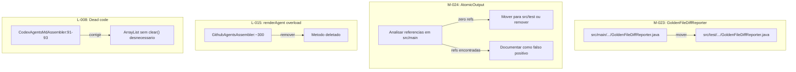

# Historia: Mover classes test-only para src/test e limpar codigo morto

**ID:** story-0008-0026

## 1. Dependencias

| Blocked By | Blocks |
| :--- | :--- |
| — | — |

## 2. Regras Transversais Aplicaveis

| ID | Titulo |
| :--- | :--- |
| RULE-002 | Comportamento externo inalterado |
| RULE-003 | Commits atomicos |

## 3. Descricao

Como **Tech Lead**, eu quero mover classes que existem exclusivamente para suporte a testes de `src/main` para `src/test` e eliminar codigo morto identificado no audit, garantindo que o artefato de producao nao carregue classes desnecessarias e que o codebase esteja livre de codigo sem uso.

O audit identificou quatro problemas distintos. O finding M-023 aponta que `GoldenFileDiffReporter.java` esta localizado em `src/main/java/dev/iadev/golden/` mas e usado exclusivamente em testes — sua presenca em `src/main` aumenta o tamanho do artefato de producao sem necessidade. O finding M-024 indica que `AtomicOutput` pode estar sem uso em producao, necessitando analise de referencias. O finding L-015 identifica um overload de 3 parametros de `renderAgent()` em `GithubAgentsAssembler` (linha ~300) que nao possui nenhum chamador. O finding L-008 revela codigo morto em `CodexAgentsMdAssembler` (linhas 91-93) onde um `ArrayList` e criado e imediatamente limpo na sequencia.

A abordagem sera: (1) mover `GoldenFileDiffReporter` para `src/test` mantendo o mesmo pacote; (2) analisar todas as referencias a `AtomicOutput` — se nenhuma referencia de producao existir, mover para `src/test` ou remover; (3) deletar o overload `renderAgent(String, String, String)` sem chamadores; (4) corrigir o dead code no `CodexAgentsMdAssembler` eliminando a criacao desnecessaria de ArrayList.

### 3.1 GoldenFileDiffReporter (M-023)

Mover de `src/main/java/dev/iadev/golden/` para `src/test/java/dev/iadev/golden/`. Manter pacote identico. Atualizar imports se necessario.

### 3.2 AtomicOutput (M-024)

Executar busca por todas as referencias em `src/main`. Se zero referencias de producao: mover para `src/test` ou remover. Se existirem referencias: documentar como falso positivo e fechar o finding.

### 3.3 renderAgent overload (L-015)

Remover o metodo `renderAgent(String, String, String)` em `GithubAgentsAssembler:~300` que nao possui chamadores.

### 3.4 Dead code em CodexAgentsMdAssembler (L-008)

Corrigir linhas 91-93 onde `new ArrayList<>()` e criado e imediatamente `clear()` e chamado na sequencia.

## 4. Definicoes de Qualidade Locais

### DoR Local (Definition of Ready)

- [ ] Localizacao exata de `GoldenFileDiffReporter.java` confirmada em `src/main`
- [ ] Busca por referencias a `GoldenFileDiffReporter` em `src/main` confirma zero uso de producao
- [ ] Analise de referencias a `AtomicOutput` concluida
- [ ] Overload `renderAgent(String, String, String)` localizado com numero de linha
- [ ] Dead code em `CodexAgentsMdAssembler:91-93` confirmado

### DoD Local (Definition of Done)

- [ ] `GoldenFileDiffReporter.java` movido para `src/test/java/dev/iadev/golden/`
- [ ] `AtomicOutput` analisado e acao tomada (movido, removido, ou documentado como falso positivo)
- [ ] Overload `renderAgent(String, String, String)` removido de `GithubAgentsAssembler`
- [ ] Dead code em `CodexAgentsMdAssembler:91-93` corrigido
- [ ] Zero warnings de compilacao
- [ ] Todos os testes existentes passando
- [ ] Golden files identicos byte-for-byte

### Global Definition of Done (DoD)

- **Cobertura:** >= 95% Line, >= 90% Branch
- **Testes Automatizados:** Todos os testes existentes passando + novos testes
- **Relatorio de Cobertura:** JaCoCo via `mvn verify`
- **Documentacao:** Javadoc atualizado quando assinaturas mudam
- **Performance:** Sem degradacao

## 5. Contratos de Dados (Data Contract)

**GoldenFileDiffReporter — antes (src/main):**

```
src/main/java/dev/iadev/golden/GoldenFileDiffReporter.java
```

**GoldenFileDiffReporter — depois (src/test):**

```
src/test/java/dev/iadev/golden/GoldenFileDiffReporter.java
```

**renderAgent overload — antes:**

```java
// GithubAgentsAssembler.java ~linha 300
private String renderAgent(String name, String description, String tools) {
    // ... implementacao sem chamadores
}
```

**renderAgent overload — depois:**

```java
// Metodo removido — zero chamadores identificados
```

**CodexAgentsMdAssembler dead code — antes:**

```java
// linhas 91-93
List<String> items = new ArrayList<>();
items.clear();
```

**CodexAgentsMdAssembler dead code — depois:**

```java
// ArrayList desnecessario removido; logica simplificada
List<String> items = new ArrayList<>();
```

## 6. Diagramas

### 6.1 Fluxo de Limpeza



## 7. Criterios de Aceite (Gherkin)

```gherkin
Cenario: GoldenFileDiffReporter nao existe mais em src/main
  DADO que a classe GoldenFileDiffReporter foi movida para src/test
  QUANDO uma busca por "GoldenFileDiffReporter" e executada em src/main
  ENTAO zero resultados devem ser encontrados
  E a classe deve existir em src/test/java/dev/iadev/golden/

Cenario: Testes que usam GoldenFileDiffReporter continuam funcionando
  DADO que GoldenFileDiffReporter foi movido para src/test
  QUANDO os testes que referenciam GoldenFileDiffReporter sao executados
  ENTAO todos devem passar sem alteracao de comportamento
  E os imports devem resolver corretamente a nova localizacao

Cenario: renderAgent overload removido nao causa erros de compilacao
  DADO que o overload renderAgent(String, String, String) foi removido
  QUANDO o projeto e compilado com mvn compile
  ENTAO zero erros de compilacao devem ocorrer
  E nenhum chamador orfao deve existir no codebase

Cenario: Dead code em CodexAgentsMdAssembler eliminado
  DADO que o ArrayList criado e imediatamente limpo foi corrigido
  QUANDO o metodo afetado em CodexAgentsMdAssembler e inspecionado
  ENTAO nao deve existir chamada clear() imediatamente apos construcao de ArrayList
  E o comportamento do assembler deve permanecer identico

Cenario: Artefato de producao nao contem classes test-only
  DADO que GoldenFileDiffReporter e qualquer classe test-only foram movidos
  QUANDO o JAR de producao e inspecionado
  ENTAO GoldenFileDiffReporter nao deve estar presente no artefato
  E o tamanho do artefato deve ser menor ou igual ao anterior

Cenario: Golden files permanecem identicos apos limpeza
  DADO que todas as correcoes de codigo morto foram aplicadas
  QUANDO o gerador completo e executado contra todos os profiles
  ENTAO cada arquivo gerado deve ser identico byte-for-byte ao golden file correspondente
```

### 7.1 Scenario Ordering (TPP)

> TPP: degenerate (classe movida nao existe em src/main) -> happy path (testes continuam funcionando) -> erro (compilacao sem overload) -> boundary (dead code eliminado) -> integridade (artefato limpo) -> aceitacao (golden files).

### 7.2 Mandatory Scenario Categories

- [x] Degenerate cases (classe movida, arquivo ausente em src/main)
- [x] Happy path (testes funcionando com nova localizacao)
- [x] Error paths (compilacao sem overload removido)
- [x] Boundary values (artefato sem classes test-only, golden files identicos)

## 8. Sub-tarefas

- [ ] [Dev] Mover `GoldenFileDiffReporter.java` de `src/main` para `src/test`
- [ ] [Dev] Analisar referencias a `AtomicOutput` em `src/main` e tomar acao
- [ ] [Dev] Remover overload `renderAgent(String, String, String)` de `GithubAgentsAssembler`
- [ ] [Dev] Corrigir dead code em `CodexAgentsMdAssembler:91-93`
- [ ] [Test] Verificar compilacao limpa (`mvn compile`)
- [ ] [Test] Todos os testes existentes passando
- [ ] [Test] Golden files identicos byte-for-byte
