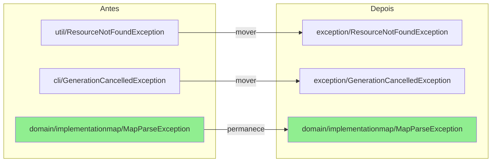
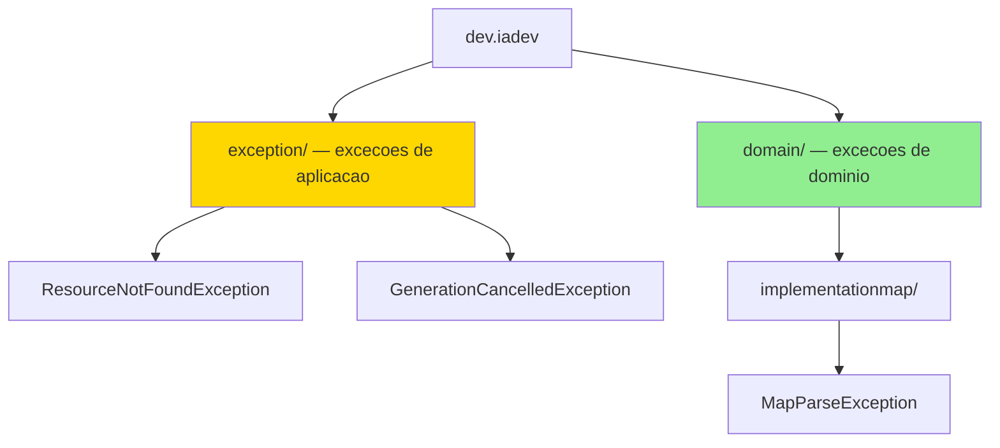

# Historia: Consolidar pacote de excecoes

**ID:** story-0008-0027

## 1. Dependencias

| Blocked By | Blocks |
| :--- | :--- |
| — | — |

## 2. Regras Transversais Aplicaveis

| ID | Titulo |
| :--- | :--- |
| RULE-002 | Comportamento externo inalterado |
| RULE-003 | Commits atomicos |

## 3. Descricao

Como **Tech Lead**, eu quero consolidar todas as classes de excecao da aplicacao em um pacote unico `exception/`, garantindo que a localizacao de excecoes siga uma convencao previsivel e que desenvolvedores encontrem rapidamente a excecao correta sem varrer multiplos pacotes.

O audit identificou tres findings relacionados: L-012 aponta que excecoes estao espalhadas em pacotes diversos sem convencao clara; L-013 indica que `ResourceNotFoundException` esta localizada em `util/` quando deveria estar em `exception/`; L-014 mostra que `GenerationCancelledException` reside em `cli/` mas e uma excecao de aplicacao e nao especifica de CLI. Essa dispersao viola o principio de organizacao coesa — excecoes de aplicacao devem ter um local canonico.

A convencao a ser estabelecida e: excecoes de nivel de aplicacao (usadas por multiplas camadas) vao para o pacote `exception/`. Excecoes de dominio especificas (usadas apenas dentro de um bounded context) permanecem no pacote do dominio correspondente (ex: `domain/implementationmap/`). Apos a consolidacao, todos os imports nos arquivos que referenciam essas excecoes devem ser atualizados.

### 3.1 Excecoes a Mover

| Classe | Pacote Atual | Pacote Destino |
| :--- | :--- | :--- |
| `ResourceNotFoundException` | `util/` | `exception/` |
| `GenerationCancelledException` | `cli/` | `exception/` |

### 3.2 Convencao de Localizacao

- **`exception/`**: excecoes de aplicacao (usadas em multiplas camadas)
- **`domain/{context}/`**: excecoes de dominio (usadas apenas dentro do bounded context)

## 4. Definicoes de Qualidade Locais

### DoR Local (Definition of Ready)

- [ ] Localizacao exata de `ResourceNotFoundException.java` confirmada em `util/`
- [ ] Localizacao exata de `GenerationCancelledException.java` confirmada em `cli/`
- [ ] Todos os arquivos que importam essas excecoes mapeados
- [ ] Pacote `exception/` existente ou a ser criado identificado
- [ ] Excecoes de dominio identificadas para exclusao do move (permanecem no dominio)

### DoD Local (Definition of Done)

- [ ] `ResourceNotFoundException` movido para `exception/`
- [ ] `GenerationCancelledException` movido para `exception/`
- [ ] Todos os imports atualizados em todos os arquivos afetados
- [ ] Convencao de localizacao documentada em comentario ou Javadoc no pacote `exception/`
- [ ] Zero warnings de compilacao
- [ ] Todos os testes existentes passando
- [ ] Golden files identicos byte-for-byte

### Global Definition of Done (DoD)

- **Cobertura:** >= 95% Line, >= 90% Branch
- **Testes Automatizados:** Todos os testes existentes passando + novos testes
- **Relatorio de Cobertura:** JaCoCo via `mvn verify`
- **Documentacao:** Javadoc atualizado quando assinaturas mudam
- **Performance:** Sem degradacao

## 5. Contratos de Dados (Data Contract)

**ResourceNotFoundException — antes:**

```java
package dev.iadev.util;

public class ResourceNotFoundException extends RuntimeException {
    public ResourceNotFoundException(String message) {
        super(message);
    }
}
```

**ResourceNotFoundException — depois:**

```java
package dev.iadev.exception;

/**
 * Thrown when a required resource (file, template, configuration) cannot be found.
 * <p>Application-level exception — used across multiple layers.</p>
 */
public class ResourceNotFoundException extends RuntimeException {
    public ResourceNotFoundException(String message) {
        super(message);
    }
}
```

**GenerationCancelledException — antes:**

```java
package dev.iadev.cli;

public class GenerationCancelledException extends RuntimeException {
    // ...
}
```

**GenerationCancelledException — depois:**

```java
package dev.iadev.exception;

/**
 * Thrown when the user cancels the generation process (e.g., interactive prompt abort).
 * <p>Application-level exception — not CLI-specific.</p>
 */
public class GenerationCancelledException extends RuntimeException {
    // ...
}
```

**Imports — antes:**

```java
import dev.iadev.util.ResourceNotFoundException;
import dev.iadev.cli.GenerationCancelledException;
```

**Imports — depois:**

```java
import dev.iadev.exception.ResourceNotFoundException;
import dev.iadev.exception.GenerationCancelledException;
```

## 6. Diagramas

### 6.1 Consolidacao de Pacotes



### 6.2 Convencao de Localizacao



## 7. Criterios de Aceite (Gherkin)

```gherkin
Cenario: ResourceNotFoundException reside no pacote exception
  DADO que a classe ResourceNotFoundException foi movida
  QUANDO o pacote exception/ e inspecionado
  ENTAO ResourceNotFoundException deve estar presente
  E o pacote util/ nao deve mais conter ResourceNotFoundException

Cenario: GenerationCancelledException reside no pacote exception
  DADO que a classe GenerationCancelledException foi movida
  QUANDO o pacote exception/ e inspecionado
  ENTAO GenerationCancelledException deve estar presente
  E o pacote cli/ nao deve mais conter GenerationCancelledException

Cenario: Todos os imports foram atualizados corretamente
  DADO que as excecoes foram movidas para exception/
  QUANDO uma busca por "import dev.iadev.util.ResourceNotFoundException" e executada
  ENTAO zero resultados devem ser encontrados
  E todos os imports devem referenciar "dev.iadev.exception.ResourceNotFoundException"

Cenario: Excecoes de dominio permanecem no pacote de dominio
  DADO que a convencao de localizacao foi aplicada
  QUANDO as excecoes em domain/ sao inspecionadas
  ENTAO excecoes especificas de dominio devem permanecer em seus pacotes originais
  E nenhuma excecao de dominio deve ter sido movida para exception/

Cenario: Compilacao limpa apos consolidacao
  DADO que todos os arquivos foram atualizados
  QUANDO mvn compile e executado
  ENTAO zero erros de compilacao devem ocorrer
  E zero warnings relacionados a imports devem existir

Cenario: Golden files permanecem identicos apos consolidacao
  DADO que a consolidacao de excecoes nao altera comportamento
  QUANDO o gerador completo e executado contra todos os profiles
  ENTAO cada arquivo gerado deve ser identico byte-for-byte ao golden file correspondente
```

### 7.1 Scenario Ordering (TPP)

> TPP: degenerate (excecao no pacote correto) -> happy path (imports atualizados) -> boundary (excecoes de dominio inalteradas) -> erro (compilacao limpa) -> aceitacao (golden files).

### 7.2 Mandatory Scenario Categories

- [x] Degenerate cases (excecao presente no pacote exception/)
- [x] Happy path (imports atualizados corretamente)
- [x] Error paths (compilacao limpa sem imports quebrados)
- [x] Boundary values (excecoes de dominio inalteradas, golden files identicos)

## 8. Sub-tarefas

- [ ] [Dev] Mover `ResourceNotFoundException` de `util/` para `exception/`
- [ ] [Dev] Mover `GenerationCancelledException` de `cli/` para `exception/`
- [ ] [Dev] Atualizar todos os imports em arquivos afetados
- [ ] [Doc] Documentar convencao de localizacao de excecoes (Javadoc no package-info.java)
- [ ] [Test] Verificar compilacao limpa (`mvn compile`)
- [ ] [Test] Todos os testes existentes passando
- [ ] [Test] Golden files identicos byte-for-byte
