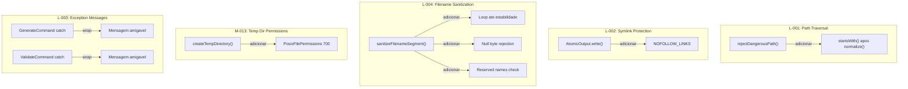
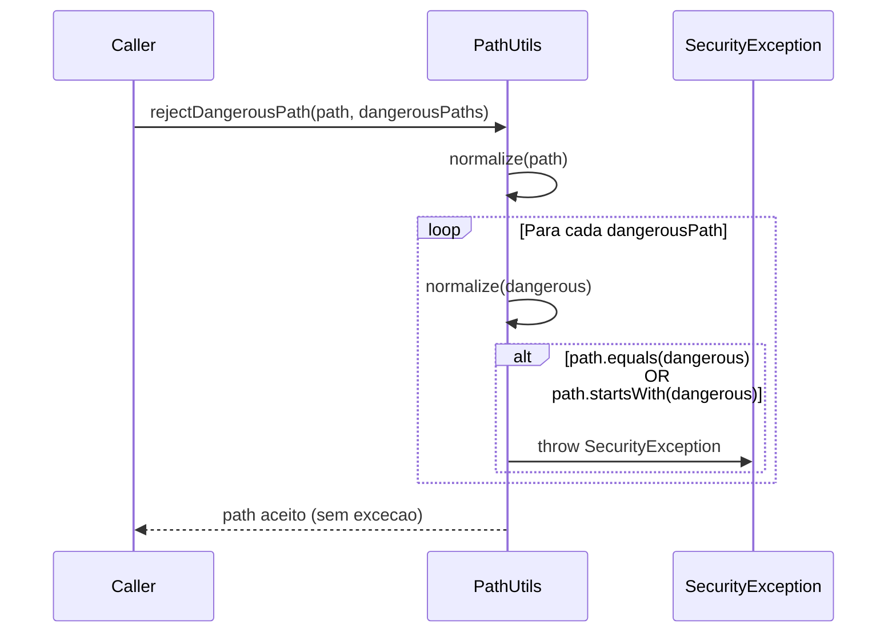

# Historia: Hardening de seguranca (paths, symlinks, sanitizacao, temp dirs)

**ID:** story-0008-0028

## 1. Dependencias

| Blocked By | Blocks |
| :--- | :--- |
| — | — |

## 2. Regras Transversais Aplicaveis

| ID | Titulo |
| :--- | :--- |
| RULE-001 | Cobertura obrigatoria |
| RULE-002 | Comportamento externo inalterado |
| RULE-003 | Commits atomicos |

## 3. Descricao

Como **Tech Lead**, eu quero aplicar um conjunto de correcoes de seguranca nos mecanismos de path validation, symlink protection, filename sanitization e temp directory creation, garantindo que o gerador esteja protegido contra ataques de path traversal, symlink following, e injecao de nomes de arquivo maliciosos.

O audit identificou cinco findings de seguranca. L-001 aponta que `PathUtils.rejectDangerousPath()` verifica apenas igualdade exata com paths perigosos mas nao detecta caminhos filhos (ex: `/etc/passwd/../../target` passaria). L-002 indica que `AtomicOutput` nao usa `NOFOLLOW_LINKS` em operacoes de arquivo, permitindo que symlinks sejam seguidos silenciosamente. L-004 revela que `Consolidator.sanitizeFilenameSegment()` aplica substituicao apenas uma vez, sem loop ate estabilidade, e nao trata null bytes nem nomes reservados do Windows (CON, NUL, AUX, PRN, COM1-COM9, LPT1-LPT9). M-013 mostra que `ResourceResolver` e `AtomicOutput` criam diretorios temporarios sem restricao de permissoes POSIX. L-003 indica que `GenerateCommand` e `ValidateCommand` expoe mensagens de excecao cruas ao usuario.

### 3.1 Path Traversal (L-001)

`PathUtils.rejectDangerousPath()` deve rejeitar nao apenas paths exatamente iguais aos perigosos, mas tambem qualquer path que seja filho (usando `startsWith()` apos normalizacao com `toRealPath()` ou `normalize()`).

### 3.2 Symlink Protection (L-002)

Todas as operacoes de escrita em `AtomicOutput` devem usar `LinkOption.NOFOLLOW_LINKS` para prevenir que symlinks redirecionem a escrita para locais inesperados.

### 3.3 Filename Sanitization (L-004)

`Consolidator.sanitizeFilenameSegment()` deve: (1) aplicar substituicao em loop ate que o resultado estabilize; (2) rejeitar null bytes (`\0`); (3) rejeitar nomes reservados do Windows (CON, NUL, AUX, PRN, COM1-COM9, LPT1-LPT9).

### 3.4 Temp Directory Permissions (M-013)

`ResourceResolver.createTempDirectory()` e `AtomicOutput.createTempDirectory()` devem aplicar `PosixFilePermissions.asFileAttribute(PosixFilePermissions.fromString("rwx------"))` (700) no Linux/macOS. Em Windows, o comportamento padrao ja restringe acesso ao usuario.

### 3.5 Exception Message Wrapping (L-003)

`GenerateCommand` e `ValidateCommand` devem capturar excecoes e exibir mensagens amigaveis ao usuario, sem expor stack traces ou paths internos do sistema.

## 4. Definicoes de Qualidade Locais

### DoR Local (Definition of Ready)

- [ ] Codigo atual de `PathUtils.rejectDangerousPath()` analisado com numeros de linha
- [ ] Operacoes de arquivo em `AtomicOutput` mapeadas (quais usam `Files.*` sem NOFOLLOW)
- [ ] Logica de `sanitizeFilenameSegment()` analisada com regex e edge cases
- [ ] Chamadas a `createTempDirectory()` mapeadas em `ResourceResolver` e `AtomicOutput`
- [ ] Pontos de captura de excecao em `GenerateCommand` e `ValidateCommand` identificados

### DoD Local (Definition of Done)

- [ ] `PathUtils.rejectDangerousPath()` rejeita paths filhos de diretorios perigosos
- [ ] `AtomicOutput` usa `NOFOLLOW_LINKS` em todas as operacoes de escrita
- [ ] `sanitizeFilenameSegment()` aplica substituicao em loop, trata null bytes e nomes reservados
- [ ] `createTempDirectory()` aplica permissoes 700 em sistemas POSIX
- [ ] `GenerateCommand` e `ValidateCommand` exibem mensagens amigaveis
- [ ] Cobertura de testes >= 95% para todos os novos caminhos de codigo
- [ ] Todos os testes existentes passando
- [ ] Golden files identicos byte-for-byte

### Global Definition of Done (DoD)

- **Cobertura:** >= 95% Line, >= 90% Branch
- **Testes Automatizados:** Todos os testes existentes passando + novos testes
- **Relatorio de Cobertura:** JaCoCo via `mvn verify`
- **Documentacao:** Javadoc atualizado quando assinaturas mudam
- **Performance:** Sem degradacao

## 5. Contratos de Dados (Data Contract)

**PathUtils.rejectDangerousPath() — antes:**

```java
public static void rejectDangerousPath(Path path, List<Path> dangerousPaths) {
    Path normalized = path.normalize();
    for (Path dangerous : dangerousPaths) {
        if (normalized.equals(dangerous.normalize())) {
            throw new SecurityException("Dangerous path: " + path);
        }
    }
}
```

**PathUtils.rejectDangerousPath() — depois:**

```java
public static void rejectDangerousPath(Path path, List<Path> dangerousPaths) {
    Path normalized = path.normalize();
    for (Path dangerous : dangerousPaths) {
        Path normalizedDangerous = dangerous.normalize();
        if (normalized.equals(normalizedDangerous)
                || normalized.startsWith(normalizedDangerous)) {
            throw new SecurityException(
                "Path rejected: target is within a protected directory".formatted());
        }
    }
}
```

**sanitizeFilenameSegment() — antes:**

```java
public static String sanitizeFilenameSegment(String segment) {
    return segment.replaceAll("[^a-zA-Z0-9._-]", "_");
}
```

**sanitizeFilenameSegment() — depois:**

```java
private static final Set<String> RESERVED_NAMES = Set.of(
    "CON", "NUL", "AUX", "PRN",
    "COM1", "COM2", "COM3", "COM4", "COM5", "COM6", "COM7", "COM8", "COM9",
    "LPT1", "LPT2", "LPT3", "LPT4", "LPT5", "LPT6", "LPT7", "LPT8", "LPT9"
);

public static String sanitizeFilenameSegment(String segment) {
    if (segment == null || segment.contains("\0")) {
        throw new IllegalArgumentException("Filename segment must not be null or contain null bytes");
    }
    String result = segment;
    String previous;
    do {
        previous = result;
        result = result.replaceAll("[^a-zA-Z0-9._-]", "_");
    } while (!result.equals(previous));

    String upperName = result.replaceAll("\\.[^.]*$", "").toUpperCase();
    if (RESERVED_NAMES.contains(upperName)) {
        result = "_" + result;
    }
    return result;
}
```

**createTempDirectory() — depois:**

```java
import java.nio.file.attribute.PosixFilePermissions;

Path tempDir = Files.createTempDirectory(prefix,
    PosixFilePermissions.asFileAttribute(
        PosixFilePermissions.fromString("rwx------")));
```

## 6. Diagramas

### 6.1 Mapa de Correcoes de Seguranca



### 6.2 Fluxo de Validacao de Path



## 7. Criterios de Aceite (Gherkin)

```gherkin
Cenario: Path traversal com caminho filho de diretorio perigoso e rejeitado
  DADO que "/etc" esta na lista de paths perigosos
  QUANDO rejectDangerousPath e invocado com "/etc/passwd"
  ENTAO uma SecurityException deve ser lancada
  E a mensagem nao deve expor o path completo do sistema

Cenario: Path seguro e aceito normalmente
  DADO que "/etc" esta na lista de paths perigosos
  QUANDO rejectDangerousPath e invocado com "/tmp/output/project"
  ENTAO nenhuma excecao deve ser lancada
  E a execucao deve continuar normalmente

Cenario: Filename com null byte e rejeitado
  DADO que um segmento de filename contem "\0"
  QUANDO sanitizeFilenameSegment e invocado
  ENTAO uma IllegalArgumentException deve ser lancada
  E a mensagem deve indicar a presenca de null bytes

Cenario: Nome reservado do Windows recebe prefixo de protecao
  DADO que o segmento de filename e "CON"
  QUANDO sanitizeFilenameSegment e invocado
  ENTAO o resultado deve ser "_CON"
  E o nome nao deve colidir com dispositivos reservados do Windows

Cenario: Sanitizacao aplica substituicao em loop ate estabilidade
  DADO que o segmento contem caracteres que geram novos caracteres invalidos apos substituicao
  QUANDO sanitizeFilenameSegment e invocado repetidamente
  ENTAO o resultado final deve ser identico ao resultado de uma segunda aplicacao
  E nenhum caractere invalido deve permanecer

Cenario: Diretorio temporario criado com permissoes restritas
  DADO que o sistema operacional suporta permissoes POSIX
  QUANDO createTempDirectory e invocado
  ENTAO o diretorio deve ter permissoes 700 (rwx------)
  E apenas o usuario proprietario deve ter acesso

Cenario: Excecoes em GenerateCommand exibem mensagem amigavel
  DADO que o gerador encontra um erro durante a execucao
  QUANDO a excecao e capturada no GenerateCommand
  ENTAO a mensagem exibida ao usuario deve ser amigavel e contextualizada
  E nenhum stack trace ou path interno do sistema deve ser exposto

Cenario: Golden files permanecem identicos apos hardening
  DADO que todas as correcoes de seguranca foram aplicadas
  QUANDO o gerador completo e executado contra todos os profiles
  ENTAO cada arquivo gerado deve ser identico byte-for-byte ao golden file correspondente
```

### 7.1 Scenario Ordering (TPP)

> TPP: degenerate (path filho rejeitado) -> happy path (path seguro aceito) -> erro (null byte, nome reservado) -> boundary (loop ate estabilidade, permissoes POSIX) -> aceitacao (mensagem amigavel, golden files).

### 7.2 Mandatory Scenario Categories

- [x] Degenerate cases (path traversal com filho rejeitado)
- [x] Happy path (path seguro aceito, sanitizacao estavel)
- [x] Error paths (null byte, nome reservado, excecao amigavel)
- [x] Boundary values (loop de sanitizacao, permissoes 700, golden files)

## 8. Sub-tarefas

- [ ] [Dev] Melhorar `PathUtils.rejectDangerousPath()` com validacao `startsWith()`
- [ ] [Dev] Adicionar `NOFOLLOW_LINKS` em operacoes de arquivo do `AtomicOutput`
- [ ] [Dev] Corrigir `sanitizeFilenameSegment()` com loop, null bytes e nomes reservados
- [ ] [Dev] Adicionar `PosixFilePermissions` (700) em `createTempDirectory()`
- [ ] [Dev] Encapsular mensagens de excecao em `GenerateCommand` e `ValidateCommand`
- [ ] [Test] Testes para path traversal com caminhos filhos
- [ ] [Test] Testes para sanitizacao com null bytes, nomes reservados, loop de estabilidade
- [ ] [Test] Testes para permissoes de diretorio temporario em ambiente POSIX
- [ ] [Test] Testes para mensagens amigaveis de erro
- [ ] [Test] Todos os testes existentes passando
- [ ] [Test] Golden files identicos byte-for-byte
