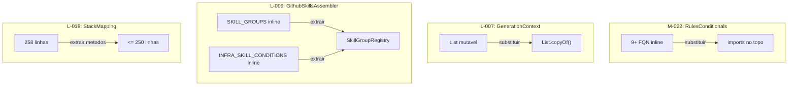
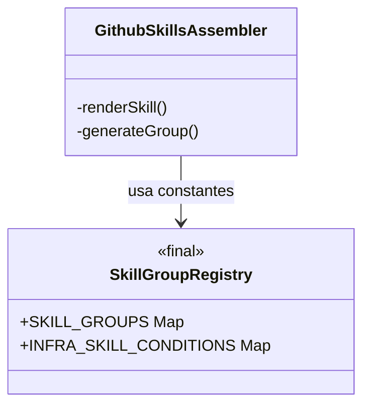

# Historia: Corrigir nomes qualificados e cleanups menores

**ID:** story-0008-0029

## 1. Dependencias

| Blocked By | Blocks |
| :--- | :--- |
| — | — |

## 2. Regras Transversais Aplicaveis

| ID | Titulo |
| :--- | :--- |
| RULE-002 | Comportamento externo inalterado |
| RULE-003 | Commits atomicos |

## 3. Descricao

Como **Tech Lead**, eu quero corrigir o uso de nomes de classes totalmente qualificados inline no codigo, extrair dados estaticos para registries dedicados e aplicar cleanups menores de imutabilidade e tamanho de classe, garantindo que o codebase siga convencoes de imports Java idiomaticas e que todas as classes estejam dentro dos limites de tamanho.

O audit identificou quatro findings nesta area. M-022 aponta que `RulesConditionals` usa 9+ nomes totalmente qualificados inline (`java.nio.file.Files`, `java.io.IOException`, `java.io.UncheckedIOException`, entre outros) em vez de imports no topo do arquivo — isso prejudica a legibilidade e viola convencoes Java. L-007 indica que `CicdAssembler.GenerationContext` (record interno) possui campos `List` mutaveis expostos sem copia defensiva ou uso de `List.copyOf()`. L-009 revela que `GithubSkillsAssembler` possui um inicializador estatico grande com dados de grupos de skills e condicoes de infra embutidos inline, inflando a classe. L-018 nota que `StackMapping` esta com 258 linhas (borderline acima do limite de 250).

### 3.1 RulesConditionals — Imports (M-022)

Substituir todos os 9+ nomes totalmente qualificados por imports no topo do arquivo. Classes afetadas: `java.nio.file.Files`, `java.nio.file.Path`, `java.io.IOException`, `java.io.UncheckedIOException`, e outras identificadas.

### 3.2 CicdAssembler.GenerationContext — Imutabilidade (L-007)

Se o record `GenerationContext` ainda possui campos `List` mutaveis (verificar se ja foi corrigido por story-0008-0013), substituir por `List.copyOf()` no construtor compacto ou usar `Collections.unmodifiableList()`.

### 3.3 GithubSkillsAssembler — Extrair SkillGroupRegistry (L-009)

Extrair as constantes `SKILL_GROUPS` e `INFRA_SKILL_CONDITIONS` do bloco estatico de `GithubSkillsAssembler` para uma nova classe `SkillGroupRegistry` dedicada. Isso reduz o tamanho da classe e centraliza a configuracao de grupos em um local acessivel.

### 3.4 StackMapping — Reducao de Linhas (L-018)

Se `StackMapping` ainda possui mais de 250 linhas apos as stories anteriores, extrair metodos auxiliares ou dados estaticos para reduzir a contagem para dentro do limite.

## 4. Definicoes de Qualidade Locais

### DoR Local (Definition of Ready)

- [ ] Todos os nomes qualificados em `RulesConditionals` mapeados com numeros de linha
- [ ] Estado atual de `CicdAssembler.GenerationContext` verificado (pode ja ter sido corrigido)
- [ ] Dados estaticos em `GithubSkillsAssembler` mapeados (SKILL_GROUPS, INFRA_SKILL_CONDITIONS)
- [ ] Contagem de linhas atual de `StackMapping` verificada

### DoD Local (Definition of Done)

- [ ] Zero nomes totalmente qualificados inline em `RulesConditionals`
- [ ] `CicdAssembler.GenerationContext` usa `List.copyOf()` ou e imutavel (ou documentado como ja corrigido)
- [ ] Classe `SkillGroupRegistry` criada com `SKILL_GROUPS` e `INFRA_SKILL_CONDITIONS`
- [ ] `GithubSkillsAssembler` referencia `SkillGroupRegistry` em vez de dados inline
- [ ] `StackMapping` com <= 250 linhas (ou documentado como aceitavel se borderline)
- [ ] Zero warnings de compilacao
- [ ] Todos os testes existentes passando
- [ ] Golden files identicos byte-for-byte

### Global Definition of Done (DoD)

- **Cobertura:** >= 95% Line, >= 90% Branch
- **Testes Automatizados:** Todos os testes existentes passando + novos testes
- **Relatorio de Cobertura:** JaCoCo via `mvn verify`
- **Documentacao:** Javadoc atualizado quando assinaturas mudam
- **Performance:** Sem degradacao

## 5. Contratos de Dados (Data Contract)

**RulesConditionals — antes (nomes qualificados inline):**

```java
public class RulesConditionals {
    public void copyDatabaseRefs(...) {
        try {
            java.nio.file.Files.copy(source, target);
        } catch (java.io.IOException e) {
            throw new java.io.UncheckedIOException(e);
        }
    }
}
```

**RulesConditionals — depois (imports):**

```java
import java.io.IOException;
import java.io.UncheckedIOException;
import java.nio.file.Files;
import java.nio.file.Path;

public class RulesConditionals {
    public void copyDatabaseRefs(...) {
        try {
            Files.copy(source, target);
        } catch (IOException e) {
            throw new UncheckedIOException(e);
        }
    }
}
```

**SkillGroupRegistry (nova classe):**

```java
package dev.iadev.assembler;

import java.util.List;
import java.util.Map;

/**
 * Registry of skill groups and infrastructure skill conditions.
 * Extracted from GithubSkillsAssembler to reduce class size.
 */
public final class SkillGroupRegistry {

    private SkillGroupRegistry() {}

    public static final Map<String, List<String>> SKILL_GROUPS = Map.ofEntries(
        // ... dados extraidos de GithubSkillsAssembler
    );

    public static final Map<String, String> INFRA_SKILL_CONDITIONS = Map.ofEntries(
        // ... dados extraidos de GithubSkillsAssembler
    );
}
```

**GenerationContext — depois (imutavel):**

```java
public record GenerationContext(
    List<String> workflows,
    List<String> actions
) {
    public GenerationContext {
        workflows = List.copyOf(workflows);
        actions = List.copyOf(actions);
    }
}
```

## 6. Diagramas

### 6.1 Mapa de Cleanups



### 6.2 Dependencia GithubSkillsAssembler -> SkillGroupRegistry



## 7. Criterios de Aceite (Gherkin)

```gherkin
Cenario: RulesConditionals nao contem nomes totalmente qualificados
  DADO que os imports foram adicionados ao topo do arquivo
  QUANDO uma busca por "java.nio.file.Files" inline no corpo de metodos e executada
  ENTAO zero resultados devem ser encontrados em RulesConditionals
  E os imports correspondentes devem existir no bloco de imports

Cenario: GenerationContext possui listas imutaveis
  DADO que o record GenerationContext foi corrigido
  QUANDO uma instancia e criada com listas mutaveis
  ENTAO as listas retornadas pelos accessors devem ser imutaveis
  E tentativas de modificacao devem lancar UnsupportedOperationException

Cenario: SkillGroupRegistry contem todos os dados extraidos
  DADO que a classe SkillGroupRegistry foi criada
  QUANDO SKILL_GROUPS e INFRA_SKILL_CONDITIONS sao acessados
  ENTAO os dados devem ser identicos aos que estavam inline em GithubSkillsAssembler
  E GithubSkillsAssembler nao deve mais conter esses dados inline

Cenario: GithubSkillsAssembler reduzido apos extracao
  DADO que SKILL_GROUPS e INFRA_SKILL_CONDITIONS foram extraidos
  QUANDO a contagem de linhas de GithubSkillsAssembler e verificada
  ENTAO a classe deve ter menos linhas que antes da extracao
  E deve referenciar SkillGroupRegistry para acessar os dados

Cenario: StackMapping esta dentro do limite de 250 linhas
  DADO que cleanups foram aplicados a StackMapping
  QUANDO a contagem de linhas e verificada
  ENTAO a classe deve ter no maximo 250 linhas
  E nenhum comportamento deve ter sido alterado

Cenario: Golden files permanecem identicos apos cleanups
  DADO que todos os cleanups foram aplicados
  QUANDO o gerador completo e executado contra todos os profiles
  ENTAO cada arquivo gerado deve ser identico byte-for-byte ao golden file correspondente
```

### 7.1 Scenario Ordering (TPP)

> TPP: degenerate (zero FQN inline) -> happy path (listas imutaveis, registry criado) -> boundary (classe reduzida, StackMapping <= 250) -> aceitacao (golden files).

### 7.2 Mandatory Scenario Categories

- [x] Degenerate cases (zero nomes qualificados inline)
- [x] Happy path (listas imutaveis, dados extraidos para registry)
- [x] Error paths (UnsupportedOperationException em listas imutaveis)
- [x] Boundary values (StackMapping <= 250 linhas, golden files identicos)

## 8. Sub-tarefas

- [ ] [Dev] Adicionar imports e substituir 9+ nomes qualificados em `RulesConditionals`
- [ ] [Dev] Verificar e corrigir imutabilidade de `CicdAssembler.GenerationContext`
- [ ] [Dev] Criar classe `SkillGroupRegistry` com dados extraidos
- [ ] [Dev] Atualizar `GithubSkillsAssembler` para referenciar `SkillGroupRegistry`
- [ ] [Dev] Reduzir `StackMapping` para <= 250 linhas (se necessario)
- [ ] [Test] Testes unitarios para `SkillGroupRegistry` (dados corretos, imutabilidade)
- [ ] [Test] Testes para `GenerationContext` com listas imutaveis
- [ ] [Test] Todos os testes existentes passando
- [ ] [Test] Golden files identicos byte-for-byte
