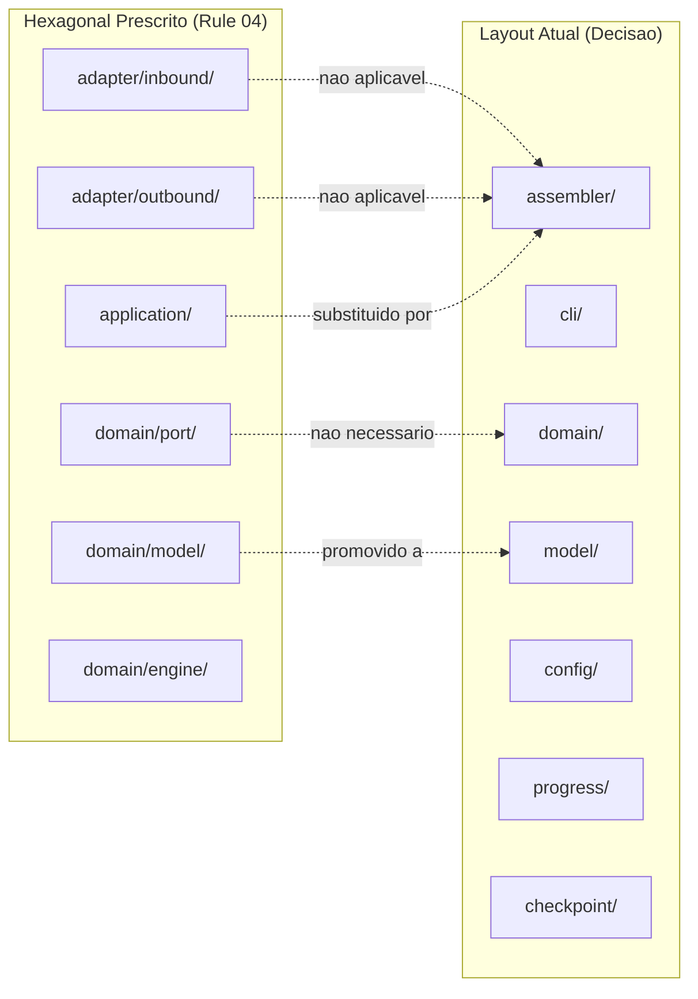
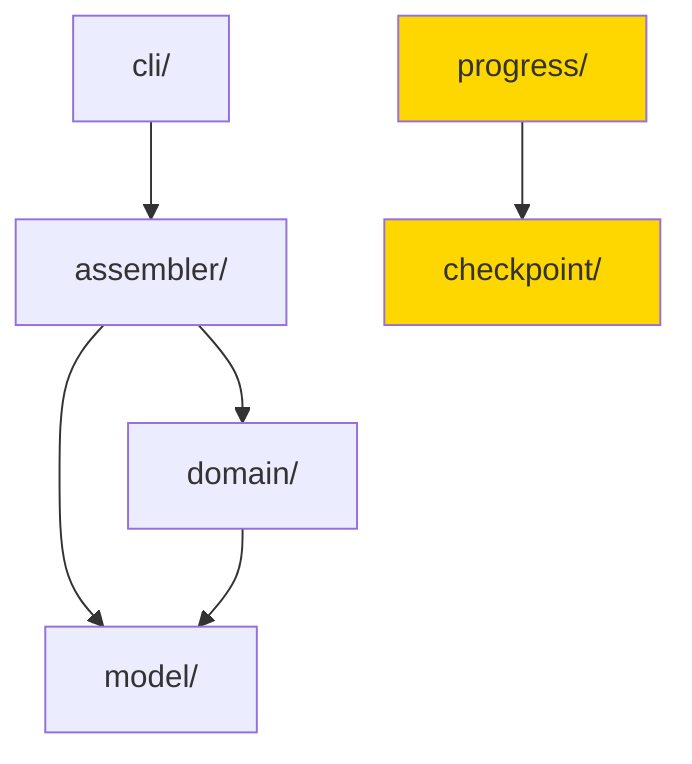

# Historia: Documentar desvios arquiteturais como ADR

**ID:** story-0008-0030

## 1. Dependencias

| Blocked By | Blocks |
| :--- | :--- |
| story-0008-0019, story-0008-0020 | — |

## 2. Regras Transversais Aplicaveis

| ID | Titulo |
| :--- | :--- |
| RULE-003 | Commits atomicos |

## 3. Descricao

Como **Tech Lead**, eu quero documentar os desvios arquiteturais identificados no audit como decisoes intencionais em um Architecture Decision Record (ADR), garantindo que futuros desenvolvedores compreendam o racional por tras da estrutura de pacotes e nao tentem "corrigir" decisoes conscientes.

O audit identificou cinco findings arquiteturais que sao desvios do padrao hexagonal prescrito nas rules: M-007 (ausencia de hierarquia hexagonal adapter/port), M-008 (dominio importa modelo irmao), M-010 (CLI importa assembler diretamente sem camada de aplicacao), L-005 (pacote model/ como irmao de domain/ em vez de sub-pacote), e L-006 (acoplamento entre progress/ e checkpoint/). Esses desvios nao sao bugs — sao decisoes deliberadas para um projeto que e uma ferramenta CLI de geracao de codigo, onde a complexidade de uma arquitetura hexagonal completa nao se justifica.

O ADR deve seguir o template existente em `docs/adr/` e documentar quatro decisoes principais: (1) layout plano de pacotes em vez de hierarquia hexagonal completa; (2) `model/` como pacote irmao de `domain/` e nao sub-pacote; (3) ausencia de camada `application/` com assemblers servindo como orquestracao; (4) acoplamento intencional entre `progress/` e `checkpoint/`.

### 3.1 Decisao 1: Layout Plano de Pacotes

**Contexto:** O Rule 04 prescreve arquitetura hexagonal com pacotes `adapter/inbound`, `adapter/outbound`, `domain/port`, e `application/`. O projeto usa um layout plano com `assembler/`, `cli/`, `domain/`, `model/`, `config/`, etc.

**Decisao:** Manter layout plano. Racional: a ferramenta CLI e um gerador de codigo sem I/O externo complexo (sem banco, sem HTTP, sem mensageria). A adicao de ports e adapters criaria indireccao sem beneficio proporcional.

### 3.2 Decisao 2: model/ como Irmao de domain/

**Contexto:** O padrao DDD coloca modelos dentro de `domain/model/`. O projeto tem `model/` como pacote separado no mesmo nivel que `domain/`.

**Decisao:** Manter `model/` como irmao. Racional: os records em `model/` sao DTOs puros compartilhados entre assemblers, CLI e dominio. Coloca-los dentro de `domain/` criaria dependencia circular.

### 3.3 Decisao 3: Ausencia de Camada application/

**Contexto:** O Rule 04 prescreve uma camada `application/` com use cases. O projeto nao possui essa camada; o pipeline de assemblers serve como orquestracao.

**Decisao:** Nao criar camada `application/`. Racional: o pipeline de assemblers ja e a orquestracao. Cada assembler e um step idempotente que recebe configuracao e produz arquivos. Adicionar use cases seria duplicacao de responsabilidade.

### 3.4 Decisao 4: Acoplamento progress/ e checkpoint/

**Contexto:** O audit nota que `progress/` depende diretamente de `checkpoint/`. Em arquitetura hexagonal, essa dependencia seria via interface.

**Decisao:** Manter acoplamento direto. Racional: `progress/` reporta o estado de `checkpoint/` — os dois modulos sao coesos por natureza e nao serao substituidos independentemente.

## 4. Definicoes de Qualidade Locais

### DoR Local (Definition of Ready)

- [ ] Stories story-0008-0019 e story-0008-0020 concluidas (pre-requisito para decisao informada)
- [ ] Template de ADR existente em `docs/adr/` identificado
- [ ] Findings M-007, M-008, M-010, L-005, L-006 revisados e confirmados como desvios intencionais
- [ ] Racional para cada desvio discutido e aprovado pelo Tech Lead

### DoD Local (Definition of Done)

- [ ] ADR criado em `docs/adr/` seguindo template existente
- [ ] Decisao 1 (layout plano) documentada com contexto, decisao, e consequencias
- [ ] Decisao 2 (model/ como irmao) documentada com contexto, decisao, e consequencias
- [ ] Decisao 3 (ausencia de application/) documentada com contexto, decisao, e consequencias
- [ ] Decisao 4 (acoplamento progress/checkpoint) documentada com contexto, decisao, e consequencias
- [ ] Findings referenciados no ADR por ID (M-007, M-008, M-010, L-005, L-006)
- [ ] ADR linkado na documentacao de arquitetura (se existente)

### Global Definition of Done (DoD)

- **Cobertura:** >= 95% Line, >= 90% Branch
- **Testes Automatizados:** Todos os testes existentes passando + novos testes
- **Relatorio de Cobertura:** JaCoCo via `mvn verify`
- **Documentacao:** Javadoc atualizado quando assinaturas mudam
- **Performance:** Sem degradacao

## 5. Contratos de Dados (Data Contract)

**ADR File — estrutura esperada:**

```markdown
# ADR-NNN: Desvios Arquiteturais Intencionais para CLI de Geracao de Codigo

## Status
Aceito

## Contexto
O Codebase Audit de 2026-03-20 identificou desvios do padrao hexagonal
prescrito nas rules do projeto (findings M-007, M-008, M-010, L-005, L-006).
Este ADR documenta esses desvios como decisoes intencionais.

## Decisao
1. Layout plano de pacotes (sem adapter/port/inbound/outbound)
2. model/ como pacote irmao de domain/
3. Ausencia de camada application/
4. Acoplamento direto entre progress/ e checkpoint/

## Consequencias
- (+) Simplicidade e navegabilidade do codebase
- (+) Menos indireccao para um projeto sem I/O externo complexo
- (-) Desvio do padrao prescrito nas rules — requer justificativa
- (-) Futuros audits devem referenciar este ADR
```

**Nenhum contrato de dados de codigo** — esta story e exclusivamente de documentacao.

## 6. Diagramas

### 6.1 Comparacao: Hexagonal Prescrito vs. Layout Atual



### 6.2 Dependencias entre Pacotes (Aceitas)



## 7. Criterios de Aceite (Gherkin)

```gherkin
Cenario: ADR criado no diretorio correto
  DADO que o template de ADR foi seguido
  QUANDO o diretorio docs/adr/ e inspecionado
  ENTAO um novo arquivo ADR deve existir
  E o nome deve seguir a convencao de numeracao existente

Cenario: ADR documenta todas as quatro decisoes
  DADO que o ADR foi criado
  QUANDO o conteudo e inspecionado
  ENTAO as quatro decisoes devem estar documentadas (layout plano, model/ irmao, sem application/, progress/checkpoint)
  E cada decisao deve conter contexto, decisao e consequencias

Cenario: ADR referencia os findings do audit por ID
  DADO que o ADR foi criado
  QUANDO o conteudo e inspecionado
  ENTAO os findings M-007, M-008, M-010, L-005 e L-006 devem ser referenciados
  E o link para o audit report deve estar presente

Cenario: ADR com status incorreto e rejeitado na revisao
  DADO que um ADR esta sendo revisado
  QUANDO o campo Status e verificado
  ENTAO o valor deve ser "Aceito" ou "Proposto"
  E nao deve estar em branco ou com valor invalido

Cenario: ADR nao altera nenhum codigo fonte
  DADO que esta story e exclusivamente de documentacao
  QUANDO os arquivos modificados sao listados
  ENTAO apenas arquivos em docs/adr/ devem ter sido criados ou alterados
  E nenhum arquivo .java deve ter sido modificado

Cenario: Todos os testes existentes permanecem passando
  DADO que nenhum codigo fonte foi alterado
  QUANDO mvn verify e executado
  ENTAO todos os testes devem passar
  E a cobertura deve permanecer >= 95% line e >= 90% branch
```

### 7.1 Scenario Ordering (TPP)

> TPP: degenerate (ADR existe no diretorio) -> happy path (quatro decisoes documentadas) -> boundary (findings referenciados, status correto) -> integridade (nenhum codigo alterado) -> aceitacao (testes passando).

### 7.2 Mandatory Scenario Categories

- [x] Degenerate cases (ADR criado no local correto)
- [x] Happy path (todas as decisoes documentadas com contexto)
- [x] Error paths (status invalido rejeitado)
- [x] Boundary values (nenhum codigo fonte alterado, testes passando)

## 8. Sub-tarefas

- [ ] [Dev] Criar arquivo ADR em `docs/adr/` seguindo template existente
- [ ] [Dev] Documentar decisao de layout plano (rationale, consequencias)
- [ ] [Dev] Documentar decisao de `model/` como pacote irmao (rationale, consequencias)
- [ ] [Dev] Documentar decisao de ausencia de camada `application/` (rationale, consequencias)
- [ ] [Dev] Documentar decisao de acoplamento `progress/`/`checkpoint/` (rationale, consequencias)
- [ ] [Doc] Linkar ADR na documentacao de arquitetura existente
