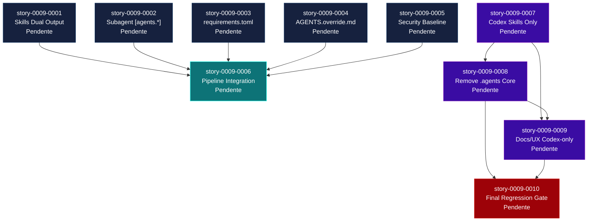

# Mapa de Implementacao — EPIC-0009: Codex Full Parity

**Gerado a partir das dependencias BlockedBy/Blocks de cada historia do EPIC-0009.**

---

## 1. Matriz de Dependencias

| Story | Titulo | Blocked By | Blocks | Status |
| :--- | :--- | :--- | :--- | :--- |
| story-0009-0001 | Codex Skills Dual Output | — | story-0009-0006 | Pendente |
| story-0009-0002 | Subagent Definitions [agents.*] | — | story-0009-0006 | Pendente |
| story-0009-0003 | CodexRequirementsAssembler | — | story-0009-0006 | Pendente |
| story-0009-0004 | CodexOverrideAssembler | — | story-0009-0006 | Pendente |
| story-0009-0005 | Enhanced AGENTS.md Security Baseline | — | story-0009-0006 | Pendente |
| story-0009-0006 | Pipeline Integration, Testes e Golden Files | story-0009-0001 a 0005 | — | Pendente |
| story-0009-0007 | Codex Skills Single Output (.codex/skills only) | — | story-0009-0008, story-0009-0009 | Pendente |
| story-0009-0008 | Remocao de `.agents/` no Core do Gerador | story-0009-0007 | story-0009-0009, story-0009-0010 | Pendente |
| story-0009-0009 | Refatoracao de Documentacao e UX para Codex-only | story-0009-0007, story-0009-0008 | story-0009-0010 | Pendente |
| story-0009-0010 | Regressao Completa e Golden Files sem `.agents/` | story-0009-0008, story-0009-0009 | — | Pendente |

> **Nota:** As stories 0001-0005 sao independentes entre si e podem ser executadas em paralelo maximo. Apenas story-0009-0006 depende da conclusao de todas as anteriores.

---

## 2. Fases de Implementacao

> As historias sao agrupadas em fases. Dentro de cada fase, as historias podem ser implementadas **em paralelo**. Uma fase so pode iniciar quando todas as dependencias das fases anteriores estiverem concluidas.

```
+==============================================================================================+
|                    FASE 0 — Codex Baseline (paralelo: 5)                                     |
|                                                                                              |
|  story-0009-0001   story-0009-0002   story-0009-0003   story-0009-0004   story-0009-0005    |
|  Skills Dual       [agents.*]        requirements      AGENTS.override    Security Baseline   |
|  Output            config.toml       .toml             .md                AGENTS.md           |
+==============================================================================================+
                                       |
                                       v
+==============================================================================================+
|                    FASE 1 — Baseline Integration                                              |
|                                                                                              |
|  story-0009-0006  (integra baseline no pipeline e valida goldens iniciais)                  |
+==============================================================================================+
                                       |
                                       v
+==============================================================================================+
|                    FASE 2 — Centralizacao Codex-only                                          |
|                                                                                              |
|  story-0009-0007  ->  story-0009-0008  ->  story-0009-0009                                  |
|  Skills only          Remove `.agents/`    Docs/UX codex-only                               |
|  `.codex/skills/`     from generator core  (README/CLAUDE/mapping/summary)                  |
+==============================================================================================+
                                       |
                                       v
+==============================================================================================+
|                    FASE 3 — Final Regression Gate                                             |
|                                                                                              |
|  story-0009-0010  (golden files + full verify sem `.agents/`)                               |
+==============================================================================================+
```

---

## 3. Caminho Critico

> O caminho critico (a sequencia mais longa de dependencias) determina o tempo minimo de implementacao do projeto.

```
story-0009-000X (qualquer da Fase 0) → story-0009-0006 → story-0009-0007 → story-0009-0008 → story-0009-0009 → story-0009-0010
                 Fase 0                  Fase 1            Fase 2             Fase 2             Fase 2             Fase 3
```

**6 etapas no caminho critico consolidado.** A extensao codex-only introduz uma cadeia sequencial de migracao e validacao final obrigatoria para remover compatibilidade legado com seguranca.

Estimativa de complexidade relativa (Fase 0):

| Story | Complexidade | Justificativa |
| :--- | :--- | :--- |
| story-0009-0001 | Baixa | Reutiliza `copySkillsTree()` existente, uma invocacao adicional |
| story-0009-0002 | Media | Modificacao de assembler + template, reutiliza `CodexScanner` |
| story-0009-0003 | Media | Novo assembler + template, derivacao condicional simples |
| story-0009-0004 | Baixa | Novo assembler simples, template estatico com documentacao |
| story-0009-0005 | Media | Expansao de template com conteudo rico (OWASP tabela, 5 subsecoes) |

O caminho critico provavelmente passa por **story-0009-0005** (template mais extenso) ou **story-0009-0003** (novo assembler completo).

---

## 4. Grafo de Dependencias (Mermaid)



---

## 5. Resumo por Fase

| Fase | Historias | Camada | Paralelismo | Pre-requisito |
| :--- | :--- | :--- | :--- | :--- |
| 0 | story-0009-0001, 0002, 0003, 0004, 0005 | Assemblers + Templates Baseline | 5 paralelas | EPIC-002 concluido |
| 1 | story-0009-0006 | Integration baseline | 1 | Fase 0 concluida |
| 2 | story-0009-0007, 0008, 0009 | Migracao codex-only | parcial (0008 apos 0007; 0009 apos 0008) | Fase 1 concluida |
| 3 | story-0009-0010 | Regression gate final | 1 | Fase 2 concluida |

**Total: 10 historias em 4 fases.**

---

## 6. Detalhamento por Fase

### Fase 0 — Core Artifacts (5 paralelas)

| Story | Escopo Principal | Artefatos Chave |
| :--- | :--- | :--- |
| story-0009-0001 | Dual output de skills (.codex/skills/ + .agents/skills/) | Modificacao em `CodexSkillsAssembler.java` |
| story-0009-0002 | Secoes [agents.*] no config.toml | Modificacao em `CodexConfigAssembler.java` + `config.toml.njk` |
| story-0009-0003 | Novo assembler para requirements.toml | `CodexRequirementsAssembler.java` + `requirements.toml.njk` |
| story-0009-0004 | Novo assembler para AGENTS.override.md | `CodexOverrideAssembler.java` + `agents-override.md.njk` |
| story-0009-0005 | Secao Security Baseline expandida no AGENTS.md | Modificacao em `sections/security.md.njk` |

**Entregas da Fase 0:**

- `.codex/skills/` com todas as skills espelhadas
- `config.toml` com secoes `[agents.*]` para cada agente
- `.codex/requirements.toml` com constraints de seguranca
- `AGENTS.override.md` documentado na raiz
- AGENTS.md com secao Security Baseline abrangente (quando security configurado)

### Fase 1 — Integration & Validation

| Story | Escopo Principal | Artefatos Chave |
| :--- | :--- | :--- |
| story-0009-0006 | Pipeline, testes, golden files, README | `AssemblerFactory.java`, `ReadmeAssembler.java`, golden files para 8 perfis |

**Entregas da Fase 1:**

- Pipeline expandido de 23 para 25 assemblers
- `ReadmeAssembler` com contagem de artefatos Codex atualizada
- Testes de integracao com 4+ fixtures
- Golden files regenerados para 8 perfis
- Testes de regressao confirmando zero impacto em `.claude/` e `.github/`
- CLAUDE.md com mapping table atualizada

### Fase 2 — Centralizacao Codex-only

| Story | Escopo Principal | Artefatos Chave |
| :--- | :--- | :--- |
| story-0009-0007 | Skills apenas em `.codex/skills/` | `CodexSkillsAssembler.java`, `CodexSkillsAssemblerTest.java` |
| story-0009-0008 | Remocao de `.agents/` no core | `AssemblerTarget.java`, `FileCategorizer.java`, `OverwriteDetector.java`, `SummaryTableBuilder.java` |
| story-0009-0009 | Documentacao e UX codex-only | `README.md`, `CLAUDE.md`, `MappingTableBuilder.java`, `readme-template.md` |

**Entregas da Fase 2:**

- Nenhum output novo em `.agents/`
- Pipeline e enums alinhados com target Codex-only
- Documentacao oficial sem referencias a `.agents/` como caminho ativo
- Tabelas de mapeamento/summary refletindo centralizacao em `.codex/`

### Fase 3 — Regression Gate Final

| Story | Escopo Principal | Artefatos Chave |
| :--- | :--- | :--- |
| story-0009-0010 | Golden + verify final sem `.agents/` | `src/test/resources/golden/**`, suites de regressao |

**Entregas da Fase 3:**

- Golden files dos 8 perfis sem dependencia de `.agents/`
- `mvn clean verify` verde com contrato final
- Evidencias de cobertura e regressao para fechamento do epic

---

## 7. Observacoes Estrategicas

### Gargalo Principal

O gargalo passa a ser a cadeia de migracao codex-only:
`story-0009-0007 -> story-0009-0008 -> story-0009-0009 -> story-0009-0010`.
Mesmo com paralelismo maximo na Fase 0, o fechamento exige essa sequencia.

### Historias Folha (sem dependentes)

**story-0009-0010** e a historia folha final e representa o gate de qualidade definitivo para encerramento do epic.

### Otimizacao de Tempo

- **Fase 0 oferece paralelismo maximo** (5 stories independentes) para consolidar baseline.
- **Fase 2 exige sequenciamento tecnico**, pois remover `.agents/` no core antecede ajuste documental definitivo.
- **Story 0010 nao deve iniciar cedo**, pois depende de contratos finais estabilizados.

### Risco Residual

O principal risco e a **quebra silenciosa por referencia residual a `.agents/`** em testes/docs/core. A mitigacao e reforcar asserts negativos e consolidar goldens apenas na Fase 3.

### Dependencia Externa

Este epico depende exclusivamente do EPIC-002 (concluido). Nao ha dependencia em epicos futuros ou trabalho em andamento. Pode ser iniciado imediatamente.
