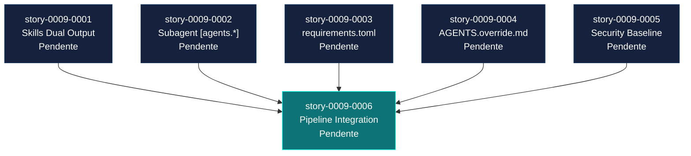

# Mapa de Implementacao — EPIC-0009: Codex Full Parity

**Gerado a partir das dependencias BlockedBy/Blocks de cada historia do EPIC-0009.**

---

## 1. Matriz de Dependencias

| Story | Titulo | Blocked By | Blocks | Status |
| :--- | :--- | :--- | :--- | :--- |
| story-0009-0001 | Codex Skills Dual Output | — | story-0009-0006 | Pendente |
| story-0009-0002 | Subagent Definitions [agents.*] | — | story-0009-0006 | Pendente |
| story-0009-0003 | CodexRequirementsAssembler | — | story-0009-0006 | Pendente |
| story-0009-0004 | CodexOverrideAssembler | — | story-0009-0006 | Pendente |
| story-0009-0005 | Enhanced AGENTS.md Security Baseline | — | story-0009-0006 | Pendente |
| story-0009-0006 | Pipeline Integration, Testes e Golden Files | story-0009-0001 a 0005 | — | Pendente |

> **Nota:** As stories 0001-0005 sao independentes entre si e podem ser executadas em paralelo maximo. Apenas story-0009-0006 depende da conclusao de todas as anteriores.

---

## 2. Fases de Implementacao

> As historias sao agrupadas em fases. Dentro de cada fase, as historias podem ser implementadas **em paralelo**. Uma fase so pode iniciar quando todas as dependencias das fases anteriores estiverem concluidas.

```
+==============================================================================================+
|                    FASE 0 — Core Artifacts (paralelo: 5)                                     |
|                                                                                              |
|  +-----------------+  +-----------------+  +-------------------+                             |
|  | story-0009-0001 |  | story-0009-0002 |  | story-0009-0003   |                             |
|  | Skills Dual     |  | Subagent Config |  | requirements.toml |                             |
|  | Output          |  | [agents.*]      |  |                   |                             |
|  +--------+--------+  +--------+--------+  +---------+---------+                             |
|           |                    |                      |                                       |
|  +-----------------+  +-----------------+             |                                       |
|  | story-0009-0004 |  | story-0009-0005 |             |                                       |
|  | AGENTS.override |  | Security Base-  |             |                                       |
|  | .md             |  | line AGENTS.md  |             |                                       |
|  +--------+--------+  +--------+--------+             |                                       |
|           |                    |                      |                                       |
+===========|====================|======================|======================================+
            |                    |                      |
            +--------------------+----------------------+
                                 |
                                 v
+==============================================================================================+
|                    FASE 1 — Integration & Validation                                         |
|                                                                                              |
|  +------------------------------------------------------------------------+                  |
|  | story-0009-0006                                                        |                  |
|  | Pipeline Integration, Testes de Integracao e Golden Files              |                  |
|  | (<- 0001, 0002, 0003, 0004, 0005)                                     |                  |
|  +------------------------------------------------------------------------+                  |
|                                                                                              |
+==============================================================================================+
```

---

## 3. Caminho Critico

> O caminho critico (a sequencia mais longa de dependencias) determina o tempo minimo de implementacao do projeto.

```
story-0009-000X (qualquer das 5) → story-0009-0006
          Fase 0                      Fase 1
```

**2 fases no caminho critico.** O caminho critico e determinado pela story mais longa da Fase 0. Todas as 5 stories da Fase 0 sao independentes, portanto o gargalo e a story mais complexa.

Estimativa de complexidade relativa (Fase 0):

| Story | Complexidade | Justificativa |
| :--- | :--- | :--- |
| story-0009-0001 | Baixa | Reutiliza `copySkillsTree()` existente, uma invocacao adicional |
| story-0009-0002 | Media | Modificacao de assembler + template, reutiliza `CodexScanner` |
| story-0009-0003 | Media | Novo assembler + template, derivacao condicional simples |
| story-0009-0004 | Baixa | Novo assembler simples, template estatico com documentacao |
| story-0009-0005 | Media | Expansao de template com conteudo rico (OWASP tabela, 5 subsecoes) |

O caminho critico provavelmente passa por **story-0009-0005** (template mais extenso) ou **story-0009-0003** (novo assembler completo).

---

## 4. Grafo de Dependencias (Mermaid)



---

## 5. Resumo por Fase

| Fase | Historias | Camada | Paralelismo | Pre-requisito |
| :--- | :--- | :--- | :--- | :--- |
| 0 | story-0009-0001, 0002, 0003, 0004, 0005 | Assemblers + Templates | 5 paralelas | EPIC-002 concluido |
| 1 | story-0009-0006 | Integration + Validation | 1 | Fase 0 concluida |

**Total: 6 historias em 2 fases.**

---

## 6. Detalhamento por Fase

### Fase 0 — Core Artifacts (5 paralelas)

| Story | Escopo Principal | Artefatos Chave |
| :--- | :--- | :--- |
| story-0009-0001 | Dual output de skills (.codex/skills/ + .agents/skills/) | Modificacao em `CodexSkillsAssembler.java` |
| story-0009-0002 | Secoes [agents.*] no config.toml | Modificacao em `CodexConfigAssembler.java` + `config.toml.njk` |
| story-0009-0003 | Novo assembler para requirements.toml | `CodexRequirementsAssembler.java` + `requirements.toml.njk` |
| story-0009-0004 | Novo assembler para AGENTS.override.md | `CodexOverrideAssembler.java` + `agents-override.md.njk` |
| story-0009-0005 | Secao Security Baseline expandida no AGENTS.md | Modificacao em `sections/security.md.njk` |

**Entregas da Fase 0:**

- `.codex/skills/` com todas as skills espelhadas
- `config.toml` com secoes `[agents.*]` para cada agente
- `.codex/requirements.toml` com constraints de seguranca
- `AGENTS.override.md` documentado na raiz
- AGENTS.md com secao Security Baseline abrangente (quando security configurado)

### Fase 1 — Integration & Validation

| Story | Escopo Principal | Artefatos Chave |
| :--- | :--- | :--- |
| story-0009-0006 | Pipeline, testes, golden files, README | `AssemblerFactory.java`, `ReadmeAssembler.java`, golden files para 8 perfis |

**Entregas da Fase 1:**

- Pipeline expandido de 23 para 25 assemblers
- `ReadmeAssembler` com contagem de artefatos Codex atualizada
- Testes de integracao com 4+ fixtures
- Golden files regenerados para 8 perfis
- Testes de regressao confirmando zero impacto em `.claude/` e `.github/`
- CLAUDE.md com mapping table atualizada

---

## 7. Observacoes Estrategicas

### Gargalo Principal

**Nenhum gargalo interno.** As 5 stories da Fase 0 sao totalmente independentes e podem ser executadas em paralelo maximo. O unico pre-requisito externo e EPIC-002 (ja concluido).

### Historias Folha (sem dependentes)

**story-0009-0006** e a unica historia folha. E tambem o gate de qualidade final — so deve ser iniciada quando todas as 5 stories anteriores estiverem concluidas e com testes unitarios passando.

### Otimizacao de Tempo

- **Fase 0 oferece paralelismo maximo** (5 stories independentes). Alocar multiplos desenvolvedores/agentes nesta fase maximiza throughput.
- **Stories 0001 e 0004 sao as mais simples** — reutilizam logica existente com mudancas minimas. Podem ser as primeiras a iniciar para liberar carga cognitiva.
- **Story 0005 e a mais extensa** em termos de conteudo de template (OWASP tabela + 5 subsecoes). Pode ser delegada a um agente especializado em seguranca.

### Risco Residual

O principal risco e a **atualizacao de golden files** na Fase 1. Se o output gerado difere sutilmente entre perfis (ex: um perfil tem security e outro nao), os golden files precisam capturar essas diferencas. Recomenda-se regenerar golden files incrementalmente durante a Fase 0 (por story) e consolidar na Fase 1.

### Dependencia Externa

Este epico depende exclusivamente do EPIC-002 (concluido). Nao ha dependencia em epicos futuros ou trabalho em andamento. Pode ser iniciado imediatamente.
