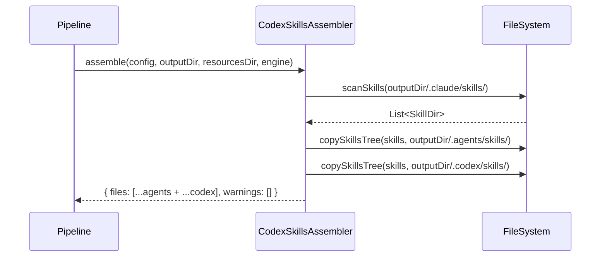

# Historia: Codex Skills Dual Output (.codex/skills/ + .agents/skills/)

**ID:** story-0009-0001

## 1. Dependencias

| Blocked By | Blocks |
| :--- | :--- |
| — | story-0009-0006 |

## 2. Regras Transversais Aplicaveis

| ID | Titulo |
| :--- | :--- |
| RULE-201 | Dual output de skills |
| RULE-206 | Impacto zero no output existente |
| RULE-210 | Golden files obrigatorios |

## 3. Descricao

Como **desenvolvedor do ia-dev-environment**, eu quero que o `CodexSkillsAssembler` gere skills em **dois** caminhos — `.agents/skills/` (existente) e `.codex/skills/` (novo) — garantindo que o Codex CLI descubra skills em ambos os locais de scan.

O Codex CLI descobre skills em dois caminhos paralelos: `.codex/skills/` (dentro da pasta de configuracao do projeto) e `.agents/skills/` (caminho alternativo para repos que compartilham agents entre ferramentas). Atualmente, o `CodexSkillsAssembler` so escreve em `.agents/skills/`. Esta story adiciona o segundo output sem alterar o primeiro.

### 3.1 Assembler a Modificar

**Arquivo:** `java/src/main/java/dev/iadev/assembler/CodexSkillsAssembler.java`

### 3.2 Mudanca Requerida

O metodo `assemble()` atualmente:
1. Escaneia `.claude/skills/` para encontrar subdiretorios com SKILL.md
2. Copia cada skill (SKILL.md + references/) para `.agents/skills/{name}/`

Apos a mudanca:
1. Escaneia `.claude/skills/` (sem mudanca)
2. Copia para `.agents/skills/{name}/` (sem mudanca)
3. **Novo:** Copia para `.codex/skills/{name}/` (mesma logica, target diferente)

### 3.3 Opcao de Implementacao

Reutilizar o metodo `copySkillsTree()` existente, invocando-o duas vezes com targets diferentes:
- `copySkillsTree(sourceDir, agentsSkillsDir)` — existente
- `copySkillsTree(sourceDir, codexSkillsDir)` — novo

O retorno de `files` no `AssemblerResult` deve incluir os caminhos de **ambos** os outputs.

### 3.4 Estrutura de Output Gerado

```
.codex/
├── config.toml          (existente, nao alterado)
└── skills/
    ├── x-dev-implement/
    │   ├── SKILL.md
    │   └── references/
    ├── x-review-pr/
    │   ├── SKILL.md
    │   └── references/
    └── ... (todas as skills)

.agents/
└── skills/              (existente, nao alterado)
    ├── x-dev-implement/
    └── ...
```

## 4. Definicoes de Qualidade Locais

### DoR Local (Definition of Ready)

- [ ] `CodexSkillsAssembler.java` lido e analisado
- [ ] Metodo `copySkillsTree()` entendido e reutilizavel
- [ ] `AssemblerTarget.CODEX` resolve para `.codex/` confirmado
- [ ] Skills geradas em `.claude/skills/` disponiveis em fixtures de teste

### DoD Local (Definition of Done)

- [ ] `CodexSkillsAssembler` gera skills em `.codex/skills/` alem de `.agents/skills/`
- [ ] Conteudo de `.codex/skills/` e `.agents/skills/` identico byte-for-byte
- [ ] `AssemblerResult.files` inclui caminhos de ambos os outputs
- [ ] Output `.claude/` e `.github/` inalterados (RULE-206)
- [ ] Output `.agents/skills/` existente inalterado
- [ ] Testes unitarios cobrindo: 0 skills, 1 skill, N skills, skills com references/

### Global Definition of Done (DoD)

- **Cobertura:** >= 95% Line, >= 90% Branch
- **Testes Automatizados:** Unitarios + integracao com fixtures diversas
- **Relatorio de Cobertura:** JaCoCo via `mvn verify`
- **Documentacao:** Javadoc atualizado no metodo assemble()
- **Performance:** Sem degradacao mensuravel

## 5. Contratos de Dados (Data Contract)

**CodexSkillsAssembler.assemble — Output (antes):**

| Campo | Valor |
| :--- | :--- |
| `files` | `[".agents/skills/x-dev-implement/SKILL.md", ...]` |
| `warnings` | `[]` |

**CodexSkillsAssembler.assemble — Output (depois):**

| Campo | Valor |
| :--- | :--- |
| `files` | `[".agents/skills/x-dev-implement/SKILL.md", ..., ".codex/skills/x-dev-implement/SKILL.md", ...]` |
| `warnings` | `[]` |

## 6. Diagramas

### 6.1 Fluxo de Copia Dual



## 7. Criterios de Aceite (Gherkin)

```gherkin
Cenario: Geracao dual de skills para Codex
  DADO que o pipeline gerou 14 skills em .claude/skills/
  QUANDO executo CodexSkillsAssembler.assemble
  ENTAO .agents/skills/ contem 14 subdiretorios com SKILL.md
  E .codex/skills/ contem 14 subdiretorios com SKILL.md
  E o conteudo de ambos e identico byte-for-byte

Cenario: Skills com references sao copiadas para ambos targets
  DADO que a skill "architecture" possui references/ com 3 arquivos
  QUANDO executo CodexSkillsAssembler.assemble
  ENTAO .agents/skills/architecture/references/ contem 3 arquivos
  E .codex/skills/architecture/references/ contem 3 arquivos

Cenario: Zero skills gera diretorios vazios
  DADO que .claude/skills/ esta vazio
  QUANDO executo CodexSkillsAssembler.assemble
  ENTAO .agents/skills/ existe mas esta vazio
  E .codex/skills/ existe mas esta vazio
  E files retornado e lista vazia

Cenario: Output existente .claude/ e .github/ nao e alterado
  DADO que .claude/ e .github/ ja foram gerados pelo pipeline
  QUANDO executo CodexSkillsAssembler.assemble
  ENTAO nenhum arquivo em .claude/ ou .github/ e modificado
```

## 8. Sub-tarefas

- [ ] [Dev] Extrair path do target `.codex/skills/` usando `AssemblerTarget.CODEX`
- [ ] [Dev] Adicionar segunda invocacao de `copySkillsTree()` para `.codex/skills/`
- [ ] [Dev] Concatenar files de ambos os outputs no `AssemblerResult`
- [ ] [Test] Unitario: dual output com 0, 1, N skills
- [ ] [Test] Unitario: skills com references/ copiadas para ambos targets
- [ ] [Test] Integracao: output completo com fixture full
- [ ] [Test] Regressao: output .claude/ e .github/ inalterados
