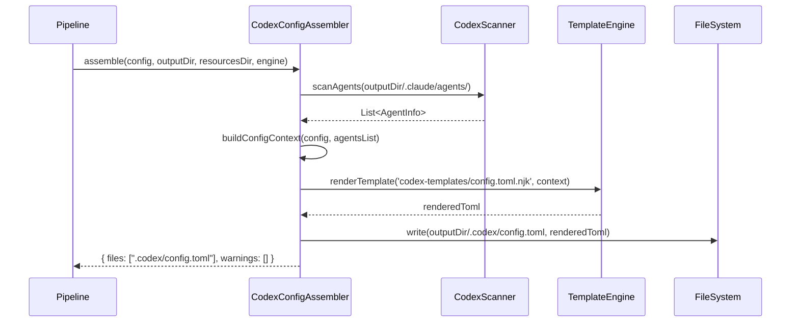

# Historia: Subagent Definitions [agents.*] no config.toml

**ID:** story-0009-0002

## 1. Dependencias

| Blocked By | Blocks |
| :--- | :--- |
| — | story-0009-0006 |

## 2. Regras Transversais Aplicaveis

| ID | Titulo |
| :--- | :--- |
| RULE-202 | Subagents derivados deterministicamente |
| RULE-206 | Impacto zero no output existente |
| RULE-208 | TOML e Markdown via template |
| RULE-209 | Paridade de placeholders |
| RULE-210 | Golden files obrigatorios |

## 3. Descricao

Como **desenvolvedor do ia-dev-environment**, eu quero que o `config.toml` gerado inclua secoes `[agents.*]` para cada agente definido no projeto, garantindo que o Codex CLI reconheca e utilize os subagents configurados.

No Codex CLI, subagents sao definidos como secoes `[agents.{role_name}]` no `config.toml`, contendo `description` e opcionalmente `model`, `approval_policy`, e `config_file`. Isso e equivalente aos arquivos `.claude/agents/*.md` no Claude Code. Atualmente, o `config.toml` gerado nao inclui definicoes de agentes.

### 3.1 Assembler a Modificar

**Arquivo:** `java/src/main/java/dev/iadev/assembler/CodexConfigAssembler.java`

### 3.2 Template a Modificar

**Arquivo:** `java/src/main/resources/codex-templates/config.toml.njk`

### 3.3 Mudanca no Assembler

O metodo `buildConfigContext()` precisa ser estendido para incluir:
- `agents_list` — Lista de agentes com `name` e `description`, lida de `.claude/agents/` via `CodexScanner`

O `CodexScanner.scanAgents()` ja existe e retorna essa informacao. Basta:
1. Invocar `CodexScanner.scanAgents(outputDir/.claude/agents/)`
2. Passar `agents_list` no context de renderizacao

### 3.4 Mudanca no Template

Adicionar bloco condicional ao final do `config.toml.njk`:

```toml

[agents.{{ agent.name }}]
description = "{{ agent.description }}"

```

### 3.5 Estrutura de Output Gerado

```toml
# Codex CLI configuration for my-java-cli
# Generated by ia-dev-environment -- do not edit manually.

model = "o4-mini"
approval_policy = "on-request"

[sandbox]
mode = "workspace-write"

[agents.architect]
description = "Software architect specialized in hexagonal architecture..."

[agents.tech-lead]
description = "Tech lead responsible for code quality and reviews..."

[agents.security-engineer]
description = "Security engineer focused on OWASP compliance..."

# ... (1 section per agent)
```

## 4. Definicoes de Qualidade Locais

### DoR Local (Definition of Ready)

- [ ] `CodexConfigAssembler.java` lido e analisado
- [ ] `CodexScanner.scanAgents()` disponivel e testado (EPIC-002)
- [ ] Template `config.toml.njk` atual entendido
- [ ] Formato TOML para `[agents.*]` validado contra documentacao Codex

### DoD Local (Definition of Done)

- [ ] `buildConfigContext()` inclui `agents_list` no context
- [ ] Template `config.toml.njk` renderiza secoes `[agents.*]`
- [ ] Cada agente gera uma secao TOML com `description`
- [ ] Sem agentes = sem secoes `[agents.*]` (condicional)
- [ ] Nomes de agentes sanitizados para bare keys TOML (sem espacos, sem caracteres especiais)
- [ ] Output `.claude/` e `.github/` inalterados
- [ ] Testes unitarios com 0, 1, N agentes

### Global Definition of Done (DoD)

- **Cobertura:** >= 95% Line, >= 90% Branch
- **Testes Automatizados:** Unitarios + integracao
- **Relatorio de Cobertura:** JaCoCo via `mvn verify`
- **Documentacao:** Javadoc atualizado
- **Performance:** Sem degradacao

## 5. Contratos de Dados (Data Contract)

**AgentInfo (ja existente no CodexScanner):**

| Campo | Tipo | Descricao |
| :--- | :--- | :--- |
| `name` | `String` | Nome do agente (ex: "architect", "tech-lead") |
| `description` | `String` | Descricao extraida da primeira linha do .md |

**Context estendido para config.toml:**

| Campo | Tipo | Obrigatorio | Origem |
| :--- | :--- | :--- | :--- |
| `agents_list` | `List<AgentInfo>` | O | `CodexScanner.scanAgents()` |

**config.toml Output — Nova secao:**

```toml
[agents.{name}]
description = "{description}"
```

## 6. Diagramas

### 6.1 Fluxo de Geracao Estendido



## 7. Criterios de Aceite (Gherkin)

```gherkin
Cenario: config.toml com secoes de agentes
  DADO que o pipeline gerou 8 agentes em .claude/agents/
  QUANDO executo CodexConfigAssembler.assemble
  ENTAO .codex/config.toml contem 8 secoes [agents.*]
  E cada secao tem description preenchida
  E o formato TOML e valido

Cenario: config.toml sem agentes quando nenhum foi gerado
  DADO que .claude/agents/ esta vazio
  QUANDO executo CodexConfigAssembler.assemble
  ENTAO .codex/config.toml NAO contem secoes [agents.*]
  E as secoes existentes (model, approval_policy, sandbox) permanecem inalteradas

Cenario: Nomes de agentes sanitizados para TOML bare keys
  DADO que existe um agente com nome "typescript-developer"
  QUANDO executo CodexConfigAssembler.assemble
  ENTAO a secao e [agents.typescript-developer] (hifens sao validos em bare keys TOML)

Cenario: Descricao com aspas e escapada corretamente
  DADO que um agente tem descricao contendo aspas duplas
  QUANDO executo CodexConfigAssembler.assemble
  ENTAO as aspas na description sao escapadas como \"
  E o TOML e valido
```

## 8. Sub-tarefas

- [ ] [Dev] Adicionar invocacao de `CodexScanner.scanAgents()` em `CodexConfigAssembler`
- [ ] [Dev] Passar `agents_list` no context de renderizacao
- [ ] [Dev] Adicionar bloco `` ao template `config.toml.njk`
- [ ] [Dev] Sanitizar nomes de agentes para bare keys TOML
- [ ] [Dev] Escapar aspas duplas em descriptions
- [ ] [Test] Unitario: config.toml com 0, 1, N agentes
- [ ] [Test] Unitario: agente com caracteres especiais no nome
- [ ] [Test] Unitario: agente com aspas na descricao
- [ ] [Test] Regressao: campos existentes (model, approval_policy, sandbox) inalterados
