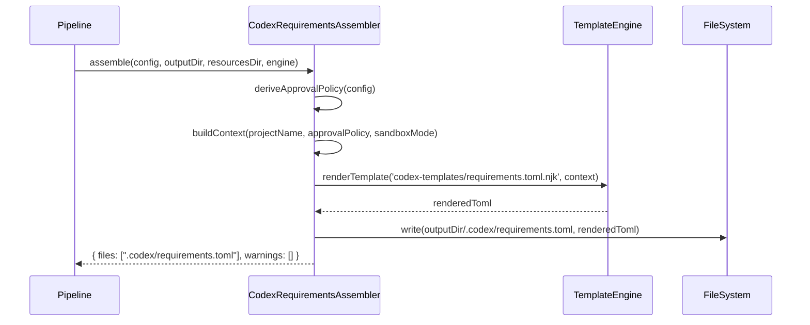

# Historia: CodexRequirementsAssembler — requirements.toml

**ID:** story-0009-0003

## 1. Dependencias

| Blocked By | Blocks |
| :--- | :--- |
| — | story-0009-0006 |

## 2. Regras Transversais Aplicaveis

| ID | Titulo |
| :--- | :--- |
| RULE-203 | requirements.toml seguro por padrao |
| RULE-206 | Impacto zero no output existente |
| RULE-207 | Padrao de extensao do pipeline |
| RULE-208 | TOML e Markdown via template |
| RULE-209 | Paridade de placeholders |
| RULE-210 | Golden files obrigatorios |

## 3. Descricao

Como **desenvolvedor do ia-dev-environment**, eu quero que o gerador produza um arquivo `.codex/requirements.toml` com constraints administrativas derivadas do config do projeto, garantindo que projetos gerados tenham politicas de seguranca enforced por padrao.

O `requirements.toml` e um mecanismo exclusivo do Codex CLI para admins definirem constraints que sobrescrevem qualquer configuracao do usuario. Ele garante que `approval_policy` e `sandbox_mode` nao possam ser relaxados abaixo de limites minimos definidos pelo administrador do projeto. Nao existe equivalente no Claude Code ou GitHub Copilot.

### 3.1 Novo Assembler

**Arquivo:** `java/src/main/java/dev/iadev/assembler/CodexRequirementsAssembler.java`

### 3.2 Novo Template

**Arquivo:** `java/src/main/resources/codex-templates/requirements.toml.njk`

### 3.3 Interface e Assinatura

```java
public class CodexRequirementsAssembler implements Assembler {
    @Override
    public AssemblerResult assemble(
        ProjectConfig config,
        Path outputDir,
        Path resourcesDir,
        TemplateEngine engine
    );
}
```

### 3.4 Logica de Derivacao

| Campo | Regra de Derivacao |
| :--- | :--- |
| `approval_policy` | Se `security.frameworks` nao vazio → `"suggest"`. Caso contrario → `"on-request"`. |
| `sandbox.mode` | Sempre `"workspace-write"` (default seguro). |

### 3.5 Posicao no Pipeline

Inserir apos `CodexSkillsAssembler` (posicao 19) e antes de `DocsAdrAssembler` (posicao 20). Nova posicao: **20** (DocsAdrAssembler desloca para 21).

### 3.6 Estrutura de Output Gerado

```toml
# Codex requirements for my-java-cli
# Generated by ia-dev-environment -- do not edit manually.
#
# This file enforces minimum security policies for the project.
# Values here override any user or project configuration.
# See: https://developers.openai.com/codex/config-reference/

[policy]
# Minimum approval policy (cannot be relaxed by users)
approval_policy = "on-request"

[sandbox]
# Minimum sandbox isolation (cannot be relaxed by users)
mode = "workspace-write"
```

## 4. Definicoes de Qualidade Locais

### DoR Local (Definition of Ready)

- [ ] Documentacao do Codex `requirements.toml` consultada
- [ ] Interface `Assembler` e `AssemblerResult` entendidos
- [ ] `AssemblerTarget.CODEX` resolve para `.codex/`
- [ ] Pipeline current position mapping documentado

### DoD Local (Definition of Done)

- [ ] `CodexRequirementsAssembler` implementado e compilando
- [ ] Template `requirements.toml.njk` criado com comentarios explicativos
- [ ] `approval_policy` derivado corretamente do config
- [ ] `sandbox.mode` sempre `"workspace-write"`
- [ ] TOML gerado e valido (parseable por qualquer parser TOML)
- [ ] Output `.claude/`, `.github/`, `.agents/` inalterados
- [ ] Testes unitarios com configs diversas

### Global Definition of Done (DoD)

- **Cobertura:** >= 95% Line, >= 90% Branch
- **Testes Automatizados:** Unitarios + integracao
- **Relatorio de Cobertura:** JaCoCo via `mvn verify`
- **Documentacao:** Javadoc em metodos publicos
- **Performance:** Sem degradacao

## 5. Contratos de Dados (Data Contract)

**CodexRequirementsAssembler — Context de Renderizacao:**

| Campo | Tipo | Obrigatorio | Origem |
| :--- | :--- | :--- | :--- |
| `project_name` | `String` | M | `config.identity.name` |
| `approval_policy` | `String` | M | Derivado: "suggest" se security, "on-request" caso contrario |
| `sandbox_mode` | `String` | M | Fixo: "workspace-write" |

**CodexRequirementsAssembler — Output:**

| Campo | Valor |
| :--- | :--- |
| `files` | `[".codex/requirements.toml"]` |
| `warnings` | `[]` |

## 6. Diagramas

### 6.1 Fluxo de Geracao



## 7. Criterios de Aceite (Gherkin)

```gherkin
Cenario: requirements.toml gerado com security frameworks
  DADO que o projeto tem security.frameworks = ["owasp"]
  QUANDO executo CodexRequirementsAssembler.assemble
  ENTAO .codex/requirements.toml e gerado
  E approval_policy = "suggest"
  E sandbox.mode = "workspace-write"
  E o arquivo contem comentarios explicativos

Cenario: requirements.toml gerado sem security frameworks
  DADO que o projeto NAO tem security.frameworks
  QUANDO executo CodexRequirementsAssembler.assemble
  ENTAO .codex/requirements.toml e gerado
  E approval_policy = "on-request"
  E sandbox.mode = "workspace-write"

Cenario: TOML gerado e valido
  DADO que qualquer configuracao de projeto
  QUANDO executo CodexRequirementsAssembler.assemble
  ENTAO o conteudo de .codex/requirements.toml e parseable por um parser TOML
  E nao contem erros de sintaxe

Cenario: Output existente inalterado
  DADO que .claude/, .github/, .agents/ ja foram gerados
  QUANDO executo CodexRequirementsAssembler.assemble
  ENTAO nenhum arquivo fora de .codex/ e modificado
```

## 8. Sub-tarefas

- [ ] [Dev] Criar `CodexRequirementsAssembler.java` implementando `Assembler`
- [ ] [Dev] Criar template `codex-templates/requirements.toml.njk`
- [ ] [Dev] Implementar `deriveApprovalPolicy()` com logica condicional
- [ ] [Dev] Construir context de renderizacao
- [ ] [Dev] Escrever output em `.codex/requirements.toml`
- [ ] [Test] Unitario: com security frameworks (approval_policy = "suggest")
- [ ] [Test] Unitario: sem security frameworks (approval_policy = "on-request")
- [ ] [Test] Unitario: TOML valido para todas as configuracoes
- [ ] [Test] Regressao: output existente inalterado
