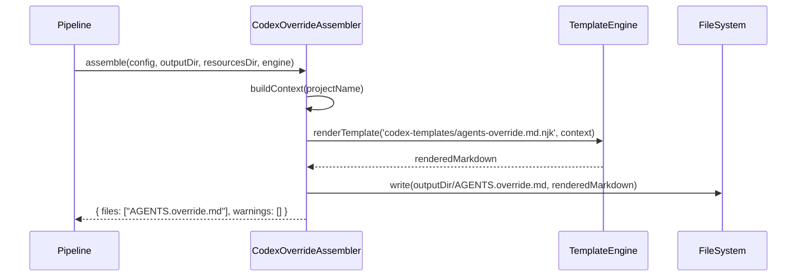

# Historia: CodexOverrideAssembler — AGENTS.override.md

**ID:** story-0009-0004

## 1. Dependencias

| Blocked By | Blocks |
| :--- | :--- |
| — | story-0009-0006 |

## 2. Regras Transversais Aplicaveis

| ID | Titulo |
| :--- | :--- |
| RULE-204 | AGENTS.override.md documentado |
| RULE-206 | Impacto zero no output existente |
| RULE-207 | Padrao de extensao do pipeline |
| RULE-208 | TOML e Markdown via template |
| RULE-210 | Golden files obrigatorios |

## 3. Descricao

Como **desenvolvedor do ia-dev-environment**, eu quero que o gerador produza um arquivo `AGENTS.override.md` na raiz do projeto, documentando o mecanismo de override do Codex CLI e servindo como template para customizacao local.

No Codex CLI, um `AGENTS.override.md` em qualquer diretorio substitui **completamente** o `AGENTS.md` daquele diretorio (nao faz merge — e substituicao total). Isso permite que subdiretorios tenham instrucoes completamente diferentes. O arquivo gerado deve conter documentacao explicativa e exemplos, com o conteudo efetivo vazio (para nao alterar o comportamento default).

### 3.1 Novo Assembler

**Arquivo:** `java/src/main/java/dev/iadev/assembler/CodexOverrideAssembler.java`

### 3.2 Novo Template

**Arquivo:** `java/src/main/resources/codex-templates/agents-override.md.njk`

### 3.3 Interface e Assinatura

```java
public class CodexOverrideAssembler implements Assembler {
    @Override
    public AssemblerResult assemble(
        ProjectConfig config,
        Path outputDir,
        Path resourcesDir,
        TemplateEngine engine
    );
}
```

### 3.4 Posicao no Pipeline

Inserir apos `CodexRequirementsAssembler`. O target e `ROOT` (raiz do output, ao lado de `AGENTS.md`).

### 3.5 Estrutura de Output Gerado

```markdown
<!-- AGENTS.override.md — Override template for OpenAI Codex CLI -->
<!-- Generated by ia-dev-environment — customize as needed. -->
<!--
  HOW OVERRIDES WORK:
  - An AGENTS.override.md file REPLACES (not merges) the AGENTS.md in the same directory.
  - Place this file in any subdirectory to provide directory-specific instructions.
  - The Codex CLI reads AGENTS.md files hierarchically from root to working directory.
  - An override at a deeper level completely replaces the parent AGENTS.md for that scope.

  EXAMPLE USAGE:
  - Place in `src/tests/` to give test-specific instructions
  - Place in `src/legacy/` to relax coding standards for legacy code
  - Place in `docs/` to switch Codex to documentation-writing mode

  To activate: remove these comments and add your override instructions below.
  To deactivate: delete this file or rename it.
-->

<!-- Add your override instructions below this line -->
```

## 4. Definicoes de Qualidade Locais

### DoR Local (Definition of Ready)

- [ ] Documentacao do Codex AGENTS.override.md consultada
- [ ] Interface `Assembler` e `AssemblerResult` entendidos
- [ ] `AssemblerTarget.ROOT` resolve para raiz do output confirmado
- [ ] AGENTS.md existente nao sera alterado

### DoD Local (Definition of Done)

- [ ] `CodexOverrideAssembler` implementado e compilando
- [ ] Template `agents-override.md.njk` criado com documentacao explicativa
- [ ] Output gerado em raiz do projeto (ao lado de AGENTS.md)
- [ ] Conteudo efetivo vazio (apenas comentarios HTML)
- [ ] Nao interfere com AGENTS.md existente
- [ ] Output `.claude/`, `.github/`, `.agents/` inalterados
- [ ] Testes unitarios

### Global Definition of Done (DoD)

- **Cobertura:** >= 95% Line, >= 90% Branch
- **Testes Automatizados:** Unitarios + integracao
- **Relatorio de Cobertura:** JaCoCo via `mvn verify`
- **Documentacao:** Javadoc em metodos publicos
- **Performance:** Sem degradacao

## 5. Contratos de Dados (Data Contract)

**CodexOverrideAssembler — Context de Renderizacao:**

| Campo | Tipo | Obrigatorio | Origem |
| :--- | :--- | :--- | :--- |
| `project_name` | `String` | M | `config.identity.name` |

**CodexOverrideAssembler — Output:**

| Campo | Valor |
| :--- | :--- |
| `files` | `["AGENTS.override.md"]` |
| `warnings` | `[]` |

## 6. Diagramas

### 6.1 Fluxo de Geracao



## 7. Criterios de Aceite (Gherkin)

```gherkin
Cenario: AGENTS.override.md gerado com documentacao
  DADO que qualquer configuracao de projeto
  QUANDO executo CodexOverrideAssembler.assemble
  ENTAO AGENTS.override.md e gerado na raiz do output
  E contem comentarios HTML explicando o mecanismo de override
  E contem exemplos de uso (tests, legacy, docs)
  E nao contem instrucoes ativas (apenas comentarios)

Cenario: AGENTS.override.md nao interfere com AGENTS.md
  DADO que AGENTS.md ja foi gerado na raiz
  QUANDO executo CodexOverrideAssembler.assemble
  ENTAO AGENTS.md permanece inalterado
  E AGENTS.override.md e um arquivo separado

Cenario: Output existente inalterado
  DADO que .claude/, .github/, .agents/ ja foram gerados
  QUANDO executo CodexOverrideAssembler.assemble
  ENTAO nenhum arquivo exceto AGENTS.override.md e criado/modificado
```

## 8. Sub-tarefas

- [ ] [Dev] Criar `CodexOverrideAssembler.java` implementando `Assembler`
- [ ] [Dev] Criar template `codex-templates/agents-override.md.njk`
- [ ] [Dev] Incluir documentacao sobre mecanismo de override nos comentarios
- [ ] [Dev] Incluir exemplos de uso pratico
- [ ] [Test] Unitario: arquivo gerado com conteudo esperado
- [ ] [Test] Unitario: AGENTS.md nao alterado
- [ ] [Test] Regressao: output existente inalterado
