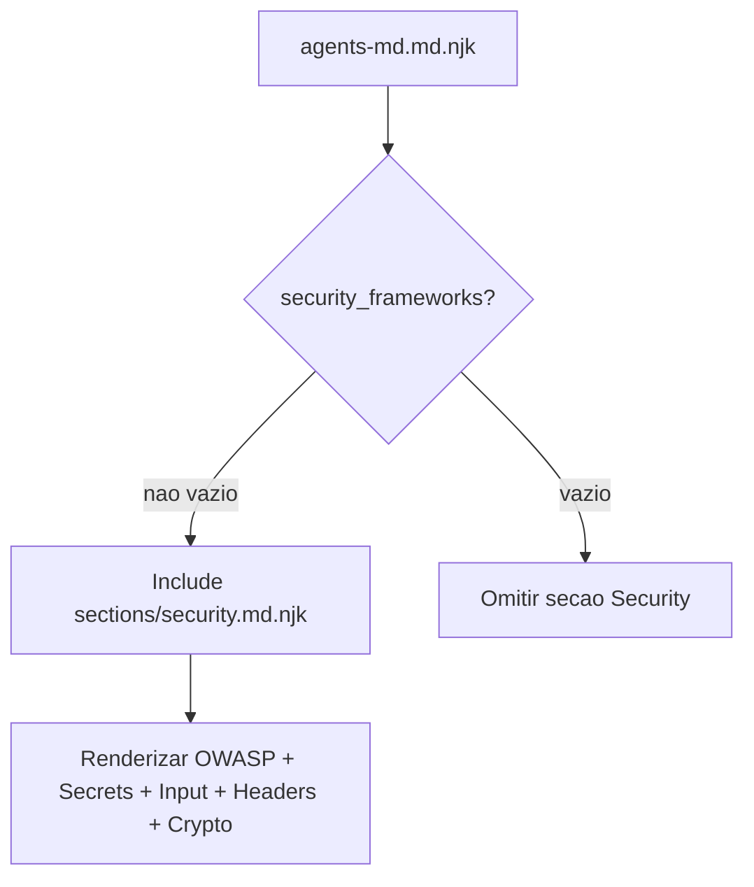

# Historia: Enhanced AGENTS.md — Security Baseline Section

**ID:** story-0009-0005

## 1. Dependencias

| Blocked By | Blocks |
| :--- | :--- |
| — | story-0009-0006 |

## 2. Regras Transversais Aplicaveis

| ID | Titulo |
| :--- | :--- |
| RULE-205 | Security Baseline condicional |
| RULE-206 | Impacto zero no output existente |
| RULE-208 | TOML e Markdown via template |
| RULE-209 | Paridade de placeholders |
| RULE-210 | Golden files obrigatorios |

## 3. Descricao

Como **desenvolvedor do ia-dev-environment**, eu quero que o `AGENTS.md` gerado inclua uma secao **Security Baseline** abrangente quando `security.frameworks` estiver configurado, garantindo que o Codex CLI receba orientacoes de seguranca completas para projetos que requerem conformidade.

A secao de seguranca atual no AGENTS.md (template `sections/security.md.njk`) e minimalista — menciona apenas que o projeto segue frameworks de seguranca. Esta story a expande para incluir diretrizes acionaveis baseadas na rule `06-security-baseline.md` do projeto: OWASP Top 10, gestao de segredos, validacao de input, headers de seguranca, e boas praticas de criptografia.

### 3.1 Template a Modificar

**Arquivo:** `java/src/main/resources/codex-templates/sections/security.md.njk`

### 3.2 Assembler Impactado

O `CodexAgentsMdAssembler` ja inclui a secao security condicionalmente. Nenhuma mudanca no assembler e necessaria — apenas no template.

### 3.3 Conteudo da Secao Security Baseline

A secao expandida deve incluir:

1. **OWASP Top 10** — Lista resumida das 10 vulnerabilidades mais criticas
2. **Gestao de Segredos** — Nunca hardcode, usar environment variables ou secrets manager
3. **Validacao de Input** — Validar em system boundaries, sanitizar antes de uso
4. **Headers de Seguranca** — CSP, X-Frame-Options, Strict-Transport-Security, etc.
5. **Criptografia** — TLS 1.2+, hashing com bcrypt/argon2, key management
6. **Pentest Readiness** — Checklist basico de preparacao

### 3.4 Condicionalidade

A secao so e incluida quando `security_frameworks` nao esta vazio (condicao ja existe no template principal `agents-md.md.njk`). Para projetos sem `security.frameworks`, nenhuma mudanca ocorre.

### 3.5 Estrutura de Output (secao no AGENTS.md)

```markdown
## Security Baseline

This project follows security frameworks: owasp.

### OWASP Top 10

| # | Vulnerability | Mitigation |
|---|--------------|------------|
| A01 | Broken Access Control | Role-based access, deny by default |
| A02 | Cryptographic Failures | TLS 1.2+, strong hashing, key rotation |
| A03 | Injection | Parameterized queries, input validation |
| A04 | Insecure Design | Threat modeling, secure design patterns |
| A05 | Security Misconfiguration | Hardened defaults, minimal footprint |
| A06 | Vulnerable Components | Dependency scanning, timely updates |
| A07 | Auth Failures | MFA, strong passwords, session management |
| A08 | Data Integrity Failures | Signed updates, CI/CD pipeline security |
| A09 | Logging Failures | Structured security logging, audit trails |
| A10 | SSRF | URL validation, network segmentation |

### Secrets Management

- NEVER hardcode secrets (API keys, passwords, tokens) in source code
- Use environment variables or secrets manager (Vault, AWS Secrets Manager)
- Rotate secrets regularly; revoke immediately on exposure
- Add `.env`, `credentials.json`, `*.pem`, `*.key` to `.gitignore`

### Input Validation

- Validate ALL external input at system boundaries
- Use allowlists over denylists
- Sanitize before use in queries, commands, or responses
- Reject unexpected types, sizes, or formats early

### Security Headers

- `Content-Security-Policy`: restrict resource loading
- `X-Frame-Options: DENY`: prevent clickjacking
- `Strict-Transport-Security`: enforce HTTPS
- `X-Content-Type-Options: nosniff`: prevent MIME sniffing

### Cryptography

- TLS 1.2+ for all network communication
- Hash passwords with bcrypt or argon2 (never MD5/SHA1)
- Use cryptographically secure random generators
- Manage encryption keys via dedicated key management service
```

## 4. Definicoes de Qualidade Locais

### DoR Local (Definition of Ready)

- [ ] Template `sections/security.md.njk` atual lido e entendido
- [ ] Rule `06-security-baseline.md` do projeto lida para referencia
- [ ] Skill `security/SKILL.md` consultada para conteudo detalhado
- [ ] Condicao de inclusao no `agents-md.md.njk` principal confirmada

### DoD Local (Definition of Done)

- [ ] Template `sections/security.md.njk` expandido com 5 subsecoes
- [ ] OWASP Top 10 tabela com vulnerabilidades e mitigacoes
- [ ] Secrets Management, Input Validation, Security Headers, Cryptography documentados
- [ ] Secao renderiza corretamente quando `security_frameworks` presente
- [ ] Secao ausente quando `security_frameworks` vazio
- [ ] Output `.claude/`, `.github/`, `.agents/` inalterados
- [ ] AGENTS.md sem security nao muda para projetos sem security frameworks

### Global Definition of Done (DoD)

- **Cobertura:** >= 95% Line, >= 90% Branch
- **Testes Automatizados:** Unitarios + integracao
- **Relatorio de Cobertura:** JaCoCo via `mvn verify`
- **Documentacao:** N/A (mudanca e no template, nao no Java)
- **Performance:** Sem degradacao

## 5. Contratos de Dados (Data Contract)

**Context existente (sem mudanca):**

| Campo | Tipo | Obrigatorio | Origem |
| :--- | :--- | :--- | :--- |
| `security_frameworks` | `String` | O | `config.security.frameworks` (ex: "owasp", "owasp, pci-dss") |

**Nenhum campo novo necessario.** A secao expandida usa apenas o campo `security_frameworks` ja presente no context.

## 6. Diagramas

### 6.1 Condicionalidade da Secao



## 7. Criterios de Aceite (Gherkin)

```gherkin
Cenario: AGENTS.md com Security Baseline completo
  DADO que o projeto tem security.frameworks = "owasp"
  QUANDO executo CodexAgentsMdAssembler.assemble
  ENTAO AGENTS.md contem secao "## Security Baseline"
  E contem tabela OWASP Top 10 com 10 linhas
  E contem subsecao "### Secrets Management"
  E contem subsecao "### Input Validation"
  E contem subsecao "### Security Headers"
  E contem subsecao "### Cryptography"

Cenario: AGENTS.md com multiplos security frameworks
  DADO que o projeto tem security.frameworks = "owasp, pci-dss"
  QUANDO executo CodexAgentsMdAssembler.assemble
  ENTAO AGENTS.md contem "This project follows security frameworks: owasp, pci-dss."
  E todas as subsecoes de seguranca estao presentes

Cenario: AGENTS.md sem Security Baseline quando nao configurado
  DADO que o projeto NAO tem security.frameworks
  QUANDO executo CodexAgentsMdAssembler.assemble
  ENTAO AGENTS.md NAO contem secao "## Security Baseline"
  E o restante do AGENTS.md permanece identico

Cenario: Projetos sem security nao sao impactados
  DADO que o projeto nao tem security.frameworks (valor vazio)
  QUANDO executo CodexAgentsMdAssembler.assemble
  ENTAO AGENTS.md e identico ao gerado antes desta story
```

## 8. Sub-tarefas

- [ ] [Dev] Expandir template `sections/security.md.njk` com OWASP Top 10 tabela
- [ ] [Dev] Adicionar subsecao Secrets Management ao template
- [ ] [Dev] Adicionar subsecao Input Validation ao template
- [ ] [Dev] Adicionar subsecao Security Headers ao template
- [ ] [Dev] Adicionar subsecao Cryptography ao template
- [ ] [Test] Unitario: renderizacao com security_frameworks = "owasp"
- [ ] [Test] Unitario: renderizacao com multiplos frameworks
- [ ] [Test] Unitario: renderizacao sem security_frameworks (secao ausente)
- [ ] [Test] Regressao: AGENTS.md sem security permanece identico
- [ ] [Test] Golden files atualizados para perfis com security
