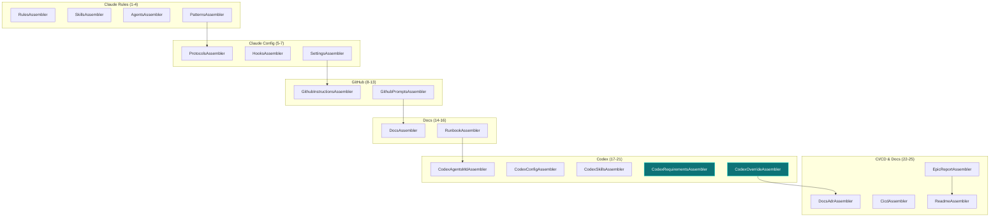

# Historia: Pipeline Integration, Testes e Golden Files

**ID:** story-0009-0006

## 1. Dependencias

| Blocked By | Blocks |
| :--- | :--- |
| story-0009-0001, story-0009-0002, story-0009-0003, story-0009-0004, story-0009-0005 | — |

## 2. Regras Transversais Aplicaveis

| ID | Titulo |
| :--- | :--- |
| RULE-206 | Impacto zero no output existente |
| RULE-207 | Padrao de extensao do pipeline |
| RULE-210 | Golden files obrigatorios |

## 3. Descricao

Como **desenvolvedor do ia-dev-environment**, eu quero que os novos assemblers e modificacoes das stories 0001-0005 estejam integrados no pipeline principal, com testes de integracao end-to-end, golden files atualizados e contagem de artefatos correta no README, garantindo que a geracao completa funcione de ponta a ponta.

Esta story e a **gate de qualidade final** do EPIC-0009. Ela:
1. Registra novos assemblers (`CodexRequirementsAssembler`, `CodexOverrideAssembler`) no `AssemblerFactory`
2. Atualiza o `ReadmeAssembler` para contar os novos artefatos Codex
3. Executa testes de integracao com multiplas fixtures (minimal, full, domain-driven, security)
4. Regenera golden files para os 8 perfis
5. Valida regressao: output `.claude/` e `.github/` byte-for-byte identico ao anterior

### 3.1 Assemblers a Registrar no AssemblerFactory

**Arquivo:** `java/src/main/java/dev/iadev/assembler/AssemblerFactory.java`

Metodo `buildCodexAssemblers()` atualmente retorna:
```java
List.of(
    desc(new CodexAgentsMdAssembler(...), CODEX, "AGENTS.md"),
    desc(new CodexConfigAssembler(...), CODEX, "config.toml"),
    desc(new CodexSkillsAssembler(...), CODEX_AGENTS, "skills"),
    desc(new DocsAdrAssembler(...), DOCS, "ADRs")
);
```

Deve ser expandido para:
```java
List.of(
    desc(new CodexAgentsMdAssembler(...), ROOT, "AGENTS.md"),
    desc(new CodexConfigAssembler(...), CODEX, "config.toml"),
    desc(new CodexSkillsAssembler(...), CODEX_AGENTS, "skills"),
    desc(new CodexRequirementsAssembler(...), CODEX, "requirements.toml"),
    desc(new CodexOverrideAssembler(...), ROOT, "AGENTS.override.md"),
    desc(new DocsAdrAssembler(...), DOCS, "ADRs")
);
```

### 3.2 ReadmeAssembler — Contagem de Artefatos

**Arquivo:** `java/src/main/java/dev/iadev/assembler/ReadmeAssembler.java`

Atualizar a contagem de artefatos Codex na Generation Summary:

| Artefato | Antes | Depois |
| :--- | :--- | :--- |
| AGENTS.md (root) | 1 | 1 |
| config.toml | 1 | 1 |
| requirements.toml | 0 | 1 |
| AGENTS.override.md | 0 | 1 |
| .agents/skills/ | N | N |
| .codex/skills/ | 0 | N |

### 3.3 CLAUDE.md — Mapping Table Update

Atualizar a tabela de mapping `.claude/ <-> .codex/` no `CLAUDE.md` para incluir:

| .claude/ | .codex/ | Notes |
|----------|---------|-------|
| Rules (`rules/*.md`) | Embedded in AGENTS.md | Codex uses single file |
| Skills (`skills/*/SKILL.md`) | `.codex/skills/` + `.agents/skills/` | Dual output |
| Agents (`agents/*.md`) | `[agents.*]` in config.toml | TOML sections |
| Hooks (`hooks/`) | N/A | No direct Codex equivalent |
| Settings (`settings*.json`) | `config.toml` + `requirements.toml` | TOML format |

### 3.4 Golden Files

Regenerar golden files para todos os 8 perfis:
- go-gin
- java-quarkus
- java-spring
- kotlin-ktor
- python-click-cli
- python-fastapi
- rust-axum
- typescript-nestjs

Cada golden file deve incluir os novos artefatos:
- `.codex/requirements.toml`
- `.codex/skills/` (espelho de `.agents/skills/`)
- `AGENTS.override.md`
- `config.toml` com secoes `[agents.*]`
- AGENTS.md com Security Baseline (para perfis com security)

## 4. Definicoes de Qualidade Locais

### DoR Local (Definition of Ready)

- [ ] Stories 0001-0005 concluidas e testes unitarios passando
- [ ] Todos os novos assemblers compilando sem erros
- [ ] Templates novos/modificados renderizando corretamente
- [ ] Pipeline existente funcional (23 assemblers)

### DoD Local (Definition of Done)

- [ ] `AssemblerFactory.buildCodexAssemblers()` inclui novos assemblers
- [ ] Pipeline executa 25 assemblers na ordem correta (23 + 2 novos)
- [ ] `ReadmeAssembler` conta artefatos Codex corretamente
- [ ] Testes de integracao com 4+ fixtures passando
- [ ] Golden files atualizados para 8 perfis
- [ ] Testes de regressao: output `.claude/` e `.github/` identicos
- [ ] Testes de regressao: AGENTS.md existente identico para configs sem mudanca
- [ ] Testes de regressao: config.toml sem agents identico para configs sem agents
- [ ] Zero warnings do compilador Java 21
- [ ] Cobertura >= 95% Line, >= 90% Branch

### Global Definition of Done (DoD)

- **Cobertura:** >= 95% Line, >= 90% Branch
- **Testes Automatizados:** Unitarios + integracao + regressao + golden files
- **Relatorio de Cobertura:** JaCoCo via `mvn verify`
- **Documentacao:** CLAUDE.md e README atualizados
- **Performance:** Pipeline <= 2x tempo anterior

## 5. Contratos de Dados (Data Contract)

**AssemblerFactory.buildCodexAssemblers — Antes:**

| # | Assembler | Target |
| :--- | :--- | :--- |
| 17 | CodexAgentsMdAssembler | ROOT |
| 18 | CodexConfigAssembler | CODEX |
| 19 | CodexSkillsAssembler | CODEX_AGENTS |
| 20 | DocsAdrAssembler | DOCS |

**AssemblerFactory.buildCodexAssemblers — Depois:**

| # | Assembler | Target |
| :--- | :--- | :--- |
| 17 | CodexAgentsMdAssembler | ROOT |
| 18 | CodexConfigAssembler | CODEX |
| 19 | CodexSkillsAssembler | CODEX_AGENTS |
| 20 | CodexRequirementsAssembler | CODEX |
| 21 | CodexOverrideAssembler | ROOT |
| 22 | DocsAdrAssembler | DOCS |

**ReadmeAssembler — Generation Summary (nova contagem):**

| Component | Count |
|-----------|-------|
| Codex AGENTS.md | 1 |
| Codex config.toml | 1 |
| Codex requirements.toml | 1 |
| Codex AGENTS.override.md | 1 |
| Codex .agents/skills/ | N |
| Codex .codex/skills/ | N |

## 6. Diagramas

### 6.1 Pipeline Expandido



## 7. Criterios de Aceite (Gherkin)

```gherkin
Cenario: Pipeline completo com 25 assemblers
  DADO que o pipeline e inicializado
  QUANDO listo os assemblers registrados
  ENTAO existem 25 assemblers na ordem correta
  E CodexRequirementsAssembler esta na posicao 20
  E CodexOverrideAssembler esta na posicao 21

Cenario: Geracao completa com config full
  DADO que tenho um config full (domain_driven, security, all features)
  QUANDO executo o pipeline completo
  ENTAO .codex/config.toml contem secoes [agents.*]
  E .codex/requirements.toml existe
  E .codex/skills/ contem todas as skills
  E AGENTS.md contem Security Baseline
  E AGENTS.override.md existe na raiz

Cenario: Geracao completa com config minimal
  DADO que tenho um config minimal (sem domain, sem security, sem database)
  QUANDO executo o pipeline completo
  ENTAO .codex/config.toml NAO contem secoes [agents.*] (se nenhum agent)
  E .codex/requirements.toml existe com approval_policy = "on-request"
  E AGENTS.md NAO contem Security Baseline
  E AGENTS.override.md existe na raiz

Cenario: Regressao — output .claude/ e .github/ inalterados
  DADO que gero output com a mesma config antes e depois das mudancas
  QUANDO comparo .claude/ e .github/ byte-for-byte
  ENTAO sao identicos

Cenario: Golden files para 8 perfis
  DADO que gero output para cada um dos 8 perfis
  QUANDO comparo com golden files
  ENTAO todos os 8 perfis passam na comparacao byte-for-byte

Cenario: ReadmeAssembler conta artefatos Codex corretamente
  DADO que o pipeline completo foi executado com config full
  QUANDO leio o README gerado
  ENTAO a Generation Summary inclui contagem de artefatos Codex
  E o total de artefatos Codex inclui requirements.toml e AGENTS.override.md
```

## 8. Sub-tarefas

- [ ] [Dev] Registrar `CodexRequirementsAssembler` em `AssemblerFactory.buildCodexAssemblers()`
- [ ] [Dev] Registrar `CodexOverrideAssembler` em `AssemblerFactory.buildCodexAssemblers()`
- [ ] [Dev] Atualizar `ReadmeAssembler` para contar novos artefatos Codex
- [ ] [Dev] Atualizar tabela de mapping no CLAUDE.md
- [ ] [Test] Integracao: pipeline completo com config full
- [ ] [Test] Integracao: pipeline completo com config minimal
- [ ] [Test] Integracao: pipeline completo com config domain-driven
- [ ] [Test] Integracao: pipeline completo com config security
- [ ] [Test] Regressao: .claude/ e .github/ byte-for-byte identicos
- [ ] [Test] Golden files: regenerar para 8 perfis
- [ ] [Test] Golden files: validar byte-for-byte
- [ ] [Test] ReadmeAssembler: contagem de artefatos Codex correta
