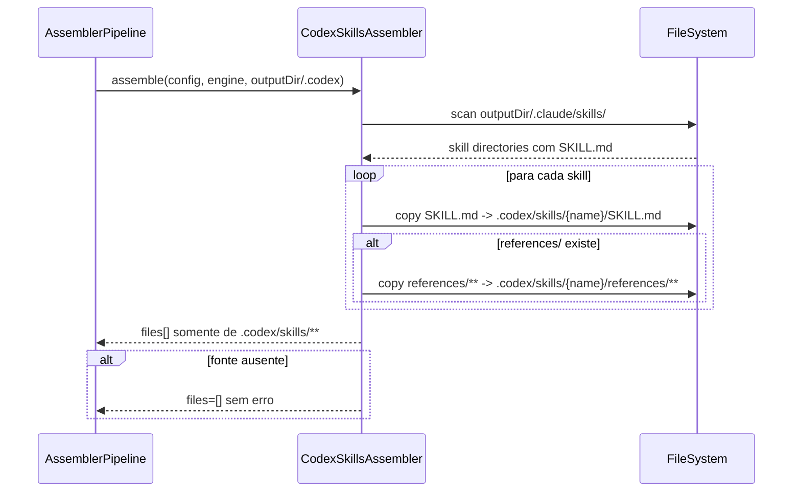

# Historia: Codex Skills Single Output (.codex/skills only)

**ID:** story-0009-0007

## 1. Dependencias

| Blocked By | Blocks |
| :--- | :--- |
| — | story-0009-0008, story-0009-0009 |

## 2. Regras Transversais Aplicaveis

| ID | Titulo |
| :--- | :--- |
| RULE-211 | Centralizacao Codex em `.codex/` |
| RULE-212 | Remocao de compatibilidade `.agents/` |
| RULE-213 | `AGENTS.md` na raiz preservado |
| RULE-215 | Migracao segura sem quebra funcional |
| RULE-216 | Cobertura de regressao para remocao |

## 3. Descricao

Como **mantenedor do ia-dev-environment**, eu quero que o `CodexSkillsAssembler` gere skills exclusivamente em `.codex/skills/`, garantindo que toda a estrutura operacional de skills do Codex fique centralizada dentro da pasta `.codex/` sem dependencia do caminho legado `.agents/skills/`.

A implementacao atual escreve em dois caminhos (`.agents/skills/` e `.codex/skills/`) para compatibilidade. Esta historia encerra a fase de transicao e define o contrato final: o gerador deixa de produzir qualquer skill em `.agents/`, preservando apenas `AGENTS.md` na raiz como arquivo canônico de instrucoes globais do workspace.

Do ponto de vista de arquitetura, esta historia e a base para as demais refatoracoes do epic: `AssemblerTarget`, contadores, categorizacao e documentacao passam a assumir Codex-only para skills. A mudanca deve ser aplicada com testes claros de ausencia de output legado para evitar regressao silenciosa.

### 3.1 Modificacao no CodexSkillsAssembler

- Arquivo alvo: `java/src/main/java/dev/iadev/assembler/CodexSkillsAssembler.java`
- Mudanca: remover escrita em `.agents/skills/` e manter somente copia para `.codex/skills/`.
- O metodo `assemble()` deve continuar lendo fonte em `.claude/skills/` (sem alteracao).

### 3.2 Contrato de output do Assembler

- Antes: lista `files` inclui caminhos de `.agents/skills/**` e `.codex/skills/**`.
- Depois: lista `files` inclui **somente** caminhos `.codex/skills/**`.
- A lista deve continuar incluindo `references/` recursivamente quando existir.

### 3.3 Compatibilidade explicita removida

- Nao criar fallback automatico para `.agents/skills/`.
- Nao criar diretório vazio `.agents/`.
- Nao manter dual-write “temporario” no codigo final desta historia.

## 4. Definicoes de Qualidade Locais

### DoR Local (Definition of Ready)

- [ ] `CodexSkillsAssembler` atual analisado com cenarios de `SKILL.md` + `references/`
- [ ] Testes atuais de dual output identificados
- [ ] Contrato final aprovado: Codex-only em `.codex/skills/`
- [ ] Dependencia de `AGENTS.md` raiz confirmada como fora do escopo desta mudanca

### DoD Local (Definition of Done)

- [ ] `CodexSkillsAssembler` escreve exclusivamente em `.codex/skills/`
- [ ] Nao existe escrita em `.agents/` no fluxo de skills
- [ ] Testes unitarios atualizados para validar ausencia de `.agents/`
- [ ] Testes validam copia de `references/` em `.codex/skills/`
- [ ] Nenhuma regressao em `.claude/` e `.github/`
- [ ] `AGENTS.md` raiz continua sendo gerado por `CodexAgentsMdAssembler`

### Global Definition of Done (DoD)

- **Cobertura:** >= 95% Line, >= 90% Branch
- **Testes Automatizados:** Unitarios + integracao + regressao
- **Relatorio de Cobertura:** JaCoCo via `mvn verify`
- **Documentacao:** Javadocs e docs de arquitetura atualizados se necessario
- **Performance:** Sem degradacao perceptivel no pipeline

## 5. Contratos de Dados (Data Contract)

**Contrato de entrada (fonte de skills):**

| Campo | Formato | Request | Response | Origem / Regra |
| :--- | :--- | :--- | :--- | :--- |
| `sourceSkillDir` | path (`.claude/skills/{name}`) | M | - | Derive — scan de diretorios com `SKILL.md` |
| `sourceSkillMd` | file path (`SKILL.md`) | M | - | Derive — existencia valida skill |
| `sourceReferencesDir` | path (`references/`) | O | - | Derive — opcional |

**Contrato de saida (arquivos gerados):**

| Campo | Formato | Request | Response | Origem / Regra |
| :--- | :--- | :--- | :--- | :--- |
| `generatedSkillMd` | path (`.codex/skills/{name}/SKILL.md`) | - | M | Generate — copia 1:1 de `sourceSkillMd` |
| `generatedReferenceFile` | path (`.codex/skills/{name}/references/**`) | - | O | Generate — copia recursiva quando existir |
| `files[]` | list of paths | - | M | Derive — agregacao de todos os arquivos copiados |
| `warnings[]` | list of strings | - | M | Derive — vazio em execucao normal |

## 6. Diagramas

### 6.1 Fluxo de geracao Codex-only para skills



## 7. Criterios de Aceite (Gherkin)

```gherkin
Cenario: Entrada degenerada sem diretorio de skills
  DADO que .claude/skills/ nao existe
  QUANDO executo CodexSkillsAssembler
  ENTAO o retorno files deve ser vazio
  E nenhum diretorio .agents/ deve ser criado

Cenario: Fluxo feliz com 2 skills validas
  DADO que existem as skills "x-dev-implement" e "x-review-pr" em .claude/skills/
  QUANDO executo CodexSkillsAssembler
  ENTAO .codex/skills/x-dev-implement/SKILL.md deve existir
  E .codex/skills/x-review-pr/SKILL.md deve existir
  E .agents/skills/ nao deve existir

Cenario: Erro de permissao ao copiar arquivo de skill
  DADO que SKILL.md de uma skill nao pode ser lido por permissao de arquivo
  QUANDO executo CodexSkillsAssembler
  ENTAO a execucao deve falhar com erro explicito de IO
  E o erro deve identificar o caminho da skill com falha

Cenario: Limite de fronteira para references com 1 arquivo
  DADO que a skill "architecture" possui references/ com exatamente 1 arquivo
  QUANDO executo CodexSkillsAssembler
  ENTAO .codex/skills/architecture/references/ deve conter 1 arquivo
  E files[] deve incluir esse caminho

Cenario: Limite de fronteira para references com 100 arquivos
  DADO que a skill "architecture" possui references/ com 100 arquivos
  QUANDO executo CodexSkillsAssembler
  ENTAO .codex/skills/architecture/references/ deve conter 100 arquivos
  E nenhum arquivo deve ser escrito em .agents/

Cenario: Fronteira acima do limite esperado para references com 101 arquivos
  DADO que a skill "architecture" possui references/ com 101 arquivos
  QUANDO executo CodexSkillsAssembler
  ENTAO os 101 arquivos devem ser copiados para .codex/skills/architecture/references/
  E files[] deve refletir todos os caminhos gerados
```

## 8. Sub-tarefas

- [ ] [Dev] Remover dual-write para `.agents/skills/` em `CodexSkillsAssembler`
- [ ] [Dev] Garantir que `assemble()` agregue apenas caminhos de `.codex/skills/**`
- [ ] [Dev] Revisar Javadoc do assembler para refletir Codex-only
- [ ] [Test] Atualizar `CodexSkillsAssemblerTest` para validar ausencia de `.agents/`
- [ ] [Test] Adicionar cenarios de references com cardinalidade 1/100/101
- [ ] [Test] Cobrir comportamento quando `.claude/skills/` nao existe
- [ ] [Doc] Atualizar notas tecnicas desta historia no epic e implementation map
