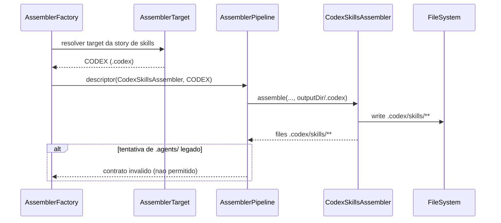

# Historia: Remocao de `.agents/` no Core do Gerador

**ID:** story-0009-0008

## 1. Dependencias

| Blocked By | Blocks |
| :--- | :--- |
| story-0009-0007 | story-0009-0009, story-0009-0010 |

## 2. Regras Transversais Aplicaveis

| ID | Titulo |
| :--- | :--- |
| RULE-211 | Centralizacao Codex em `.codex/` |
| RULE-212 | Remocao de compatibilidade `.agents/` |
| RULE-214 | Refatoracao cross-plataform consistente |
| RULE-215 | Migracao segura sem quebra funcional |
| RULE-216 | Cobertura de regressao para remocao |

## 3. Descricao

Como **engenheiro de plataforma do gerador**, eu quero remover o conceito estrutural de `.agents/` do core de geracao, garantindo que enums de target, contadores, categorizacao de CLI, deteccao de overwrite e fluxo de pipeline passem a refletir o modelo final centralizado em `.codex/`.

Esta historia trata o refactor interno de infraestrutura, nao apenas o assembler de skills. O objetivo e impedir referencias residuais a `.agents/` que possam manter comportamento legado, gerar contagens incorretas, mensagens confusas no CLI ou falsa deteccao de artefatos.

A remocao deve cobrir codigo de producao e testes correlatos, mantendo a semantica de `AGENTS.md` na raiz. Se alguma classe tiver contrato publico relacionado a `.agents/`, o contrato deve ser migrado para `.codex/skills` com nomenclatura explicita e coerente.

### 3.1 Superficies de codigo obrigatorias

- `AssemblerTarget` e consumidores (`AssemblerFactory`, pipeline descriptors)
- `ReadmeGithubCounter` (metodos de contagem de codex)
- `SummaryTableBuilder` (linhas de summary)
- `FileCategorizer` (categoria exibida no output do CLI)
- `OverwriteDetector` (diretorios monitorados para conflito)
- Testes associados: `AssemblerTargetTest`, `CliDisplayTest`, `OverwriteDetectorTest`, testes de tabelas README

### 3.2 Decisoes de design

- Eliminar `CODEX_AGENTS` como target dedicado.
- Skills de Codex passam a usar target `CODEX` com path interno `skills/`.
- Contagem de skills Codex deve ocorrer dentro da contagem `.codex/`, sem linha separada “Skills (.agents)”.
- Mensagens de overwrite nao devem listar `.agents/` como artefato gerado pelo pipeline.

## 4. Definicoes de Qualidade Locais

### DoR Local (Definition of Ready)

- [ ] Inventario de referencias `.agents/` no codigo de producao completo
- [ ] Inventario de referencias `.agents/` em testes completo
- [ ] Decisao sobre deprecacao/remocao de `CODEX_AGENTS` alinhada
- [ ] Plano de ajuste para mensagens de CLI e summary definido

### DoD Local (Definition of Done)

- [ ] `AssemblerTarget` nao expoe target para `.agents/`
- [ ] Nenhum assembler escreve em `.agents/`
- [ ] `OverwriteDetector` ignora `.agents/` como artefato gerado
- [ ] `FileCategorizer` nao categoriza `.agents/` como output oficial
- [ ] Summary/contadores nao exibem “Skills (.agents)”
- [ ] Testes unitarios de todas as classes afetadas atualizados e verdes
- [ ] Regressao: pipeline continua funcional para `.claude/`, `.github/` e `.codex/`

### Global Definition of Done (DoD)

- **Cobertura:** >= 95% Line, >= 90% Branch
- **Testes Automatizados:** Unitarios + integracao + regressao
- **Relatorio de Cobertura:** JaCoCo via `mvn verify`
- **Documentacao:** tabelas e descricoes tecnicas alinhadas ao novo contrato
- **Performance:** sem impacto relevante no tempo de geracao

## 5. Contratos de Dados (Data Contract)

**Contrato de target de assembler (antes):**

| Campo | Formato | Request | Response | Origem / Regra |
| :--- | :--- | :--- | :--- | :--- |
| `target` | enum | M | - | `CODEX_AGENTS` mapeia para `.agents/` |
| `resolvedPath` | path | - | M | `outputDir/.agents` |

**Contrato de target de assembler (depois):**

| Campo | Formato | Request | Response | Origem / Regra |
| :--- | :--- | :--- | :--- | :--- |
| `target` | enum | M | - | `CODEX` para artefatos Codex |
| `resolvedPath` | path | - | M | `outputDir/.codex` |
| `skillsSubpath` | relative path | - | M | `skills/{skillName}/SKILL.md` dentro de `.codex` |

**Contrato de summary README (depois):**

| Campo | Formato | Request | Response | Origem / Regra |
| :--- | :--- | :--- | :--- | :--- |
| `codexTotalFiles` | integer >= 0 | - | M | Derive — contagem recursiva de `.codex/` |
| `agentsDirCount` | N/A | - | - | Removido — `.agents/` nao e mais gerado |

## 6. Diagramas

### 6.1 Refatoracao de fluxo de path target



## 7. Criterios de Aceite (Gherkin)

```gherkin
Cenario: Entrada degenerada com target legado inexistente
  DADO que um teste tenta resolver target CODEX_AGENTS
  QUANDO compilo o projeto
  ENTAO o target legado nao deve existir no enum
  E o codigo deve usar apenas CODEX para artefatos Codex

Cenario: Fluxo feliz de pipeline sem .agents
  DADO um projeto valido com todas as configuracoes necessarias
  QUANDO executo o pipeline completo
  ENTAO os artefatos Codex devem ser escritos em .codex/
  E nenhum diretorio .agents/ deve ser criado

Cenario: Erro de categorizacao de caminho legado no CLI
  DADO um caminho de arquivo ".agents/skills/x/SKILL.md" vindo de fixture antiga
  QUANDO FileCategorizer categoriza o caminho
  ENTAO o resultado nao deve classificar como output oficial atual
  E a categorizacao deve orientar para contrato descontinuado

Cenario: Fronteira minima de overwrite com apenas .codex existente
  DADO um diretorio de saida contendo somente ".codex/"
  QUANDO OverwriteDetector verifica conflitos
  ENTAO deve listar conflito em ".codex/"
  E nao deve depender da existencia de ".agents/"

Cenario: Fronteira maxima de overwrite com .claude, .github, .codex e docs
  DADO um diretorio de saida contendo ".claude/", ".github/", ".codex/" e "docs/"
  QUANDO OverwriteDetector verifica conflitos
  ENTAO deve retornar exatamente 4 conflitos
  E ".agents/" nao deve aparecer na lista

Cenario: Fronteira acima do esperado com diretorio ".agents/" residual manual
  DADO um diretorio de saida contendo ".agents/" criado manualmente por usuario
  QUANDO OverwriteDetector verifica conflitos
  ENTAO o fluxo do gerador nao deve considerar ".agents/" como artefato oficial
  E a geracao deve continuar conforme contrato atual
```

## 8. Sub-tarefas

- [ ] [Dev] Remover `CODEX_AGENTS` de `AssemblerTarget` e ajustar consumidores
- [ ] [Dev] Ajustar descriptor do `CodexSkillsAssembler` para target `CODEX`
- [ ] [Dev] Refatorar `ReadmeGithubCounter` para remover contagem dedicada de `.agents/`
- [ ] [Dev] Refatorar `SummaryTableBuilder` para remover linha “Skills (.agents)”
- [ ] [Dev] Ajustar `FileCategorizer` para contrato codex-only
- [ ] [Dev] Ajustar `OverwriteDetector` para nao monitorar `.agents/`
- [ ] [Test] Atualizar `AssemblerTargetTest` para novo enum de targets
- [ ] [Test] Atualizar `CliDisplayTest` para categorias sem `.agents/`
- [ ] [Test] Atualizar `OverwriteDetectorTest` para 4 diretorios oficiais
- [ ] [Test] Atualizar testes de summary/readme para novas contagens
