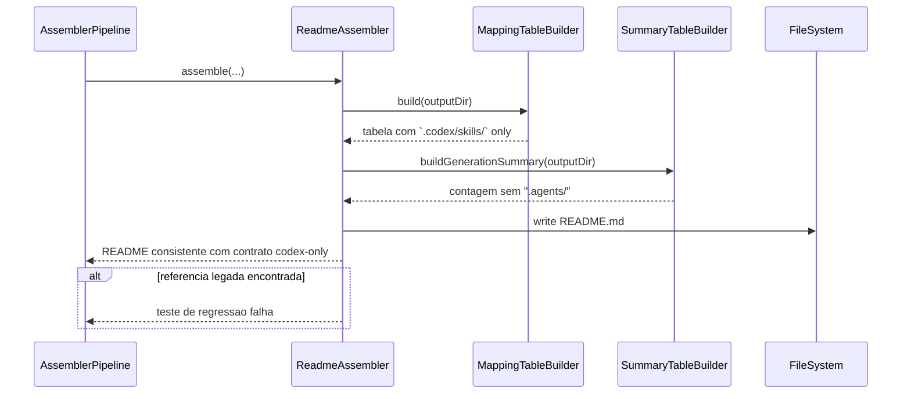

# Historia: Refatoracao de Documentacao e UX para Codex-only

**ID:** story-0009-0009

## 1. Dependencias

| Blocked By | Blocks |
| :--- | :--- |
| story-0009-0007, story-0009-0008 | story-0009-0010 |

## 2. Regras Transversais Aplicaveis

| ID | Titulo |
| :--- | :--- |
| RULE-211 | Centralizacao Codex em `.codex/` |
| RULE-213 | `AGENTS.md` na raiz preservado |
| RULE-214 | Refatoracao cross-plataform consistente |
| RULE-215 | Migracao segura sem quebra funcional |

## 3. Descricao

Como **usuario do gerador ia-dev-env**, eu quero que README, CLAUDE.md e mensagens de resumo/UX reflitam exclusivamente a estrutura Codex centralizada em `.codex/`, garantindo documentacao coerente com o comportamento real do pipeline e sem instrucoes legadas sobre `.agents/`.

Atualmente existem referencias explicitas em documentacao e tabelas de mapeamento indicando dual output de skills. Com a remocao de compatibilidade, essas mensagens passam a ser inconsistentes e podem induzir implementacoes erradas em projetos gerados. Esta historia corrige linguagem, exemplos e contadores exibidos ao usuario final.

O foco e garantir comunicacao de produto alinhada: “Codex = `.codex/` + `AGENTS.md` raiz”. Isso inclui seções “What’s Generated”, mapeamentos entre plataformas, generation summary e possiveis descricoes internas que ainda citam `.agents/`.

### 3.1 Superficies documentais obrigatorias

- `README.md` (overview, “What’s Generated”, mapas e notas)
- `CLAUDE.md` (mapping table e summary)
- geracao de README via `readme-template.md` e builders relacionados
- comentarios/Javadocs de classes que descrevem output Codex

### 3.2 Regras de comunicacao

- Nao mencionar `.agents/` como output ativo.
- Manter `AGENTS.md` na raiz explicitamente destacado.
- Explicar que skills do Codex estao em `.codex/skills/`.
- Garantir consistencia entre docs estaticas e docs geradas.

## 4. Definicoes de Qualidade Locais

### DoR Local (Definition of Ready)

- [ ] Inventario de referencias documentais a `.agents/` concluido
- [ ] Templates de README e builders mapeados
- [ ] Decisao de wording para Codex-only aprovada
- [ ] Escopo de arquivos root (`README.md`, `CLAUDE.md`) confirmado

### DoD Local (Definition of Done)

- [ ] README nao cita `.agents/` como artefato gerado
- [ ] CLAUDE.md mapeia skills Codex somente para `.codex/skills/`
- [ ] Tabelas de summary e mapeamento geradas sem dual output
- [ ] Mensagens de UX/CLI relacionadas a artefatos estao consistentes
- [ ] Comentarios/Javadocs relevantes atualizados
- [ ] Revisao textual confirma ausencia de referencias legadas ativas

### Global Definition of Done (DoD)

- **Cobertura:** >= 95% Line, >= 90% Branch (impactos em builders/testes)
- **Testes Automatizados:** Unitarios de builders + golden docs
- **Relatorio de Cobertura:** JaCoCo via `mvn verify`
- **Documentacao:** README e CLAUDE.md atualizados e consistentes
- **Performance:** Nao aplicavel (mudanca documental/formatacao)

## 5. Contratos de Dados (Data Contract)

**Contrato de mapeamento de plataformas (depois):**

| Campo | Formato | Request | Response | Origem / Regra |
| :--- | :--- | :--- | :--- | :--- |
| `claudeSkills` | markdown cell | - | M | Derive — `skills/*/SKILL.md` |
| `githubSkills` | markdown cell | - | M | Derive — `.github/skills/*/SKILL.md` |
| `codexSkills` | markdown cell | - | M | Generate — `.codex/skills/*/SKILL.md` |
| `codexRootAgentsMd` | markdown cell | - | M | Generate — `AGENTS.md` raiz preservado |
| `legacyAgentsDir` | markdown cell | - | - | Removido — nao documentar `.agents/` |

**Contrato de generation summary (depois):**

| Campo | Formato | Request | Response | Origem / Regra |
| :--- | :--- | :--- | :--- | :--- |
| `codexArtifactsCount` | integer >= 0 | - | M | Derive — recursivo em `.codex/` |
| `agentsRootCount` | integer (0/1) | - | M | Derive — existencia de `AGENTS.md` raiz |
| `agentsDirCount` | N/A | - | - | Removido |

## 6. Diagramas

### 6.1 Fluxo de geracao de documentacao alinhada



## 7. Criterios de Aceite (Gherkin)

```gherkin
Cenario: Entrada degenerada com projeto sem skills
  DADO que o projeto gerado nao contem skills habilitadas
  QUANDO o README e montado
  ENTAO nao deve haver mencao a ".agents/"
  E a secao de Codex deve apontar para ".codex/"

Cenario: Fluxo feliz de documentacao codex-only
  DADO que o pipeline gera skills Codex
  QUANDO abro README.md e CLAUDE.md gerados
  ENTAO ambos devem referenciar skills em ".codex/skills/"
  E ambos devem preservar `AGENTS.md` na raiz

Cenario: Erro por referencia legada em template
  DADO que existe referencia textual ".agents/" em template de README
  QUANDO executo os testes de tabela de mapeamento
  ENTAO o teste deve falhar explicitamente
  E o diff deve evidenciar o trecho legado

Cenario: Fronteira minima de summary com 0 arquivos em .codex
  DADO que o diretorio ".codex/" existe e esta vazio
  QUANDO SummaryTableBuilder calcula os totais
  ENTAO o total de artefatos Codex deve ser 0
  E nao deve existir linha de "Skills (.agents)"

Cenario: Fronteira maxima de summary com 500 arquivos em .codex
  DADO que o diretorio ".codex/" contem 500 arquivos
  QUANDO SummaryTableBuilder calcula os totais
  ENTAO o total de artefatos Codex deve ser 500
  E o resumo deve permanecer formatado corretamente

Cenario: Fronteira acima do esperado com diretorio ".agents/" residual
  DADO que existe um diretorio ".agents/" residual criado manualmente
  QUANDO README e CLAUDE.md sao gerados
  ENTAO a documentacao nao deve listar ".agents/" como artefato oficial
  E a narrativa deve permanecer codex-only
```

## 8. Sub-tarefas

- [ ] [Dev] Atualizar `README.md` raiz para remover referencias a `.agents/`
- [ ] [Dev] Atualizar `CLAUDE.md` raiz e tabela de mapping para codex-only
- [ ] [Dev] Refatorar `MappingTableBuilder` para remover dual output textual
- [ ] [Dev] Refatorar `SummaryTableBuilder` e template README conforme contrato
- [ ] [Dev] Revisar Javadocs/comentarios que citam `.agents/`
- [ ] [Test] Atualizar `ReadmeTablesTest`, `ReadmeUtilsTest`, `SummaryTableBuilderTest`
- [ ] [Test] Adicionar assercoes negativas para ausencia de `.agents/` em docs geradas
- [ ] [Doc] Revisar linguagem final em pt-BR tecnico e consistente
