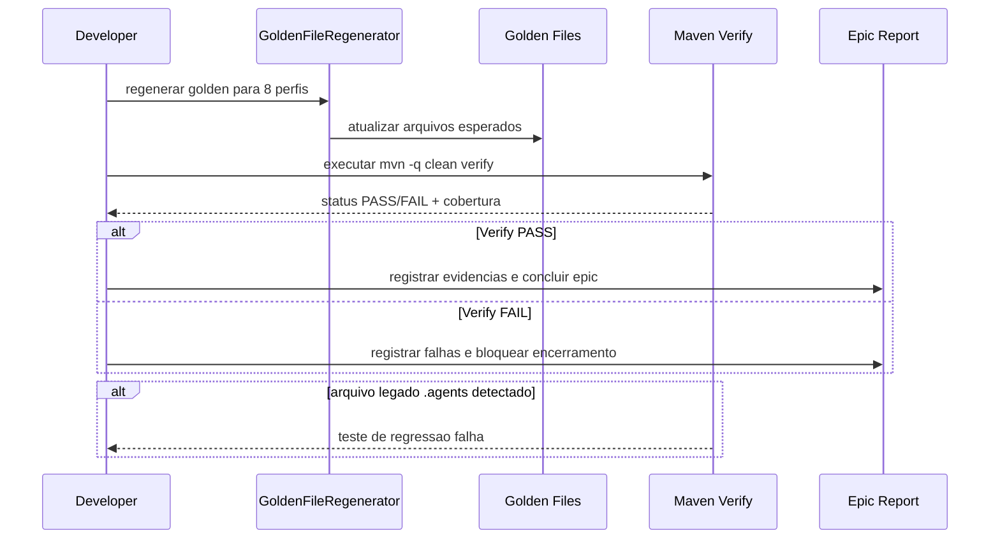

# Historia: Regressao Completa e Golden Files sem `.agents/`

**ID:** story-0009-0010

## 1. Dependencias

| Blocked By | Blocks |
| :--- | :--- |
| story-0009-0008, story-0009-0009 | — |

## 2. Regras Transversais Aplicaveis

| ID | Titulo |
| :--- | :--- |
| RULE-210 | Golden files obrigatorios |
| RULE-212 | Remocao de compatibilidade `.agents/` |
| RULE-215 | Migracao segura sem quebra funcional |
| RULE-216 | Cobertura de regressao para remocao |

## 3. Descricao

Como **guardiao de qualidade do ia-dev-environment**, eu quero executar a validacao final de regressao com atualizacao completa dos golden files, garantindo que a remocao de `.agents/` nao introduza quebra funcional e que os artefatos finais reflitam o contrato definitivo: skills Codex em `.codex/skills/` e `AGENTS.md` preservado na raiz.

Esta historia consolida a verificacao end-to-end do epic apos as refatoracoes estruturais e documentais. O foco e assegurar confiabilidade de geracao para todos os perfis suportados e confirmar que o comportamento esperado permanece estavel para `.claude/` e `.github/`.

Deve incluir execucao de suite completa (`mvn clean verify`), regeneracao de goldens para todos os perfis, validacao byte-for-byte, cobertura e inspecoes negativas (ausencia de `.agents/` em outputs e docs). Somente com essa historia concluida o epic pode ser considerado finalizado.

### 3.1 Escopo de validacao obrigatorio

- Golden files de todos os perfis suportados pelo projeto
- Testes unitarios e integracao de assemblers/README/CLI
- Verificacao de contagem e mapeamento em docs geradas
- Verificacao de ausencia de output `.agents/`
- Verificacao de preservacao de `AGENTS.md` raiz

### 3.2 Perfis minimos para validacao de golden

- go-gin
- java-quarkus
- java-spring
- kotlin-ktor
- python-click-cli
- python-fastapi
- rust-axum
- typescript-nestjs

## 4. Definicoes de Qualidade Locais

### DoR Local (Definition of Ready)

- [ ] Stories 0008 e 0009 concluidas e mergeadas no branch do epic
- [ ] Testes unitarios locais das classes afetadas passando
- [ ] Comando de regeneracao de golden validado no ambiente atual
- [ ] Baseline de diffs de golden inicial capturada

### DoD Local (Definition of Done)

- [ ] Golden files atualizados para todos os perfis suportados
- [ ] Nenhum golden contem `.agents/skills/` como output gerado
- [ ] Todos os golden contem `.codex/skills/` quando aplicavel
- [ ] `AGENTS.md` raiz preservado em todos os perfis relevantes
- [ ] `mvn -q clean verify` executa com sucesso
- [ ] Cobertura atende limites globais
- [ ] Regressao confirma `.claude/` e `.github/` sem impacto indevido
- [ ] Relatorio final do epic atualizado com evidencias de validacao

### Global Definition of Done (DoD)

- **Cobertura:** >= 95% Line, >= 90% Branch
- **Testes Automatizados:** Unitarios + integracao + golden + regressao
- **Relatorio de Cobertura:** JaCoCo via `mvn verify jacoco:report`
- **Documentacao:** artefatos de epic e tabelas atualizados
- **Compilacao limpa:** zero erros e zero falhas de teste

## 5. Contratos de Dados (Data Contract)

**Contrato de validacao de artefatos gerados por perfil:**

| Campo | Formato | Request | Response | Origem / Regra |
| :--- | :--- | :--- | :--- | :--- |
| `profileName` | enum/string | M | - | Generate — lista de perfis suportados |
| `generatedCodexSkillsPath` | path pattern | - | M | Derive — `.codex/skills/**` |
| `generatedAgentsLegacyPath` | path pattern | - | - | Removido — nao deve existir |
| `generatedRootAgentsMd` | file path | - | M | Derive — `AGENTS.md` |
| `goldenParityStatus` | PASS/FAIL | - | M | Derive — comparacao byte-for-byte |

**Contrato de saida da verificacao final:**

| Campo | Formato | Request | Response | Origem / Regra |
| :--- | :--- | :--- | :--- | :--- |
| `verifyExitCode` | integer | - | M | Derive — `mvn clean verify` |
| `testsPassed` | integer >= 0 | - | M | Derive — surefire/failsafe |
| `failedTests` | list | - | O | Derive — presente somente em falha |
| `coverageLine` | percentage | - | M | Derive — JaCoCo |
| `coverageBranch` | percentage | - | M | Derive — JaCoCo |

## 6. Diagramas

### 6.1 Fluxo de consolidacao e regressao final



## 7. Criterios de Aceite (Gherkin)

```gherkin
Cenario: Entrada degenerada com apenas 1 perfil para smoke local
  DADO que executo validacao inicial somente com perfil "java-spring"
  QUANDO comparo output gerado com golden atualizado
  ENTAO a comparacao deve passar para ".codex/skills/"
  E nao deve existir referencia a ".agents/"

Cenario: Fluxo feliz com regressao completa em 8 perfis
  DADO que os 8 perfis oficiais foram regenerados
  QUANDO executo mvn -q clean verify
  ENTAO todos os testes devem passar
  E os golden files devem estar em paridade byte-for-byte
  E `AGENTS.md` na raiz deve permanecer presente

Cenario: Erro em golden por referencia legada
  DADO que um golden antigo ainda referencia ".agents/skills/"
  QUANDO executo a suite de golden tests
  ENTAO o teste deve falhar explicitamente com diff
  E a falha deve indicar o perfil e arquivo divergente

Cenario: Fronteira minima de cobertura no limite aceito
  DADO que a suite completa finaliza com line coverage de 95% e branch de 90%
  QUANDO avalio os quality gates
  ENTAO o build deve ser considerado aprovado

Cenario: Fronteira maxima de cobertura
  DADO que a suite completa finaliza com line coverage de 100% e branch de 100%
  QUANDO avalio os quality gates
  ENTAO o build deve ser considerado aprovado

Cenario: Fronteira acima do limite com regressao critica
  DADO que os testes passam mas o output gera diretorio ".agents/"
  QUANDO executo os testes de regressao estrutural
  ENTAO a validacao final deve falhar
  E o epic nao deve ser marcado como concluido
```

## 8. Sub-tarefas

- [ ] [Dev] Executar regeneracao de golden files para os 8 perfis
- [ ] [Dev] Revisar diffs de golden para confirmar ausencia de `.agents/`
- [ ] [Test] Executar `mvn -q clean verify` completo
- [ ] [Test] Executar `mvn -q verify jacoco:report` para cobertura final
- [ ] [Test] Validar explicitamente ausencia de `.agents/` em outputs esperados
- [ ] [Test] Validar preservacao de `AGENTS.md` raiz
- [ ] [Doc] Atualizar status/relatorio do epic com evidencias finais
