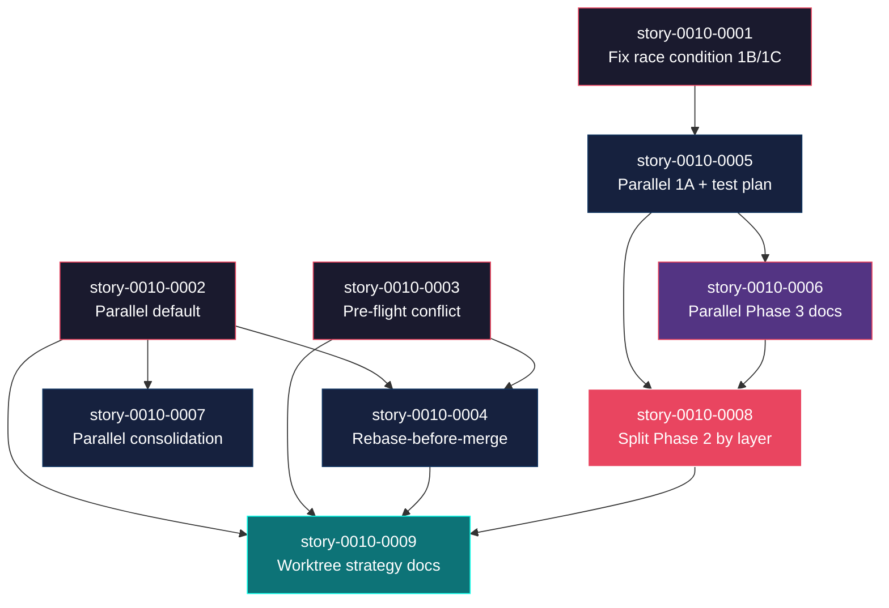

# Mapa de Implementacao — Otimizacao de Paralelismo e Worktree (EPIC-0010)

**Gerado a partir das dependencias BlockedBy/Blocks de cada historia do epic-0010.**

---

## 1. Matriz de Dependencias

| Story | Titulo | Blocked By | Blocks | Status |
| :--- | :--- | :--- | :--- | :--- |
| story-0010-0001 | Corrigir race condition Phase 1C/1B | — | story-0010-0005 | Pendente |
| story-0010-0002 | Tornar execucao paralela o default | — | story-0010-0004, story-0010-0007, story-0010-0009 | Pendente |
| story-0010-0003 | Pre-flight conflict analysis | — | story-0010-0004, story-0010-0009 | Pendente |
| story-0010-0004 | Rebase-before-merge strategy | story-0010-0002, story-0010-0003 | story-0010-0009 | Pendente |
| story-0010-0005 | Paralelizar Phase 1A com test planning | story-0010-0001 | story-0010-0006, story-0010-0008 | Pendente |
| story-0010-0006 | Paralelizar Phase 3 documentation generators | story-0010-0005 | story-0010-0008 | Pendente |
| story-0010-0007 | Paralelizar epic consolidation 2.1 + 2.2 | story-0010-0002 | story-0010-0009 | Pendente |
| story-0010-0008 | Split Phase 2 em sub-fases por layer | story-0010-0005, story-0010-0006 | story-0010-0009 | Pendente |
| story-0010-0009 | Documentacao estrategia de worktree | story-0010-0002, story-0010-0003, story-0010-0004, story-0010-0008 | — | Pendente |

> **Nota:** story-0010-0001 e story-0010-0002/0003 operam em skills diferentes (`x-dev-lifecycle` vs `x-dev-epic-implement`), permitindo paralelismo real na Fase 0 sem conflitos de arquivo. story-0010-0009 e uma historia folha (sem dependentes) e serve como consolidacao documental do epico inteiro.

---

## 2. Fases de Implementacao

```
+======================================================================+
|           FASE 0 -- Fundacao e Correcoes (paralelo)                  |
|                                                                      |
|  +-----------------+  +-----------------+  +-----------------+       |
|  | story-0010-0001 |  | story-0010-0002 |  | story-0010-0003 |       |
|  | Fix race 1B/1C  |  | Parallel default|  | Pre-flight      |       |
|  | (lifecycle)      |  | (epic-impl)     |  | conflict        |       |
|  +--------+--------+  +----+-------+----+  +----+-------+----+       |
+=========|==================|=======|===========|=======|=============+
          |                  |       |           |       |
          v                  |       v           v       |
+======================================================================+
|           FASE 1 -- Otimizacoes Internas (paralelo)                  |
|                                                                      |
|  +-----------------+  +-----------------+  +-----------------+       |
|  | story-0010-0005 |  | story-0010-0004 |  | story-0010-0007 |       |
|  | Parallel 1A+    |  | Rebase-before-  |  | Parallel        |       |
|  | test plan       |  | merge           |  | consolidation   |       |
|  | (<- 0001)       |  | (<- 0002,0003)  |  | (<- 0002)       |       |
|  +--------+--------+  +-----------------+  +-----------------+       |
+=========|============================================================+
          |
          v
+======================================================================+
|           FASE 2 -- Paralelizacao de Fases (sequencial)              |
|                                                                      |
|  +---------------------------------------------+                    |
|  | story-0010-0006                              |                    |
|  | Paralelizar Phase 3 documentation generators |                    |
|  | (<- 0005)                                    |                    |
|  +---------------------+------------------------+                    |
+========================|=============================================+
                         |
                         v
+======================================================================+
|           FASE 3 -- Implementacao Avancada (sequencial)              |
|                                                                      |
|  +---------------------------------------------+                    |
|  | story-0010-0008                              |                    |
|  | Split Phase 2 em sub-fases por layer         |                    |
|  | (<- 0005, 0006)                              |                    |
|  +---------------------+------------------------+                    |
+========================|=============================================+
                         |
                         v
+======================================================================+
|           FASE 4 -- Documentacao (sequencial)                        |
|                                                                      |
|  +---------------------------------------------+                    |
|  | story-0010-0009                              |                    |
|  | Documentacao estrategia de worktree          |                    |
|  | (<- 0002, 0003, 0004, 0008)                  |                    |
|  +---------------------------------------------+                    |
+======================================================================+
```

---

## 3. Caminho Critico

```
story-0010-0001 --> story-0010-0005 --> story-0010-0006 --> story-0010-0008 --> story-0010-0009
     Fase 0              Fase 1              Fase 2              Fase 3              Fase 4
```

**5 fases no caminho critico, 5 historias na cadeia mais longa (0001 -> 0005 -> 0006 -> 0008 -> 0009).**

Qualquer atraso em story-0010-0001 (fix race condition) propaga diretamente para todo o fluxo de otimizacao do lifecycle. story-0010-0001 e o gargalo principal pois desbloqueia a cadeia mais longa do epico.

---

## 4. Grafo de Dependencias (Mermaid)



---

## 5. Resumo por Fase

| Fase | Historias | Area de Impacto | Paralelismo | Pre-requisito |
| :--- | :--- | :--- | :--- | :--- |
| 0 | story-0010-0001, story-0010-0002, story-0010-0003 | lifecycle (0001), epic-implement (0002, 0003) | 3 paralelas | — |
| 1 | story-0010-0004, story-0010-0005, story-0010-0007 | epic-implement (0004, 0007), lifecycle (0005) | 3 paralelas | Fase 0 concluida |
| 2 | story-0010-0006 | lifecycle Phase 3 | 1 (sequencial) | story-0010-0005 concluida |
| 3 | story-0010-0008 | lifecycle Phase 2, x-dev-implement | 1 (sequencial) | story-0010-0005, story-0010-0006 concluidas |
| 4 | story-0010-0009 | documentacao | 1 (sequencial) | story-0010-0002, 0003, 0004, 0008 concluidas |

**Total: 9 historias em 5 fases.**

> **Nota:** As Fases 0 e 1 tem maximo paralelismo (3 stories cada), acelerando significativamente o inicio do epico. Fases 2-4 sao sequenciais por dependencias tecnicas (cada uma constroi sobre a anterior).

---

## 6. Detalhamento por Fase

### Fase 0 -- Fundacao e Correcoes

| Story | Escopo Principal | Artefatos Chave |
| :--- | :--- | :--- |
| story-0010-0001 | Fix race condition 1C/1B — separar parallel block em 2 waves | `.claude/skills/x-dev-lifecycle/SKILL.md` (secoes Phase 1B-1E) |
| story-0010-0002 | Inverter default: parallel vira default, adicionar `--sequential` | `.claude/skills/x-dev-epic-implement/SKILL.md` (flags, sections 1.3, 1.4, 1.4a) |
| story-0010-0003 | Novo mecanismo de pre-flight conflict analysis com file-overlap matrix | `.claude/skills/x-dev-epic-implement/SKILL.md` (nova secao Phase 0.5) |

**Entregas da Fase 0:**

- Race condition eliminada — task decomposer agora recebe test plan como input
- Execucao paralela via worktrees ativada por default
- Pre-flight conflict analysis funcional com file-overlap matrix

### Fase 1 -- Otimizacoes Internas

| Story | Escopo Principal | Artefatos Chave |
| :--- | :--- | :--- |
| story-0010-0004 | Rebase-before-merge para worktree branches apos parallel dispatch | `.claude/skills/x-dev-epic-implement/SKILL.md` (Section 1.4b) |
| story-0010-0005 | Architecture plan e test plan em paralelo (Wave 1) | `.claude/skills/x-dev-lifecycle/SKILL.md` (Phase 1 restructure) |
| story-0010-0007 | Tech Lead Review + Report Generation em paralelo | `.claude/skills/x-dev-epic-implement/SKILL.md` (Phase 2.1, 2.2) |

**Entregas da Fase 1:**

- Merge de worktrees mais robusto com rebase incremental
- Phase 1 do lifecycle 5-10 min mais rapida por story
- Consolidation phase do epic-implement 5-10 min mais rapida por epico

### Fase 2 -- Paralelizacao de Fases

| Story | Escopo Principal | Artefatos Chave |
| :--- | :--- | :--- |
| story-0010-0006 | Documentation generators como subagents paralelos | `.claude/skills/x-dev-lifecycle/SKILL.md` (Phase 3) |

**Entregas da Fase 2:**

- Phase 3 do lifecycle 3-5 min mais rapida por story
- Generators independentes rodam em paralelo

### Fase 3 -- Implementacao Avancada

| Story | Escopo Principal | Artefatos Chave |
| :--- | :--- | :--- |
| story-0010-0008 | Phase 2 dividida em sub-fases paralelas por layer arquitetural | `.claude/skills/x-dev-lifecycle/SKILL.md` (Phase 2), `.claude/skills/x-dev-implement/SKILL.md` |

**Entregas da Fase 3:**

- Phase 2 do lifecycle 15-30 min mais rapida para stories multi-layer
- Reducao de pressao no context window por subagent

### Fase 4 -- Documentacao

| Story | Escopo Principal | Artefatos Chave |
| :--- | :--- | :--- |
| story-0010-0009 | Guia completo de worktree strategy e resolucao de conflitos | `docs/guides/worktree-parallelism-strategy.md` (novo) |

**Entregas da Fase 4:**

- Documentacao abrangente da estrategia de paralelismo
- Guia de troubleshooting para conflitos de merge

---

## 7. Observacoes Estrategicas

### Gargalo Principal

**story-0010-0001** (Fix race condition 1C/1B) e o gargalo do caminho critico. Ela desbloqueia story-0010-0005, que por sua vez desbloqueia a cadeia mais longa do epico (0006 -> 0008 -> 0009). Investir tempo extra na correcao correta desta race condition — garantindo que Wave 1 e Wave 2 estejam bem definidas e que o gate entre elas seja robusto — evita retrabalho em 4 stories downstream.

### Historias Folha (sem dependentes)

- **story-0010-0009** (Documentacao) — unica historia folha. Depende de quase todas as demais (0002, 0003, 0004, 0008), servindo como consolidacao. Pode absorver atrasos sem impacto no caminho critico das melhorias tecnicas.

### Otimizacao de Tempo

- **Paralelismo maximo na Fase 0:** 3 stories simultaneas (0001, 0002, 0003) que operam em skills diferentes — zero conflito de arquivo
- **Paralelismo maximo na Fase 1:** 3 stories simultaneas (0004, 0005, 0007) — 0004 e 0007 atuam em `x-dev-epic-implement`, mas em secoes distintas (1.4b vs 2.1/2.2); 0005 atua em `x-dev-lifecycle`
- **Fases 2-3 sao sequenciais** por necessidade tecnica: cada uma depende estruturalmente da anterior
- **Alocacao ideal:** 2 desenvolvedores — um focado no fluxo `x-dev-lifecycle` (0001 -> 0005 -> 0006 -> 0008), outro no fluxo `x-dev-epic-implement` (0002 -> 0004, 0003 -> 0004, 0007)

### Dependencias Cruzadas

story-0010-0009 e o ponto de convergencia final — depende de 4 stories de branches diferentes do grafo (0002, 0003, 0004, 0008). Isso garante que a documentacao reflita todas as mudancas implementadas. Atrasos em qualquer branch propagam para a documentacao, mas nao para outras historias tecnicas.

story-0010-0008 e outro ponto de convergencia: depende de 0005 (Phase 1 restructure) E 0006 (Phase 3 parallelization). Ambas devem estar completas antes de dividir Phase 2, pois a nova estrutura de phases precisa ser coerente com as mudancas anteriores.

### Marco de Validacao Arquitetural

**story-0010-0001** (Fase 0) serve como checkpoint de validacao. Ela valida que:
1. A separacao em waves funciona sem quebrar o fluxo existente
2. O gate entre Wave 1 e Wave 2 e confiavel
3. O fallback para modo sem test plan continua funcionando

Se story-0010-0001 for validada com sucesso, as demais otimizacoes de paralelismo no lifecycle (0005, 0006, 0008) seguem o mesmo padrao de separacao em waves, dando confianca na abordagem.

### Impacto Estimado por Area

| Area | Stories | Economia Estimada |
| :--- | :--- | :--- |
| Epic-level (entre stories) | 0002, 0003, 0004 | 60-180 min/epico |
| Lifecycle Phase 1 (planning) | 0001, 0005 | 5-10 min/story |
| Lifecycle Phase 2 (implementation) | 0008 | 15-30 min/story |
| Lifecycle Phase 3 (documentation) | 0006 | 3-5 min/story |
| Epic consolidation | 0007 | 5-10 min/epico |
| **Total estimado** | | **~90-235 min/epico** |
