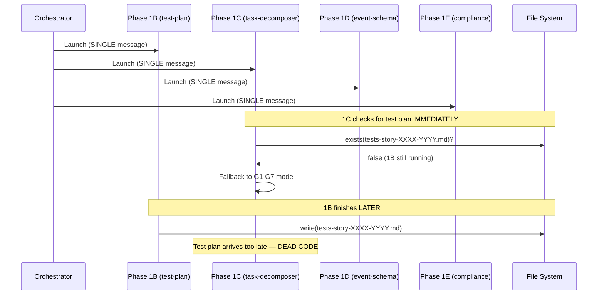
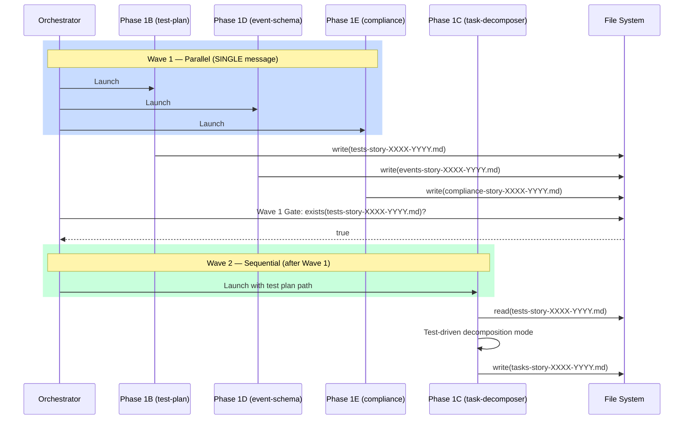

# Historia: Corrigir race condition Phase 1C/1B no x-dev-lifecycle

**ID:** story-0010-0001

## 1. Dependencias

| Blocked By | Blocks |
| :--- | :--- |
| — | story-0010-0005 |

## 2. Regras Transversais Aplicaveis

| ID | Titulo |
| :--- | :--- |
| RULE-003 | Single Message Dispatch |
| RULE-009 | Backward Compatibility |

## 3. Descricao

Como **Tech Lead**, eu quero corrigir a race condition entre as Phases 1B e 1C no skill `x-dev-lifecycle`, garantindo que a task decomposition (1C) consuma o test plan produzido pela Phase 1B e que o modo test-driven de decomposicao deixe de ser dead code.

Atualmente, o skill `x-dev-lifecycle` lanca as Phases 1B-1E em uma UNICA mensagem (dispatch paralelo conforme RULE-003). No entanto, a Phase 1C (`x-lib-task-decomposer`) depende do output da Phase 1B (`x-test-plan`). O task decomposer verifica se existe um test plan com marcadores TPP para decidir entre decomposicao test-driven (RED/GREEN/REFACTOR por task) ou fallback G1-G7 (layer-based). Como 1B e 1C iniciam simultaneamente, o arquivo `tests-story-XXXX-YYYY.md` ainda nao existe quando 1C executa sua verificacao, e o decomposer SEMPRE cai no modo fallback G1-G7.

Isso significa que a feature de decomposicao test-driven — implementada para suportar Double-Loop TDD — nunca e acionada em producao. O fix consiste em dividir o bloco paralelo em duas waves: Wave 1 lanca 1B + 1D + 1E em paralelo (sem dependencias cruzadas); Wave 2 lanca 1C somente apos 1B completar (garantindo que o test plan exista). A secao "Phases 1B-1E" do SKILL.md deve ser reescrita para refletir essa divisao, mantendo backward compatibility com projetos que nao possuem `x-lib-task-decomposer`.

### 3.1 Reestruturacao do Bloco Paralelo

- Wave 1 (dispatch paralelo em SINGLE message): Phase 1B (test plan via `x-test-plan`), Phase 1D (event schema, condicional), Phase 1E (compliance assessment, condicional)
- Wave 2 (dispatch sequencial, apos Wave 1 completar): Phase 1C (task decomposition via `x-lib-task-decomposer`, lendo o output de 1B)
- A secao `## Phases 1B-1E` deve ser renomeada para `## Phases 1B-1E — Two-Wave Planning`
- O comentario `CRITICAL: ALL planning subagents MUST be launched in a SINGLE message` deve ser atualizado para refletir que sao duas waves

### 3.2 Gate entre Wave 1 e Wave 2

- Apos Wave 1 completar, verificar se o arquivo `docs/stories/epic-XXXX/plans/tests-story-XXXX-YYYY.md` foi produzido por 1B
- Se o arquivo existe: Wave 2 (1C) recebe o path como input explicito
- Se o arquivo nao existe (1B falhou): Wave 2 (1C) executa sem test plan, caindo no fallback G1-G7 (comportamento identico ao atual, preservando backward compatibility)

### 3.3 Preservacao de Backward Compatibility

- Projetos sem `x-lib-task-decomposer` continuam funcionando: Phase 1C e condicional (skill file check)
- Projetos sem `x-test-plan` continuam funcionando: Wave 1 pula 1B, Wave 2 executa 1C em modo fallback
- A ordem das phases nao muda (1B, 1C, 1D, 1E) — apenas o timing de dispatch muda

## 4. Definicoes de Qualidade Locais

### DoR Local

- [ ] Skill file `x-dev-lifecycle/SKILL.md` lido e secao "Phases 1B-1E" localizada
- [ ] Skill file `x-lib-task-decomposer/SKILL.md` lido para confirmar logica de auto-detect
- [ ] Skill file `x-test-plan/SKILL.md` lido para confirmar output path
- [ ] Race condition reproduzida: confirmar que 1C nunca encontra test plan quando lancado em paralelo com 1B

### DoD Local

- [ ] Secao "Phases 1B-1E" reescrita com estrutura Two-Wave
- [ ] Wave 1 lanca 1B + 1D + 1E em SINGLE message
- [ ] Wave 2 lanca 1C somente apos Wave 1 completar
- [ ] Gate entre waves verifica existencia do test plan
- [ ] Fallback G1-G7 preservado quando test plan nao existe
- [ ] Frontmatter YAML do SKILL.md permanece valido
- [ ] Nenhuma outra secao do SKILL.md foi alterada (phases 0, 1, 2-8 intactas)

### Global Definition of Done (DoD)

- **Consistencia:** Skills modificadas mantam frontmatter YAML valido
- **Backward Compatibility:** Flags existentes continuam funcionando
- **TDD Compliance:** Commits show test-first pattern
- **Double-Loop TDD:** Acceptance tests from Gherkin (outer loop), unit tests via TPP (inner loop)

## 5. Contratos de Dados (Data Contract)

### Estrutura Atual (bloco unico)

```
## Phases 1B-1E — Parallel Planning (Subagents via Task — SINGLE message)

CRITICAL: ALL planning subagents MUST be launched in a SINGLE message.

### 1B: Test Planning
### 1C: Task Decomposition
### 1D: Event Schema Design
### 1E: Compliance Assessment
```

### Estrutura Proposta (duas waves)

```
## Phases 1B-1E — Two-Wave Planning

### Wave 1 — Parallel (SINGLE message)
CRITICAL: Wave 1 subagents MUST be launched in a SINGLE message.

#### 1B: Test Planning (MANDATORY DRIVER for Phase 2)
#### 1D: Event Schema Design (if event_driven)
#### 1E: Compliance Assessment (if compliance active)

### Wave 1 Gate
- Check: does tests-story-XXXX-YYYY.md exist?
- If yes: pass path to Wave 2
- If no: log WARNING, Wave 2 proceeds without test plan

### Wave 2 — Sequential (after Wave 1 completes)

#### 1C: Task Decomposition
- Receives test plan path from Wave 1 Gate (or null)
- Auto-detects decomposition mode based on test plan presence
```

### Invariantes

- O conteudo interno de cada subsecao (1B, 1C, 1D, 1E) NAO muda — apenas a estrutura de agrupamento e timing mudam
- O contrato de output de cada phase permanece identico (mesmos arquivos, mesmos paths)

## 6. Diagramas

### 6.1 Fluxo Antes (Race Condition)



### 6.2 Fluxo Depois (Two-Wave)



## 7. Criterios de Aceite (Gherkin)

```gherkin
Cenario: Wave 2 executa quando Wave 1 nao produz test plan
  DADO que o skill x-test-plan falhou durante Wave 1
  E o arquivo "docs/stories/epic-0010/plans/tests-story-0010-0001.md" nao existe
  QUANDO o Wave 1 Gate e avaliado
  ENTAO o log deve conter "WARNING: Test plan not produced by Phase 1B"
  E a Phase 1C deve ser lancada sem test plan path
  E o task decomposer deve usar o modo fallback G1-G7

Cenario: Wave 1 lanca 1B, 1D e 1E em paralelo
  DADO que o projeto possui event_driven=true e compliance ativo
  QUANDO o orchestrator executa "Phases 1B-1E — Two-Wave Planning"
  ENTAO as Phases 1B, 1D e 1E devem ser lancadas em uma SINGLE message
  E a Phase 1C NAO deve estar presente na Wave 1

Cenario: Wave 2 recebe test plan e ativa decomposicao test-driven
  DADO que Wave 1 completou com sucesso
  E o arquivo "docs/stories/epic-0010/plans/tests-story-0010-0001.md" existe com marcadores TPP
  QUANDO o Wave 1 Gate verifica a existencia do test plan
  ENTAO o path "docs/stories/epic-0010/plans/tests-story-0010-0001.md" deve ser passado para Phase 1C
  E o task decomposer deve usar o modo test-driven (RED/GREEN/REFACTOR por task)

Cenario: Projeto sem x-lib-task-decomposer pula Phase 1C
  DADO que o skill file "skills/x-lib-task-decomposer/SKILL.md" nao existe no projeto
  QUANDO o orchestrator avalia se Wave 2 deve ser executada
  ENTAO a Phase 1C deve ser pulada com log "x-lib-task-decomposer not available"
  E nenhum erro deve ser lancado

Cenario: Wave 1 com apenas 1B quando event_driven e compliance estao desativados
  DADO que o projeto possui event_driven=false e compliance inativo
  QUANDO o orchestrator executa Wave 1
  ENTAO apenas a Phase 1B deve ser lancada
  E as Phases 1D e 1E devem ser puladas com log condicional

Cenario: Frontmatter YAML permanece valido apos edicao
  DADO que o arquivo "x-dev-lifecycle/SKILL.md" foi editado com a nova estrutura Two-Wave
  QUANDO o frontmatter YAML e parseado
  ENTAO os campos "name", "description", "allowed-tools" e "argument-hint" devem estar presentes
  E o YAML deve ser valido sem erros de sintaxe
```

### 7.1 Scenario Ordering (TPP)

> TPP: degenerate (Wave 1 sem test plan) -> unconditional (Wave 1 paralela) -> condicional (Wave 2 com test plan) -> condicional (sem task decomposer) -> boundary (apenas 1B em Wave 1) -> integridade (frontmatter valido).

### 7.2 Mandatory Scenario Categories

- [x] Degenerate cases (Wave 1 falha em produzir test plan)
- [x] Happy path (Wave 1 paralela, Wave 2 com test plan)
- [x] Error paths (projeto sem x-lib-task-decomposer)
- [x] Boundary values (Wave 1 com apenas 1B, frontmatter valido)

## 8. Sub-tarefas

- [ ] [Dev] Reescrever secao "Phases 1B-1E" do `x-dev-lifecycle/SKILL.md` com estrutura Two-Wave
- [ ] [Dev] Implementar Wave 1 Gate (verificacao de existencia do test plan entre waves)
- [ ] [Dev] Atualizar prompt da Phase 1C para receber test plan path como parametro explicito
- [ ] [Dev] Atualizar comentario CRITICAL sobre SINGLE message dispatch
- [ ] [Test] Validar que frontmatter YAML permanece valido apos edicao
- [ ] [Test] Validar que secoes fora de "Phases 1B-1E" nao foram alteradas
- [ ] [Test] Simular cenario: 1B falha, 1C cai em fallback G1-G7
- [ ] [Test] Simular cenario: 1B sucesso, 1C usa modo test-driven
- [ ] [Doc] Atualizar Integration Notes com referencia ao Two-Wave dispatch
