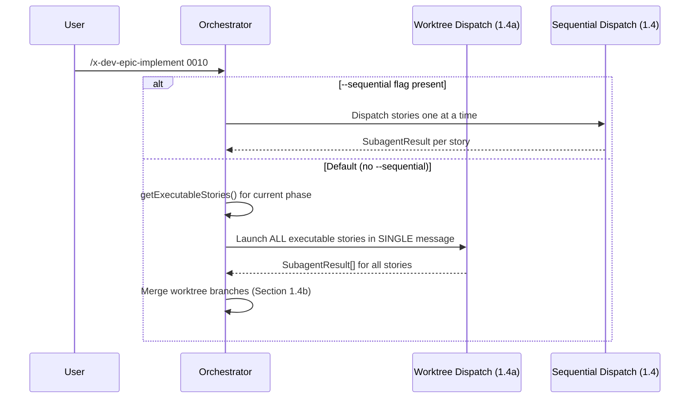
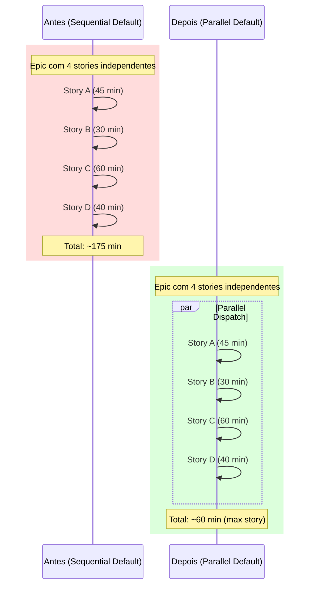

# Historia: Tornar execucao paralela via worktrees o default no x-dev-epic-implement

**ID:** story-0010-0002

## 1. Dependencias

| Blocked By | Blocks |
| :--- | :--- |
| — | story-0010-0004, story-0010-0007, story-0010-0009 |

## 2. Regras Transversais Aplicaveis

| ID | Titulo |
| :--- | :--- |
| RULE-005 | Dependency-Safe Dispatch |
| RULE-006 | Worktree Branch Isolation |
| RULE-009 | Backward Compatibility |

## 3. Descricao

Como **Tech Lead**, eu quero que a execucao paralela via worktrees seja o comportamento default do skill `x-dev-epic-implement`, garantindo que stories independentes dentro da mesma phase sejam executadas concorrentemente sem necessidade de flag explicita, reduzindo o tempo total de execucao de epics de 2-4 horas para ~1 hora.

Atualmente, o skill `x-dev-epic-implement` opera em modo sequencial por default. A flag `--parallel` e opt-in e deve ser passada explicitamente para ativar dispatch via worktrees. Na pratica, stories dentro da mesma phase que tem todas as dependencias satisfeitas aguardam umas pelas outras desnecessariamente. Cada story leva 30-60+ minutos via `x-dev-lifecycle`, entao um epic com 4 stories independentes na mesma phase roda em 2-4 horas em vez de ~1 hora.

O fix inverte o default: a execucao paralela via worktrees passa a ser o comportamento padrao para stories independentes na mesma phase. Uma nova flag `--sequential` e adicionada para cenarios onde o isolamento via worktree nao e desejado (ex: maquinas com memoria limitada, debugging). As secoes 1.3 (Core Loop Algorithm), 1.4 (Subagent Dispatch), 1.4a (Parallel Worktree Dispatch), o frontmatter `argument-hint`, e a tabela de Optional Flags devem ser atualizados para refletir a inversao.

### 3.1 Inversao de Default

- Remover a flag `--parallel` da tabela de Optional Flags
- Adicionar a flag `--sequential` com default `false` e descricao: "Disable parallel worktrees, execute stories one at a time"
- Atualizar `argument-hint` no frontmatter YAML: substituir `--parallel` por `--sequential`
- Atualizar `mode` no checkpoint: `{ parallel: true, ... }` como default, `{ parallel: false, ... }` quando `--sequential`

### 3.2 Atualizacao da Secao 1.3 (Core Loop Algorithm)

- O texto atual diz: "stories without dependencies can run in parallel if `--parallel` is set"
- Novo texto: "stories without dependencies run in parallel via worktrees by default; use `--sequential` to disable"
- O comentario na secao 1.1 (step 4) sobre `mode: { parallel: false }` deve mudar para `mode: { parallel: true }`

### 3.3 Atualizacao da Secao 1.4 e 1.4a

- Secao 1.4 (Sequential Mode) passa a ser condicional: "When `--sequential` flag is set"
- Secao 1.4a (Parallel Worktree Dispatch) passa a ser o default: "Default behavior. When `--sequential` is NOT set, use parallel worktree dispatch."
- A nota de ativacao em 1.4a deve ser invertida: "Activation: Default behavior. Only when `--sequential` flag is set, the sequential dispatch in Section 1.4 is used instead."

### 3.4 Preservacao de Backward Compatibility

- A flag `--parallel` deve ser REMOVIDA (nao deprecada) — ela nao tem mais sentido como default
- Se um usuario passar `--parallel` apos a mudanca, o parser deve ignorar a flag silenciosamente (nao abortar com erro) por pelo menos 1 ciclo de versao
- A flag `--sequential` e aditiva — novos usuarios nao precisam conhece-la a menos que queiram forcar modo sequencial

## 4. Definicoes de Qualidade Locais

### DoR Local

- [ ] Skill file `x-dev-epic-implement/SKILL.md` lido e todas as secoes que referenciam `--parallel` identificadas
- [ ] Lista completa de ocorrencias de `--parallel` no SKILL.md documentada
- [ ] Comportamento atual do dispatch sequencial (1.4) e paralelo (1.4a) compreendido
- [ ] Formato do `execution-state.json` verificado (campo `mode.parallel`)

### DoD Local

- [ ] Flag `--parallel` removida da tabela de Optional Flags
- [ ] Flag `--sequential` adicionada com default `false`
- [ ] `argument-hint` no frontmatter YAML atualizado
- [ ] Secao 1.1 (step 4) atualizada com `mode: { parallel: true }` como default
- [ ] Secao 1.3 atualizada para refletir paralelo como default
- [ ] Secao 1.4 condicionalizada com `--sequential`
- [ ] Secao 1.4a marcada como comportamento default
- [ ] Graceful handling de `--parallel` (ignorar silenciosamente, nao abortar)
- [ ] Nenhuma secao fora de 1.1, 1.3, 1.4, 1.4a, Optional Flags e frontmatter foi alterada
- [ ] Frontmatter YAML do SKILL.md permanece valido

### Global Definition of Done (DoD)

- **Consistencia:** Skills modificadas mantam frontmatter YAML valido
- **Backward Compatibility:** Flags existentes continuam funcionando
- **TDD Compliance:** Commits show test-first pattern
- **Double-Loop TDD:** Acceptance tests from Gherkin (outer loop), unit tests via TPP (inner loop)

## 5. Contratos de Dados (Data Contract)

### Tabela de Flags — Antes

```markdown
| Flag | Type | Default | Description |
|------|------|---------|-------------|
| `--parallel` | boolean | `false` | Enable parallel worktrees (default: sequential) |
```

### Tabela de Flags — Depois

```markdown
| Flag | Type | Default | Description |
|------|------|---------|-------------|
| `--sequential` | boolean | `false` | Disable parallel worktrees, execute stories one at a time |
```

### Frontmatter — Antes

```yaml
argument-hint: "[EPIC-ID] [--phase N] [--story story-XXXX-YYYY] [--skip-review] [--dry-run] [--resume] [--parallel]"
```

### Frontmatter — Depois

```yaml
argument-hint: "[EPIC-ID] [--phase N] [--story story-XXXX-YYYY] [--skip-review] [--dry-run] [--resume] [--sequential]"
```

### Checkpoint Mode — Antes

```json
{
  "mode": { "parallel": false, "skipReview": false }
}
```

### Checkpoint Mode — Depois (default)

```json
{
  "mode": { "parallel": true, "skipReview": false }
}
```

### Checkpoint Mode — Depois (com --sequential)

```json
{
  "mode": { "parallel": false, "skipReview": false }
}
```

## 6. Diagramas

### 6.1 Fluxo de Decisao do Dispatch Mode



### 6.2 Comparacao de Timeline



## 7. Criterios de Aceite (Gherkin)

```gherkin
Cenario: Epic sem flags usa dispatch paralelo por default
  DADO que o usuario executa "/x-dev-epic-implement 0010" sem flags adicionais
  QUANDO o orchestrator inicializa o execution state
  ENTAO o campo mode.parallel deve ser true
  E as stories da phase 0 com dependencias satisfeitas devem ser lancadas em SINGLE message via worktrees

Cenario: Flag --sequential ativa dispatch sequencial
  DADO que o usuario executa "/x-dev-epic-implement 0010 --sequential"
  QUANDO o orchestrator inicializa o execution state
  ENTAO o campo mode.parallel deve ser false
  E as stories devem ser executadas uma por vez conforme Secao 1.4

Cenario: Flag --parallel legada e ignorada silenciosamente
  DADO que o usuario executa "/x-dev-epic-implement 0010 --parallel"
  QUANDO o parser processa os argumentos
  ENTAO a flag --parallel deve ser ignorada sem erro
  E o campo mode.parallel deve ser true (default)
  E o log NAO deve conter mensagens de erro sobre flag desconhecida

Cenario: Dry-run mostra plano com dispatch paralelo
  DADO que o usuario executa "/x-dev-epic-implement 0010 --dry-run"
  QUANDO o orchestrator gera o execution plan
  ENTAO o plano deve indicar "dispatch: parallel (default)"
  E stories independentes na mesma phase devem estar agrupadas como "concurrent"

Cenario: Sequential com --story executa story unica sem worktree
  DADO que o usuario executa "/x-dev-epic-implement 0010 --story story-0010-0003 --sequential"
  QUANDO o orchestrator executa a story isolada
  ENTAO a story deve ser executada sem criacao de worktree
  E o dispatch deve seguir a Secao 1.4 (sequential mode)

Cenario: Frontmatter YAML contem --sequential no argument-hint
  DADO que o arquivo "x-dev-epic-implement/SKILL.md" foi editado
  QUANDO o frontmatter YAML e parseado
  ENTAO o campo argument-hint deve conter "--sequential"
  E o campo argument-hint NAO deve conter "--parallel"
  E os campos "name", "description" e "allowed-tools" devem estar presentes
```

### 7.1 Scenario Ordering (TPP)

> TPP: unconditional (default paralelo sem flags) -> condicional (--sequential ativa sequencial) -> condicional (--parallel legada ignorada) -> condicional (dry-run com paralelo) -> boundary (--story + --sequential) -> integridade (frontmatter valido).

### 7.2 Mandatory Scenario Categories

- [x] Degenerate cases (epic sem flags usa parallel default)
- [x] Happy path (--sequential ativa modo sequencial)
- [x] Error paths (--parallel legada ignorada sem erro)
- [x] Boundary values (--story + --sequential, frontmatter valido)

## 8. Sub-tarefas

- [ ] [Dev] Remover flag `--parallel` da tabela de Optional Flags no SKILL.md
- [ ] [Dev] Adicionar flag `--sequential` com default `false` na tabela de Optional Flags
- [ ] [Dev] Atualizar `argument-hint` no frontmatter YAML
- [ ] [Dev] Atualizar Secao 1.1 step 4: `mode: { parallel: true }` como default
- [ ] [Dev] Atualizar Secao 1.3: refletir paralelo como default
- [ ] [Dev] Condicionalizar Secao 1.4 com `--sequential`
- [ ] [Dev] Marcar Secao 1.4a como comportamento default
- [ ] [Dev] Adicionar graceful handling para flag `--parallel` legada (ignorar silenciosamente)
- [ ] [Test] Validar que frontmatter YAML permanece valido apos edicao
- [ ] [Test] Validar que todas as ocorrencias de `--parallel` foram removidas ou tratadas
- [ ] [Test] Simular cenario: execucao sem flags gera mode.parallel=true
- [ ] [Test] Simular cenario: --sequential gera mode.parallel=false
- [ ] [Test] Simular cenario: --parallel legada nao causa erro
- [ ] [Doc] Atualizar Integration Notes se necessario
