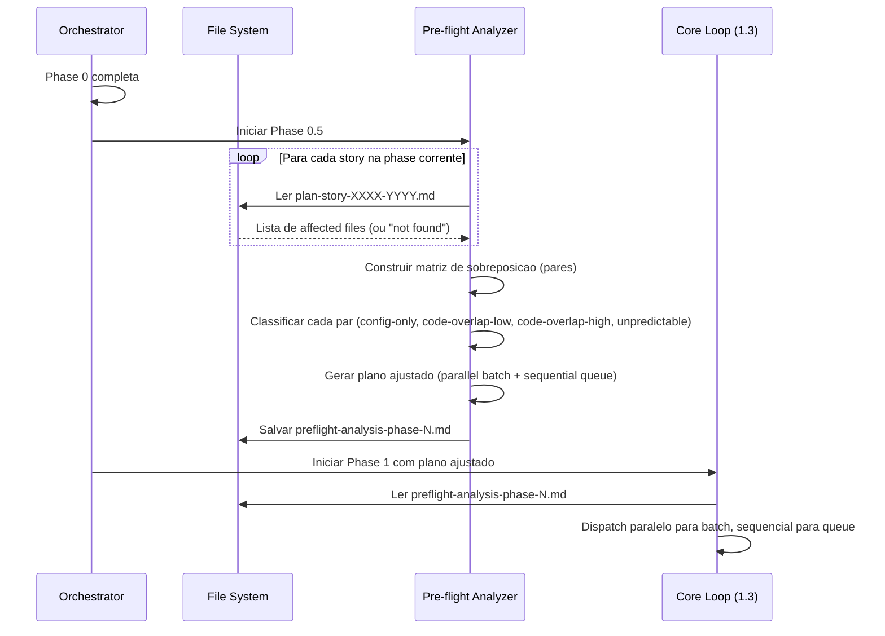
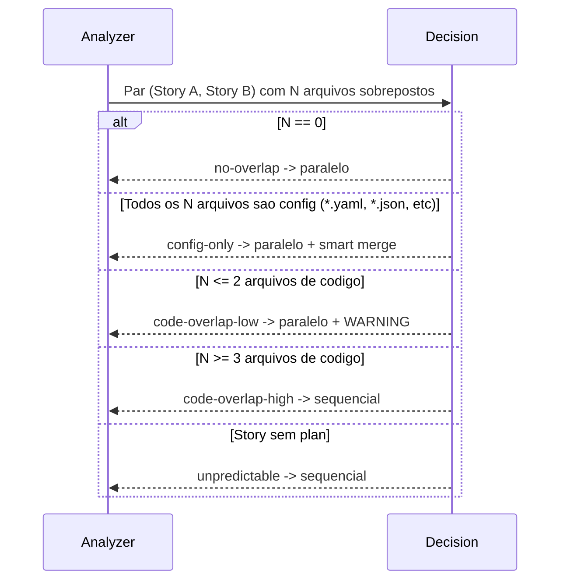

# Historia: Implementar pre-flight conflict analysis para worktrees

**ID:** story-0010-0003

## 1. Dependencias

| Blocked By | Blocks |
| :--- | :--- |
| — | story-0010-0004, story-0010-0009 |

## 2. Regras Transversais Aplicaveis

| ID | Titulo |
| :--- | :--- |
| RULE-005 | Dependency-Safe Dispatch |
| RULE-006 | Worktree Branch Isolation |
| RULE-010 | Pre-flight Before Parallel |

## 3. Descricao

Como **Tech Lead**, eu quero que o skill `x-dev-epic-implement` execute uma analise pre-flight de conflitos antes do dispatch paralelo, garantindo que stories que tocam os mesmos arquivos de codigo sejam detectadas proativamente e demovidas para execucao sequencial, evitando conflitos de merge dispendiosos.

Atualmente, a deteccao de conflitos no `x-dev-epic-implement` e reativa — conflitos sao descobertos apenas no momento do merge (Secao 1.4b-1.4c). Com a execucao paralela como default (story-0010-0002), conflitos se tornam mais frequentes porque mais stories executam simultaneamente. Um conflito de merge detectado na Phase 1.4b exige: (1) dispatch de um subagent de resolucao (1.4c), (2) possivel falha e block propagation, (3) retrabalho. Cada conflito custa 15-30 minutos de resolucao.

O fix adiciona uma nova secao "Phase 0.5 — Pre-flight Conflict Analysis" ao SKILL.md, posicionada entre Phase 0 (Preparation) e Phase 1 (Execution Loop). Essa phase lê o implementation plan de cada story para identificar quais arquivos serao tocados, constroi uma matriz de sobreposicao entre stories da mesma phase, classifica as sobreposicoes, e produz um plano de execucao ajustado que demove stories com alto risco de conflito para execucao sequencial.

### 3.1 Leitura de Implementation Plans

- Para cada story na phase corrente, ler o implementation plan em `docs/stories/epic-XXXX/plans/plan-story-XXXX-YYYY.md`
- Extrair a lista de "Affected files" ou "Existing classes to modify" + "New classes/interfaces to create"
- Se o plan nao existe para uma story (Phase 1 ainda nao executou): marcar story como "unpredictable" e tratar como potencial conflito com qualquer outra story

### 3.2 Construcao da Matriz de Sobreposicao

- Para cada par de stories (A, B) na mesma phase, calcular a interseccao dos conjuntos de arquivos
- Cada sobreposicao recebe uma contagem: numero de arquivos em comum
- A matriz e simetrica: overlap(A,B) == overlap(B,A)

### 3.3 Classificacao de Sobreposicoes

| Tipo | Criterio | Acao |
|------|----------|------|
| config-only | Todos os arquivos em sobreposicao sao de configuracao (`*.yaml`, `*.json`, `*.properties`, `*.toml`, `*.env`, `pom.xml`, `build.gradle`, `package.json`) | Permitir paralelo + smart merge (config files sao geralmente merge-friendly) |
| code-overlap-low | 1-2 arquivos de codigo (`.ts`, `.java`, `.py`, `.go`, `.rs`, `.kt`) em sobreposicao | Permitir paralelo com WARNING no log |
| code-overlap-high | 3+ arquivos de codigo em sobreposicao | Demoter para execucao sequencial |
| unpredictable | Uma ou ambas as stories sem implementation plan | Demoter para execucao sequencial (conservador) |

### 3.4 Output: Plano de Execucao Ajustado

- Stories sem sobreposicao ou com config-only overlap: dispatch paralelo
- Stories com code-overlap-high ou unpredictable: dispatch sequencial (dentro da mesma phase, uma apos a outra)
- O plano ajustado e salvo em `docs/stories/epic-XXXX/plans/preflight-analysis-phase-N.md` para auditoria
- O Core Loop (Secao 1.3) deve consumir o plano ajustado ao determinar o dispatch mode por story

### 3.5 Integracao com Secao 1.3

- Antes de chamar `getExecutableStories()`, o orchestrator lê o preflight analysis para a phase corrente
- Stories marcadas como "sequential" no preflight sao removidas do batch paralelo e enfileiradas para dispatch sequencial apos o batch paralelo completar
- A ordem sequencial respeita o critical path priority (RULE-007)

## 4. Definicoes de Qualidade Locais

### DoR Local

- [ ] Skill file `x-dev-epic-implement/SKILL.md` lido completamente
- [ ] Formato dos implementation plans (`plan-story-XXXX-YYYY.md`) analisado para extrair lista de arquivos
- [ ] Secao 1.3 (Core Loop Algorithm) compreendida em detalhe
- [ ] Tipos de arquivo de configuracao vs codigo definidos

### DoD Local

- [ ] Nova secao "Phase 0.5 — Pre-flight Conflict Analysis" adicionada ao SKILL.md
- [ ] Posicionamento correto: entre Phase 0 e Phase 1
- [ ] Algoritmo de leitura de plans documentado
- [ ] Matriz de sobreposicao com formula de calculo documentada
- [ ] Tabela de classificacao (config-only, code-overlap-low, code-overlap-high, unpredictable) presente
- [ ] Output path (`preflight-analysis-phase-N.md`) definido
- [ ] Integracao com Secao 1.3 documentada (como o Core Loop consome o plano ajustado)
- [ ] Secao nao interfere com `--sequential` mode (quando sequential, Phase 0.5 e pulada)
- [ ] Frontmatter YAML do SKILL.md permanece valido

### Global Definition of Done (DoD)

- **Consistencia:** Skills modificadas mantam frontmatter YAML valido
- **Backward Compatibility:** Flags existentes continuam funcionando
- **TDD Compliance:** Commits show test-first pattern
- **Double-Loop TDD:** Acceptance tests from Gherkin (outer loop), unit tests via TPP (inner loop)

## 5. Contratos de Dados (Data Contract)

### Estrutura do Preflight Analysis Output

```markdown
# Pre-flight Conflict Analysis — Phase {N}

## File Overlap Matrix

| Story A | Story B | Overlapping Files | Classification |
|---------|---------|-------------------|----------------|
| story-0010-0001 | story-0010-0002 | pom.xml | config-only |
| story-0010-0001 | story-0010-0003 | UserService.java, UserRepository.java, UserController.java | code-overlap-high |
| story-0010-0002 | story-0010-0003 | — | no-overlap |

## Adjusted Execution Plan

### Parallel Batch
- story-0010-0002 (no overlaps)

### Sequential Queue (after parallel batch)
1. story-0010-0001 (code-overlap-high with story-0010-0003)
2. story-0010-0003 (code-overlap-high with story-0010-0001)

## Warnings
- story-0010-0004: no implementation plan found (classified as unpredictable)
```

### Dados de Input por Story

```json
{
  "storyId": "story-0010-0001",
  "planPath": "docs/stories/epic-0010/plans/plan-story-0010-0001.md",
  "affectedFiles": [
    "src/main/java/com/example/UserService.java",
    "src/main/java/com/example/UserRepository.java",
    "pom.xml"
  ],
  "hasPlan": true
}
```

### Dados de Output por Par

```json
{
  "storyA": "story-0010-0001",
  "storyB": "story-0010-0003",
  "overlappingFiles": ["UserService.java", "UserRepository.java", "UserController.java"],
  "overlapCount": 3,
  "classification": "code-overlap-high",
  "action": "demote-to-sequential"
}
```

## 6. Diagramas

### 6.1 Fluxo da Phase 0.5



### 6.2 Arvore de Decisao de Classificacao



## 7. Criterios de Aceite (Gherkin)

```gherkin
Cenario: Phase 0.5 e pulada quando --sequential esta ativo
  DADO que o usuario executa "/x-dev-epic-implement 0010 --sequential"
  QUANDO o orchestrator avalia se Phase 0.5 deve executar
  ENTAO a Phase 0.5 deve ser pulada com log "Pre-flight analysis skipped (sequential mode)"
  E o dispatch deve seguir direto para Phase 1 em modo sequencial

Cenario: Stories sem sobreposicao sao marcadas para dispatch paralelo
  DADO que a phase 0 contem 3 stories: story-0010-0001, story-0010-0002, story-0010-0003
  E os implementation plans indicam arquivos distintos sem sobreposicao
  QUANDO a Phase 0.5 constroi a matriz de sobreposicao
  ENTAO todas as 3 stories devem ser classificadas como "no-overlap"
  E o plano ajustado deve conter todas as 3 stories no "Parallel Batch"
  E o "Sequential Queue" deve estar vazio

Cenario: Stories com 3+ arquivos de codigo sobrepostos sao demovidas para sequencial
  DADO que story-0010-0001 toca "UserService.java", "UserRepository.java", "UserController.java"
  E story-0010-0003 toca "UserService.java", "UserRepository.java", "UserController.java", "UserMapper.java"
  QUANDO a Phase 0.5 calcula a sobreposicao entre story-0010-0001 e story-0010-0003
  ENTAO a classificacao deve ser "code-overlap-high" com overlapCount=3
  E ambas as stories devem ser movidas para o "Sequential Queue"
  E a ordem sequencial deve respeitar critical path priority

Cenario: Sobreposicao apenas em arquivos de configuracao permite paralelo
  DADO que story-0010-0001 e story-0010-0002 compartilham apenas "pom.xml" e "application.yaml"
  E nenhum arquivo de codigo (.java, .ts, .py) esta em sobreposicao
  QUANDO a Phase 0.5 classifica o par
  ENTAO a classificacao deve ser "config-only"
  E ambas as stories devem permanecer no "Parallel Batch"

Cenario: Story sem implementation plan e classificada como unpredictable
  DADO que story-0010-0004 nao possui arquivo "plan-story-0010-0004.md"
  E story-0010-0004 esta na mesma phase que story-0010-0001
  QUANDO a Phase 0.5 tenta ler o plan de story-0010-0004
  ENTAO story-0010-0004 deve ser classificada como "unpredictable"
  E o par (story-0010-0001, story-0010-0004) deve ser demovido para "Sequential Queue"
  E o log deve conter "WARNING: No implementation plan for story-0010-0004 — classified as unpredictable"

Cenario: Preflight analysis salva arquivo de auditoria
  DADO que a Phase 0.5 completou a analise para phase 1
  QUANDO o plano ajustado e gerado
  ENTAO o arquivo "docs/stories/epic-0010/plans/preflight-analysis-phase-1.md" deve ser criado
  E o arquivo deve conter a secao "File Overlap Matrix"
  E o arquivo deve conter a secao "Adjusted Execution Plan"

Cenario: Code-overlap-low emite WARNING mas permite paralelo
  DADO que story-0010-0005 e story-0010-0006 compartilham apenas "AppConfig.java"
  E "AppConfig.java" e um arquivo de codigo (.java)
  QUANDO a Phase 0.5 classifica o par
  ENTAO a classificacao deve ser "code-overlap-low" com overlapCount=1
  E ambas as stories devem permanecer no "Parallel Batch"
  E o log deve conter "WARNING: Low code overlap (1 file) between story-0010-0005 and story-0010-0006"
```

### 7.1 Scenario Ordering (TPP)

> TPP: degenerate (--sequential pula Phase 0.5) -> unconditional (sem sobreposicao, tudo paralelo) -> condicional (code-overlap-high demove) -> condicional (config-only permite paralelo) -> condicional (unpredictable demove) -> integridade (arquivo de auditoria salvo) -> boundary (code-overlap-low com WARNING).

### 7.2 Mandatory Scenario Categories

- [x] Degenerate cases (--sequential pula Phase 0.5)
- [x] Happy path (sem sobreposicao, tudo paralelo)
- [x] Error paths (story sem plan classificada como unpredictable)
- [x] Boundary values (code-overlap-low com 1 arquivo, config-only overlap)

## 8. Sub-tarefas

- [ ] [Dev] Adicionar secao "Phase 0.5 — Pre-flight Conflict Analysis" ao SKILL.md entre Phase 0 e Phase 1
- [ ] [Dev] Documentar algoritmo de leitura de implementation plans (extrair affected files)
- [ ] [Dev] Documentar construcao da matriz de sobreposicao (pares de stories)
- [ ] [Dev] Documentar tabela de classificacao (config-only, code-overlap-low, code-overlap-high, unpredictable)
- [ ] [Dev] Documentar output path e formato do preflight analysis
- [ ] [Dev] Integrar Phase 0.5 com Secao 1.3 (Core Loop consome plano ajustado)
- [ ] [Dev] Adicionar condicional: Phase 0.5 pulada quando `--sequential`
- [ ] [Test] Validar que frontmatter YAML permanece valido apos edicao
- [ ] [Test] Simular cenario: 3 stories sem sobreposicao -> todas paralelas
- [ ] [Test] Simular cenario: 2 stories com 3+ arquivos de codigo -> demovidas para sequencial
- [ ] [Test] Simular cenario: sobreposicao apenas em config -> permitir paralelo
- [ ] [Test] Simular cenario: story sem plan -> classificada como unpredictable
- [ ] [Doc] Atualizar Integration Notes com referencia a Phase 0.5
