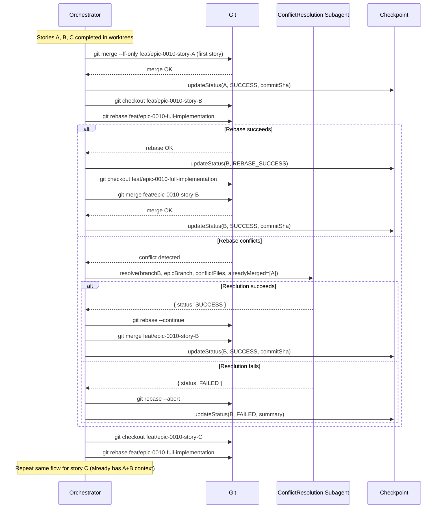

# Historia: Implementar rebase-before-merge strategy apos parallel dispatch

**ID:** story-0010-0004

## 1. Dependencias

| Blocked By | Blocks |
| :--- | :--- |
| story-0010-0002, story-0010-0003 | story-0010-0009 |

## 2. Regras Transversais Aplicaveis

| ID | Titulo |
| :--- | :--- |
| RULE-002 | Checkpoint Atomicity |
| RULE-006 | Worktree Branch Isolation |
| RULE-007 | Critical Path Priority |

## 3. Descricao

Como **orquestrador de epicos (x-dev-epic-implement)**, eu quero que o merge de branches vindas de worktrees paralelas use uma estrategia de rebase-before-merge, garantindo que cada branch subsequente seja rebaseada sobre o epic branch atualizado antes do merge, eliminando conflitos desnecessarios causados por branches stale.

Atualmente, a Section 1.4b do `x-dev-epic-implement` executa merges sequenciais das branches de worktree no epic branch. O problema: todas as worktree branches foram criadas a partir do MESMO ponto base. Apos o merge da story A, o epic branch avancou, mas a branch da story B ainda aponta para o base antigo. Um `git merge` direto da story B pode gerar conflitos espurios — arquivos que ambas as stories tocaram (ex: `pom.xml`, `build.gradle`, `CHANGELOG.md`) aparecem como conflitantes mesmo quando as mudancas sao complementares.

A estrategia rebase-before-merge resolve isso ao rebasear cada branch sobre o epic branch atualizado antes de tentar o merge. Isso da ao conflict resolution subagent (Section 1.4c) contexto completo do que ja foi merged, e reduz drasticamente a taxa de conflitos espurios em epicos com 4+ stories paralelas.

### 3.1 Novo Algoritmo de Merge (Section 1.4b)

O algoritmo atual (merge direto) sera substituido por:

1. **Story A** (primeira no critical path): merge direto no epic branch (fast-forward quando possivel)
2. **Story B** (segunda): `git rebase feat/epic-{epicId}-full-implementation` na branch da story B, resolver conflitos se houver, depois `git merge`
3. **Story C** (terceira): idem — rebase sobre epic branch atualizado (que ja contem A + B), depois merge
4. Cada rebase + merge atualiza o checkpoint atomicamente (RULE-002)

### 3.2 Tratamento de Falha no Rebase

- Se o rebase falhar (conflitos nao-triviais), o subagent de conflict resolution (Section 1.4c) e acionado com contexto adicional: lista de commits ja merged no epic branch
- Se o conflict resolution tambem falhar: `git rebase --abort`, marcar story como FAILED, propagar block para dependentes
- O checkpoint deve registrar o estado intermediario: `REBASING`, `REBASE_FAILED`, ou `REBASE_SUCCESS` antes do merge

### 3.3 Preservacao do Fast-Forward para Primeira Story

A primeira story na ordem do critical path nao precisa de rebase (e a primeira a ser merged, sem divergencia). O merge pode ser fast-forward (`--ff-only`) quando possivel, caindo para merge commit se necessario.

## 4. Definicoes de Qualidade Locais

### DoR Local

- [ ] Section 1.4b do `x-dev-epic-implement/SKILL.md` lida e compreendida
- [ ] Section 1.4c (conflict resolution subagent) lida e compreendida
- [ ] story-0010-0002 (parallel default) em status SUCCESS
- [ ] story-0010-0003 (pre-flight conflict analysis) em status SUCCESS
- [ ] Comportamento atual de merge direto documentado e testado

### DoD Local

- [ ] Section 1.4b reescrita com algoritmo rebase-before-merge
- [ ] Primeira story usa fast-forward merge (sem rebase)
- [ ] Stories subsequentes executam rebase antes do merge
- [ ] Checkpoint registra estados intermediarios (REBASING, REBASE_FAILED, REBASE_SUCCESS)
- [ ] Fallback para conflict resolution subagent (Section 1.4c) preservado
- [ ] `git rebase --abort` executado em caso de falha irrecuperavel
- [ ] Prompt do conflict resolution subagent atualizado com contexto de commits ja merged
- [ ] Flags existentes (`--parallel`, `--resume`) continuam funcionando

### Global Definition of Done (DoD)

- **Consistencia:** Skills modificadas mantam frontmatter YAML valido
- **Backward Compatibility:** Flags existentes continuam funcionando
- **TDD Compliance:** Commits show test-first pattern
- **Double-Loop TDD:** Acceptance tests from Gherkin (outer loop), unit tests via TPP (inner loop)

## 5. Contratos de Dados (Data Contract)

**Section 1.4b — Merge Algorithm (antes):**

```
Para cada SUCCESS story (em ordem critical path):
  git merge feat/epic-{epicId}-{storyId}
  → updateStoryStatus(SUCCESS | FAILED)
```

**Section 1.4b — Merge Algorithm (depois):**

```
Para cada SUCCESS story (em ordem critical path):
  SE primeira story:
    git merge --ff-only feat/epic-{epicId}-{storyId}
    SE falhar: git merge feat/epic-{epicId}-{storyId}
  SENAO:
    git rebase feat/epic-{epicId}-full-implementation (na branch da story)
    SE rebase OK: git merge feat/epic-{epicId}-{storyId}
    SE rebase FALHAR: dispatch conflict resolution → abort se irrecuperavel
  → updateStoryStatus(SUCCESS | REBASING | REBASE_FAILED | FAILED)
```

**Checkpoint States Adicionados:**

| State | Descricao |
| :--- | :--- |
| `REBASING` | Rebase em andamento para esta story |
| `REBASE_SUCCESS` | Rebase concluido, merge pendente |
| `REBASE_FAILED` | Rebase falhou, conflict resolution acionado ou story marcada FAILED |

**Conflict Resolution Subagent — Contexto Adicional:**

| Campo | Tipo | Descricao |
| :--- | :--- | :--- |
| `alreadyMergedStories` | `string[]` | IDs das stories ja merged no epic branch |
| `alreadyMergedCommits` | `string[]` | SHAs dos commits ja no epic branch |
| `rebaseSourceBranch` | `string` | Branch que esta sendo rebaseada |

## 6. Diagramas

### 6.1 Fluxo de Rebase-Before-Merge



## 7. Criterios de Aceite (Gherkin)

```gherkin
Cenario: Merge de story unica nao aciona rebase
  DADO que apenas 1 story completou com status SUCCESS em parallel dispatch
  E a story "story-0010-0001" e a unica na lista de merge
  QUANDO o orchestrator executa Section 1.4b
  ENTAO o merge e feito via "git merge --ff-only" sem rebase previo
  E o checkpoint registra status SUCCESS com commitSha

Cenario: Primeira story no critical path usa fast-forward merge
  DADO que 3 stories completaram com status SUCCESS: "story-0010-0001", "story-0010-0002", "story-0010-0003"
  E a ordem do critical path e ["story-0010-0001", "story-0010-0002", "story-0010-0003"]
  QUANDO o orchestrator inicia Section 1.4b
  ENTAO "story-0010-0001" e merged via "git merge --ff-only"
  E nenhum "git rebase" e executado para "story-0010-0001"

Cenario: Segunda story e rebaseada antes do merge
  DADO que "story-0010-0001" ja foi merged no epic branch
  E "story-0010-0002" completou com status SUCCESS
  QUANDO o orchestrator processa "story-0010-0002" na Section 1.4b
  ENTAO "git rebase feat/epic-0010-full-implementation" e executado na branch de "story-0010-0002"
  E apos rebase bem-sucedido, "git merge feat/epic-0010-story-0010-0002" e executado
  E o checkpoint registra status SUCCESS com commitSha

Cenario: Rebase com conflito aciona conflict resolution subagent
  DADO que "story-0010-0001" ja foi merged no epic branch
  E "story-0010-0002" tem conflitos ao rebasear sobre o epic branch atualizado
  QUANDO o rebase detecta conflitos nos arquivos ["pom.xml", "CHANGELOG.md"]
  ENTAO o checkpoint registra status REBASING para "story-0010-0002"
  E o conflict resolution subagent e despachado com conflictFiles=["pom.xml", "CHANGELOG.md"]
  E o subagent recebe alreadyMergedStories=["story-0010-0001"]

Cenario: Falha no conflict resolution aborta rebase e marca FAILED
  DADO que o rebase de "story-0010-0003" gerou conflitos
  E o conflict resolution subagent retornou status FAILED
  QUANDO o orchestrator recebe o resultado do subagent
  ENTAO "git rebase --abort" e executado
  E o checkpoint registra status FAILED para "story-0010-0003"
  E stories dependentes de "story-0010-0003" sao marcadas como BLOCKED

Cenario: Checkpoint e atualizado atomicamente apos cada rebase e merge
  DADO que 3 stories estao na fila de merge
  QUANDO o orchestrator processa cada story sequencialmente
  ENTAO o checkpoint e atualizado 1 vez apos o merge de cada story (nao em batch)
  E se o orchestrator crashar apos o merge da story 2, o checkpoint reflete stories 1 e 2 como SUCCESS
```

### 7.1 Scenario Ordering (TPP)

> Scenarios follow TPP order: degenerate (single story, no rebase needed) → happy path (rebase + merge success) → error (conflict + resolution) → boundary (abort + propagation, atomic checkpoint).

### 7.2 Mandatory Scenario Categories

- [x] Degenerate cases (story unica sem rebase)
- [x] Happy path (rebase + merge bem-sucedido)
- [x] Error paths (conflito + fallback + abort)
- [x] Boundary values (atomicidade de checkpoint, propagacao de block)

## 8. Sub-tarefas

- [ ] [Dev] Reescrever Section 1.4b com algoritmo rebase-before-merge
- [ ] [Dev] Adicionar fast-forward merge para primeira story no critical path
- [ ] [Dev] Implementar logica de rebase com fallback para conflict resolution
- [ ] [Dev] Adicionar estados REBASING, REBASE_SUCCESS, REBASE_FAILED ao checkpoint
- [ ] [Dev] Atualizar prompt do conflict resolution subagent (Section 1.4c) com contexto de already-merged
- [ ] [Dev] Implementar `git rebase --abort` para falhas irrecuperaveis
- [ ] [Test] Cenario: story unica sem rebase
- [ ] [Test] Cenario: rebase + merge bem-sucedido para 2+ stories
- [ ] [Test] Cenario: conflito no rebase aciona subagent
- [ ] [Test] Cenario: falha no subagent aborta rebase e propaga BLOCKED
- [ ] [Test] Cenario: checkpoint atomico apos cada operacao
- [ ] [Doc] Atualizar secao de integracao do SKILL.md com novo fluxo de merge
