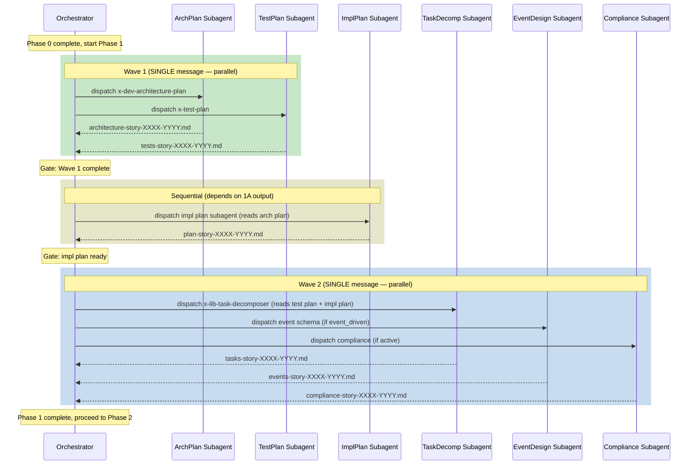

# Historia: Paralelizar Phase 1A (architecture plan) com test planning

**ID:** story-0010-0005

## 1. Dependencias

| Blocked By | Blocks |
| :--- | :--- |
| story-0010-0001 | story-0010-0006, story-0010-0008 |

## 2. Regras Transversais Aplicaveis

| ID | Titulo |
| :--- | :--- |
| RULE-001 | Context Isolation |
| RULE-003 | Single Message Dispatch |

## 3. Descricao

Como **orquestrador de lifecycle (x-dev-lifecycle)**, eu quero que a geracao do architecture plan (Phase 1A) e o test planning (Phase 1B) rodem em paralelo, garantindo que o tempo total de planejamento seja reduzido em 5-10 minutos por story sem comprometer a qualidade dos artefatos gerados.

Atualmente, o `x-dev-lifecycle` executa Phase 1 de forma sequencial: Step 1A (architecture plan via `x-dev-architecture-plan`) completa primeiro, depois Step 1B (implementation plan) roda, e so entao Phases 1B-1E lancam em paralelo (test plan, task decomposition, event schema, compliance). O problema: o `x-test-plan` (Phase 1B no bloco paralelo) le knowledge packs estaticos de arquitetura (`skills/architecture/references/`, `skills/testing/references/`), NAO o output gerado pelo architecture plan. Portanto, o test planning nao depende do architecture plan e pode iniciar simultaneamente.

A reestruturacao propoe duas ondas de paralelismo:
- **Wave 1 (paralela):** Step 1A (architecture plan) + Step 1B-test (test plan via `x-test-plan`) — ambos em uma UNICA mensagem (RULE-003)
- **Sequencial:** Step 1B-impl (implementation plan) — depende do output de 1A, executa apos Wave 1
- **Wave 2 (paralela):** 1C (task decomposition, le test plan de Wave 1) + 1D (event schema, le impl plan) + 1E (compliance, le impl plan) — todos em uma UNICA mensagem

### 3.1 Analise de Dependencias entre Phases

| Phase | Le (Input) | Produz (Output) | Depende de |
| :--- | :--- | :--- | :--- |
| 1A (arch plan) | Story file, ADRs, architecture KPs | `architecture-story-XXXX-YYYY.md` | Nada (Phase 0 output) |
| 1B-test (test plan) | Story file, testing KPs, architecture KPs | `tests-story-XXXX-YYYY.md` | Nada (le KPs estaticos) |
| 1B-impl (impl plan) | Story file, architecture KPs, arch plan output | `plan-story-XXXX-YYYY.md` | 1A (le arch plan gerado) |
| 1C (task decomp) | Test plan, impl plan | `tasks-story-XXXX-YYYY.md` | 1B-test + 1B-impl |
| 1D (event schema) | Impl plan, protocol KPs | `events-story-XXXX-YYYY.md` | 1B-impl |
| 1E (compliance) | Impl plan, security KPs | `compliance-story-XXXX-YYYY.md` | 1B-impl |

### 3.2 Nova Estrutura de Execucao

```
Wave 1 (SINGLE message, parallel):
  ├── 1A: x-dev-architecture-plan → architecture-story-XXXX-YYYY.md
  └── 1B-test: x-test-plan → tests-story-XXXX-YYYY.md

Gate: Wait for Wave 1 completion

Sequential:
  └── 1B-impl: implementation plan subagent → plan-story-XXXX-YYYY.md
      (reads arch plan from 1A if generated)

Wave 2 (SINGLE message, parallel):
  ├── 1C: task decomposition (reads test plan + impl plan)
  ├── 1D: event schema design (reads impl plan, conditional)
  └── 1E: compliance assessment (reads impl plan, conditional)
```

### 3.3 Condicao de Skip para 1A

O comportamento existente de skip deve ser preservado: se o architecture plan ja existe em `docs/stories/epic-XXXX/plans/architecture-story-XXXX-YYYY.md` (detectado em Phase 0), Wave 1 lanca APENAS o test plan. O architecture plan nao e re-gerado.

### 3.4 Fallback de Test Plan

Se `x-test-plan` falhar em Wave 1, o comportamento existente e preservado: Phase 2 cai para G1-G7 fallback mode. O gate de `x-test-plan` continua sendo: "se falhar, Phase 2 usa fallback".

## 4. Definicoes de Qualidade Locais

### DoR Local

- [ ] `x-dev-lifecycle/SKILL.md` lido integralmente (Phases 0, 1, 1B-1E, 2)
- [ ] Dependencias entre phases mapeadas conforme tabela da Section 3.1
- [ ] story-0010-0001 (race condition fix) em status SUCCESS
- [ ] Confirmado que `x-test-plan` NAO le output do architecture plan

### DoD Local

- [ ] Phase 1 reestruturada em Wave 1 (parallel) → Sequential → Wave 2 (parallel)
- [ ] Wave 1 lanca architecture plan e test plan em UNICA mensagem (RULE-003)
- [ ] Step 1B-impl executa sequencialmente apos Wave 1
- [ ] Wave 2 lanca 1C + 1D + 1E em UNICA mensagem (RULE-003)
- [ ] Skip de architecture plan (quando ja existe) preservado
- [ ] Fallback G1-G7 (quando test plan falha) preservado
- [ ] Phase 0 checks inalterados
- [ ] Frontmatter YAML do SKILL.md valido

### Global Definition of Done (DoD)

- **Consistencia:** Skills modificadas mantam frontmatter YAML valido
- **Backward Compatibility:** Flags existentes continuam funcionando
- **TDD Compliance:** Commits show test-first pattern
- **Double-Loop TDD:** Acceptance tests from Gherkin (outer loop), unit tests via TPP (inner loop)

## 5. Contratos de Dados (Data Contract)

**Phase 1 — Estrutura de Execucao (antes):**

```
Sequential: Step 1A (arch plan)
Sequential: Step 1B (impl plan)
Parallel (SINGLE message): 1B-test, 1C, 1D, 1E
```

**Phase 1 — Estrutura de Execucao (depois):**

```
Wave 1 Parallel (SINGLE message): Step 1A (arch plan) + 1B-test (test plan)
Sequential: Step 1B-impl (impl plan, depends on 1A)
Wave 2 Parallel (SINGLE message): 1C + 1D + 1E (depend on 1B-impl + 1B-test)
```

**Wave 1 — Subagent Dispatch:**

| Subagent | Skill/Task | Output | Condicao |
| :--- | :--- | :--- | :--- |
| Architecture Plan | `x-dev-architecture-plan` | `architecture-story-XXXX-YYYY.md` | Skip se arquivo ja existe |
| Test Plan | `x-test-plan` | `tests-story-XXXX-YYYY.md` | Sempre executado |

**Wave 2 — Subagent Dispatch:**

| Subagent | Skill/Task | Output | Condicao |
| :--- | :--- | :--- | :--- |
| Task Decomposition | `x-lib-task-decomposer` | `tasks-story-XXXX-YYYY.md` | Sempre |
| Event Schema | subagent general-purpose | `events-story-XXXX-YYYY.md` | Se `event_driven == true` |
| Compliance | subagent general-purpose | `compliance-story-XXXX-YYYY.md` | Se compliance ativo |

## 6. Diagramas

### 6.1 Nova Estrutura de Paralelismo em Phase 1



## 7. Criterios de Aceite (Gherkin)

```gherkin
Cenario: Architecture plan ja existe — Wave 1 lanca apenas test plan
  DADO que o arquivo "docs/stories/epic-0010/plans/architecture-story-0010-0001.md" ja existe
  QUANDO o orchestrator inicia Phase 1
  ENTAO Wave 1 despacha apenas 1 subagent (x-test-plan)
  E x-dev-architecture-plan NAO e invocado
  E o architecture plan existente e preservado inalterado

Cenario: Wave 1 lanca architecture plan e test plan em paralelo
  DADO que o arquivo "docs/stories/epic-0010/plans/architecture-story-0010-0001.md" NAO existe
  E o change scope avaliado e "Full"
  QUANDO o orchestrator inicia Phase 1 Wave 1
  ENTAO x-dev-architecture-plan e x-test-plan sao despachados em uma UNICA mensagem
  E ambos executam em paralelo
  E Wave 1 aguarda a conclusao de ambos antes de prosseguir

Cenario: Implementation plan le output do architecture plan gerado em Wave 1
  DADO que Wave 1 completou e gerou "architecture-story-0010-0001.md"
  QUANDO o orchestrator executa Step 1B-impl (sequencial)
  ENTAO o subagent de implementation plan recebe instrucao para ler "docs/stories/epic-0010/plans/architecture-story-0010-0001.md"
  E o plano de implementacao incorpora decisoes arquiteturais do arch plan

Cenario: Wave 2 lanca task decomposition, event schema e compliance em paralelo
  DADO que Step 1B-impl completou e produziu "plan-story-0010-0001.md"
  E o test plan "tests-story-0010-0001.md" existe de Wave 1
  E o projeto tem event_driven=true e compliance ativo
  QUANDO o orchestrator inicia Wave 2
  ENTAO 3 subagents sao despachados em uma UNICA mensagem: task decomposer, event schema, compliance
  E task decomposer le tanto o test plan quanto o impl plan

Cenario: Falha do test plan em Wave 1 nao bloqueia architecture plan
  DADO que Wave 1 esta executando com architecture plan e test plan em paralelo
  E x-test-plan falha com erro
  QUANDO Wave 1 completa
  ENTAO o architecture plan gerado e preservado normalmente
  E o orchestrator emite WARNING sobre falha do test plan
  E Phase 2 sera configurado para G1-G7 fallback mode

Cenario: Wave 2 sem event schema e compliance — apenas task decomposition
  DADO que Step 1B-impl completou
  E o projeto tem event_driven=false e compliance inativo
  QUANDO o orchestrator inicia Wave 2
  ENTAO apenas 1 subagent e despachado (task decomposer)
  E nenhum subagent de event schema ou compliance e lancado
```

### 7.1 Scenario Ordering (TPP)

> Scenarios follow TPP order: degenerate (arch plan exists, skip) → happy path (full Wave 1 + Wave 2) → dependency chain (impl plan reads arch output) → parallel expansion (Wave 2 with all subagents) → error (test plan failure isolation) → boundary (minimal Wave 2).

### 7.2 Mandatory Scenario Categories

- [x] Degenerate cases (arch plan ja existe, skip)
- [x] Happy path (Wave 1 paralela + Wave 2 paralela)
- [x] Error paths (falha do test plan nao bloqueia arch plan)
- [x] Boundary values (Wave 2 com minimo de 1 subagent)

## 8. Sub-tarefas

- [ ] [Dev] Reestruturar Phase 1 em Wave 1 (parallel) → Sequential → Wave 2 (parallel)
- [ ] [Dev] Mover dispatch de `x-test-plan` para Wave 1 (junto com architecture plan)
- [ ] [Dev] Garantir que Wave 1 usa SINGLE message dispatch (RULE-003)
- [ ] [Dev] Manter Step 1B-impl sequencial apos Wave 1 (le output de 1A)
- [ ] [Dev] Reestruturar Wave 2 para lancar 1C + 1D + 1E em SINGLE message
- [ ] [Dev] Preservar skip de architecture plan quando arquivo ja existe
- [ ] [Dev] Preservar fallback G1-G7 quando test plan falha
- [ ] [Test] Cenario: Wave 1 com skip de arch plan
- [ ] [Test] Cenario: Wave 1 full parallel (arch plan + test plan)
- [ ] [Test] Cenario: falha isolada do test plan em Wave 1
- [ ] [Test] Cenario: Wave 2 com todos os subagents
- [ ] [Test] Cenario: Wave 2 minimal (apenas task decomposer)
- [ ] [Doc] Atualizar diagrama de fluxo do Phase 1 no SKILL.md
