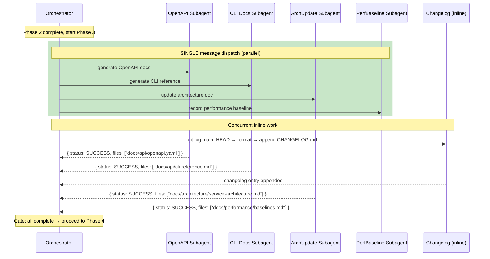

# Historia: Paralelizar Phase 3 documentation generators

**ID:** story-0010-0006

## 1. Dependencias

| Blocked By | Blocks |
| :--- | :--- |
| story-0010-0005 | story-0010-0008 |

## 2. Regras Transversais Aplicaveis

| ID | Titulo |
| :--- | :--- |
| RULE-001 | Context Isolation |
| RULE-003 | Single Message Dispatch |

## 3. Descricao

Como **orquestrador de lifecycle (x-dev-lifecycle)**, eu quero que os documentation generators da Phase 3 rodem como subagents paralelos em uma UNICA mensagem, garantindo que o tempo de geracao de documentacao seja reduzido de 3-5 minutos sequenciais para o tempo do gerador mais lento (tipicamente 30-60 segundos).

Atualmente, a Phase 3 do `x-dev-lifecycle` executa documentation generators inline e sequencialmente: OpenAPI generator, CLI docs, event docs, changelog, architecture doc update, performance baseline. Cada gerador e independente — le fontes diferentes e escreve em arquivos diferentes. Nao ha dependencia de dados entre eles. A execucao sequencial inline e um desperdicio: o orchestrator fica bloqueado esperando cada gerador terminar antes de iniciar o proximo.

A conversao propoe transformar Phase 3 de "orchestrator inline sequential" para "parallel subagent dispatch": cada documentation generator se torna um subagent independente, todos lancados em uma UNICA mensagem (RULE-003). O orchestrator aguarda todos completarem antes de prosseguir para Phase 4 (Review). A excecao e o changelog entry, que pode permanecer inline por ser rapido (leitura de git log + append) e servir como "gate" — o orchestrator gera o changelog enquanto os subagents rodam.

### 3.1 Analise de Independencia dos Generators

| Generator | Le (Input) | Escreve (Output) | Compartilha arquivo? |
| :--- | :--- | :--- | :--- |
| OpenAPI/Swagger | Codigo fonte (controllers, DTOs) | `docs/api/openapi.yaml` | Nao |
| gRPC/Proto docs | `.proto` files | `docs/api/grpc-reference.md` | Nao |
| CLI docs | CLI command classes | `docs/api/cli-reference.md` | Nao |
| GraphQL schema | Schema files | `docs/api/graphql-reference.md` | Nao |
| Event docs | Event classes, CloudEvents config | `docs/api/event-reference.md` | Nao |
| Architecture update | Arch plan, existing arch doc | `docs/architecture/service-architecture.md` | Nao |
| Performance baseline | Metrics antes/depois | `docs/performance/baselines.md` | Nao |
| Changelog | `git log main..HEAD` | `CHANGELOG.md` | Nao |

Nenhum generator compartilha arquivo de output. Todos podem rodar em paralelo sem risco de conflito de escrita.

### 3.2 Nova Estrutura de Phase 3

```
Parallel dispatch (SINGLE message):
  ├── Subagents 1..N: Interface doc generators (one subagent per interface: OpenAPI, gRPC, CLI, GraphQL, Event, etc.)
  ├── Architecture doc update subagent (if arch plan exists)
  └── Performance baseline subagent (if feature affects request path)

Inline (orchestrator, concurrent with subagents):
  └── Changelog entry generation (fast, git log + append)

Gate: Wait for all subagents + inline changelog to complete
```

### 3.3 Agrupamento de Interface Generators

Multiplas interfaces do projeto (ex: `rest` + `cli` + `kafka`) resultam em multiplos generators. Cada interface generator e um subagent separado. Para projetos com 3+ interfaces, isso pode significar 3+ subagents so para docs de interface, mais architecture update e performance baseline.

O limite pratico e de 5 subagents paralelos em Phase 3 (para evitar pressao excessiva de memoria — ref: Subagent Memory Risk no project memory). Se o projeto tiver mais de 5 generators, os excedentes sao enfileirados em uma segunda wave.

### 3.4 Changelog Permanece Inline

O changelog entry generation permanece inline no orchestrator porque:
1. E rapido (< 5 segundos): `git log main..HEAD --oneline` + format + append
2. Nao requer context isolation (le apenas git log local)
3. Serve como "trabalho util" enquanto o orchestrator espera os subagents

## 4. Definicoes de Qualidade Locais

### DoR Local

- [ ] Phase 3 do `x-dev-lifecycle/SKILL.md` lida integralmente
- [ ] Tabela de independencia dos generators confirmada (Section 3.1)
- [ ] story-0010-0005 (paralelizacao Phase 1A) em status SUCCESS
- [ ] Limite de 5 subagents paralelos definido e documentado

### DoD Local

- [ ] Phase 3 convertida de inline sequential para parallel subagent dispatch
- [ ] Interface doc generators lancados como subagents separados
- [ ] Architecture doc update lancado como subagent (condicional)
- [ ] Performance baseline lancado como subagent (condicional)
- [ ] Changelog permanece inline no orchestrator
- [ ] Todos os subagents lancados em UNICA mensagem (RULE-003)
- [ ] Gate de espera implementado: orchestrator aguarda todos completarem
- [ ] Limite de 5 subagents paralelos com overflow para segunda wave
- [ ] Frontmatter YAML do SKILL.md valido

### Global Definition of Done (DoD)

- **Consistencia:** Skills modificadas mantam frontmatter YAML valido
- **Backward Compatibility:** Flags existentes continuam funcionando
- **TDD Compliance:** Commits show test-first pattern
- **Double-Loop TDD:** Acceptance tests from Gherkin (outer loop), unit tests via TPP (inner loop)

## 5. Contratos de Dados (Data Contract)

**Phase 3 — Estrutura de Execucao (antes):**

```
Inline sequential (orchestrator):
  1. OpenAPI generator (if rest)
  2. gRPC docs (if grpc)
  3. CLI docs (if cli)
  4. GraphQL docs (if graphql)
  5. Event docs (if event interfaces)
  6. Changelog entry
  7. Architecture doc update (if arch plan exists)
  8. Performance baseline (if applicable)
```

**Phase 3 — Estrutura de Execucao (depois):**

```
Parallel subagent dispatch (SINGLE message):
  ├── Subagent: OpenAPI generator (if rest)
  ├── Subagent: gRPC docs (if grpc)
  ├── Subagent: CLI docs (if cli)
  ├── Subagent: GraphQL docs (if graphql)
  ├── Subagent: Event docs (if event interfaces)
  ├── Subagent: Architecture doc update (if arch plan exists)
  └── Subagent: Performance baseline (if applicable)

Inline concurrent (orchestrator):
  └── Changelog entry (git log + append)

Gate: all subagents + changelog complete → Phase 4
```

**Subagent Prompt Template (por generator):**

| Campo | Tipo | Descricao |
| :--- | :--- | :--- |
| `generatorType` | `string` | Tipo do generator: `openapi`, `grpc`, `cli`, `graphql`, `event`, `architecture`, `performance` |
| `outputPath` | `string` | Caminho do arquivo de output |
| `sourcePaths` | `string[]` | Caminhos dos arquivos fonte a serem lidos |
| `storyId` | `string` | ID da story sendo documentada |

**SubagentResult Contract (RULE-008):**

| Campo | Tipo | Obrigatorio |
| :--- | :--- | :--- |
| `status` | `SUCCESS \| FAILED` | Sim |
| `commitSha` | `string` | Sim (se SUCCESS) |
| `findingsCount` | `number` | Sim |
| `summary` | `string` | Sim |

## 6. Diagramas

### 6.1 Phase 3 — Parallel Documentation Generation



## 7. Criterios de Aceite (Gherkin)

```gherkin
Cenario: Projeto sem interfaces documentaveis — Phase 3 gera apenas changelog
  DADO que o projeto tem interfaces=["none"]
  E nao existe architecture plan
  E o feature nao afeta request path
  QUANDO o orchestrator executa Phase 3
  ENTAO nenhum subagent e despachado
  E apenas o changelog entry e gerado inline
  E Phase 3 completa em menos de 10 segundos

Cenario: Projeto com interface CLI — documentation generator paralelo
  DADO que o projeto tem interfaces=["cli"]
  E nao existe architecture plan
  QUANDO o orchestrator executa Phase 3
  ENTAO 1 subagent e despachado para CLI docs em uma UNICA mensagem
  E o changelog e gerado inline concorrentemente
  E o subagent produz "docs/api/cli-reference.md"
  E o orchestrator aguarda o subagent completar antes de Phase 4

Cenario: Projeto com multiplas interfaces — todos generators em paralelo
  DADO que o projeto tem interfaces=["rest", "cli", "kafka"]
  E existe architecture plan em "docs/stories/epic-0010/plans/architecture-story-0010-0001.md"
  E o feature afeta o request path (performance baseline aplicavel)
  QUANDO o orchestrator executa Phase 3
  ENTAO 5 subagents sao despachados em uma UNICA mensagem: OpenAPI, CLI, Event, ArchUpdate, PerfBaseline
  E o changelog e gerado inline concorrentemente
  E cada subagent escreve em arquivo diferente sem conflito

Cenario: Subagent de documentation falha — nao bloqueia outros generators
  DADO que 3 subagents foram despachados em Phase 3: OpenAPI, CLI, ArchUpdate
  E o subagent de OpenAPI retorna status FAILED
  QUANDO todos os subagents completam
  ENTAO o subagent de CLI retorna status SUCCESS com "docs/api/cli-reference.md"
  E o subagent de ArchUpdate retorna status SUCCESS
  E o orchestrator emite WARNING sobre falha do OpenAPI generator
  E Phase 3 NAO e marcada como FAILED (documentacao e best-effort)

Cenario: Mais de 5 generators — overflow para segunda wave
  DADO que o projeto tem interfaces=["rest", "grpc", "cli", "graphql", "kafka"]
  E existe architecture plan
  E performance baseline e aplicavel
  QUANDO o orchestrator executa Phase 3
  ENTAO os primeiros 5 generators sao despachados em Wave 1 (UNICA mensagem)
  E os 2 generators restantes sao despachados em Wave 2 apos Wave 1 completar
  E o changelog e gerado inline durante Wave 1

Cenario: Gate de Phase 3 aguarda todos os subagents antes de Phase 4
  DADO que 3 subagents foram despachados em Phase 3
  E o changelog inline ja completou
  E 2 subagents completaram mas 1 ainda esta executando
  QUANDO o orchestrator verifica o gate de Phase 3
  ENTAO Phase 4 NAO e iniciada
  E o orchestrator aguarda o subagent restante completar
  E somente apos todos completarem, Phase 4 (Review) e iniciada
```

### 7.1 Scenario Ordering (TPP)

> Scenarios follow TPP order: degenerate (zero generators, changelog only) → constant (1 generator) → collection (multiplas interfaces, N generators) → error (falha de subagent isolada) → boundary (overflow de 5+, gate de espera).

### 7.2 Mandatory Scenario Categories

- [x] Degenerate cases (zero interfaces documentaveis)
- [x] Happy path (multiplas interfaces em paralelo)
- [x] Error paths (falha de subagent nao bloqueia outros)
- [x] Boundary values (overflow de 5+ generators, gate de espera)

## 8. Sub-tarefas

- [ ] [Dev] Converter interface doc generators de inline para subagent dispatch
- [ ] [Dev] Converter architecture doc update de inline para subagent dispatch
- [ ] [Dev] Converter performance baseline de inline para subagent dispatch
- [ ] [Dev] Manter changelog entry como inline (nao converter para subagent)
- [ ] [Dev] Implementar SINGLE message dispatch para todos subagents (RULE-003)
- [ ] [Dev] Implementar gate de espera: aguardar todos subagents + changelog
- [ ] [Dev] Implementar limite de 5 subagents com overflow para segunda wave
- [ ] [Dev] Definir prompt template para cada tipo de documentation generator subagent
- [ ] [Test] Cenario: zero generators (apenas changelog)
- [ ] [Test] Cenario: 1 generator paralelo + changelog inline
- [ ] [Test] Cenario: N generators paralelos + arch update + perf baseline
- [ ] [Test] Cenario: falha isolada de subagent (best-effort)
- [ ] [Test] Cenario: overflow de 5+ generators em duas waves
- [ ] [Test] Cenario: gate de espera bloqueia Phase 4
- [ ] [Doc] Atualizar Phase 3 section do SKILL.md com novo fluxo paralelo
