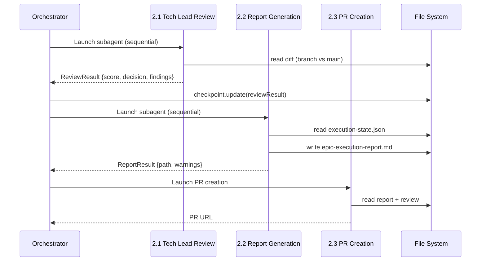
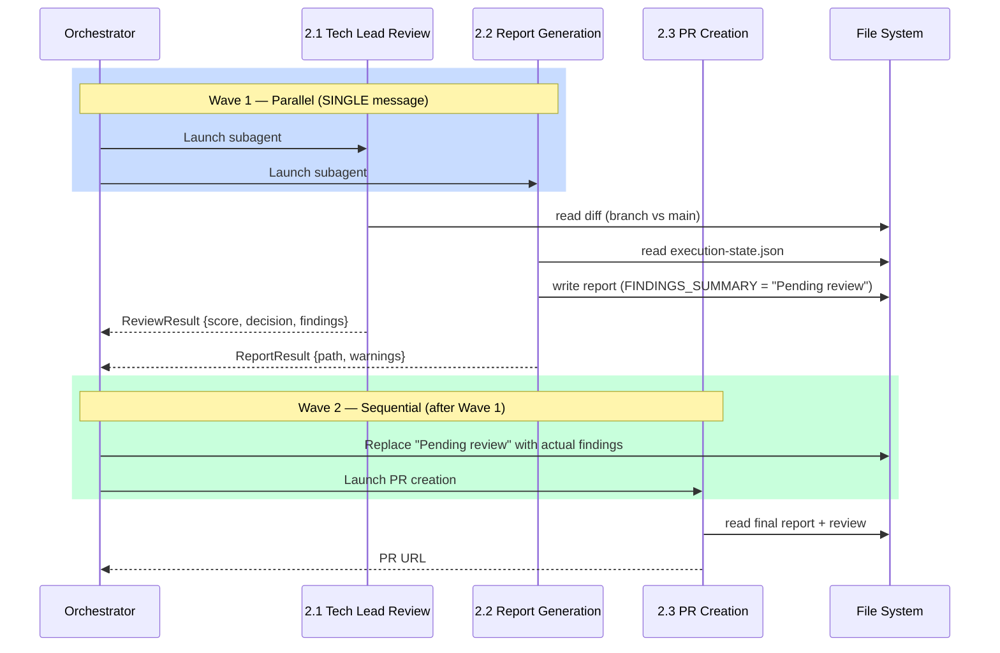

# Historia: Paralelizar epic consolidation phases 2.1 e 2.2

**ID:** story-0010-0007

## 1. Dependencias

| Blocked By | Blocks |
| :--- | :--- |
| story-0010-0002 | story-0010-0009 |

## 2. Regras Transversais Aplicaveis

| ID | Titulo |
| :--- | :--- |
| RULE-001 | Context Isolation |
| RULE-002 | Checkpoint Atomicity |
| RULE-003 | Single Message Dispatch |

## 3. Descricao

Como **Tech Lead**, eu quero paralelizar as fases 2.1 (Tech Lead Review) e 2.2 (Report Generation) na Phase 2 — Consolidation do skill `x-dev-epic-implement`, garantindo que a Phase 2.3 (PR Creation) aguarde ambos os resultados antes de criar o PR, economizando 5-10 minutos por epic.

Atualmente, a Phase 2 — Consolidation do `x-dev-epic-implement` executa tres acoes sequenciais apos a conclusao de todas as stories: (2.1) Tech Lead Review subagent que le o diff completo do epic branch contra main, (2.2) Report Generation subagent que le o checkpoint `execution-state.json` e preenche o template de relatorio, e (2.3) PR Creation que depende do report e do review score para compor o body do PR. O texto atual diz explicitamente "three sequential consolidation actions".

No entanto, as fases 2.1 e 2.2 sao **independentes entre si**: 2.1 opera sobre o diff do git (branch vs main), enquanto 2.2 opera sobre o checkpoint em disco (execution-state.json + template). Nao ha dependencia de dados entre elas. Apenas a fase 2.3 depende de ambos os resultados — precisa do `ReviewResult` de 2.1 para popular `{{FINDINGS_SUMMARY}}` no report e precisa do report gerado por 2.2 como artefato do PR. Portanto, 2.1 e 2.2 podem ser lancados como subagents paralelos em uma SINGLE message (conforme RULE-003), com 2.3 aguardando a conclusao de ambos.

### 3.1 Reestruturacao da Phase 2

- Reescrever a secao `## Phase 2 — Consolidation` para dividir em duas waves:
  - **Wave 1 (paralela):** Lancar 2.1 (Tech Lead Review) e 2.2 (Report Generation) em uma SINGLE message
  - **Wave 2 (sequencial, apos Wave 1):** Executar 2.3 (PR Creation) usando os resultados de ambos
- O texto introdutorio "three sequential consolidation actions" deve ser atualizado para "two-wave consolidation"
- O comentario CRITICAL sobre dispatch deve referenciar a paralelizacao de 2.1/2.2

### 3.2 Handling de Falhas em Wave 1

- Se 2.1 falha: log warning, continue (review e informacional — comportamento existente preservado)
- Se 2.2 falha: 2.3 cria PR sem report attachment, log ERROR com motivo
- Se ambos falham: 2.3 cria PR minimalista com dados do checkpoint diretamente
- O checkpoint deve ser atualizado atomicamente (RULE-002) apos cada subagent completar

### 3.3 Dados Compartilhados entre 2.2 e 2.3

- A fase 2.2 gera o report escrevendo `epic-execution-report.md` em disco
- A fase 2.2 popula `{{FINDINGS_SUMMARY}}` usando dados do checkpoint (gravados por 2.1 previamente, na execucao sequencial)
- Com paralelismo, 2.2 pode iniciar antes que 2.1 grave o `ReviewResult` no checkpoint
- Solucao: 2.2 popula `{{FINDINGS_SUMMARY}}` com placeholder "Pending review" e 2.3 substitui pelo resultado real de 2.1

## 4. Definicoes de Qualidade Locais

### DoR Local

- [ ] Skill file `x-dev-epic-implement/SKILL.md` lido e secao "Phase 2 — Consolidation" localizada (linhas 481-560+)
- [ ] Prompts de 2.1 e 2.2 analisados para confirmar independencia de dados
- [ ] Contrato de `ReviewResult` entendido (campos: score, decision, findings)
- [ ] Template `_TEMPLATE-EPIC-EXECUTION-REPORT.md` analisado para mapear dependencia de `{{FINDINGS_SUMMARY}}`

### DoD Local

- [ ] Secao "Phase 2 — Consolidation" reescrita com estrutura Two-Wave
- [ ] Wave 1 lanca 2.1 e 2.2 em SINGLE message (RULE-003)
- [ ] Wave 2 (2.3) aguarda ambos os resultados antes de criar PR
- [ ] Handling de falha para 2.1, 2.2, e ambos documentado
- [ ] Placeholder "Pending review" em `{{FINDINGS_SUMMARY}}` substituido por 2.3
- [ ] Checkpoint atualizado atomicamente apos cada subagent (RULE-002)
- [ ] Frontmatter YAML do SKILL.md permanece valido
- [ ] Secoes fora de Phase 2 inalteradas

### Global Definition of Done (DoD)

- **Consistencia:** Skills modificadas mantam frontmatter YAML valido
- **Backward Compatibility:** Flags existentes continuam funcionando
- **TDD Compliance:** Commits show test-first pattern
- **Double-Loop TDD:** Acceptance tests from Gherkin (outer loop), unit tests via TPP (inner loop)

## 5. Contratos de Dados (Data Contract)

### Estrutura Atual (sequencial)

```
## Phase 2 — Consolidation

After all stories complete (or reach terminal state), the orchestrator runs three
sequential consolidation actions. Each action is dispatched to a clean-context
subagent (RULE-001) to keep the orchestrator's context lightweight.

### 2.1 Tech Lead Review Subagent
(reads diff: branch vs main)

### 2.2 Report Generation Subagent
(reads checkpoint: execution-state.json)

### 2.3 PR Creation
(depends on 2.1 review + 2.2 report)
```

### Estrutura Proposta (duas waves)

```
## Phase 2 — Consolidation (Two-Wave)

After all stories complete (or reach terminal state), the orchestrator runs
a two-wave consolidation. Wave 1 launches independent subagents in parallel;
Wave 2 waits for both results before creating the PR.

### Wave 1 — Parallel Review + Report (SINGLE message)
CRITICAL: Both subagents MUST be launched in a SINGLE message (RULE-003).

#### 2.1 Tech Lead Review Subagent
(reads diff: branch vs main — unchanged)

#### 2.2 Report Generation Subagent
(reads checkpoint: execution-state.json — unchanged)
Note: {{FINDINGS_SUMMARY}} populated with "Pending review" placeholder.

### Wave 1 Result Handling
- 2.1 SUCCESS: record ReviewResult in checkpoint
- 2.1 FAILURE: log warning, continue (informational)
- 2.2 SUCCESS: report written to disk
- 2.2 FAILURE: log ERROR, PR created without report

### Wave 2 — PR Creation (after Wave 1 completes)

#### 2.3 PR Creation
- Replace "Pending review" in report with actual ReviewResult from 2.1
- Push branch + create PR using report as body
```

### Invariantes

- O conteudo interno dos prompts de 2.1 e 2.2 NAO muda — apenas a estrutura de dispatch e timing mudam
- O formato de output (ReviewResult, epic-execution-report.md) permanece identico
- A flag `--skip-review` continua funcionando (pula 2.1, Wave 1 lanca somente 2.2)

## 6. Diagramas

### 6.1 Fluxo Antes (Sequencial)



### 6.2 Fluxo Depois (Two-Wave)



## 7. Criterios de Aceite (Gherkin)

```gherkin
Cenario: Wave 1 sem stories completadas nao dispara consolidation
  DADO que o epic "EPIC-0099" possui 5 stories todas com status FAILED
  E nenhuma story possui status SUCCESS
  QUANDO o orchestrator avalia se Phase 2 deve iniciar
  ENTAO a Phase 2 nao deve ser executada
  E o log deve conter "No successful stories — skipping consolidation"

Cenario: Wave 1 lanca 2.1 e 2.2 em paralelo via SINGLE message
  DADO que o epic "EPIC-0010" possui 3 stories com status SUCCESS
  E o checkpoint "execution-state.json" contem dados de todas as stories
  QUANDO o orchestrator inicia a Phase 2 — Consolidation
  ENTAO os subagents 2.1 (Tech Lead Review) e 2.2 (Report Generation) devem ser lancados em uma SINGLE message
  E 2.1 deve receber branch "feat/epic-0010-full-implementation" e base "main"
  E 2.2 deve receber path do checkpoint e path do template

Cenario: Wave 2 aguarda ambos os resultados antes de criar PR
  DADO que Wave 1 foi lancada com 2.1 e 2.2 em paralelo
  E 2.1 retornou ReviewResult com score "35/40" e decision "GO"
  E 2.2 retornou ReportResult com path "docs/stories/epic-0010/epic-execution-report.md"
  QUANDO o orchestrator avalia o Wave 1 Gate
  ENTAO o placeholder "Pending review" no report deve ser substituido pelos findings reais de 2.1
  E a Phase 2.3 deve criar o PR com o report atualizado no body

Cenario: Review falha mas report e PR sao criados
  DADO que Wave 1 foi lancada com 2.1 e 2.2 em paralelo
  E 2.1 falhou com timeout apos 120 segundos
  E 2.2 completou com sucesso gerando o report
  QUANDO o orchestrator processa os resultados de Wave 1
  ENTAO o log deve conter "WARNING: Tech Lead Review failed — continuing without review"
  E o placeholder "Pending review" no report deve permanecer como "Review unavailable"
  E a Phase 2.3 deve criar o PR sem review score no titulo

Cenario: Report falha mas PR e criado com dados do checkpoint
  DADO que Wave 1 foi lancada com 2.1 e 2.2 em paralelo
  E 2.1 completou com ReviewResult valido
  E 2.2 falhou ao gerar o report
  QUANDO o orchestrator processa os resultados de Wave 1
  ENTAO o log deve conter "ERROR: Report generation failed"
  E a Phase 2.3 deve criar o PR com body minimalista extraido do checkpoint
  E o review score de 2.1 deve ser incluido no body do PR

Cenario: Flag --skip-review reduz Wave 1 a apenas 2.2
  DADO que o epic foi invocado com flag "--skip-review"
  QUANDO o orchestrator inicia a Phase 2 — Consolidation
  ENTAO Wave 1 deve lancar apenas o subagent 2.2 (Report Generation)
  E nenhum subagent de Tech Lead Review deve ser lancado
  E o campo "{{FINDINGS_SUMMARY}}" deve ser populado com "Review skipped by user"
```

### 7.1 Scenario Ordering (TPP)

> TPP: degenerate (zero stories completadas) -> unconditional (Wave 1 paralela) -> condicional (Wave 2 aguarda ambos) -> erro parcial (review falha) -> erro parcial (report falha) -> boundary (--skip-review).

### 7.2 Mandatory Scenario Categories

- [x] Degenerate cases (zero stories completadas — consolidation nao executa)
- [x] Happy path (Wave 1 paralela, Wave 2 com ambos resultados)
- [x] Error paths (review falha, report falha)
- [x] Boundary values (--skip-review reduz Wave 1)

## 8. Sub-tarefas

- [ ] [Dev] Reescrever secao "Phase 2 — Consolidation" do `x-dev-epic-implement/SKILL.md` com estrutura Two-Wave
- [ ] [Dev] Atualizar dispatch de 2.1 e 2.2 para SINGLE message (RULE-003)
- [ ] [Dev] Implementar Wave 1 Gate que coleta resultados de ambos os subagents
- [ ] [Dev] Implementar substituicao de placeholder "Pending review" em 2.3
- [ ] [Dev] Implementar handling de falha para 2.1 (warning, continue) e 2.2 (error, PR minimalista)
- [ ] [Dev] Atualizar logica de `--skip-review` para despachar apenas 2.2 em Wave 1
- [ ] [Test] Validar que frontmatter YAML permanece valido apos edicao
- [ ] [Test] Validar que secoes fora de Phase 2 nao foram alteradas
- [ ] [Test] Simular cenario: ambos succedem, PR criado com report completo
- [ ] [Test] Simular cenario: 2.1 falha, PR criado sem review
- [ ] [Test] Simular cenario: 2.2 falha, PR criado com body minimalista
- [ ] [Doc] Atualizar Integration Notes com referencia ao Two-Wave consolidation
