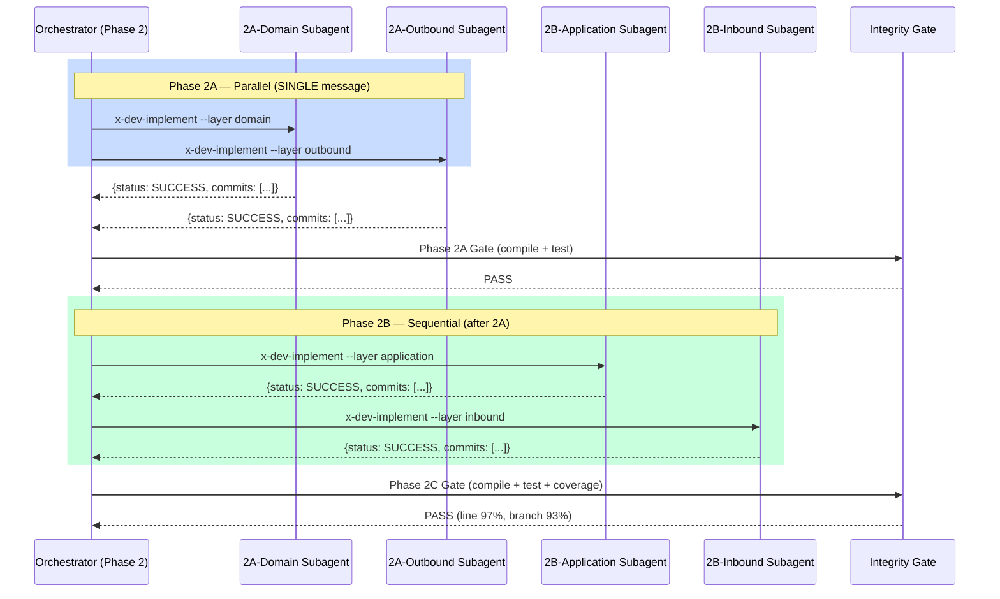
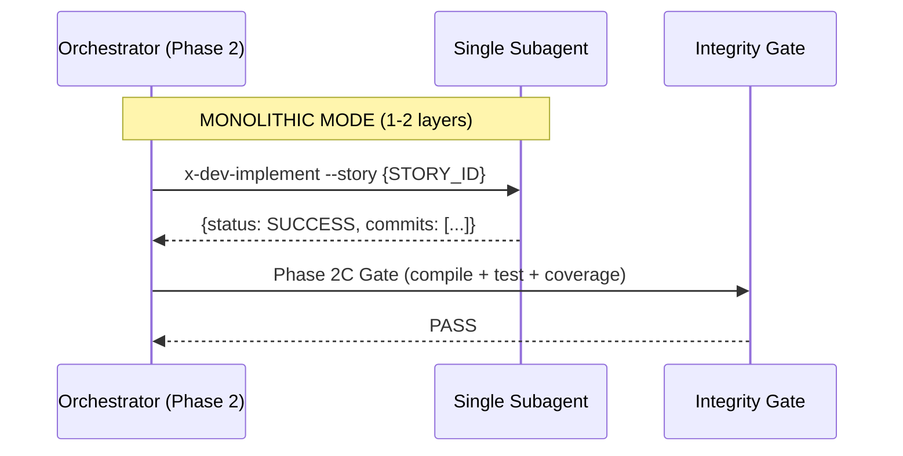
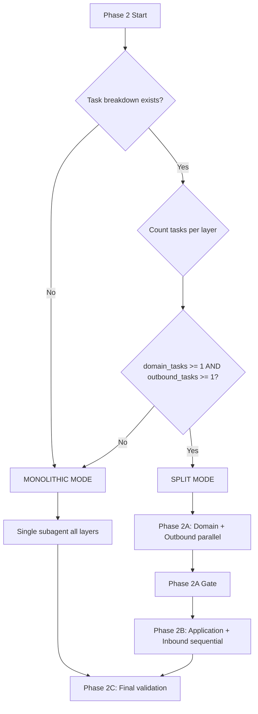

# Historia: Split Phase 2 implementation em sub-fases paralelas por layer

**ID:** story-0010-0008

## 1. Dependencias

| Blocked By | Blocks |
| :--- | :--- |
| story-0010-0005, story-0010-0006 | story-0010-0009 |

## 2. Regras Transversais Aplicaveis

| ID | Titulo |
| :--- | :--- |
| RULE-001 | Context Isolation |
| RULE-003 | Single Message Dispatch |
| RULE-004 | Integrity Gate Mandatory |
| RULE-009 | Backward Compatibility |

## 3. Descricao

Como **Tech Lead**, eu quero dividir a Phase 2 — TDD Implementation do skill `x-dev-lifecycle` em sub-fases paralelas por layer, garantindo que layers independentes (domain, outbound adapter) sejam implementadas em paralelo por subagents separados, reduzindo o tempo de implementacao e evitando exaustao de context window em stories grandes.

Atualmente, a Phase 2 do `x-dev-lifecycle` lanca um UNICO subagent `general-purpose` que implementa a story inteira: todos os ciclos TDD, todas as layers (domain, ports, outbound adapter, application, inbound adapter), todos os testes. Este e o subagent mais pesado de todo o ciclo de vida — para stories que tocam 3+ layers, o subagent pode consumir 80-100k tokens de contexto, arriscando exaustao do context window e degradacao de qualidade nas ultimas layers.

O proprio skill reconhece na secao "Parallelism in Phase 2" que "Independent test scenarios CAN run in parallel" e "Subagents working on independent layers MUST be launched in a SINGLE message", mas a implementacao efetiva lanca apenas UM subagent monolitico. A arquitetura hexagonal do projeto garante que domain e outbound adapter sao layers independentes (domain nao importa adapter, outbound adapter implementa port definido no domain). Portanto, os ciclos TDD dessas duas layers podem ser executados em paralelo sem conflito.

### 3.1 Divisao em Sub-fases

A Phase 2 deve ser dividida em tres sub-fases:

- **Phase 2A (paralela):** Domain TDD cycles + Outbound adapter TDD cycles, lancados como 2 subagents em SINGLE message
  - Subagent Domain: implementa entities, value objects, engines, business rules (domain/model, domain/engine)
  - Subagent Outbound: implementa outbound port implementations, repository adapters, external clients (adapter/outbound)
- **Phase 2B (sequencial, apos 2A):** Application layer + Inbound adapter, lancados como 1-2 subagents sequenciais
  - Application layer depende de domain (entities, ports definidos em 2A)
  - Inbound adapter depende de application (use cases) e domain (DTOs mapeados a partir de entities)
- **Phase 2C (validacao):** Compilacao + testes + coverage — integrity gate obrigatorio (RULE-004)

### 3.2 Deteccao de Complexidade (Small vs Large Stories)

- Stories com 1-2 layers: manter subagent monolitico (overhead de split nao compensa)
- Stories com 3+ layers: ativar split automaticamente
- Heuristica baseada no task breakdown (`tasks-story-XXXX-YYYY.md`):
  - Contar tasks por layer (domain, outbound, application, inbound)
  - Se `domain_tasks >= 1 AND outbound_tasks >= 1 AND (application_tasks >= 1 OR inbound_tasks >= 1)`: ativar split
  - Caso contrario: subagent monolitico

### 3.3 Atualizacao do x-dev-implement

O skill `x-dev-implement` deve ser atualizado para suportar um parametro `--layer` que restringe a implementacao a uma layer especifica. Isso permite que o orchestrator do lifecycle lance subagents independentes com escopo isolado:

- `x-dev-implement --layer domain` — implementa apenas domain/model + domain/engine + domain/port
- `x-dev-implement --layer outbound` — implementa apenas adapter/outbound
- `x-dev-implement --layer application` — implementa apenas application (use cases)
- `x-dev-implement --layer inbound` — implementa apenas adapter/inbound
- Sem `--layer`: comportamento atual (todas as layers, backward compatible)

### 3.4 Contexto para Cada Subagent (RULE-001)

Cada subagent de layer recebe apenas:
- Story ID e epic ID
- Layer scope (domain, outbound, application, inbound)
- Paths para test plan e task breakdown (filtrados para a layer relevante)
- Path para knowledge packs da layer (coding-standards, layer-templates)

## 4. Definicoes de Qualidade Locais

### DoR Local

- [ ] Skill file `x-dev-lifecycle/SKILL.md` lido e secao "Phase 2 — TDD Implementation" localizada
- [ ] Skill file `x-dev-implement/SKILL.md` lido e mecanismo de layer implementation entendido
- [ ] Secao "Parallelism in Phase 2" analisada para confirmar intencao de paralelismo
- [ ] Dependency graph entre layers confirmado: domain e outbound sao independentes; application depende de domain; inbound depende de application
- [ ] Formato do task breakdown (`tasks-story-XXXX-YYYY.md`) analisado para mapear tasks por layer

### DoD Local

- [ ] Phase 2 dividida em sub-fases 2A (paralela), 2B (sequencial), 2C (validacao)
- [ ] Phase 2A lanca domain + outbound subagents em SINGLE message (RULE-003)
- [ ] Phase 2B executa apos 2A completar com integrity gate intermediario
- [ ] Phase 2C executa integrity gate final (compilacao + testes + coverage) (RULE-004)
- [ ] Heuristica de deteccao de complexidade implementada (1-2 layers = monolitico, 3+ layers = split)
- [ ] Parametro `--layer` adicionado ao `x-dev-implement` com escopo por layer
- [ ] Sem `--layer`: comportamento monolitico preservado (RULE-009)
- [ ] Frontmatter YAML de ambos os SKILL.md permanece valido
- [ ] Secoes fora de Phase 2 inalteradas em ambos os skills

### Global Definition of Done (DoD)

- **Consistencia:** Skills modificadas mantam frontmatter YAML valido
- **Backward Compatibility:** Flags existentes continuam funcionando
- **TDD Compliance:** Commits show test-first pattern
- **Double-Loop TDD:** Acceptance tests from Gherkin (outer loop), unit tests via TPP (inner loop)

## 5. Contratos de Dados (Data Contract)

### Estrutura Atual — x-dev-lifecycle Phase 2 (monolitico)

```
## Phase 2 — TDD Implementation (Subagent via Task)

Launch a **single** `general-purpose` subagent for implementation:

> You are a **Developer** implementing story {STORY_ID}...
> Step 1 — Read context
> Step 2 — TDD Loop
> Step 3 — Commit each TDD cycle

### Parallelism in Phase 2
Independent test scenarios CAN run in parallel...
Subagents working on independent layers MUST be launched in a SINGLE message
```

### Estrutura Proposta — x-dev-lifecycle Phase 2 (split por layer)

```
## Phase 2 — TDD Implementation (Split by Layer)

### Complexity Detection
- Count tasks per layer from tasks-story-XXXX-YYYY.md
- If domain_tasks >= 1 AND outbound_tasks >= 1: SPLIT MODE
- Otherwise: MONOLITHIC MODE (single subagent, backward compatible)

### Phase 2A — Inner Layers (Parallel, SINGLE message)
CRITICAL: Both layer subagents MUST be launched in a SINGLE message (RULE-003).

#### 2A-Domain: Domain TDD Cycles
Launch: x-dev-implement --layer domain --story {STORY_ID}
Scope: domain/model, domain/engine, domain/port

#### 2A-Outbound: Outbound Adapter TDD Cycles
Launch: x-dev-implement --layer outbound --story {STORY_ID}
Scope: adapter/outbound

### Phase 2A Gate (Integrity Check)
- Compile: {{COMPILE_COMMAND}} — MUST pass
- Test: domain + outbound tests — MUST pass

### Phase 2B — Outer Layers (Sequential, after 2A)

#### 2B-Application: Application Layer
Launch: x-dev-implement --layer application --story {STORY_ID}
Depends on: domain entities + outbound port implementations

#### 2B-Inbound: Inbound Adapter
Launch: x-dev-implement --layer inbound --story {STORY_ID}
Depends on: application use cases + domain DTOs

### Phase 2C — Final Validation (Integrity Gate — RULE-004)
- Compile: {{COMPILE_COMMAND}}
- Test: {{TEST_COMMAND}}
- Coverage: {{COVERAGE_COMMAND}} (line >= 95%, branch >= 90%)
```

### Estrutura Proposta — x-dev-implement (novo parametro)

```
---
name: x-dev-implement
description: Implements a feature/story following project conventions.
argument-hint: "[--story STORY_ID] [--layer domain|outbound|application|inbound]"
---

## Layer Scope
When --layer is provided:
- Filter test plan scenarios to only those affecting the target layer
- Filter task breakdown to only tasks for the target layer
- Implementation follows same TDD loop, but restricted to layer scope
- Commits include layer tag: feat(domain): ... or feat(outbound): ...

When --layer is omitted:
- Full story implementation (all layers) — backward compatible
```

## 6. Diagramas

### 6.1 Fluxo Split Mode (3+ layers)



### 6.2 Fluxo Monolithic Mode (1-2 layers)



### 6.3 Decision Tree — Split vs Monolithic



## 7. Criterios de Aceite (Gherkin)

```gherkin
Cenario: Story com apenas 1 layer usa modo monolitico
  DADO que a story "story-0010-0001" possui task breakdown com 5 tasks
  E todas as 5 tasks pertencem a layer "domain"
  E nenhuma task pertence a layer "outbound"
  QUANDO o orchestrator avalia a complexidade na Phase 2
  ENTAO o modo MONOLITHIC deve ser selecionado
  E um unico subagent deve ser lancado sem parametro "--layer"

Cenario: Story com 3+ layers ativa modo split automaticamente
  DADO que a story "story-0010-0008" possui task breakdown com 12 tasks
  E 4 tasks pertencem a layer "domain"
  E 3 tasks pertencem a layer "outbound"
  E 3 tasks pertencem a layer "application"
  E 2 tasks pertencem a layer "inbound"
  QUANDO o orchestrator avalia a complexidade na Phase 2
  ENTAO o modo SPLIT deve ser selecionado
  E Phase 2A deve lancar 2 subagents (domain + outbound) em SINGLE message

Cenario: Phase 2A lanca domain e outbound em paralelo
  DADO que o modo SPLIT foi selecionado para story "story-0010-0008"
  QUANDO Phase 2A e iniciada
  ENTAO o subagent domain deve receber "x-dev-implement --layer domain --story story-0010-0008"
  E o subagent outbound deve receber "x-dev-implement --layer outbound --story story-0010-0008"
  E ambos devem ser lancados em uma SINGLE message (RULE-003)

Cenario: Phase 2A Gate bloqueia 2B quando compilacao falha
  DADO que Phase 2A completou com domain SUCCESS e outbound SUCCESS
  MAS a compilacao via "mvn compile" falha com erro em domain/port
  QUANDO o Phase 2A Gate e executado
  ENTAO o status deve ser FAIL
  E Phase 2B NAO deve ser iniciada
  E o log deve conter "Phase 2A Gate FAILED — blocking Phase 2B"

Cenario: Phase 2B executa application e inbound sequencialmente
  DADO que Phase 2A Gate retornou PASS
  QUANDO Phase 2B e iniciada
  ENTAO o subagent application deve ser lancado primeiro com "--layer application"
  E somente apos application completar, o subagent inbound deve ser lancado com "--layer inbound"
  E os subagents NAO devem ser lancados em paralelo (dependencia application -> inbound)

Cenario: x-dev-implement com --layer restringe escopo a uma layer
  DADO que o skill "x-dev-implement" e invocado com "--layer domain"
  E o test plan contem 8 cenarios de teste (4 domain, 2 outbound, 2 application)
  QUANDO o subagent inicia o TDD loop
  ENTAO apenas os 4 cenarios de teste da layer "domain" devem ser executados
  E os cenarios de "outbound" e "application" devem ser ignorados

Cenario: x-dev-implement sem --layer executa todas as layers
  DADO que o skill "x-dev-implement" e invocado sem parametro "--layer"
  E o test plan contem 8 cenarios de teste distribuidos em 3 layers
  QUANDO o subagent inicia o TDD loop
  ENTAO todos os 8 cenarios devem ser executados na ordem TPP
  E a implementacao deve seguir layer order: domain -> ports -> outbound -> application -> inbound
```

### 7.1 Scenario Ordering (TPP)

> TPP: degenerate (1 layer = monolitico) -> unconditional (3+ layers = split) -> condicional (2A paralela) -> erro (gate falha) -> condicional (2B sequencial) -> condicional (--layer filtra escopo) -> boundary (sem --layer = todas as layers).

### 7.2 Mandatory Scenario Categories

- [x] Degenerate cases (1 layer — modo monolitico)
- [x] Happy path (3+ layers — split com 2A paralela, 2B sequencial, 2C validacao)
- [x] Error paths (Phase 2A Gate falha, bloqueia 2B)
- [x] Boundary values (--layer filtra escopo, sem --layer preserva comportamento)

## 8. Sub-tarefas

- [ ] [Dev] Reescrever secao "Phase 2 — TDD Implementation" do `x-dev-lifecycle/SKILL.md` com estrutura Split by Layer
- [ ] [Dev] Implementar Complexity Detection (heuristica domain_tasks + outbound_tasks)
- [ ] [Dev] Implementar Phase 2A dispatch paralelo (domain + outbound em SINGLE message)
- [ ] [Dev] Implementar Phase 2A Gate (compilacao + testes intermediarios)
- [ ] [Dev] Implementar Phase 2B sequential dispatch (application, depois inbound)
- [ ] [Dev] Implementar Phase 2C integrity gate final (RULE-004)
- [ ] [Dev] Adicionar parametro `--layer` ao `x-dev-implement/SKILL.md` com filtragem de escopo
- [ ] [Dev] Atualizar frontmatter do `x-dev-implement/SKILL.md` com `argument-hint` incluindo `--layer`
- [ ] [Test] Validar que frontmatter YAML permanece valido em ambos os SKILL.md
- [ ] [Test] Validar que secoes fora de Phase 2 nao foram alteradas no lifecycle
- [ ] [Test] Simular cenario: story com 1 layer usa modo monolitico
- [ ] [Test] Simular cenario: story com 3+ layers usa modo split
- [ ] [Test] Simular cenario: Phase 2A Gate falha, 2B nao inicia
- [ ] [Test] Simular cenario: x-dev-implement --layer domain filtra apenas domain tests
- [ ] [Doc] Documentar decision tree (split vs monolithic) na secao Phase 2
