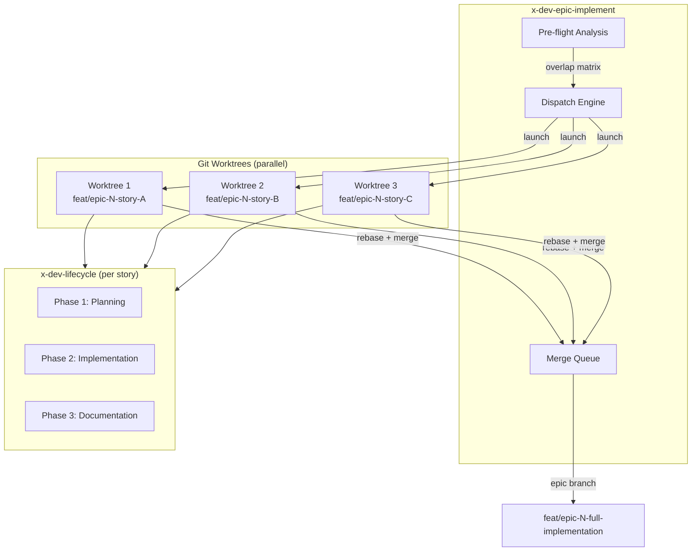
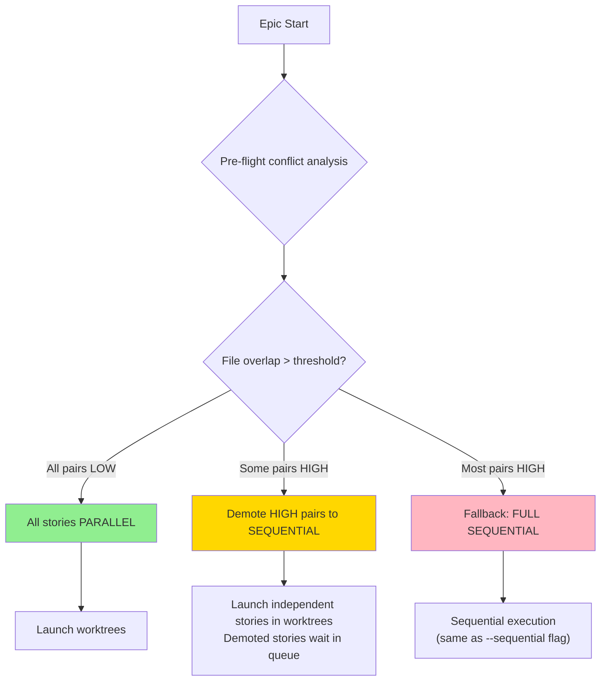
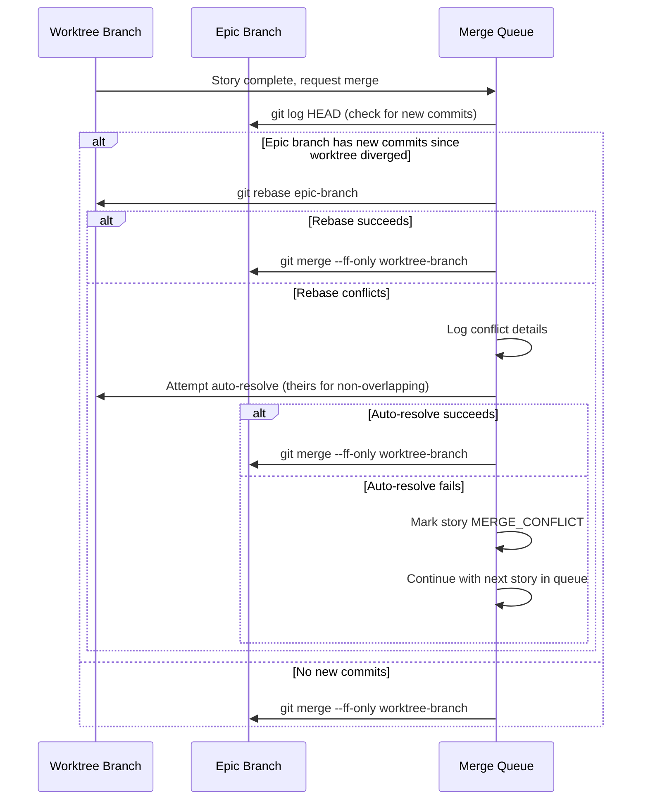

# Historia: Documentacao da estrategia de worktree e guia de resolucao de conflitos

**ID:** story-0010-0009

## 1. Dependencias

| Blocked By | Blocks |
| :--- | :--- |
| story-0010-0002, story-0010-0003, story-0010-0004, story-0010-0008 | — |

## 2. Regras Transversais Aplicaveis

| ID | Titulo |
| :--- | :--- |
| RULE-006 | Worktree Branch Isolation |
| RULE-009 | Backward Compatibility |
| RULE-010 | Pre-flight Before Parallel |

## 3. Descricao

Como **desenvolvedor do ia-dev-environment**, eu quero uma documentacao abrangente explicando a estrategia de worktree para execucao paralela de stories, garantindo que novos contribuidores compreendam o modelo de paralelismo, saibam quando usar `--sequential` vs o default paralelo, e consigam resolver conflitos de merge sem assistencia.

Com todas as melhorias de paralelismo deste epic (default paralelo via worktrees, pre-flight conflict analysis, rebase-before-merge, split por layer), o modelo de execucao tornou-se significativamente mais complexo. Sem documentacao adequada, desenvolvedores podem: (a) nao entender por que stories executam em worktrees separadas, (b) nao saber interpretar warnings de pre-flight conflict analysis, (c) nao conseguir resolver conflitos quando o rebase-before-merge falha, (d) forcar `--sequential` desnecessariamente por medo de conflitos.

Esta story cria um guia completo em `docs/guides/worktree-parallelism-strategy.md` que serve como referencia unica para todo o modelo de paralelismo implementado neste epic. O guia deve ser autossuficiente — um desenvolvedor que le apenas este documento deve entender o modelo completo sem precisar ler os SKILL.md internos.

### 3.1 Estrutura do Guia

O documento deve conter as seguintes secoes:

1. **Architecture Overview** — Diagrama do modelo de execucao paralela: orchestrator -> worktrees -> branches -> merge
2. **Decision Tree** — Quando paralelo e seguro vs quando usar `--sequential`
3. **Pre-flight Conflict Analysis** — Como a file-overlap matrix funciona, o que os warnings significam
4. **Merge Strategy** — Rebase-before-merge explicado com exemplos passo a passo
5. **Common Conflict Scenarios** — Top 5 cenarios e como resolver cada um
6. **Configuration Reference** — Flags, thresholds, environment variables
7. **Troubleshooting** — FAQ com problemas reais e solucoes

### 3.2 Audiencia e Tom

- Audiencia primaria: desenvolvedores usando `x-dev-epic-implement` e `x-dev-lifecycle`
- Tom: tecnico e direto, sem introducoes longas
- Exemplos concretos com comandos git reais e outputs esperados
- Diagramas mermaid para fluxos complexos

### 3.3 Validacao Cruzada com Skills

O guia deve ser consistente com as secoes modificadas nos skills deste epic:
- `x-dev-epic-implement/SKILL.md` — Phase 1 dispatch e Phase 2 consolidation
- `x-dev-lifecycle/SKILL.md` — Phase 2 split por layer
- Pre-flight conflict analysis (story-0010-0003)
- Rebase-before-merge strategy (story-0010-0004)

## 4. Definicoes de Qualidade Locais

### DoR Local

- [ ] Stories story-0010-0002, story-0010-0003, story-0010-0004 e story-0010-0008 concluidas e mergeadas
- [ ] Skill files modificados lidos para extrair detalhes tecnicos atualizados
- [ ] Cenarios de conflito reais documentados durante a execucao das stories anteriores
- [ ] Lista de flags e thresholds compilada a partir das stories do epic

### DoD Local

- [ ] Arquivo `docs/guides/worktree-parallelism-strategy.md` criado com todas as 7 secoes
- [ ] Diagramas mermaid renderizaveis e tecnicamente corretos
- [ ] Exemplos com comandos git reais e outputs esperados
- [ ] Decision tree cobre todos os cenarios: fully parallel, partially sequential, fully sequential
- [ ] Top 5 conflict scenarios documentados com resolucao passo a passo
- [ ] Configuration reference lista todas as flags introduzidas neste epic
- [ ] Guia e autossuficiente — nao requer leitura dos SKILL.md para compreensao
- [ ] Validacao cruzada: informacoes no guia sao consistentes com os SKILL.md modificados

### Global Definition of Done (DoD)

- **Consistencia:** Skills modificadas mantam frontmatter YAML valido
- **Backward Compatibility:** Flags existentes continuam funcionando
- **TDD Compliance:** Commits show test-first pattern
- **Double-Loop TDD:** Acceptance tests from Gherkin (outer loop), unit tests via TPP (inner loop)

## 5. Contratos de Dados (Data Contract)

### Estrutura do Documento

```
docs/guides/worktree-parallelism-strategy.md

# Worktree Parallelism Strategy

## 1. Architecture Overview
- Execution model diagram (mermaid)
- Component roles: orchestrator, worktrees, branches, merge queue
- Relationship between x-dev-epic-implement and x-dev-lifecycle

## 2. Decision Tree: Parallel vs Sequential
- Flowchart (mermaid)
- Criteria: file overlap, dependency graph, story count
- Examples: when to use --sequential

## 3. Pre-flight Conflict Analysis
- File-overlap matrix explained
- Threshold values and what they mean
- Warning levels: LOW, MEDIUM, HIGH overlap
- How demotion to sequential works

## 4. Merge Strategy: Rebase-Before-Merge
- Step-by-step with git commands
- When rebase is automatic vs manual
- Conflict detection during rebase
- Fallback: manual merge

## 5. Common Conflict Scenarios
### 5.1 Shared Configuration File
### 5.2 Same Domain Entity Modified
### 5.3 Port Interface Change
### 5.4 Test Fixture Collision
### 5.5 Migration File Ordering

## 6. Configuration Reference
| Flag | Default | Description |
| --sequential | (not set, parallel is default) | Opt-out: forces sequential execution |
| --layer | (all layers) | Restricts implementation to a specific layer |

## 7. Troubleshooting
### Q: Stories keep getting demoted to sequential
### Q: Rebase fails with "cannot apply" error
### Q: Coverage drops after parallel merge
### Q: Pre-flight shows HIGH overlap but stories are independent
```

### Flags e Thresholds Esperados

| Flag/Config | Origem (Story) | Descricao |
| :--- | :--- | :--- |
| Paralelo por default (sem flag) | story-0010-0002 | Execucao paralela via worktrees e o comportamento default; `--parallel` removida (aceita como alias legado ignorado) |
| `--sequential` | story-0010-0002 | Forca execucao sequencial (opt-out do paralelismo default do orchestrator) |
| `--layer` | story-0010-0008 | Restringe implementacao a uma layer especifica (domain, outbound, application, inbound) |

## 6. Diagramas

### 6.1 Modelo de Execucao Paralela (Overview)



### 6.2 Decision Tree



### 6.3 Rebase-Before-Merge Flow



## 7. Criterios de Aceite (Gherkin)

```gherkin
Cenario: Guia criado com estrutura vazia nao e aceito
  DADO que o arquivo "docs/guides/worktree-parallelism-strategy.md" foi criado
  MAS contem apenas headings sem conteudo (secoes vazias)
  QUANDO a validacao de completude e executada
  ENTAO a validacao deve falhar
  E o erro deve indicar "Sections 1-7 must contain substantive content"

Cenario: Guia contem todas as 7 secoes obrigatorias
  DADO que o arquivo "docs/guides/worktree-parallelism-strategy.md" foi criado
  QUANDO os headings de nivel 2 sao extraidos do documento
  ENTAO devem existir exatamente 7 secoes de nivel 2
  E as secoes devem ser: "Architecture Overview", "Decision Tree", "Pre-flight Conflict Analysis", "Merge Strategy", "Common Conflict Scenarios", "Configuration Reference", "Troubleshooting"

Cenario: Configuration reference lista todas as flags do epic
  DADO que o guia contem a secao "Configuration Reference"
  QUANDO a tabela de flags e extraida
  ENTAO deve documentar que paralelo e o default (sem flag, comportamento automatico apos story-0010-0002)
  E deve conter a flag "--sequential" como opt-out (origem: story-0010-0002)
  E deve documentar "--parallel" apenas como alias legado ignorado (se mencionado)
  E deve conter a flag "--layer" com valores "domain|outbound|application|inbound" (origem: story-0010-0008)

Cenario: Diagramas mermaid sao sintaticamente validos
  DADO que o guia contem blocos de codigo com linguagem "mermaid"
  QUANDO cada bloco mermaid e parseado
  ENTAO todos os blocos devem ser sintaticamente validos
  E nenhum bloco deve conter erros de sintaxe mermaid

Cenario: Common Conflict Scenarios contem pelo menos 5 cenarios
  DADO que o guia contem a secao "Common Conflict Scenarios"
  QUANDO as subsecoes de nivel 3 sao contadas
  ENTAO devem existir pelo menos 5 cenarios documentados
  E cada cenario deve conter: descricao do problema, causa raiz, e resolucao passo a passo

Cenario: Guia e consistente com skills modificados no epic
  DADO que o guia documenta que execucao paralela e o default (sem flag explicita)
  E o skill "x-dev-epic-implement/SKILL.md" define paralelo como default apos story-0010-0002 (com "--sequential" como opt-out)
  QUANDO as informacoes sao comparadas
  ENTAO o guia deve refletir exatamente o comportamento descrito no skill
  E nenhuma informacao no guia deve contradizer os SKILL.md

Cenario: Troubleshooting contem pelo menos 4 perguntas com resolucao
  DADO que o guia contem a secao "Troubleshooting"
  QUANDO as subsecoes de FAQ sao contadas
  ENTAO devem existir pelo menos 4 perguntas
  E cada pergunta deve conter uma resposta com comandos ou acoes concretas
```

### 7.1 Scenario Ordering (TPP)

> TPP: degenerate (estrutura vazia recusada) -> constante (7 secoes presentes) -> condicional (flags listadas) -> integridade (mermaid valido) -> colecao (5+ conflict scenarios) -> integracao (consistencia com skills) -> boundary (4+ troubleshooting items).

### 7.2 Mandatory Scenario Categories

- [x] Degenerate cases (guia com secoes vazias recusado)
- [x] Happy path (7 secoes completas, flags corretas, mermaid valido)
- [x] Error paths (inconsistencia com skills detectada)
- [x] Boundary values (minimo 5 conflict scenarios, minimo 4 troubleshooting)

## 8. Sub-tarefas

- [ ] [Dev] Criar arquivo `docs/guides/worktree-parallelism-strategy.md` com esqueleto das 7 secoes
- [ ] [Dev] Escrever secao 1 — Architecture Overview com diagrama mermaid do modelo de execucao
- [ ] [Dev] Escrever secao 2 — Decision Tree com flowchart mermaid (parallel vs sequential)
- [ ] [Dev] Escrever secao 3 — Pre-flight Conflict Analysis (file-overlap matrix, thresholds, warnings)
- [ ] [Dev] Escrever secao 4 — Merge Strategy (rebase-before-merge passo a passo com comandos git)
- [ ] [Dev] Escrever secao 5 — Common Conflict Scenarios (5 cenarios com causa e resolucao)
- [ ] [Dev] Escrever secao 6 — Configuration Reference (tabela de flags com defaults e origens)
- [ ] [Dev] Escrever secao 7 — Troubleshooting (4+ FAQs com resolucoes concretas)
- [ ] [Test] Validar que todos os diagramas mermaid sao sintaticamente validos
- [ ] [Test] Validar consistencia cruzada com skills modificados (flags, defaults, comportamentos)
- [ ] [Test] Validar que o guia e autossuficiente (revisao por pessoa que nao leu os SKILL.md)
- [ ] [Doc] Adicionar link para o guia no EPIC-0010.md na secao de referencias
