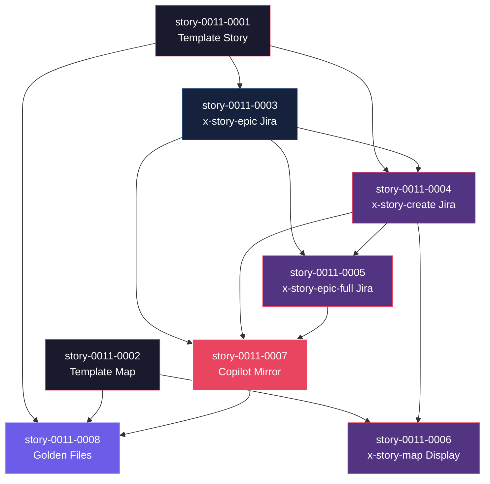

# Mapa de Implementação — Integração Jira para Geração de Épicos e Histórias

**Gerado a partir das dependências BlockedBy/Blocks de cada história do epic-0011.**

---

## 1. Matriz de Dependências

| Story | Título | Blocked By | Blocks | Status | Chave Jira |
| :--- | :--- | :--- | :--- | :--- | :--- |
| story-0011-0001 | Adicionar campo Chave Jira ao template de história | — | story-0011-0003, story-0011-0004, story-0011-0008 | Pendente | — |
| story-0011-0002 | Adicionar coluna Chave Jira ao template de implementation map | — | story-0011-0006, story-0011-0008 | Pendente | — |
| story-0011-0003 | Implementar integração Jira no skill x-story-epic | story-0011-0001 | story-0011-0004, story-0011-0005, story-0011-0007 | Pendente | — |
| story-0011-0004 | Implementar integração Jira no skill x-story-create | story-0011-0001, story-0011-0003 | story-0011-0005, story-0011-0006, story-0011-0007 | Pendente | — |
| story-0011-0005 | Implementar orquestração Jira no skill x-story-epic-full | story-0011-0003, story-0011-0004 | story-0011-0007 | Pendente | — |
| story-0011-0006 | Implementar exibição de Jira keys no skill x-story-map | story-0011-0002, story-0011-0004 | story-0011-0007 | Pendente | — |
| story-0011-0007 | Atualizar GitHub Copilot skill counterparts | story-0011-0003, story-0011-0004, story-0011-0005 | story-0011-0008 | Pendente | — |
| story-0011-0008 | Atualizar golden files e testes de integração | story-0011-0001, story-0011-0002, story-0011-0007 | — | Pendente | — |

> **Nota:** story-0011-0006 tem dependência implícita de story-0011-0004 porque precisa que as stories geradas tenham o campo `Chave Jira` preenchido para exibir na matrix.

---

## 2. Fases de Implementação

```
╔══════════════════════════════════════════════════════════════════════════╗
║                   FASE 0 — Fundação Templates (paralelo: 2)            ║
║                                                                        ║
║   ┌──────────────────┐              ┌──────────────────┐               ║
║   │  story-0011-0001 │              │  story-0011-0002 │               ║
║   │  Template Story  │              │  Template Map    │               ║
║   └────────┬─────────┘              └────────┬─────────┘               ║
╚════════════╪═════════════════════════════════╪═════════════════════════╝
             │                                 │
             ▼                                 │
╔══════════════════════════════════════════════════════════════════════════╗
║                   FASE 1 — Core Pattern (paralelo: 1)                  ║
║                                                                        ║
║   ┌──────────────────────────────────────────────┐                     ║
║   │  story-0011-0003                             │                     ║
║   │  Integração Jira no x-story-epic             │                     ║
║   │  (← story-0011-0001)                         │                     ║
║   └────────────────────┬─────────────────────────┘                     ║
╚════════════════════════╪═══════════════════════════════════════════════╝
                         │
                         ▼
╔══════════════════════════════════════════════════════════════════════════╗
║                   FASE 2 — Extensions (paralelo: 3)                    ║
║                                                                        ║
║   ┌──────────────────┐  ┌──────────────────┐  ┌──────────────────┐    ║
║   │  story-0011-0004 │  │  story-0011-0005 │  │  story-0011-0006 │    ║
║   │  x-story-create  │  │  x-story-full    │  │  x-story-map     │    ║
║   └────────┬─────────┘  └────────┬─────────┘  └────────┬─────────┘    ║
╚════════════╪═════════════════════╪═════════════════════╪══════════════╝
             │                     │                     │
             ▼                     ▼                     ▼
╔══════════════════════════════════════════════════════════════════════════╗
║                   FASE 3 — Copilot Mirror (paralelo: 1)                ║
║                                                                        ║
║   ┌──────────────────────────────────────────────┐                     ║
║   │  story-0011-0007                             │                     ║
║   │  GitHub Copilot counterparts                 │                     ║
║   │  (← 0003, 0004, 0005)                       │                     ║
║   └────────────────────┬─────────────────────────┘                     ║
╚════════════════════════╪═══════════════════════════════════════════════╝
                         │
                         ▼
╔══════════════════════════════════════════════════════════════════════════╗
║                   FASE 4 — Cross-Cutting (paralelo: 1)                 ║
║                                                                        ║
║   ┌──────────────────────────────────────────────┐                     ║
║   │  story-0011-0008                             │                     ║
║   │  Golden files e testes                       │                     ║
║   │  (← 0001, 0002, 0007)                       │                     ║
║   └──────────────────────────────────────────────┘                     ║
╚══════════════════════════════════════════════════════════════════════════╝
```

---

## 3. Caminho Crítico

```
story-0011-0001 → story-0011-0003 → story-0011-0004 → story-0011-0005 → story-0011-0007 → story-0011-0008
     Fase 0            Fase 1            Fase 2            Fase 2            Fase 3            Fase 4
```

**5 fases no caminho crítico, 6 histórias na cadeia mais longa (0001 → 0003 → 0004 → 0005 → 0007 → 0008).**

Qualquer atraso em story-0011-0003 (core pattern) propaga diretamente para todas as fases subsequentes. Este é o investimento mais importante do épico.

---

## 4. Grafo de Dependências (Mermaid)



---

## 5. Resumo por Fase

| Fase | Histórias | Camada | Paralelismo | Pré-requisito |
| :--- | :--- | :--- | :--- | :--- |
| 0 | story-0011-0001, story-0011-0002 | Foundation (templates) | 2 paralelas | — |
| 1 | story-0011-0003 | Core Domain (pattern establishment) | 1 | Fase 0 concluída |
| 2 | story-0011-0004, story-0011-0005, story-0011-0006 | Extensions | 3 paralelas | Fase 1 concluída |
| 3 | story-0011-0007 | Composition (Copilot mirror) | 1 | Fase 2 concluída |
| 4 | story-0011-0008 | Cross-Cutting (testes) | 1 | Fase 3 concluída |

**Total: 8 histórias em 5 fases.**

> **Nota:** story-0011-0005 e story-0011-0006 na Fase 2 dependem de story-0011-0004, que também é Fase 2 mas precisa concluir antes. Na prática, story-0011-0004 inicia primeiro na Fase 2, e 0005/0006 podem iniciar assim que 0004 finalizar. Para simplificação, mantemos todos na Fase 2 com a restrição intra-fase documentada.

---

## 6. Detalhamento por Fase

### Fase 0 — Fundação Templates

| Story | Escopo Principal | Artefatos Chave |
| :--- | :--- | :--- |
| story-0011-0001 | Campo `Chave Jira` no template de história | `_TEMPLATE-STORY.md` atualizado |
| story-0011-0002 | Coluna `Chave Jira` no template de implementation map | `_TEMPLATE-IMPLEMENTATION-MAP.md` atualizado |

**Entregas da Fase 0:**

- Template de história com campo `**Chave Jira:** <CHAVE-JIRA>` após o ID
- Template de implementation map com coluna `Chave Jira` na matriz de dependências
- Base para todos os skills referenciarem o novo campo

### Fase 1 — Core Pattern

| Story | Escopo Principal | Artefatos Chave |
| :--- | :--- | :--- |
| story-0011-0003 | Integração Jira no skill x-story-epic | `x-story-epic/SKILL.md` com Step 5.5 |

**Entregas da Fase 1:**

- Step 5.5 completo com: MCP check, AskUserQuestion, Jira MCP call, placeholder replacement, error handling
- Pattern de integração Jira estabelecido e reutilizável pelas extensões
- Dual-mode (standalone + cascaded) definido

### Fase 2 — Extensions

| Story | Escopo Principal | Artefatos Chave |
| :--- | :--- | :--- |
| story-0011-0004 | Integração Jira por story no x-story-create | `x-story-create/SKILL.md` com Step 2.X |
| story-0011-0005 | Orquestração Jira no x-story-epic-full | `x-story-epic-full/SKILL.md` com Phase A.5 |
| story-0011-0006 | Exibição de Jira keys no x-story-map | `x-story-map/SKILL.md` com leitura de Chave Jira |

**Entregas da Fase 2:**

- Step 2.X com Mode A (cascaded) e Mode B (standalone) + dependency linking
- Phase A.5 (decisão Jira), Phase D.5 (linking), Phase E report atualizado
- Matrix e Mermaid graph com Jira keys visíveis

### Fase 3 — Copilot Mirror

| Story | Escopo Principal | Artefatos Chave |
| :--- | :--- | :--- |
| story-0011-0007 | GitHub Copilot counterparts | 4 arquivos em `github-skills-templates/story/` |

**Entregas da Fase 3:**

- x-story-epic-full.md, x-story-epic.md, x-story-create.md, x-story-map.md atualizados
- Paridade funcional entre Claude Code e GitHub Copilot skills

### Fase 4 — Cross-Cutting

| Story | Escopo Principal | Artefatos Chave |
| :--- | :--- | :--- |
| story-0011-0008 | Golden files e testes | Golden files + test updates |

**Entregas da Fase 4:**

- Golden files atualizados para refletir novos campos nos templates
- Todos os testes passando
- Coverage ≥ 95% line / ≥ 90% branch mantida

---

## 7. Observações Estratégicas

### Gargalo Principal

**story-0011-0003** (Integração Jira no x-story-epic) bloqueia 3 stories downstream (0004, 0005, 0007) e estabelece o pattern de integração que todas as extensões reutilizam. Investir tempo extra no design do Step 5.5 — especialmente no dual-mode (standalone vs cascaded) e no error handling — evita refatoração em cascata.

### Histórias Folha (sem dependentes)

**story-0011-0008** (Golden files e testes) é a única história folha. Pode absorver atrasos sem impacto no caminho crítico. Ideal para execução paralela por um desenvolvedor focado em qualidade.

### Otimização de Tempo

- **Máximo paralelismo na Fase 0**: 2 stories de template independentes podem iniciar imediatamente
- **Fase 2 é o ponto de maior paralelismo**: 3 stories (0004, 0005, 0006) mas com dependência intra-fase em 0004 → considerar iniciar 0004 primeiro
- **Fase 3 e 4 são sequenciais**: não há como acelerar — são convergências naturais

### Dependências Cruzadas

story-0011-0007 (Copilot) é o principal ponto de convergência: depende de 0003, 0004, e 0005, que vêm de ramos diferentes (core e extensions). Atraso em qualquer um dos três propaga para 0007 e 0008.

story-0011-0008 (testes) converge 0001, 0002 (templates) e 0007 (Copilot), integrando mudanças de todas as fases anteriores.

### Marco de Validação Arquitetural

**story-0011-0003** (Fase 1) serve como checkpoint de validação. Após sua conclusão, o pattern de integração Jira está estabelecido e testado. Se o design do Step 5.5 funcionar corretamente (MCP check silencioso, AskUserQuestion, error handling não-bloqueante), a expansão para x-story-create e x-story-epic-full é mecânica.
