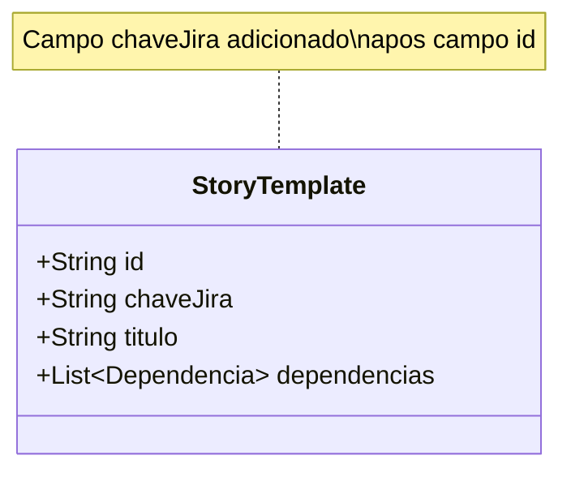

# Historia: Adicionar campo Chave Jira ao template de historia

**ID:** story-0011-0001
**Chave Jira:** —

## 1. Dependencias
| Blocked By | Blocks |
| :--- | :--- |
| — | story-0011-0003, story-0011-0004, story-0011-0008 |

## 2. Regras Transversais Aplicaveis
| ID | Titulo |
| :--- | :--- |
| RULE-005 | Quality Gates |

## 3. Descricao

Como **engenheiro de plataforma**, eu quero que o template padrao de historia (`_TEMPLATE-STORY.md`) inclua um campo `**Chave Jira:** <CHAVE-JIRA>` logo apos o campo `**ID:**`, para que todas as historias geradas a partir do template ja possuam o campo preparado para receber a chave de integracao com o Jira.

### Contexto

O template de historia atual (`java/src/main/resources/templates/_TEMPLATE-STORY.md`) nao possui campo para associacao com issues do Jira. Este campo e pre-requisito para todas as stories de integracao Jira subsequentes, pois define o contrato de dados no nivel do template.

### Escopo

- Adicionar o campo `**Chave Jira:** <CHAVE-JIRA>` ao template `_TEMPLATE-STORY.md` imediatamente apos o campo `**ID:**`
- O valor padrao deve ser o placeholder `<CHAVE-JIRA>` quando Jira nao estiver habilitado, ou `—` (em-dash) para indicar ausencia explicita
- Atualizar os golden files correspondentes ao template modificado
- Garantir que o parser existente de stories reconheca o novo campo

## 4. Definicoes de Qualidade Locais

### DoR Local
- [ ] Template `_TEMPLATE-STORY.md` atual localizado e revisado
- [ ] Formato da chave Jira definido (padrao: `PROJ-123`)
- [ ] Golden files do template identificados

### DoD Local
- [ ] Campo `**Chave Jira:**` presente no template apos o campo `**ID:**`
- [ ] Placeholder `<CHAVE-JIRA>` usado como valor padrao
- [ ] Golden files atualizados e passando
- [ ] Parser de stories reconhece o campo sem erros
- [ ] Nenhuma regressao nos testes existentes

### Global DoD
- [ ] Cobertura de linhas >= 95%
- [ ] Cobertura de branches >= 90%
- [ ] Zero warnings do compilador/linter
- [ ] Testes seguem padrao test-first (TDD)
- [ ] Commits atomicos com Conventional Commits

## 5. Contratos de Dados

| Campo | Tipo | Obrigatorio | Descricao |
| :--- | :--- | :--- | :--- |
| `Chave Jira` | String | Sim | Chave de issue do Jira (ex: `PROJ-123`) ou `—` quando Jira nao habilitado |

### Formato da Chave Jira
- Regex de validacao: `^[A-Z][A-Z0-9]+-\d+$`
- Valores especiais aceitos: `—` (sem integracao), `<CHAVE-JIRA>` (placeholder do template)
- Exemplos validos: `PROJ-123`, `MY-TEAM-42`, `ABC-1`
- Exemplos invalidos: `proj-123`, `123-PROJ`, `PROJ_123`

## 6. Diagramas (Mermaid)




## 7. Criterios de Aceite (Gherkin)

```gherkin
Funcionalidade: Campo Chave Jira no template de historia

  Cenario: Template sem campo Chave Jira antes da modificacao
    DADO que o template "_TEMPLATE-STORY.md" existe na versao atual
    QUANDO eu inspeciono o conteudo do template
    ENTAO o campo "Chave Jira" NAO deve estar presente no template

  Cenario: Template com campo Chave Jira apos ID
    DADO que a modificacao foi aplicada ao template "_TEMPLATE-STORY.md"
    QUANDO eu inspeciono o conteudo do template
    ENTAO o campo "**Chave Jira:** <CHAVE-JIRA>" deve estar presente
    E o campo "Chave Jira" deve estar imediatamente apos o campo "**ID:**"
    E o valor padrao deve ser o placeholder "<CHAVE-JIRA>"

  Cenario: Campo Chave Jira com placeholder nao substituido deve ser detectavel
    DADO que uma historia foi gerada a partir do template
    E o campo "Chave Jira" ainda contem o placeholder "<CHAVE-JIRA>"
    QUANDO o validador de stories e executado
    ENTAO um aviso deve ser emitido indicando que o placeholder nao foi substituido
    E o aviso deve conter o ID da historia afetada

  Cenario: Campo com chave Jira no formato correto
    DADO que uma historia foi gerada a partir do template
    QUANDO o campo "Chave Jira" e preenchido com "PROJ-123"
    ENTAO o parser deve reconhecer o valor como uma chave Jira valida
    E o formato deve corresponder ao padrao "UPPERCASE-NUMBER"

  Cenario: Campo com chave Jira em formato invalido
    DADO que uma historia foi gerada a partir do template
    QUANDO o campo "Chave Jira" e preenchido com "proj-123"
    ENTAO o validador deve rejeitar o valor
    E uma mensagem de erro deve indicar o formato esperado "PROJ-123"

  Cenario: Campo com valor em-dash indicando ausencia de integracao
    DADO que uma historia foi gerada a partir do template
    QUANDO o campo "Chave Jira" e preenchido com "—"
    ENTAO o parser deve reconhecer o valor como ausencia explicita de chave Jira
    E nenhum aviso ou erro deve ser emitido
```

## 8. Sub-tarefas

- [ ] **[Dev]** Adicionar campo `**Chave Jira:** <CHAVE-JIRA>` ao template `_TEMPLATE-STORY.md` apos o campo `**ID:**`
- [ ] **[Dev]** Atualizar parser de stories para reconhecer o novo campo `Chave Jira`
- [ ] **[Dev]** Implementar validacao de formato da chave Jira (regex: `^[A-Z][A-Z0-9]+-\d+$`)
- [ ] **[Test]** Criar testes unitarios para o parser com o novo campo (degenerate, happy path, erro, boundary)
- [ ] **[Test]** Verificar e atualizar golden files do template modificado
- [ ] **[Test]** Validar que testes existentes nao apresentam regressao
- [ ] **[Doc]** Atualizar documentacao do template com descricao do novo campo
