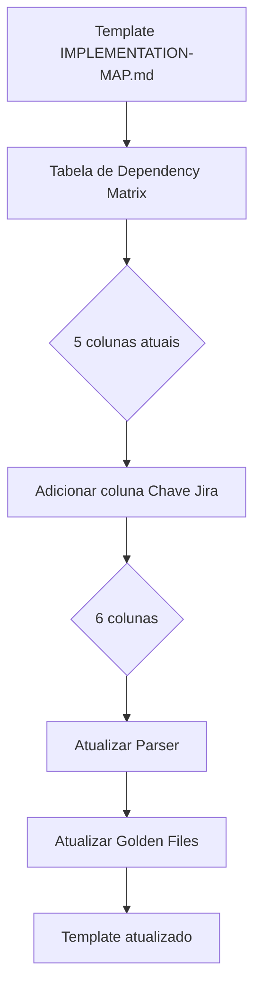
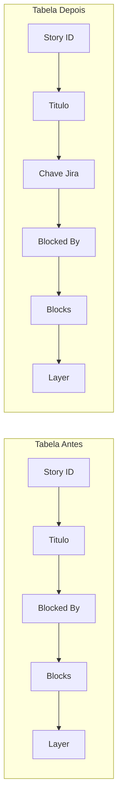

# História: Adicionar coluna Chave Jira ao template de implementation map

**ID:** story-0011-0002
**Chave Jira:** —

## 1. Dependências
| Blocked By | Blocks |
| :--- | :--- |
| — | story-0011-0006, story-0011-0008 |

## 2. Regras Transversais Aplicáveis
| ID | Título |
| :--- | :--- |
| RULE-005 | Quality Gates |

## 3. Descrição

Como **engenheiro de plataforma**, eu quero que o template de implementation map (`_TEMPLATE-IMPLEMENTATION-MAP.md`) inclua uma coluna `Chave Jira` na tabela de dependency matrix, para que o mapa de implementacao reflita a associação entre stories e issues do Jira.

### Contexto

O template de implementation map atual possui uma tabela de dependency matrix com 5 colunas. A nova coluna `Chave Jira` deve ser adicionada para suportar a rastreabilidade entre stories geradas e issues criadas no Jira. Esta modificação é pré-requisito para que o parser de implementation map processe chaves Jira durante a execução do epic.

### Escopo

- Adicionar coluna `Chave Jira` a tabela de dependency matrix no template `_TEMPLATE-IMPLEMENTATION-MAP.md`
- A coluna deve ser posicionada entre `Titulo` e `Blocked By`
- A tabela passa de 5 colunas para 6 colunas
- Atualizar golden files correspondentes
- Atualizar o parser `ImplementationMapParser` para reconhecer a nova coluna

## 4. Definições de Qualidade Locais

### DoR Local
- [ ] Template `_TEMPLATE-IMPLEMENTATION-MAP.md` atual localizado e revisado
- [ ] Estrutura atual da tabela de dependency matrix documentada (5 colunas)
- [ ] Parser `ImplementationMapParser` identificado e compreendido
- [ ] Golden files do template identificados

### DoD Local
- [ ] Coluna `Chave Jira` presente na tabela de dependency matrix
- [ ] Coluna posicionada entre `Titulo` e `Blocked By`
- [ ] Tabela com 6 colunas funcionando corretamente
- [ ] Parser atualizado para processar a nova coluna
- [ ] Golden files atualizados e passando
- [ ] Nenhuma regressão nos testes existentes

### Global DoD
- [ ] Cobertura de linhas >= 95%
- [ ] Cobertura de branches >= 90%
- [ ] Zero warnings do compilador/linter
- [ ] Testes seguem padrão test-first (TDD)
- [ ] Commits atomicos com Conventional Commits

## 5. Contratos de Dados

| Campo | Tipo | Obrigatório | Descrição |
| :--- | :--- | :--- | :--- |
| `Chave Jira` (coluna) | String | Sim | Chave Jira do story ou `—` quando sem integração |

### Estrutura da Tabela — Antes (5 colunas)

```markdown
| Story ID | Título | Blocked By | Blocks | Layer |
```

### Estrutura da Tabela — Depois (6 colunas)

```markdown
| Story ID | Título | Chave Jira | Blocked By | Blocks | Layer |
```

### Regras de Preenchimento
- Valor padrao: `—` (em-dash) quando Jira não habilitado
- Placeholder no template: `<CHAVE-JIRA>` para substituicao automatica
- Formato valido: `^[A-Z][A-Z0-9]+-\d+$` (ex: `PROJ-123`)

## 6. Diagramas (Mermaid)





## 7. Critérios de Aceite (Gherkin)

```gherkin
Funcionalidade: Coluna Chave Jira no template de implementation map

  Cenário: Template sem coluna Jira antes da modificação
    DADO que o template "_TEMPLATE-IMPLEMENTATION-MAP.md" existe na versão atual
    QUANDO eu inspeciono a tabela de dependency matrix
    ENTAO a tabela deve conter exatamente 5 colunas
    E a coluna "Chave Jira" NAO deve estar presente

  Cenário: Template com coluna Jira entre Titulo e Blocked By
    DADO que a modificação foi aplicada ao template "_TEMPLATE-IMPLEMENTATION-MAP.md"
    QUANDO eu inspeciono a tabela de dependency matrix
    ENTAO a tabela deve conter exatamente 6 colunas
    E a coluna "Chave Jira" deve estar posicionada após "Titulo"
    E a coluna "Chave Jira" deve estar posicionada antes de "Blocked By"

  Cenário: Coluna com placeholder não substituído
    DADO que um implementation map foi gerado a partir do template
    E a coluna "Chave Jira" contem o placeholder "<CHAVE-JIRA>" em uma ou mais linhas
    QUANDO o validador de implementation map e executado
    ENTAO um aviso deve ser emitido para cada linha com placeholder não substituído
    E o aviso deve conter o Story ID da linha afetada

  Cenário: Map com mix de stories com e sem Jira keys
    DADO que um implementation map foi gerado com 5 stories
    E os stories 1, 3 e 5 possuem chaves Jira validas ("PROJ-101", "PROJ-103", "PROJ-105")
    E os stories 2 e 4 possuem o valor "—" na coluna Chave Jira
    QUANDO o parser de implementation map processa a tabela
    ENTAO os 5 stories devem ser parseados corretamente
    E os stories 1, 3 e 5 devem ter suas chaves Jira associadas
    E os stories 2 e 4 devem ter chave Jira como ausente

  Cenário: Parser processa tabela com 6 colunas sem regressão
    DADO que o parser de implementation map foi atualizado
    QUANDO eu processo um implementation map com a tabela de 6 colunas
    ENTAO todos os campos devem ser extraidos corretamente
    E o campo "Chave Jira" deve estar disponível no modelo parseado
    E os campos existentes (Story ID, Titulo, Blocked By, Blocks, Layer) devem manter seus valores

  Cenário: Backward compatibility com tabelas de 5 colunas
    DADO que o parser de implementation map foi atualizado
    QUANDO eu processo um implementation map legado com tabela de 5 colunas
    ENTAO o parser deve processar a tabela sem erros
    E o campo "Chave Jira" deve ser tratado como ausente para todas as linhas
```

## 8. Sub-tarefas

- [ ] **[Dev]** Adicionar coluna `Chave Jira` a tabela de dependency matrix no template `_TEMPLATE-IMPLEMENTATION-MAP.md`
- [ ] **[Dev]** Posicionar a coluna entre `Titulo` e `Blocked By`
- [ ] **[Dev]** Atualizar `ImplementationMapParser` para reconhecer e processar a 6a coluna
- [ ] **[Dev]** Implementar backward compatibility no parser para tabelas legadas de 5 colunas
- [ ] **[Test]** Criar testes unitarios para o parser com tabela de 6 colunas
- [ ] **[Test]** Criar teste de regressão para tabelas de 5 colunas (backward compatibility)
- [ ] **[Test]** Verificar e atualizar golden files do template modificado
- [ ] **[Test]** Validar mix de stories com e sem chaves Jira na mesma tabela
- [ ] **[Doc]** Atualizar documentacao do template de implementation map
