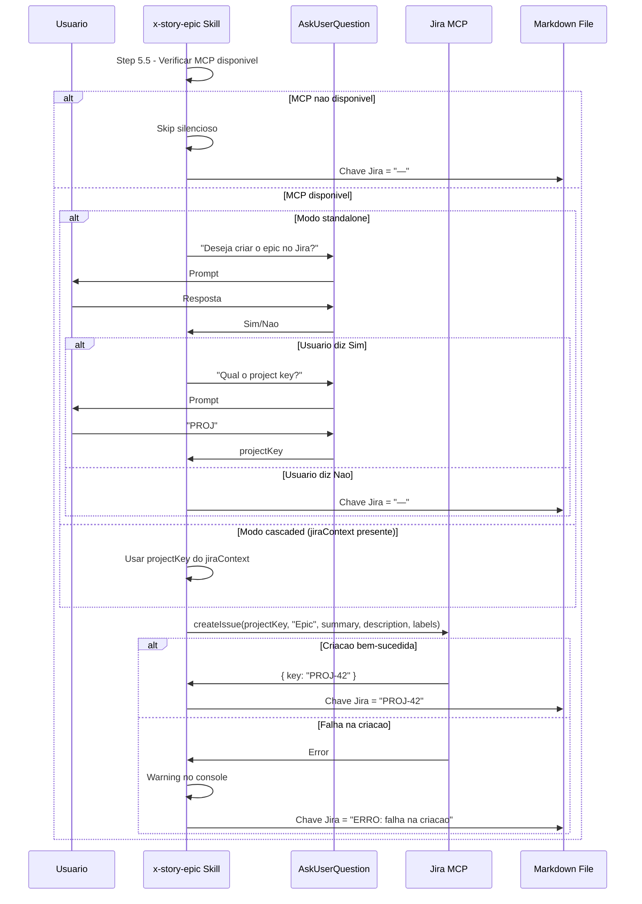
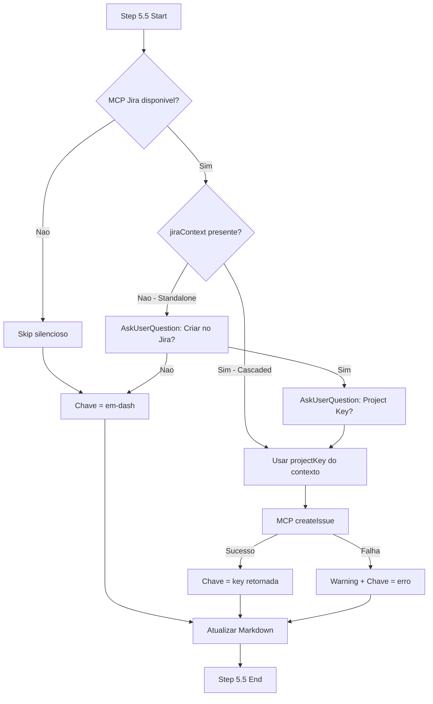

# Historia: Implementar integracao Jira no skill x-story-epic

**ID:** story-0011-0003
**Chave Jira:** —

## 1. Dependencias
| Blocked By | Blocks |
| :--- | :--- |
| story-0011-0001 | story-0011-0004, story-0011-0005, story-0011-0007 |

## 2. Regras Transversais Aplicaveis
| ID | Titulo |
| :--- | :--- |
| RULE-001 | Project Identity |
| RULE-002 | Domain |
| RULE-004 | Architecture Summary |
| RULE-005 | Quality Gates |
| RULE-006 | Security Baseline |

## 3. Descricao

Como **engenheiro de plataforma**, eu quero que o skill `x-story-epic` possua um Step 5.5 (Optional Jira Integration) que verifique a disponibilidade do MCP Jira, pergunte ao usuario se deseja criar o epic no Jira, execute a criacao via MCP, capture a chave retornada e atualize o markdown gerado, para que epics criados pelo skill possam ser automaticamente sincronizados com o Jira.

### Contexto

O skill `x-story-epic` (`java/src/main/resources/skills-templates/core/x-story-epic/SKILL.md`) gera epics com stories associadas em formato markdown. Atualmente, nao existe integracao com ferramentas de gestao de projetos. Este step adicional deve ser completamente opcional e funcionar em dois modos:

- **Modo standalone:** O skill e invocado diretamente pelo usuario. O Step 5.5 deve perguntar ao usuario via `AskUserQuestion` se deseja criar o epic no Jira.
- **Modo cascaded:** O skill e invocado por um orchestrator (ex: `x-story-epic-full`) que passa um `jiraContext`. Neste caso, o prompt ao usuario deve ser pulado e a decisao deve vir do contexto.

### Escopo

- Adicionar Step 5.5 ao skill `x-story-epic/SKILL.md`
- Verificar disponibilidade do MCP Jira via tool listing
- Implementar prompt condicional ao usuario (standalone vs cascaded)
- Chamar MCP para criacao do epic com os campos definidos no contrato
- Capturar chave retornada e atualizar o campo `**Chave Jira:**` no markdown do epic
- Tratar falhas de MCP com graceful degradation (warning + chave com mensagem de erro)

## 4. Definicoes de Qualidade Locais

### DoR Local
- [ ] Skill `x-story-epic/SKILL.md` atual revisado e compreendido
- [ ] MCP Jira disponivel para testes (ou mock adequado)
- [ ] Contrato de dados da API Jira para criacao de Epic definido
- [ ] story-0011-0001 concluida (campo Chave Jira no template)

### DoD Local
- [ ] Step 5.5 implementado no skill com logica condicional (standalone vs cascaded)
- [ ] MCP verification implementada (check de disponibilidade)
- [ ] Criacao de epic via MCP funcional com todos os campos do contrato
- [ ] Chave Jira preenchida no markdown apos criacao bem-sucedida
- [ ] Graceful degradation em caso de falha do MCP
- [ ] Modo cascaded funciona sem prompt ao usuario
- [ ] Testes cobrindo todos os cenarios do Gherkin

### Global DoD
- [ ] Cobertura de linhas >= 95%
- [ ] Cobertura de branches >= 90%
- [ ] Zero warnings do compilador/linter
- [ ] Testes seguem padrao test-first (TDD)
- [ ] Commits atomicos com Conventional Commits

## 5. Contratos de Dados

### Jira Issue Creation — Request

| Campo | Tipo | Request | Response | Origem / Regra |
| :--- | :--- | :--- | :--- | :--- |
| `projectKey` | String | M | - | User input via AskUserQuestion (standalone) ou jiraContext (cascaded) |
| `issueType` | String | M | - | Hardcoded: `"Epic"` |
| `summary` | String | M | - | Titulo do epic extraido do header markdown |
| `description` | String | M | - | Texto da secao "Visao Geral" do epic |
| `labels` | String[] | M | - | `["generated-by-ia-dev-env"]` |

### Jira Issue Creation — Response

| Campo | Tipo | Request | Response | Origem / Regra |
| :--- | :--- | :--- | :--- | :--- |
| `key` | String | - | M | Chave da issue Jira criada (ex: `PROJ-42`) |

### jiraContext (modo cascaded)

| Campo | Tipo | Obrigatorio | Descricao |
| :--- | :--- | :--- | :--- |
| `enabled` | boolean | Sim | Se integracao Jira esta habilitada |
| `projectKey` | String | Sim (se enabled) | Chave do projeto Jira |
| `cascadeToStories` | boolean | Nao | Se deve propagar criacao para stories |
| `epicIssueKey` | String | Nao | Chave do epic (preenchida apos criacao) |

## 6. Diagramas (Mermaid)





## 7. Criterios de Aceite (Gherkin)

```gherkin
Funcionalidade: Integracao Jira no skill x-story-epic

  Cenario: MCP nao disponivel resulta em skip silencioso
    DADO que o skill x-story-epic esta sendo executado
    E o MCP Jira NAO esta disponivel no ambiente
    QUANDO o Step 5.5 (Optional Jira Integration) e alcancado
    ENTAO o step deve ser ignorado silenciosamente sem erro
    E o campo "Chave Jira" no markdown do epic deve ser preenchido com "—"
    E nenhuma mensagem de erro deve ser exibida ao usuario

  Cenario: Usuario diz Sim e epic e criado no Jira com chave preenchida no markdown
    DADO que o skill x-story-epic esta sendo executado em modo standalone
    E o MCP Jira esta disponivel no ambiente
    E o epic gerado possui titulo "Epic de Pagamentos" e descricao na secao Visao Geral
    QUANDO o Step 5.5 pergunta ao usuario se deseja criar o epic no Jira
    E o usuario responde "Sim"
    E o usuario informa o project key "PAY"
    ENTAO o MCP deve ser chamado com issueType "Epic", summary "Epic de Pagamentos" e labels ["generated-by-ia-dev-env"]
    E a chave retornada "PAY-42" deve ser preenchida no campo "Chave Jira" do markdown
    E uma mensagem de confirmacao deve ser exibida ao usuario

  Cenario: Usuario diz Nao e apenas markdown e gerado sem chave Jira
    DADO que o skill x-story-epic esta sendo executado em modo standalone
    E o MCP Jira esta disponivel no ambiente
    QUANDO o Step 5.5 pergunta ao usuario se deseja criar o epic no Jira
    E o usuario responde "Nao"
    ENTAO o MCP NAO deve ser chamado
    E o campo "Chave Jira" no markdown do epic deve ser preenchido com "—"

  Cenario: MCP falha ao criar epic resulta em warning e chave com mensagem de erro
    DADO que o skill x-story-epic esta sendo executado
    E o MCP Jira esta disponivel no ambiente
    E o usuario autorizou a criacao do epic no Jira
    QUANDO o MCP e chamado para criar o epic
    E a chamada falha com erro "Project not found"
    ENTAO um warning deve ser exibido ao usuario com a mensagem de erro
    E o campo "Chave Jira" no markdown deve conter uma indicacao de falha
    E a execucao do skill deve continuar normalmente sem interromper o fluxo

  Cenario: Invocacao cascaded com jiraContext presente pula prompt ao usuario
    DADO que o skill x-story-epic esta sendo executado em modo cascaded
    E o jiraContext esta presente com enabled=true e projectKey="TEAM"
    E o MCP Jira esta disponivel no ambiente
    QUANDO o Step 5.5 e alcancado
    ENTAO o skill NAO deve perguntar ao usuario se deseja criar o epic no Jira
    E o skill NAO deve perguntar o project key
    E o MCP deve ser chamado automaticamente com projectKey "TEAM"
    E a chave retornada deve ser preenchida no markdown e armazenada no jiraContext.epicIssueKey
```

## 8. Sub-tarefas

- [ ] **[Dev]** Adicionar Step 5.5 ao skill `x-story-epic/SKILL.md` com logica de verificacao de MCP
- [ ] **[Dev]** Implementar deteccao de disponibilidade do MCP Jira via tool listing
- [ ] **[Dev]** Implementar fluxo standalone com `AskUserQuestion` para confirmacao e project key
- [ ] **[Dev]** Implementar fluxo cascaded que utiliza `jiraContext` sem prompt ao usuario
- [ ] **[Dev]** Integrar chamada MCP `createIssue` com os campos do contrato de dados
- [ ] **[Dev]** Implementar graceful degradation: warning + fallback em caso de falha do MCP
- [ ] **[Dev]** Atualizar campo `**Chave Jira:**` no markdown gerado com a chave retornada
- [ ] **[Test]** Criar testes para cenario MCP indisponivel (skip silencioso)
- [ ] **[Test]** Criar testes para modo standalone (Sim/Nao)
- [ ] **[Test]** Criar testes para modo cascaded (jiraContext)
- [ ] **[Test]** Criar testes para falha do MCP (graceful degradation)
- [ ] **[Test]** Validar que o campo Chave Jira e atualizado corretamente no markdown
- [ ] **[Doc]** Documentar o Step 5.5 e seus modos de operacao
