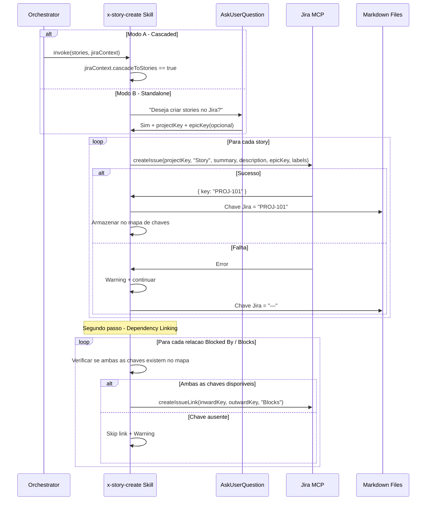
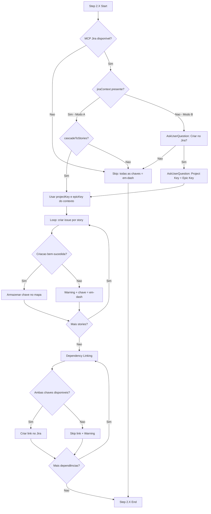

# História: Implementar integração Jira no skill x-story-create

**ID:** story-0011-0004
**Chave Jira:** —

## 1. Dependências
| Blocked By | Blocks |
| :--- | :--- |
| story-0011-0001, story-0011-0003 | story-0011-0005, story-0011-0006, story-0011-0007 |

## 2. Regras Transversais Aplicáveis
| ID | Título |
| :--- | :--- |
| RULE-001 | Project Identity |
| RULE-002 | Domain |
| RULE-003 | Coding Standards |
| RULE-004 | Architecture Summary |
| RULE-005 | Quality Gates |
| RULE-006 | Security Baseline |
| RULE-007 | TDD Compliance |

## 3. Descrição

Como **engenheiro de plataforma**, eu quero que o skill `x-story-create` possua um Step 2.X (Optional Jira Integration per story) que crie issues do tipo Story no Jira para cada história gerada, linkando-as ao epic pai quando disponível e sincronizando dependências entre stories, para que a criação de stories pelo skill seja automaticamente refletida no Jira.

### Contexto

O skill `x-story-create` (`java/src/main/resources/skills-templates/core/x-story-create/SKILL.md`) gera stories individuais em formato markdown. Com a integração Jira, cada story criada pode opcionalmente ter uma issue correspondente no Jira. O skill deve suportar dois modos de operacao:

- **Modo A (cascaded):** Invocado por um orchestrator (ex: `x-story-epic-full`) que passa um `jiraContext` com `cascadeToStories=true`. Neste modo, todas as stories sao criadas no Jira automaticamente sem prompt ao usuario. O `epicIssueKey` do contexto e usado para linkar stories ao epic pai.
- **Modo B (standalone):** Invocado diretamente pelo usuario. O skill pergunta se deseja integrar com Jira, solicita project key e opcionalmente o epic key pai.

Apos a criação de todas as stories, um segundo passo (dependency linking) deve percorrer as stories criadas e estabelecer links de dependencia (`Blocked By` / `Blocks`) entre as issues no Jira, utilizando as chaves capturadas.

### Escopo

- Adicionar Step 2.X ao skill `x-story-create/SKILL.md`
- Implementar Modo A (cascaded) e Modo B (standalone)
- Criacao de issue por story via MCP Jira
- Associacao ao epic pai via `epicKey` quando disponível
- Segundo passo: dependency linking entre stories criadas
- Tratamento de falhas parciais (algumas stories falham, outras continuam)
- Atualizacao do campo `**Chave Jira:**` em cada markdown de story

## 4. Definições de Qualidade Locais

### DoR Local
- [ ] Skill `x-story-create/SKILL.md` atual revisado e compreendido
- [ ] story-0011-0001 concluida (campo Chave Jira no template de story)
- [ ] story-0011-0003 concluida (integração Jira no x-story-epic)
- [ ] Contrato de jiraContext definido e validado
- [ ] MCP Jira disponível para testes (ou mock adequado)

### DoD Local
- [ ] Step 2.X implementado com Modo A (cascaded) e Modo B (standalone)
- [ ] Criacao de issue por story funcional via MCP
- [ ] Link ao epic pai quando epicKey presente
- [ ] Dependency linking funcional entre stories com chaves Jira
- [ ] Tratamento de falhas parciais implementado (continua com demais stories)
- [ ] Campo `**Chave Jira:**` atualizado em cada markdown de story
- [ ] Testes cobrindo todos os 6 cenarios do Gherkin

### Global DoD
- [ ] Cobertura de linhas >= 95%
- [ ] Cobertura de branches >= 90%
- [ ] Zero warnings do compilador/linter
- [ ] Testes seguem padrão test-first (TDD)
- [ ] Commits atomicos com Conventional Commits

## 5. Contratos de Dados

### Per Story Jira Issue — Request

| Campo | Tipo | Request | Response | Origem / Regra |
| :--- | :--- | :--- | :--- | :--- |
| `projectKey` | String | M | - | jiraContext.projectKey (cascaded) ou user input (standalone) |
| `issueType` | String | M | - | Hardcoded: `"Story"` |
| `summary` | String | M | - | Título da story extraido do header markdown |
| `description` | String | M | - | Texto da Seção 3 (Descrição) da story |
| `epicKey` | String | O | - | jiraContext.epicIssueKey (quando disponível) |
| `labels` | String[] | M | - | `["generated-by-ia-dev-env"]` |

### Per Story Jira Issue — Response

| Campo | Tipo | Request | Response | Origem / Regra |
| :--- | :--- | :--- | :--- | :--- |
| `key` | String | - | M | Chave da issue Jira criada (ex: `PROJ-101`) |

### jiraContext (modo cascaded — recebido do orchestrator)

| Campo | Tipo | Obrigatório | Descrição |
| :--- | :--- | :--- | :--- |
| `enabled` | boolean | Sim | Se integração Jira esta habilitada |
| `projectKey` | String | Sim (se enabled) | Chave do projeto Jira |
| `cascadeToStories` | boolean | Sim | Se deve criar issues para cada story |
| `epicIssueKey` | String | Não | Chave do epic pai no Jira (ex: `PROJ-42`) |

### Dependency Link — Request (segundo passo)

| Campo | Tipo | Request | Response | Origem / Regra |
| :--- | :--- | :--- | :--- | :--- |
| `inwardIssueKey` | String | M | - | Chave da story que bloqueia |
| `outwardIssueKey` | String | M | - | Chave da story bloqueada |
| `linkType` | String | M | - | Hardcoded: `"Blocks"` |

### Mapa de Chaves (estado interno)

| Campo | Tipo | Descrição |
| :--- | :--- | :--- |
| `storyId` | String | ID da story (ex: `story-0011-0001`) |
| `jiraKey` | String | Chave Jira retornada ou `null` se falhou |
| `status` | enum | `SUCCESS`, `FAILED`, `SKIPPED` |

## 6. Diagramas (Mermaid)





## 7. Critérios de Aceite (Gherkin)

```gherkin
Funcionalidade: Integracao Jira no skill x-story-create

  Cenário: MCP não disponível resulta em skip silencioso com todas as chaves em-dash
    DADO que o skill x-story-create esta sendo executado com 3 stories
    E o MCP Jira NAO esta disponível no ambiente
    QUANDO o Step 2.X (Optional Jira Integration per story) e alcancado
    ENTAO o step deve ser ignorado silenciosamente
    E o campo "Chave Jira" em todas as 3 stories deve ser preenchido com "—"
    E nenhuma mensagem de erro deve ser exibida ao usuario
    E a geracao de markdown deve continuar normalmente

  Cenário: Modo A cascaded com cascadeToStories true cria todas as stories sem prompt
    DADO que o skill x-story-create esta sendo executado em modo cascaded
    E o jiraContext possui enabled=true, projectKey="TEAM", cascadeToStories=true, epicIssueKey="TEAM-42"
    E o MCP Jira esta disponível
    E existem 3 stories para criar
    QUANDO o Step 2.X e alcancado
    ENTAO o skill NAO deve perguntar ao usuario se deseja criar stories no Jira
    E o MCP deve ser chamado 3 vezes com issueType "Story" e epicKey "TEAM-42"
    E cada story deve ter seu campo "Chave Jira" preenchido com a chave retornada
    E as labels devem incluir "generated-by-ia-dev-env"

  Cenário: Modo B standalone com usuario confirmando criação
    DADO que o skill x-story-create esta sendo executado em modo standalone
    E o MCP Jira esta disponível
    E existem 2 stories para criar
    QUANDO o Step 2.X pergunta ao usuario se deseja criar stories no Jira
    E o usuario responde "Sim"
    E o usuario informa project key "PAY" e epic key "PAY-10"
    ENTAO o MCP deve ser chamado 2 vezes com projectKey "PAY" e epicKey "PAY-10"
    E cada story deve ter seu campo "Chave Jira" preenchido com a chave retornada
    E o segundo passo de dependency linking deve ser executado

  Cenário: Falha na criação de uma story resulta em warning e continuacao com as demais
    DADO que o skill x-story-create esta sendo executado com 3 stories
    E o MCP Jira esta disponível e configurado
    QUANDO o MCP cria com sucesso as stories 1 e 3
    MAS o MCP falha ao criar a story 2 com erro "Rate limit exceeded"
    ENTAO as stories 1 e 3 devem ter suas chaves Jira preenchidas
    E a story 2 deve ter o campo "Chave Jira" preenchido com "—"
    E um warning deve ser exibido indicando a falha na story 2
    E a execução deve continuar sem interrupcao

  Cenário: Dependency linking com chaves parciais ignora links impossiveis
    DADO que 4 stories foram criadas no Jira
    E a story 1 (TEAM-101) bloqueia story 2 (falhou, sem chave)
    E a story 3 (TEAM-103) bloqueia story 4 (TEAM-104)
    QUANDO o segundo passo de dependency linking e executado
    ENTAO o link entre story 1 e story 2 deve ser ignorado com warning
    E o link entre story 3 e story 4 deve ser criado no Jira com tipo "Blocks"
    E o warning deve indicar que o link foi ignorado por falta de chave na story 2

  Cenário: Modo B standalone sem parent epic cria stories sem epic link
    DADO que o skill x-story-create esta sendo executado em modo standalone
    E o MCP Jira esta disponível
    E existem 2 stories para criar
    QUANDO o usuario confirma criação no Jira com project key "CORE"
    MAS o usuario NAO informa um epic key pai
    ENTAO o MCP deve ser chamado 2 vezes sem o campo epicKey
    E cada story deve ter seu campo "Chave Jira" preenchido com a chave retornada
    E as stories não devem estar linkadas a nenhum epic no Jira

  Cenário: Modo A cascaded com cascadeToStories false resulta em skip
    DADO que o skill x-story-create esta sendo executado em modo cascaded
    E o jiraContext possui enabled=true, projectKey="TEAM", cascadeToStories=false
    QUANDO o Step 2.X e alcancado
    ENTAO o step deve ser ignorado
    E o campo "Chave Jira" em todas as stories deve ser preenchido com "—"
    E nenhuma chamada ao MCP deve ser feita
```

## 8. Sub-tarefas

- [ ] **[Dev]** Adicionar Step 2.X ao skill `x-story-create/SKILL.md` com deteccao de MCP
- [ ] **[Dev]** Implementar Modo A (cascaded): leitura do jiraContext e criação automatica
- [ ] **[Dev]** Implementar Modo B (standalone): prompt ao usuario para project key e epic key
- [ ] **[Dev]** Implementar loop de criação de issue por story via MCP
- [ ] **[Dev]** Implementar associação ao epic pai via campo epicKey (quando disponível)
- [ ] **[Dev]** Implementar mapa de chaves interno para rastreamento de sucesso/falha por story
- [ ] **[Dev]** Implementar segundo passo de dependency linking entre stories criadas
- [ ] **[Dev]** Implementar tratamento de falhas parciais (warning + continuacao)
- [ ] **[Dev]** Atualizar campo `**Chave Jira:**` em cada markdown de story
- [ ] **[Test]** Criar testes para MCP indisponível (skip silencioso)
- [ ] **[Test]** Criar testes para Modo A cascaded (com e sem cascadeToStories)
- [ ] **[Test]** Criar testes para Modo B standalone (com e sem epic key)
- [ ] **[Test]** Criar testes para falha parcial na criação de stories
- [ ] **[Test]** Criar testes para dependency linking com chaves parciais
- [ ] **[Test]** Validar atualizacao do campo Chave Jira em cada markdown
- [ ] **[Doc]** Documentar o Step 2.X, seus modos de operacao e contratos de dados
