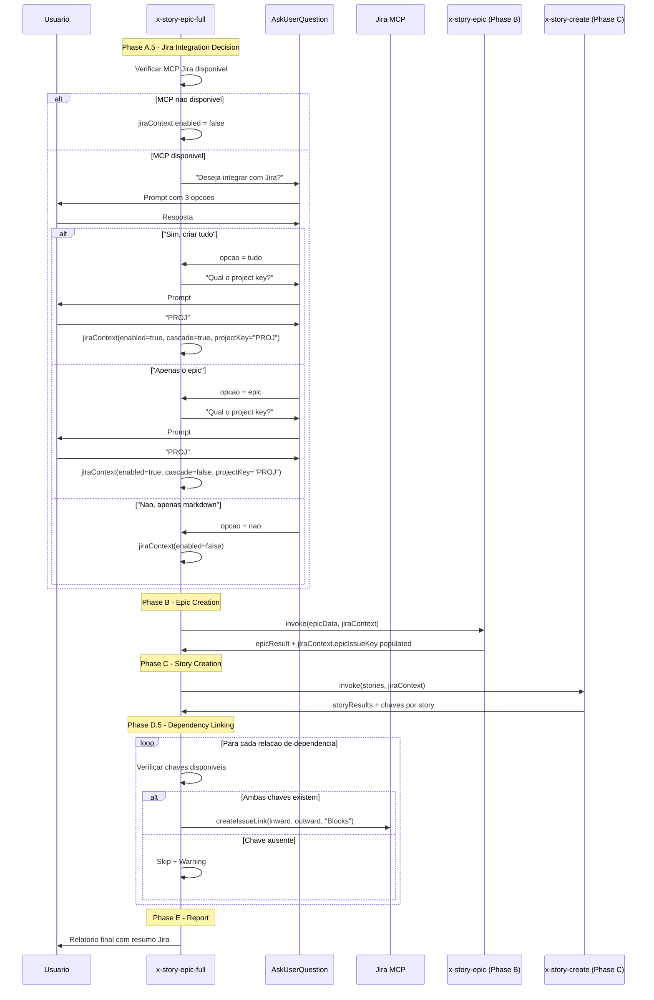
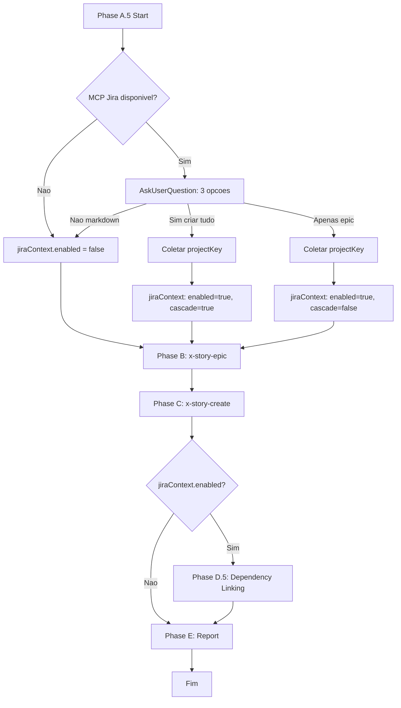

# Historia: Implementar orquestracao Jira no skill x-story-epic-full

**ID:** story-0011-0005
**Chave Jira:** —

## 1. Dependencias
| Blocked By | Blocks |
| :--- | :--- |
| story-0011-0003, story-0011-0004 | story-0011-0007 |

## 2. Regras Transversais Aplicaveis
| ID | Titulo |
| :--- | :--- |
| RULE-001 | Project Identity |
| RULE-002 | Domain |
| RULE-003 | Coding Standards |
| RULE-005 | Quality Gates |
| RULE-006 | Security Baseline |
| RULE-007 | TDD Compliance |

## 3. Descricao

Como **engenheiro de plataforma**, eu quero que o skill `x-story-epic-full` possua uma Phase A.5 (Jira Integration Decision) que pergunte ao usuario uma unica vez se deseja integrar com o Jira, construa o objeto `jiraContext` e o propague para as Phases B (epic creation) e C (story creation), alem de uma Phase D.5 (Dependency Linking) que estabeleca links entre issues no Jira e uma modificacao na Phase E (Report) para incluir o resumo da integracao Jira, para que todo o fluxo de criacao de epics e stories seja orquestrado de forma unificada com o Jira.

### Contexto

O skill `x-story-epic-full` (`java/src/main/resources/skills-templates/core/x-story-epic-full/SKILL.md`) e o orchestrator principal que coordena a criacao completa de epics com stories. Ele invoca internamente os skills `x-story-epic` (Phase B) e `x-story-create` (Phase C). Com a integracao Jira, o orchestrator deve:

1. **Phase A.5:** Verificar disponibilidade do MCP Jira, perguntar ao usuario uma unica vez se deseja integrar, coletar o project key, e construir o `jiraContext`.
2. **Phase B:** Passar o `jiraContext` para `x-story-epic`, que cria o epic no Jira e retorna a chave no `jiraContext.epicIssueKey`.
3. **Phase C:** Passar o `jiraContext` (agora com `epicIssueKey`) para `x-story-create`, que cria as stories no Jira.
4. **Phase D.5:** Percorrer todas as stories criadas e estabelecer links de dependencia no Jira.
5. **Phase E:** Incluir no relatorio final um resumo da integracao Jira (quantas issues criadas, links estabelecidos, falhas).

A decisao do usuario e coletada uma unica vez na Phase A.5 e propagada via `jiraContext` para todas as fases subsequentes. Isso evita perguntas repetidas e garante consistencia.

### Escopo

- Adicionar Phase A.5 ao skill `x-story-epic-full/SKILL.md`
- Implementar construcao do `jiraContext` com base na resposta do usuario
- Propagar `jiraContext` para Phases B e C
- Adicionar Phase D.5 para dependency linking entre todas as issues criadas
- Modificar Phase E para incluir resumo da integracao Jira no relatorio final
- Tratar cenarios de falha parcial (epic criado mas stories falham)

## 4. Definicoes de Qualidade Locais

### DoR Local
- [ ] Skill `x-story-epic-full/SKILL.md` atual revisado e compreendido
- [ ] story-0011-0003 concluida (integracao Jira no x-story-epic com suporte a jiraContext)
- [ ] story-0011-0004 concluida (integracao Jira no x-story-create com suporte a jiraContext)
- [ ] Contrato de dados do `jiraContext` definido e validado entre os 3 skills
- [ ] MCP Jira disponivel para testes (ou mock adequado)

### DoD Local
- [ ] Phase A.5 implementada com verificacao de MCP e prompt unico ao usuario
- [ ] `jiraContext` construido corretamente com base nas 3 opcoes do usuario
- [ ] Propagacao do `jiraContext` para Phases B e C funcional
- [ ] Phase D.5 implementada com dependency linking entre todas as issues
- [ ] Phase E modificada com resumo da integracao Jira
- [ ] Cenarios de falha parcial tratados (epic ok + stories falham)
- [ ] Testes cobrindo todos os cenarios do Gherkin

### Global DoD
- [ ] Cobertura de linhas >= 95%
- [ ] Cobertura de branches >= 90%
- [ ] Zero warnings do compilador/linter
- [ ] Testes seguem padrao test-first (TDD)
- [ ] Commits atomicos com Conventional Commits

## 5. Contratos de Dados

### jiraContext (construido na Phase A.5)

| Campo | Tipo | Obrigatorio | Descricao |
| :--- | :--- | :--- | :--- |
| `enabled` | boolean | Sim | Flag indicating Jira integration is active |
| `cascadeToStories` | boolean | Sim | If true, all stories are created in Jira |
| `projectKey` | String | Condicional | Jira project key (required when enabled=true) |
| `epicIssueKey` | String | Condicional | Populated after epic creation in Jira (Phase B) |

### Phase A.5 Decision Matrix

| Resposta do Usuario | enabled | cascadeToStories | projectKey | Comportamento |
| :--- | :--- | :--- | :--- | :--- |
| "Sim, criar tudo" | true | true | Coletado | Epic + todas as stories criadas no Jira |
| "Apenas o epic" | true | false | Coletado | Apenas epic criado no Jira, stories somente markdown |
| "Nao, apenas markdown" | false | false | null | Nenhuma integracao Jira, fluxo original |

### Phase D.5 Dependency Link — Request

| Campo | Tipo | Request | Response | Origem / Regra |
| :--- | :--- | :--- | :--- | :--- |
| `inwardIssueKey` | String | M | - | Chave da story que bloqueia |
| `outwardIssueKey` | String | M | - | Chave da story bloqueada |
| `linkType` | String | M | - | Hardcoded: `"Blocks"` |

### Phase E Report — Jira Summary

| Campo | Tipo | Descricao |
| :--- | :--- | :--- |
| `epicKey` | String | Chave do epic criado ou "—" |
| `storiesCreated` | int | Numero de stories criadas com sucesso no Jira |
| `storiesFailed` | int | Numero de stories que falharam na criacao |
| `linksCreated` | int | Numero de links de dependencia criados |
| `linksSkipped` | int | Numero de links ignorados por falta de chave |

## 6. Diagramas (Mermaid)





## 7. Criterios de Aceite (Gherkin)

```gherkin
Funcionalidade: Orquestracao Jira no skill x-story-epic-full

  Cenario: MCP nao disponivel resulta em jiraContext disabled e skip silencioso
    DADO que o skill x-story-epic-full esta sendo executado
    E o MCP Jira NAO esta disponivel no ambiente
    QUANDO a Phase A.5 (Jira Integration Decision) e alcancada
    ENTAO o jiraContext deve ser construido com enabled=false
    E nenhuma pergunta deve ser feita ao usuario sobre integracao Jira
    E as Phases B e C devem executar normalmente sem integracao Jira
    E a Phase D.5 deve ser ignorada
    E a Phase E deve exibir o relatorio sem secao Jira

  Cenario: Usuario escolhe criar tudo e epic mais stories sao criados no Jira
    DADO que o skill x-story-epic-full esta sendo executado
    E o MCP Jira esta disponivel no ambiente
    E existem 1 epic e 3 stories para criar
    QUANDO a Phase A.5 pergunta ao usuario se deseja integrar com Jira
    E o usuario responde "Sim, criar tudo"
    E o usuario informa project key "PAY"
    ENTAO o jiraContext deve ser construido com enabled=true, cascadeToStories=true, projectKey="PAY"
    E a Phase B deve receber o jiraContext e criar o epic no Jira
    E a Phase C deve receber o jiraContext com epicIssueKey preenchido
    E todas as 3 stories devem ser criadas no Jira linkadas ao epic
    E a Phase D.5 deve estabelecer links de dependencia entre as stories
    E a Phase E deve exibir resumo com epic key, stories criadas e links estabelecidos

  Cenario: Usuario escolhe apenas o epic e stories nao sao criadas no Jira
    DADO que o skill x-story-epic-full esta sendo executado
    E o MCP Jira esta disponivel no ambiente
    E existem 1 epic e 3 stories para criar
    QUANDO a Phase A.5 pergunta ao usuario se deseja integrar com Jira
    E o usuario responde "Apenas o epic"
    E o usuario informa project key "CORE"
    ENTAO o jiraContext deve ser construido com enabled=true, cascadeToStories=false, projectKey="CORE"
    E a Phase B deve criar o epic no Jira com chave retornada
    E a Phase C NAO deve criar stories no Jira
    E o campo "Chave Jira" nas stories deve ser preenchido com "—"
    E a Phase D.5 deve ser ignorada (sem stories no Jira para linkar)
    E a Phase E deve exibir resumo apenas com epic key

  Cenario: Usuario escolhe nao integrar e apenas markdown e gerado
    DADO que o skill x-story-epic-full esta sendo executado
    E o MCP Jira esta disponivel no ambiente
    QUANDO a Phase A.5 pergunta ao usuario se deseja integrar com Jira
    E o usuario responde "Nao, apenas markdown"
    ENTAO o jiraContext deve ser construido com enabled=false
    E nenhuma chamada ao MCP Jira deve ser feita em nenhuma fase
    E o fluxo original de geracao de markdown deve ser mantido integralmente
    E a Phase E deve exibir o relatorio padrao sem secao Jira

  Cenario: Epic criado com sucesso mas stories falham parcialmente
    DADO que o skill x-story-epic-full esta sendo executado com integracao Jira habilitada
    E o jiraContext possui enabled=true, cascadeToStories=true, projectKey="TEAM"
    E existem 1 epic e 4 stories para criar
    QUANDO a Phase B cria o epic com sucesso retornando chave "TEAM-42"
    E a Phase C cria as stories 1, 2 e 4 com sucesso
    MAS a story 3 falha na criacao no Jira
    ENTAO o jiraContext.epicIssueKey deve conter "TEAM-42"
    E as stories 1, 2 e 4 devem ter chaves Jira preenchidas
    E a story 3 deve ter campo "Chave Jira" com "—"
    E a Phase E deve reportar 1 epic criado, 3 stories criadas e 1 story falhada

  Cenario: Phase D.5 dependency linking com todas as chaves disponiveis
    DADO que o skill x-story-epic-full executou Phases B e C com sucesso
    E 4 stories foram criadas no Jira com chaves TEAM-101, TEAM-102, TEAM-103 e TEAM-104
    E a story 1 bloqueia story 2 e story 3
    E a story 3 bloqueia story 4
    QUANDO a Phase D.5 (Dependency Linking) e executada
    ENTAO 3 links de dependencia devem ser criados no Jira com tipo "Blocks"
    E o link TEAM-101 blocks TEAM-102 deve ser criado
    E o link TEAM-101 blocks TEAM-103 deve ser criado
    E o link TEAM-103 blocks TEAM-104 deve ser criado
    E a Phase E deve reportar 3 links criados e 0 links ignorados
```

## 8. Sub-tarefas

- [ ] **[Dev]** Adicionar Phase A.5 ao skill `x-story-epic-full/SKILL.md` com verificacao de disponibilidade do MCP Jira
- [ ] **[Dev]** Implementar prompt ao usuario com 3 opcoes ("Sim, criar tudo" / "Apenas o epic" / "Nao, apenas markdown")
- [ ] **[Dev]** Implementar construcao do `jiraContext` com base na resposta do usuario e na decision matrix
- [ ] **[Dev]** Implementar propagacao do `jiraContext` para Phase B (`x-story-epic`)
- [ ] **[Dev]** Implementar propagacao do `jiraContext` com `epicIssueKey` para Phase C (`x-story-create`)
- [ ] **[Dev]** Adicionar Phase D.5 (Dependency Linking) com iteracao sobre relacoes Blocked By / Blocks
- [ ] **[Dev]** Implementar logica de verificacao de chaves disponiveis antes de criar cada link
- [ ] **[Dev]** Modificar Phase E para incluir resumo da integracao Jira (epic, stories, links, falhas)
- [ ] **[Dev]** Implementar tratamento de cenario parcial (epic criado, stories falham)
- [ ] **[Test]** Criar testes para MCP indisponivel (jiraContext disabled, skip silencioso)
- [ ] **[Test]** Criar testes para cada uma das 3 opcoes do usuario na Phase A.5
- [ ] **[Test]** Criar testes para propagacao do jiraContext entre phases
- [ ] **[Test]** Criar testes para Phase D.5 com chaves completas e parciais
- [ ] **[Test]** Criar testes para Phase E com resumo Jira
- [ ] **[Test]** Criar testes para cenario de falha parcial (epic ok, stories falham)
- [ ] **[Doc]** Documentar Phase A.5, Phase D.5 e modificacoes na Phase E
