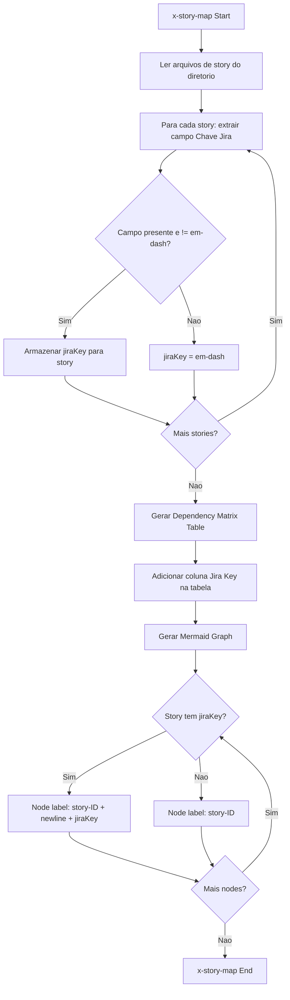
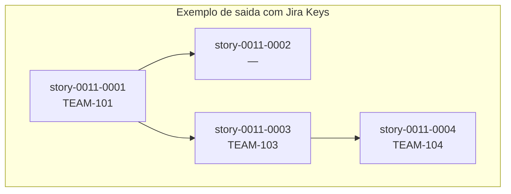

# História: Implementar exibição de Jira keys no skill x-story-map

**ID:** story-0011-0006
**Chave Jira:** —

## 1. Dependências
| Blocked By | Blocks |
| :--- | :--- |
| story-0011-0002, story-0011-0004 | story-0011-0007 |

## 2. Regras Transversais Aplicáveis
| ID | Título |
| :--- | :--- |
| RULE-005 | Quality Gates |

## 3. Descrição

Como **engenheiro de plataforma**, eu quero que o skill `x-story-map` leia o campo `**Chave Jira:**` de cada arquivo de story e exiba as chaves Jira na tabela de dependency matrix e nos labels dos nodes do grafo Mermaid, para que o mapa de implementacao reflita a rastreabilidade entre stories no markdown e issues no Jira.

### Contexto

O skill `x-story-map` (`java/src/main/resources/skills-templates/core/x-story-map/SKILL.md`) gera um Implementation Map que inclui uma tabela de dependency matrix e um grafo Mermaid de dependências entre stories. Atualmente, essas visualizações não incluem informações do Jira.

Com a introducao do campo `**Chave Jira:**` nos templates de story (story-0011-0001) e a criação de issues no Jira (story-0011-0004), o skill `x-story-map` deve ser capaz de ler essas chaves dos arquivos markdown existentes e exibi-las nas suas saidas.

Esta story e exclusivamente de exibição — nenhuma criação ou modificação de issues no Jira ocorre neste skill. Apenas leitura e apresentacao.

### Escopo

- Modificar o skill `x-story-map/SKILL.md` para ler o campo `**Chave Jira:**` de cada story
- Adicionar coluna "Jira Key" na tabela de dependency matrix
- Incluir Jira key no label dos nodes do grafo Mermaid (formato: `story-ID\nJIRA-KEY`)
- Tratar ausência de chave (campo com "—" ou campo ausente) com exibição de "—"

## 4. Definições de Qualidade Locais

### DoR Local
- [ ] Skill `x-story-map/SKILL.md` atual revisado e compreendido
- [ ] story-0011-0002 concluida (campo Chave Jira no template de Implementation Map)
- [ ] story-0011-0004 concluida (stories com Jira keys preenchidas para testes)
- [ ] Formato do campo `**Chave Jira:**` definido e consistente entre stories

### DoD Local
- [ ] Leitura do campo `**Chave Jira:**` implementada para cada story file
- [ ] Coluna "Jira Key" adicionada na tabela de dependency matrix
- [ ] Jira key incluida no label dos nodes Mermaid
- [ ] Stories sem chave Jira exibem "—" em ambas as saidas
- [ ] Mix de stories com e sem chaves exibidas corretamente
- [ ] Testes cobrindo todos os cenarios do Gherkin

### Global DoD
- [ ] Cobertura de linhas >= 95%
- [ ] Cobertura de branches >= 90%
- [ ] Zero warnings do compilador/linter
- [ ] Testes seguem padrão test-first (TDD)
- [ ] Commits atomicos com Conventional Commits

## 5. Contratos de Dados

### Leitura do campo Chave Jira — Input

| Campo | Tipo | Origem | Descrição |
| :--- | :--- | :--- | :--- |
| `**Chave Jira:**` | String (regex) | Markdown de cada story | Valor após `**Chave Jira:**` no cabeçalho da story |

### Regex de extracao

```
\*\*Chave Jira:\*\*\s*(.+)
```

Valor capturado: grupo 1, trimmed. Se "—", vazio, ou campo ausente: considerar como sem chave.

### Dependency Matrix Table — Output

| Coluna | Tipo | Descrição |
| :--- | :--- | :--- |
| Story ID | String | ID da story (ex: `story-0011-0001`) |
| Jira Key | String | Chave Jira ou "—" |
| Title | String | Título da story |
| Blocked By | String | Lista de story IDs que bloqueiam |
| Blocks | String | Lista de story IDs bloqueadas |
| Layer | int | Camada de implementacao |

### Mermaid Node Label — Output

| Formato | Exemplo |
| :--- | :--- |
| Sem Jira key | `story-0011-0001` |
| Com Jira key | `story-0011-0001\nPROJ-101` |

## 6. Diagramas (Mermaid)





## 7. Critérios de Aceite (Gherkin)

```gherkin
Funcionalidade: Exibicao de Jira keys no skill x-story-map

  Cenário: Stories sem campo Chave Jira exibem em-dash na matrix e no Mermaid
    DADO que o skill x-story-map esta sendo executado
    E existem 3 stories no diretorio
    E nenhuma das stories possui o campo "Chave Jira" preenchido com uma chave valida
    QUANDO o skill gera o Implementation Map
    ENTAO a tabela de dependency matrix deve conter a coluna "Jira Key"
    E todas as celulas da coluna "Jira Key" devem conter "—"
    E os nodes do grafo Mermaid devem exibir apenas o story ID sem Jira key

  Cenário: Stories com Jira keys exibem chaves na matrix e no Mermaid
    DADO que o skill x-story-map esta sendo executado
    E existem 3 stories no diretorio
    E a story-0011-0001 possui Chave Jira "TEAM-101"
    E a story-0011-0002 possui Chave Jira "TEAM-102"
    E a story-0011-0003 possui Chave Jira "TEAM-103"
    QUANDO o skill gera o Implementation Map
    ENTAO a tabela de dependency matrix deve exibir "TEAM-101", "TEAM-102" e "TEAM-103" na coluna "Jira Key"
    E o node Mermaid da story-0011-0001 deve ter label "story-0011-0001\nTEAM-101"
    E o node Mermaid da story-0011-0002 deve ter label "story-0011-0002\nTEAM-102"
    E o node Mermaid da story-0011-0003 deve ter label "story-0011-0003\nTEAM-103"

  Cenário: Mix de stories com e sem Jira keys exibe parcialmente
    DADO que o skill x-story-map esta sendo executado
    E existem 4 stories no diretorio
    E a story-0011-0001 possui Chave Jira "PAY-50"
    E a story-0011-0002 NAO possui Chave Jira (campo com "—")
    E a story-0011-0003 possui Chave Jira "PAY-52"
    E a story-0011-0004 NAO possui campo Chave Jira no arquivo
    QUANDO o skill gera o Implementation Map
    ENTAO a coluna "Jira Key" deve exibir "PAY-50", "—", "PAY-52" e "—" respectivamente
    E os nodes Mermaid das stories 1 e 3 devem incluir a Jira key no label
    E os nodes Mermaid das stories 2 e 4 devem exibir apenas o story ID

  Cenário: Jira key incluida no label do node Mermaid com formato correto
    DADO que o skill x-story-map esta sendo executado
    E a story-0011-0005 possui Chave Jira "CORE-200"
    QUANDO o skill gera o grafo Mermaid
    ENTAO o node da story-0011-0005 deve ter o label no formato "story-0011-0005\nCORE-200"
    E o label deve usar newline como separador entre story ID e Jira key
    E a Jira key deve aparecer na segunda linha do label do node
```

## 8. Sub-tarefas

- [ ] **[Dev]** Implementar leitura do campo `**Chave Jira:**` dos arquivos markdown de story via regex
- [ ] **[Dev]** Tratar valores ausentes, vazios e "—" como sem chave Jira
- [ ] **[Dev]** Adicionar coluna "Jira Key" na geracao da tabela de dependency matrix
- [ ] **[Dev]** Modificar geracao de nodes Mermaid para incluir Jira key no label quando disponível
- [ ] **[Dev]** Implementar formato de label com newline: `story-ID\nJIRA-KEY`
- [ ] **[Test]** Criar testes para stories sem campo Chave Jira (todas com "—")
- [ ] **[Test]** Criar testes para stories todas com Jira keys validas
- [ ] **[Test]** Criar testes para mix de stories com e sem Jira keys
- [ ] **[Test]** Criar testes para formato do label Mermaid com Jira key
- [ ] **[Test]** Validar regex de extracao do campo Chave Jira com diferentes formatos
- [ ] **[Doc]** Documentar a nova coluna na dependency matrix e o formato do label Mermaid
