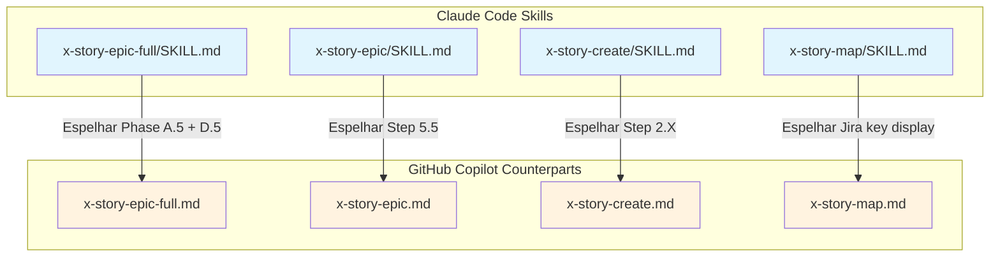
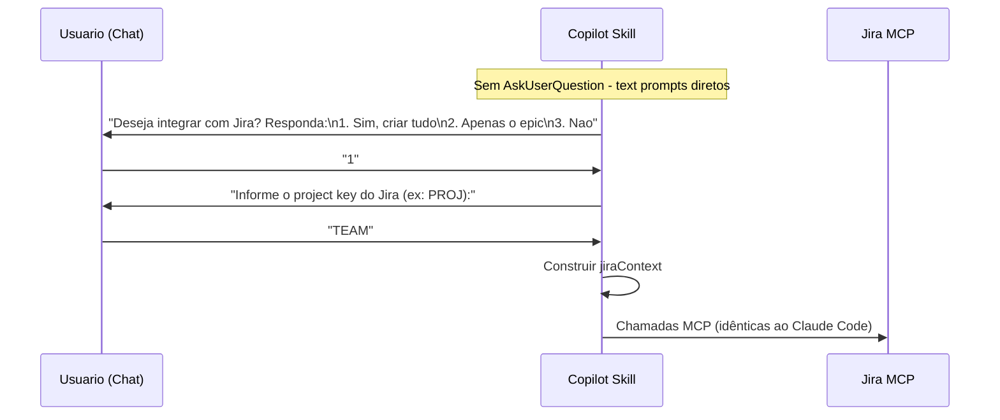

# História: Atualizar GitHub Copilot skill counterparts com integração Jira

**ID:** story-0011-0007
**Chave Jira:** —

## 1. Dependências
| Blocked By | Blocks |
| :--- | :--- |
| story-0011-0003, story-0011-0004, story-0011-0005 | story-0011-0008 |

## 2. Regras Transversais Aplicáveis
| ID | Título |
| :--- | :--- |
| RULE-001 | Project Identity |
| RULE-002 | Domain |
| RULE-003 | Coding Standards |
| RULE-004 | Architecture Summary |
| RULE-005 | Quality Gates |
| RULE-006 | Security Baseline |
| RULE-007 | TDD Compliance |

## 3. Descrição

Como **engenheiro de plataforma**, eu quero que os GitHub Copilot skill counterparts dos skills de story (`x-story-epic-full`, `x-story-epic`, `x-story-create`, `x-story-map`) sejam atualizados para refletir todas as mudanças de integração Jira implementadas nos skills Claude Code, adaptando a interacao do usuario para o contexto Copilot (sem `AskUserQuestion` — usando text prompts), para que a experiencia de integração Jira seja consistente entre Claude Code e GitHub Copilot.

### Contexto

O projeto mantem paridade entre Claude Code skills (`java/src/main/resources/skills-templates/core/`) e GitHub Copilot skills (`java/src/main/resources/github-skills-templates/story/`). Todas as mudanças de integração Jira feitas nas stories 0011-0003, 0011-0004, 0011-0005 e 0011-0006 devem ser espelhadas nos counterparts Copilot.

A principal diferença é que o GitHub Copilot não possui a tool `AskUserQuestion`. No lugar, o skill deve usar text prompts diretos ao usuario, solicitando confirmação e dados via resposta no chat. A logica de verificação de MCP, construção do `jiraContext` e chamadas ao MCP Jira permanecem estruturalmente idênticas.

### Arquivos Afetados

| Claude Code Skill | GitHub Copilot Counterpart |
| :--- | :--- |
| `skills-templates/core/x-story-epic-full/SKILL.md` | `github-skills-templates/story/x-story-epic-full.md` |
| `skills-templates/core/x-story-epic/SKILL.md` | `github-skills-templates/story/x-story-epic.md` |
| `skills-templates/core/x-story-create/SKILL.md` | `github-skills-templates/story/x-story-create.md` |
| `skills-templates/core/x-story-map/SKILL.md` | `github-skills-templates/story/x-story-map.md` |

### Escopo

- Espelhar Phase A.5 / Step 5.5 / Step 2.X / leitura de Jira keys nos 4 counterparts Copilot
- Substituir `AskUserQuestion` por text prompts diretos ao usuario no chat
- Manter contrato de dados `jiraContext` identico
- Manter logica de verificação de MCP, criação de issues e dependency linking identica
- Garantir consistencia estrutural entre os 4 arquivos atualizados

## 4. Definições de Qualidade Locais

### DoR Local
- [ ] story-0011-0003 concluida (Step 5.5 no x-story-epic)
- [ ] story-0011-0004 concluida (Step 2.X no x-story-create)
- [ ] story-0011-0005 concluida (Phase A.5/D.5 no x-story-epic-full)
- [ ] GitHub Copilot counterparts atuais revisados e compreendidos
- [ ] Diferencas de interacao entre Claude Code e Copilot documentadas

### DoD Local
- [ ] `x-story-epic-full.md` (Copilot) atualizado com Phase A.5 e Phase D.5 equivalentes
- [ ] `x-story-epic.md` (Copilot) atualizado com Step 5.5 equivalente
- [ ] `x-story-create.md` (Copilot) atualizado com Step 2.X equivalente
- [ ] `x-story-map.md` (Copilot) atualizado com leitura e exibição de Jira keys
- [ ] Nenhuma referencia a `AskUserQuestion` nos counterparts Copilot
- [ ] Text prompts substituindo `AskUserQuestion` com linguagem clara e consistente
- [ ] Contrato de dados `jiraContext` identico ao das skills Claude Code
- [ ] Testes cobrindo todos os cenarios do Gherkin

### Global DoD
- [ ] Cobertura de linhas >= 95%
- [ ] Cobertura de branches >= 90%
- [ ] Zero warnings do compilador/linter
- [ ] Testes seguem padrão test-first (TDD)
- [ ] Commits atomicos com Conventional Commits

## 5. Contratos de Dados

### Mapeamento de Interacao Claude Code vs Copilot

| Claude Code | GitHub Copilot | Descrição |
| :--- | :--- | :--- |
| `AskUserQuestion("Deseja integrar com Jira?")` | Text prompt: "Deseja integrar com Jira? Responda: sim/nao" | Confirmacao de integração |
| `AskUserQuestion("Qual o project key?")` | Text prompt: "Informe o project key do Jira (ex: PROJ):" | Coleta de project key |
| `AskUserQuestion("3 opcoes")` | Text prompt com opcoes numeradas no chat | Selecao de modo de integração |

### jiraContext (identico ao Claude Code)

| Campo | Tipo | Obrigatório | Descrição |
| :--- | :--- | :--- | :--- |
| `enabled` | boolean | Sim | Flag indicating Jira integration is active |
| `cascadeToStories` | boolean | Sim | If true, all stories are created in Jira |
| `projectKey` | String | Condicional | Jira project key (required when enabled=true) |
| `epicIssueKey` | String | Condicional | Populated after epic creation in Jira |

### Checklist de Consistencia (4 arquivos)

| Aspecto | x-story-epic-full | x-story-epic | x-story-create | x-story-map |
| :--- | :--- | :--- | :--- | :--- |
| MCP verification | Phase A.5 | Step 5.5 | Step 2.X | N/A (leitura) |
| User prompt (Copilot) | Text prompt 3 opcoes | Text prompt Sim/Nao | Modo A/B | N/A |
| jiraContext propagation | Constroi e propaga | Recebe e usa | Recebe e usa | N/A |
| Issue creation | Delega | Epic | Stories | N/A |
| Dependency linking | Phase D.5 | N/A | Segundo passo | N/A |
| Jira key display | N/A | N/A | N/A | Matrix + Mermaid |

## 6. Diagramas (Mermaid)





## 7. Critérios de Aceite (Gherkin)

```gherkin
Funcionalidade: GitHub Copilot skill counterparts com integração Jira

  Cenário: Copilot counterpart sem integração Jira representa estado anterior
    DADO que os 4 GitHub Copilot skill counterparts existem no diretorio github-skills-templates/story/
    E nenhum deles possui logica de integração Jira
    QUANDO esta story e iniciada
    ENTAO os 4 arquivos devem estar no estado base sem mencoes a MCP Jira
    E nenhum dos arquivos deve conter referencia a "jiraContext"
    E nenhum dos arquivos deve conter referencia a "AskUserQuestion"

  Cenário: Counterparts atualizados com Phase A.5, Step 5.5, Step 2.X e display equivalentes
    DADO que as stories 0011-0003, 0011-0004 e 0011-0005 estao concluidas
    E os Claude Code skills possuem integração Jira funcional
    QUANDO os 4 GitHub Copilot counterparts sao atualizados
    ENTAO o x-story-epic-full.md deve conter Phase A.5 (Jira Integration Decision) e Phase D.5 (Dependency Linking)
    E o x-story-epic.md deve conter Step 5.5 (Optional Jira Integration) com modo standalone e cascaded
    E o x-story-create.md deve conter Step 2.X (Optional Jira Integration per story) com Modo A e Modo B
    E o x-story-map.md deve conter logica de leitura e exibição de Jira keys
    E todos os 4 arquivos devem usar text prompts ao inves de AskUserQuestion

  Cenário: Counterpart referenciando tool inexistente no Copilot e rejeitado
    DADO que um GitHub Copilot counterpart esta sendo atualizado
    QUANDO o conteudo do arquivo e revisado
    ENTAO o arquivo NAO deve conter referencias a `AskUserQuestion`
    E o arquivo NAO deve conter referencias a tools exclusivas do Claude Code
    E todas as interacoes com o usuario devem ser via text prompts no chat
    E a logica de coleta de dados deve esperar resposta do usuario no proximo turno do chat

  Cenário: 4 arquivos atualizados com consistencia estrutural
    DADO que todos os 4 GitHub Copilot counterparts foram atualizados
    QUANDO os arquivos sao comparados com seus equivalentes Claude Code
    ENTAO o contrato de dados jiraContext deve ser identico em ambas as versoes
    E a logica de verificação de MCP deve ser equivalente
    E a logica de criação de issues deve ser equivalente
    E a logica de dependency linking deve ser equivalente
    E apenas a camada de interacao com o usuario deve diferir (text prompt vs AskUserQuestion)
    E os 4 arquivos devem estar sintaticamente corretos como markdown
```

## 8. Sub-tarefas

- [ ] **[Dev]** Atualizar `github-skills-templates/story/x-story-epic-full.md` com Phase A.5 e Phase D.5
- [ ] **[Dev]** Substituir `AskUserQuestion` por text prompts com opcoes numeradas no x-story-epic-full
- [ ] **[Dev]** Atualizar `github-skills-templates/story/x-story-epic.md` com Step 5.5
- [ ] **[Dev]** Substituir `AskUserQuestion` por text prompts Sim/Nao no x-story-epic
- [ ] **[Dev]** Atualizar `github-skills-templates/story/x-story-create.md` com Step 2.X
- [ ] **[Dev]** Implementar Modo A e Modo B com text prompts no x-story-create
- [ ] **[Dev]** Atualizar `github-skills-templates/story/x-story-map.md` com leitura e exibição de Jira keys
- [ ] **[Dev]** Validar que nenhum dos 4 arquivos referencia `AskUserQuestion` ou tools exclusivas do Claude Code
- [ ] **[Test]** Criar testes verificando estado anterior (sem integração Jira)
- [ ] **[Test]** Criar testes verificando presenca de Phase A.5 / Step 5.5 / Step 2.X / display nos counterparts
- [ ] **[Test]** Criar testes verificando ausência de `AskUserQuestion` nos 4 arquivos
- [ ] **[Test]** Criar testes de consistencia estrutural entre Claude Code e Copilot skills
- [ ] **[Test]** Validar que jiraContext e identico em ambas as versoes
- [ ] **[Doc]** Documentar diferenças de interacao entre Claude Code e Copilot para integração Jira
