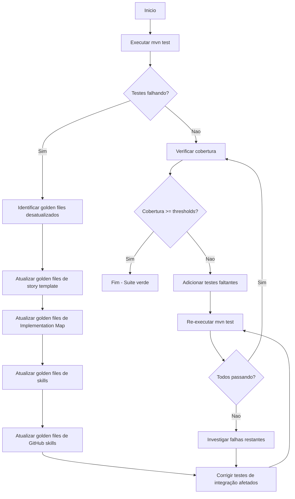
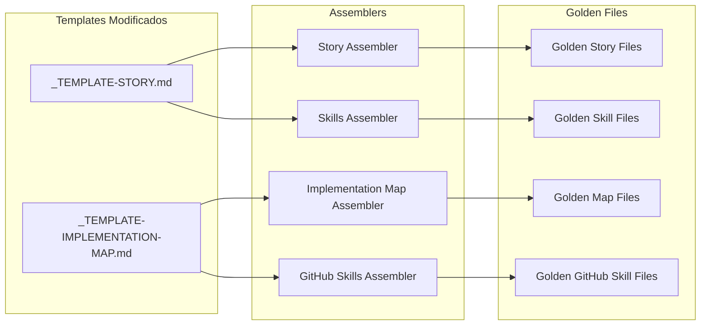

# História: Atualizar golden files e testes de integração

**ID:** story-0011-0008
**Chave Jira:** —

## 1. Dependências
| Blocked By | Blocks |
| :--- | :--- |
| story-0011-0001, story-0011-0002, story-0011-0007 | — |

## 2. Regras Transversais Aplicáveis
| ID | Título |
| :--- | :--- |
| RULE-005 | Quality Gates |

## 3. Descrição

Como **engenheiro de plataforma**, eu quero que todos os golden files e testes de integração afetados pelas mudanças nos templates (`_TEMPLATE-STORY.md` e `_TEMPLATE-IMPLEMENTATION-MAP.md`) e nos skills de story sejam atualizados para refletir o novo campo `**Chave Jira:**` e as demais modificacoes da integração Jira, para que a suite de testes passe integralmente e a cobertura se mantenha dentro dos thresholds exigidos (>= 95% linhas, >= 90% branches).

### Contexto

O projeto utiliza golden file testing para validar que os assemblers geram saidas corretas. Quando templates sao modificados (como a adicao do campo `**Chave Jira:**` nos stories 0011-0001 e 0011-0002), os golden files correspondentes ficam desatualizados e os testes falham.

Alem dos golden files, testes de integração que validam o pipeline completo de geracao também podem ser afetados. O skill `x-story-map` agora le um campo adicional dos arquivos de story, o que pode impactar testes que validam a saida do Implementation Map.

Esta story e a ultima do epic e deve garantir que toda a suite de testes esta verde antes do merge.

### Escopo

- Executar `mvn test` para identificar todos os testes falhando
- Atualizar golden files afetados pelas mudanças nos templates de story
- Atualizar golden files afetados pelas mudanças no template de Implementation Map
- Atualizar testes de integração que validam saidas dos assemblers afetados
- Verificar que testes de skills não foram quebrados pelas mudanças
- Validar cobertura >= 95% linhas e >= 90% branches
- Garantir que templates com o novo campo não quebram assemblers existentes

## 4. Definições de Qualidade Locais

### DoR Local
- [ ] story-0011-0001 concluida (campo Chave Jira no template de story)
- [ ] story-0011-0002 concluida (coluna Jira Key no template de Implementation Map)
- [ ] story-0011-0007 concluida (counterparts Copilot atualizados)
- [ ] Todas as mudanças de template estao committed e disponiveis na branch
- [ ] `mvn test` executado para identificar falhas

### DoD Local
- [ ] Todos os golden files afetados atualizados
- [ ] Todos os testes de integração afetados corrigidos
- [ ] `mvn test` passa com 0 falhas
- [ ] Cobertura de linhas >= 95%
- [ ] Cobertura de branches >= 90%
- [ ] Assemblers existentes não quebrados pelo novo campo
- [ ] Nenhum teste ignorado ou desabilitado para fazer a suite passar

### Global DoD
- [ ] Cobertura de linhas >= 95%
- [ ] Cobertura de branches >= 90%
- [ ] Zero warnings do compilador/linter
- [ ] Testes seguem padrão test-first (TDD)
- [ ] Commits atomicos com Conventional Commits

## 5. Contratos de Dados

### Golden Files Potencialmente Afetados

| Golden File Pattern | Assembler | Motivo da Mudanca |
| :--- | :--- | :--- |
| `tests/golden/*/stories/*-story.md` | Story template assembler | Novo campo `**Chave Jira:**` |
| `tests/golden/*/stories/*-implementation-map.md` | Implementation Map assembler | Nova coluna "Jira Key" |
| `tests/golden/*/skills/x-story-epic/*` | Skills assembler | Step 5.5 adicionado |
| `tests/golden/*/skills/x-story-create/*` | Skills assembler | Step 2.X adicionado |
| `tests/golden/*/skills/x-story-epic-full/*` | Skills assembler | Phase A.5 e D.5 adicionadas |
| `tests/golden/*/skills/x-story-map/*` | Skills assembler | Leitura de Jira keys |
| `tests/golden/*/github-skills/story/*` | GitHub skills assembler | Counterparts Copilot |

### Thresholds de Cobertura

| Metrica | Threshold | Fonte |
| :--- | :--- | :--- |
| Line Coverage | >= 95% | Rule 05 - Quality Gates |
| Branch Coverage | >= 90% | Rule 05 - Quality Gates |

### Comandos de Verificacao

| Comando | Proposito |
| :--- | :--- |
| `mvn test` | Executar suite completa de testes |
| `mvn jacoco:report` | Gerar relatório de cobertura |
| `mvn verify` | Verificar thresholds de cobertura |

## 6. Diagramas (Mermaid)





## 7. Critérios de Aceite (Gherkin)

```gherkin
Funcionalidade: Atualizacao de golden files e testes de integração

  Cenário: Testes falhando por golden file desatualizado sao identificados e corrigidos
    DADO que as stories 0011-0001, 0011-0002 e 0011-0007 estao concluidas
    E os templates de story e Implementation Map foram modificados com campos Jira
    QUANDO o comando "mvn test" e executado
    E existem testes falhando por divergencia entre golden files e saida atual dos assemblers
    ENTAO cada golden file desatualizado deve ser identificado pela mensagem de erro do teste
    E cada golden file deve ser atualizado para refletir a saida atual correta do assembler
    E uma re-execução de "mvn test" deve confirmar que os testes previamente falhando agora passam

  Cenário: Golden files atualizados resultam em todos os testes passando
    DADO que todos os golden files afetados foram atualizados
    E todos os testes de integração afetados foram corrigidos
    QUANDO o comando "mvn test" e executado
    ENTAO todos os testes devem passar com 0 falhas
    E nenhum teste deve estar ignorado ou desabilitado
    E o tempo de execução da suite não deve ter aumentado significativamente

  Cenário: Cobertura abaixo do threshold requer testes adicionais
    DADO que todos os testes estao passando
    QUANDO o relatório de cobertura e gerado via "mvn jacoco:report"
    E a cobertura de linhas esta abaixo de 95% ou branches abaixo de 90%
    ENTAO testes adicionais devem ser criados para cobrir os caminhos faltantes
    E a cobertura deve ser re-verificada ate atingir os thresholds exigidos
    E os novos testes devem seguir o padrão test-first (TDD)

  Cenário: Templates com novo campo não quebram assemblers existentes
    DADO que o template `_TEMPLATE-STORY.md` agora possui o campo "Chave Jira"
    E o template `_TEMPLATE-IMPLEMENTATION-MAP.md` agora possui a coluna "Jira Key"
    QUANDO os assemblers existentes processam os templates atualizados
    ENTAO nenhum assembler deve lancar excecao por causa do novo campo
    E o campo "Chave Jira" deve ser preservado na saida gerada com valor "—"
    E a coluna "Jira Key" deve aparecer na tabela de dependency matrix com valor "—"
    E todos os demais campos dos templates devem continuar sendo processados corretamente

  Cenário: Golden files de GitHub Copilot counterparts atualizados consistentemente
    DADO que os 4 GitHub Copilot counterparts foram atualizados na story 0011-0007
    QUANDO os golden files correspondentes sao gerados
    ENTAO os golden files devem refletir as mudanças de integração Jira nos counterparts
    E os golden files devem ser consistentes com os golden files dos Claude Code skills
    E nenhum golden file de Copilot deve referenciar `AskUserQuestion`
```

## 8. Sub-tarefas

- [ ] **[Test]** Executar `mvn test` e catalogar todos os testes falhando
- [ ] **[Test]** Classificar falhas por tipo: golden file desatualizado, teste de integração, teste de skill
- [ ] **[Dev]** Atualizar golden files de story template (campo Chave Jira)
- [ ] **[Dev]** Atualizar golden files de Implementation Map template (coluna Jira Key)
- [ ] **[Dev]** Atualizar golden files de skills Claude Code (x-story-epic, x-story-create, x-story-epic-full, x-story-map)
- [ ] **[Dev]** Atualizar golden files de GitHub Copilot counterparts (4 arquivos)
- [ ] **[Test]** Corrigir testes de integração que validam saida dos assemblers afetados
- [ ] **[Test]** Re-executar `mvn test` e validar 0 falhas
- [ ] **[Test]** Gerar relatório de cobertura via `mvn jacoco:report`
- [ ] **[Test]** Verificar cobertura >= 95% linhas e >= 90% branches
- [ ] **[Test]** Adicionar testes faltantes caso cobertura esteja abaixo dos thresholds
- [ ] **[Test]** Validar que assemblers existentes processam templates com novo campo sem erro
- [ ] **[Test]** Validar que nenhum teste foi ignorado ou desabilitado
- [ ] **[Doc]** Documentar lista de golden files atualizados e motivo de cada mudanca
