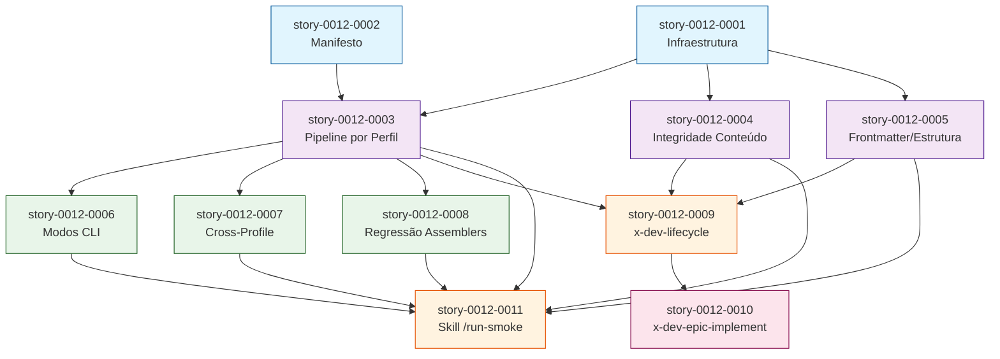

# Mapa de Implementação — Smoke Tests End-to-End e Integração no Ciclo de Desenvolvimento

**Gerado a partir das dependências BlockedBy/Blocks de cada história do epic-0012.**

---

## 1. Matriz de Dependências

| Story | Título | Blocked By | Blocks | Status | Chave Jira |
| :--- | :--- | :--- | :--- | :--- | :--- |
| story-0012-0001 | Infraestrutura de Smoke Tests | — | story-0012-0003, story-0012-0004, story-0012-0005 | Pendente | — |
| story-0012-0002 | Manifesto de Artefatos Esperados por Perfil | — | story-0012-0003 | Pendente | — |
| story-0012-0003 | Smoke Test de Pipeline Completo por Perfil | story-0012-0001, story-0012-0002 | story-0012-0006, story-0012-0007, story-0012-0008, story-0012-0009, story-0012-0011 | Pendente | — |
| story-0012-0004 | Smoke Test de Integridade de Conteúdo | story-0012-0001 | story-0012-0009, story-0012-0011 | Pendente | — |
| story-0012-0005 | Smoke Test de Frontmatter e Estrutura de Skills | story-0012-0001 | story-0012-0009, story-0012-0011 | Pendente | — |
| story-0012-0006 | Smoke Test de Modos CLI | story-0012-0003 | story-0012-0011 | Pendente | — |
| story-0012-0007 | Smoke Test de Consistência Cross-Profile | story-0012-0003 | story-0012-0011 | Pendente | — |
| story-0012-0008 | Smoke Test de Regressão de Assemblers | story-0012-0003 | story-0012-0011 | Pendente | — |
| story-0012-0009 | Integrar Smoke Tests no Skill x-dev-lifecycle | story-0012-0003, story-0012-0004, story-0012-0005 | story-0012-0010 | Pendente | — |
| story-0012-0010 | Integrar Smoke Tests no Skill x-dev-epic-implement | story-0012-0009 | — | Pendente | — |
| story-0012-0011 | Criar Skill /run-smoke para Execução On-Demand | story-0012-0003, story-0012-0004, story-0012-0005, story-0012-0006, story-0012-0007, story-0012-0008 | — | Pendente | — |

---

## 2. Fases de Implementação

```
╔══════════════════════════════════════════════════════════════════════════╗
║                   FASE 0 — Fundação (paralelo: 2)                      ║
║                                                                        ║
║   ┌──────────────────┐              ┌──────────────────┐               ║
║   │  story-0012-0001 │              │  story-0012-0002 │               ║
║   │  Infraestrutura  │              │  Manifesto       │               ║
║   │  Smoke Tests     │              │  Artefatos       │               ║
║   └────────┬─────────┘              └────────┬─────────┘               ║
╚════════════╪═════════════════════════════════╪═════════════════════════╝
             │                                 │
             ▼                                 ▼
╔══════════════════════════════════════════════════════════════════════════╗
║                   FASE 1 — Core Smoke Tests (paralelo: 3)              ║
║                                                                        ║
║   ┌──────────────────┐  ┌──────────────────┐  ┌──────────────────┐    ║
║   │  story-0012-0003 │  │  story-0012-0004 │  │  story-0012-0005 │    ║
║   │  Pipeline por    │  │  Integridade de  │  │  Frontmatter e   │    ║
║   │  Perfil          │  │  Conteúdo        │  │  Estrutura       │    ║
║   │  (← 0001, 0002)  │  │  (← 0001)       │  │  (← 0001)       │    ║
║   └────────┬─────────┘  └────────┬─────────┘  └────────┬─────────┘    ║
╚════════════╪═════════════════════╪═════════════════════╪══════════════╝
             │                     │                     │
             ▼                     ▼                     ▼
╔══════════════════════════════════════════════════════════════════════════╗
║                   FASE 2 — Extended Smoke Tests (paralelo: 3)          ║
║                                                                        ║
║   ┌──────────────────┐  ┌──────────────────┐  ┌──────────────────┐    ║
║   │  story-0012-0006 │  │  story-0012-0007 │  │  story-0012-0008 │    ║
║   │  Modos CLI       │  │  Cross-Profile   │  │  Regressão       │    ║
║   │  (← 0003)        │  │  (← 0003)        │  │  Assemblers      │    ║
║   │                   │  │                   │  │  (← 0003)        │    ║
║   └────────┬─────────┘  └────────┬─────────┘  └────────┬─────────┘    ║
╚════════════╪═════════════════════╪═════════════════════╪══════════════╝
             │                     │                     │
             ▼                     ▼                     ▼
╔══════════════════════════════════════════════════════════════════════════╗
║                   FASE 3 — Dev Workflow Integration (paralelo: 2)      ║
║                                                                        ║
║   ┌──────────────────────────────┐  ┌──────────────────────────────┐   ║
║   │  story-0012-0009             │  │  story-0012-0011             │   ║
║   │  x-dev-lifecycle             │  │  Skill /run-smoke            │   ║
║   │  (← 0003, 0004, 0005)       │  │  (← 0003..0008)             │   ║
║   └──────────────┬───────────────┘  └──────────────────────────────┘   ║
╚══════════════════╪═════════════════════════════════════════════════════╝
                   │
                   ▼
╔══════════════════════════════════════════════════════════════════════════╗
║                   FASE 4 — Epic Integration (paralelo: 1)              ║
║                                                                        ║
║   ┌──────────────────────────────────────────────┐                     ║
║   │  story-0012-0010                             │                     ║
║   │  x-dev-epic-implement                        │                     ║
║   │  (← 0009)                                    │                     ║
║   └──────────────────────────────────────────────┘                     ║
╚══════════════════════════════════════════════════════════════════════════╝
```

---

## 3. Caminho Crítico

```
story-0012-0001 → story-0012-0003 → story-0012-0009 → story-0012-0010
    (Fase 0)          (Fase 1)          (Fase 3)          (Fase 4)

Comprimento do caminho crítico: 4 histórias em 4 fases (+ Fase 2 paralela)
Total de fases: 5 (Fase 0 a Fase 4)
```

O caminho crítico passa pela infraestrutura (0001), pipeline smoke test (0003), integração no lifecycle (0009), e integração no epic implement (0010). As fases 1 e 2 permitem alto paralelismo.

---

## 4. Grafo de Dependências (Mermaid)



**Legenda:**
- Azul (Fase 0): Fundação
- Roxo (Fase 1): Core Smoke Tests
- Verde (Fase 2): Extended Smoke Tests
- Laranja (Fase 3): Dev Workflow Integration
- Rosa (Fase 4): Epic Integration

---

## 5. Resumo por Fase

| Fase | Histórias | Camada | Paralelismo | Pré-requisito |
| :--- | :--- | :--- | :--- | :--- |
| 0 | story-0012-0001, story-0012-0002 | Foundation | 2 | — |
| 1 | story-0012-0003, story-0012-0004, story-0012-0005 | Core Domain | 3 | Fase 0 completa |
| 2 | story-0012-0006, story-0012-0007, story-0012-0008 | Extensions | 3 | story-0012-0003 (Fase 1 parcial) |
| 3 | story-0012-0009, story-0012-0011 | Integration | 2 | Fases 1-2 completas |
| 4 | story-0012-0010 | Cross-Cutting | 1 | story-0012-0009 (Fase 3 parcial) |

---

## 6. Observações Estratégicas

### Paralelismo

- **Fase 0**: 2 histórias totalmente independentes → máximo paralelismo
- **Fase 1**: 3 histórias, sendo que 0004 e 0005 dependem apenas de 0001 (podem iniciar antes de 0002 terminar, mas 0003 precisa de ambos)
- **Fase 2**: 3 histórias totalmente independentes entre si → máximo paralelismo
- **Fase 3**: 0009 e 0011 são paralelas (dependências diferentes)
- **Fase 4**: Gargalo — apenas 1 história, depende de 0009

### Riscos

1. **story-0012-0003 é ponto de convergência**: Bloqueia 6 das 11 histórias. Falha aqui atrasa o épico inteiro.
2. **story-0012-0007 (cross-profile) pode ser lenta**: Executa pipeline 8 vezes e compara todos os pares. Considerar cache de resultados.
3. **story-0012-0009 e 0010 modificam skills gerados**: Mudanças nos templates de skills exigem regeneração de golden files para todos os 8 perfis.

### Estratégia de Execução Recomendada

1. Iniciar Fase 0 com ambas histórias em paralelo
2. Na Fase 1, iniciar 0004 e 0005 assim que 0001 terminar (não esperar 0002)
3. Iniciar 0003 quando ambos 0001 e 0002 estiverem completos
4. Na Fase 2, iniciar todas as 3 histórias em paralelo assim que 0003 terminar
5. Na Fase 3, iniciar 0009 e 0011 em paralelo
6. Na Fase 4, executar 0010 sequencialmente após 0009
