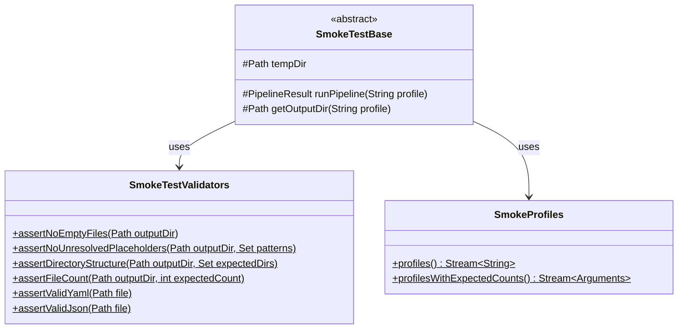
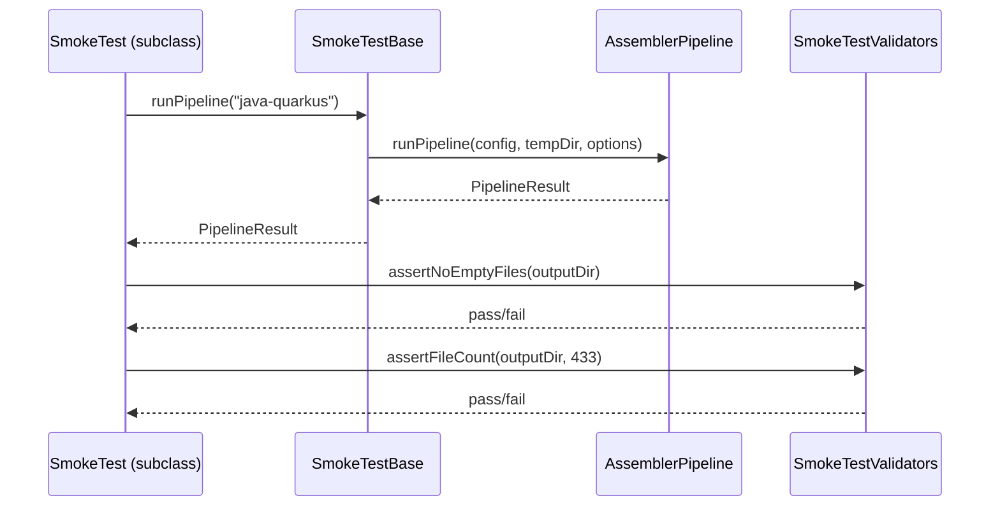

# História: Infraestrutura de Smoke Tests

**ID:** story-0012-0001
**Chave Jira:** —

## 1. Dependências

| Blocked By | Blocks |
| :--- | :--- |
| — | story-0012-0003, story-0012-0004, story-0012-0005 |

## 2. Regras Transversais Aplicáveis

| ID | Título |
| :--- | :--- |
| RULE-002 | Independência de Golden Files |
| RULE-006 | Execução em Temp Directory |

## 3. Descrição

Como **engenheiro de plataforma**, eu quero uma infraestrutura base para smoke tests com classe base, utilities de validação e provider de perfis, para que todos os smoke tests subsequentes tenham um alicerce comum e consistente.

### Contexto

Os golden file tests existentes (`GoldenFileTest.java`) validam paridade byte-a-byte entre output Java e referências TypeScript. Porém, não existe infraestrutura para validar propriedades estruturais e de integridade do output (contagem de arquivos, diretórios esperados, placeholders não resolvidos, arquivos vazios). Esta história cria a fundação reutilizável para todos os smoke tests.

### 3.1 Classe Base `SmokeTestBase`

Criar uma classe abstrata que:
- Configura `@TempDir` para output isolado
- Provê método utilitário para executar o pipeline com um perfil dado
- Provê acesso ao `PipelineResult` para asserções
- Reutiliza `ConfigProfiles.getStack()` para carregar configurações

### 3.2 Utilities de Validação

Criar classe `SmokeTestValidators` com métodos estáticos:
- `assertNoEmptyFiles(Path outputDir)` — falha se qualquer arquivo gerado tem 0 bytes
- `assertNoUnresolvedPlaceholders(Path outputDir, Set<String> patterns)` — escaneia todos os arquivos por padrões como `{{...}}`, `<CHAVE-JIRA>` etc.
- `assertDirectoryStructure(Path outputDir, Set<String> expectedDirs)` — valida que diretórios esperados existem
- `assertFileCount(Path outputDir, int expectedCount)` — valida contagem total de arquivos
- `assertValidYaml(Path file)` — valida que arquivo YAML é parseable
- `assertValidJson(Path file)` — valida que arquivo JSON é parseable

### 3.3 Profile Provider

Criar método `@MethodSource` reutilizável que fornece os 8 perfis bundled, similar ao existente em `GoldenFileTest.profiles()` mas acessível a todas as classes de smoke test.

## 4. Definições de Qualidade Locais

### DoR Local

- [ ] `GoldenFileTest.java` revisado para entender padrões existentes
- [ ] `AssemblerPipeline` e `PipelineOptions` compreendidos
- [ ] `ConfigProfiles` e seus 8 perfis identificados
- [ ] Pacote de testes identificado: `dev.iadev.smoke`

### DoD Local

- [ ] Classe `SmokeTestBase` criada em `src/test/java/dev/iadev/smoke/`
- [ ] Classe `SmokeTestValidators` criada com todos os 6 métodos utilitários
- [ ] Classe `SmokeProfiles` criada com `@MethodSource` provider
- [ ] Testes unitários para cada método de `SmokeTestValidators`
- [ ] Integração com profile Maven `integration-tests` (Failsafe)
- [ ] Nenhuma regressão nos testes existentes

### Global DoD

- [ ] Cobertura de linhas >= 95%
- [ ] Cobertura de branches >= 90%
- [ ] Zero warnings do compilador/linter
- [ ] Testes seguem padrão test-first (TDD)
- [ ] Commits atômicos com Conventional Commits

## 5. Contratos de Dados

| Campo | Tipo | Obrigatório | Descrição |
| :--- | :--- | :--- | :--- |
| `outputDir` | `Path` | Sim | Diretório temporário para output do pipeline |
| `profile` | `String` | Sim | Nome do perfil bundled (ex: `java-quarkus`) |
| `pipelineResult` | `PipelineResult` | Sim | Resultado da execução do pipeline |
| `patterns` | `Set<String>` | Sim | Padrões regex de placeholders a detectar |
| `expectedDirs` | `Set<String>` | Sim | Conjunto de diretórios esperados |
| `expectedCount` | `int` | Sim | Contagem esperada de arquivos |

## 6. Diagramas (Mermaid)





## 7. Critérios de Aceite (Gherkin)

```gherkin
Cenario: Validador rejeita diretório vazio
  DADO que o diretório de output está vazio
  QUANDO assertNoEmptyFiles é chamado
  ENTÃO o teste passa (nenhum arquivo para verificar)

Cenario: Validador detecta arquivo vazio
  DADO que existe um arquivo com 0 bytes no diretório
  QUANDO assertNoEmptyFiles é chamado
  ENTÃO o teste falha com mensagem indicando o arquivo vazio

Cenario: Validador detecta placeholder não resolvido
  DADO que existe um arquivo contendo "{{PLACEHOLDER}}"
  QUANDO assertNoUnresolvedPlaceholders é chamado com padrão "\{\{.*?\}\}"
  ENTÃO o teste falha listando o arquivo e a linha do placeholder

Cenario: Validador aceita conteúdo sem placeholders
  DADO que nenhum arquivo contém placeholders
  QUANDO assertNoUnresolvedPlaceholders é chamado
  ENTÃO o teste passa

Cenario: Validador confirma estrutura de diretórios
  DADO que os diretórios ".claude", ".github", "docs" existem
  QUANDO assertDirectoryStructure é chamado com esses diretórios esperados
  ENTÃO o teste passa

Cenario: Validador detecta diretório ausente
  DADO que o diretório ".github" não foi criado
  QUANDO assertDirectoryStructure é chamado esperando ".github"
  ENTÃO o teste falha indicando o diretório ausente

Cenario: Validador confirma contagem de arquivos
  DADO que o diretório contém exatamente 433 arquivos
  QUANDO assertFileCount é chamado com expectedCount=433
  ENTÃO o teste passa

Cenario: Validador detecta contagem divergente
  DADO que o diretório contém 430 arquivos
  QUANDO assertFileCount é chamado com expectedCount=433
  ENTÃO o teste falha com mensagem "Expected 433 files but found 430"

Cenario: Validador confirma YAML válido
  DADO que o arquivo contém YAML bem-formado
  QUANDO assertValidYaml é chamado
  ENTÃO o teste passa

Cenario: Validador rejeita YAML malformado
  DADO que o arquivo contém YAML inválido
  QUANDO assertValidYaml é chamado
  ENTÃO o teste falha com detalhes do erro de parsing

Cenario: Pipeline executa com sucesso via SmokeTestBase
  DADO que o perfil "java-quarkus" é válido
  QUANDO runPipeline("java-quarkus") é chamado
  ENTÃO o PipelineResult indica sucesso
  E o diretório de output contém arquivos gerados
```

## 8. Sub-tarefas

- [ ] [Dev] Criar pacote `dev.iadev.smoke` em `src/test/java/`
- [ ] [Test] Testes unitários para `SmokeTestValidators.assertNoEmptyFiles`
- [ ] [Dev] Implementar `SmokeTestValidators.assertNoEmptyFiles`
- [ ] [Test] Testes unitários para `SmokeTestValidators.assertNoUnresolvedPlaceholders`
- [ ] [Dev] Implementar `SmokeTestValidators.assertNoUnresolvedPlaceholders`
- [ ] [Test] Testes unitários para `SmokeTestValidators.assertDirectoryStructure`
- [ ] [Dev] Implementar `SmokeTestValidators.assertDirectoryStructure`
- [ ] [Test] Testes unitários para `SmokeTestValidators.assertFileCount`
- [ ] [Dev] Implementar `SmokeTestValidators.assertFileCount`
- [ ] [Test] Testes unitários para `SmokeTestValidators.assertValidYaml`
- [ ] [Dev] Implementar `SmokeTestValidators.assertValidYaml`
- [ ] [Test] Testes unitários para `SmokeTestValidators.assertValidJson`
- [ ] [Dev] Implementar `SmokeTestValidators.assertValidJson`
- [ ] [Dev] Criar `SmokeTestBase` com método `runPipeline`
- [ ] [Dev] Criar `SmokeProfiles` com providers reutilizáveis
- [ ] [Test] Teste de integração validando `SmokeTestBase.runPipeline` para 1 perfil
- [ ] [Dev] Configurar Failsafe para incluir classes `*SmokeTest.java`
