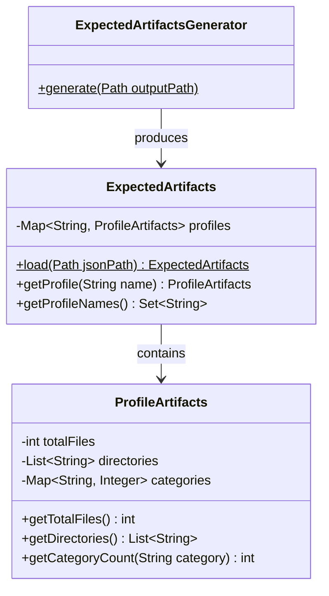
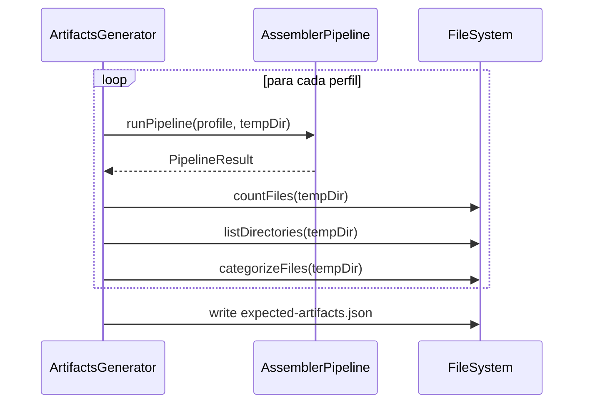

# História: Manifesto de Artefatos Esperados por Perfil

**ID:** story-0012-0002
**Chave Jira:** —

## 1. Dependências

| Blocked By | Blocks |
| :--- | :--- |
| — | story-0012-0003 |

## 2. Regras Transversais Aplicáveis

| ID | Título |
| :--- | :--- |
| RULE-001 | Parametrização por Perfil |
| RULE-005 | Manifesto Versionado |

## 3. Descrição

Como **engenheiro de plataforma**, eu quero um manifesto versionado que declare a contagem de arquivos, diretórios esperados e categorias de artefatos para cada perfil bundled, para que os smoke tests possam validar o output contra expectativas concretas e qualquer mudança no pipeline que altere a estrutura seja detectada automaticamente.

### Contexto

O incidente da migração TypeScript para Java revelou que a contagem de arquivos divergia entre as implementações. O golden file test valida conteúdo byte-a-byte, mas a contagem de arquivos é uma asserção implícita (falha quando um arquivo expected não existe). Um manifesto explícito torna essa validação declarativa e facilita diagnóstico.

### 3.1 Formato do Manifesto

Criar arquivo `src/test/resources/smoke/expected-artifacts.json` com estrutura:

```json
{
  "profiles": {
    "java-quarkus": {
      "totalFiles": 433,
      "directories": [".claude", ".claude/rules", ".claude/skills", ".github", "docs"],
      "categories": {
        "rules": 6,
        "skills": 14,
        "agents": 8,
        "github-instructions": 5,
        "github-skills": 32,
        "github-agents": 8
      }
    }
  }
}
```

### 3.2 Geração Automática do Manifesto

Criar utilitário `ExpectedArtifactsGenerator` que executa o pipeline para todos os perfis e gera o manifesto a partir do output real. Isto permite regenerar o manifesto quando o pipeline muda legitimamente (similar ao `GoldenFileRegenerator`).

### 3.3 Loader do Manifesto

Criar classe `ExpectedArtifacts` que carrega o JSON e provê métodos de acesso tipados para uso nos smoke tests.

## 4. Definições de Qualidade Locais

### DoR Local

- [ ] Contagem de arquivos atual por perfil levantada (via golden files ou execução local)
- [ ] Estrutura de diretórios esperada por perfil documentada
- [ ] Categorias de artefatos identificadas (rules, skills, agents, etc.)

### DoD Local

- [ ] Arquivo `expected-artifacts.json` criado com dados para todos os 8 perfis
- [ ] Classe `ExpectedArtifacts` com loader e métodos de acesso
- [ ] Utilitário `ExpectedArtifactsGenerator` para regeneração
- [ ] Testes unitários para `ExpectedArtifacts` (parsing, acesso, perfil inexistente)
- [ ] Manifesto validado contra output real para os 8 perfis
- [ ] Nenhuma regressão nos testes existentes

### Global DoD

- [ ] Cobertura de linhas >= 95%
- [ ] Cobertura de branches >= 90%
- [ ] Zero warnings do compilador/linter
- [ ] Testes seguem padrão test-first (TDD)
- [ ] Commits atômicos com Conventional Commits

## 5. Contratos de Dados

| Campo | Tipo | Obrigatório | Descrição |
| :--- | :--- | :--- | :--- |
| `profiles` | `Map<String, ProfileArtifacts>` | Sim | Mapa de perfil para artefatos esperados |
| `totalFiles` | `int` | Sim | Contagem total de arquivos para o perfil |
| `directories` | `List<String>` | Sim | Diretórios esperados (paths relativos) |
| `categories` | `Map<String, Integer>` | Sim | Contagem por categoria de artefato |

### Formato do JSON

```json
{
  "profiles": {
    "<profile-name>": {
      "totalFiles": <int>,
      "directories": ["<path>", ...],
      "categories": {
        "<category>": <int>,
        ...
      }
    }
  }
}
```

## 6. Diagramas (Mermaid)





## 7. Critérios de Aceite (Gherkin)

```gherkin
Cenario: Loader rejeita JSON nulo
  DADO que o caminho do JSON é nulo
  QUANDO ExpectedArtifacts.load é chamado
  ENTÃO uma exceção é lançada com mensagem apropriada

Cenario: Loader carrega manifesto válido
  DADO que existe um expected-artifacts.json válido
  QUANDO ExpectedArtifacts.load é chamado
  ENTÃO o objeto contém dados para os 8 perfis

Cenario: Acesso a perfil existente retorna dados corretos
  DADO que o manifesto contém perfil "java-quarkus" com totalFiles=433
  QUANDO getProfile("java-quarkus") é chamado
  ENTÃO totalFiles é 433
  E directories contém ".claude"
  E categories contém "rules" com valor 6

Cenario: Acesso a perfil inexistente lança exceção
  DADO que o manifesto não contém perfil "ruby-rails"
  QUANDO getProfile("ruby-rails") é chamado
  ENTÃO uma exceção é lançada indicando perfil não encontrado

Cenario: Generator produz manifesto para todos os perfis
  DADO que o pipeline funciona para todos os 8 perfis
  QUANDO ExpectedArtifactsGenerator.generate é executado
  ENTÃO o JSON produzido contém 8 entradas
  E cada entrada tem totalFiles > 0
  E cada entrada tem directories não vazio
  E cada entrada tem categories não vazio

Cenario: Manifesto reflete output real do pipeline
  DADO que o manifesto foi gerado pelo ExpectedArtifactsGenerator
  QUANDO o pipeline é executado para "java-quarkus"
  ENTÃO a contagem de arquivos no output corresponde ao totalFiles do manifesto
```

## 8. Sub-tarefas

- [ ] [Dev] Criar pacote `dev.iadev.smoke` em test (se não existir da story-0001)
- [ ] [Test] Testes unitários para `ExpectedArtifacts.load` (nulo, inválido, válido)
- [ ] [Dev] Implementar `ExpectedArtifacts` e `ProfileArtifacts` como records
- [ ] [Test] Testes unitários para `ExpectedArtifacts.getProfile` (existente, inexistente)
- [ ] [Dev] Implementar métodos de acesso tipados
- [ ] [Dev] Criar `ExpectedArtifactsGenerator`
- [ ] [Test] Teste de integração: generator produz manifesto consistente com pipeline
- [ ] [Dev] Gerar `expected-artifacts.json` para todos os 8 perfis
- [ ] [Doc] Documentar processo de regeneração do manifesto em comentário do JSON
