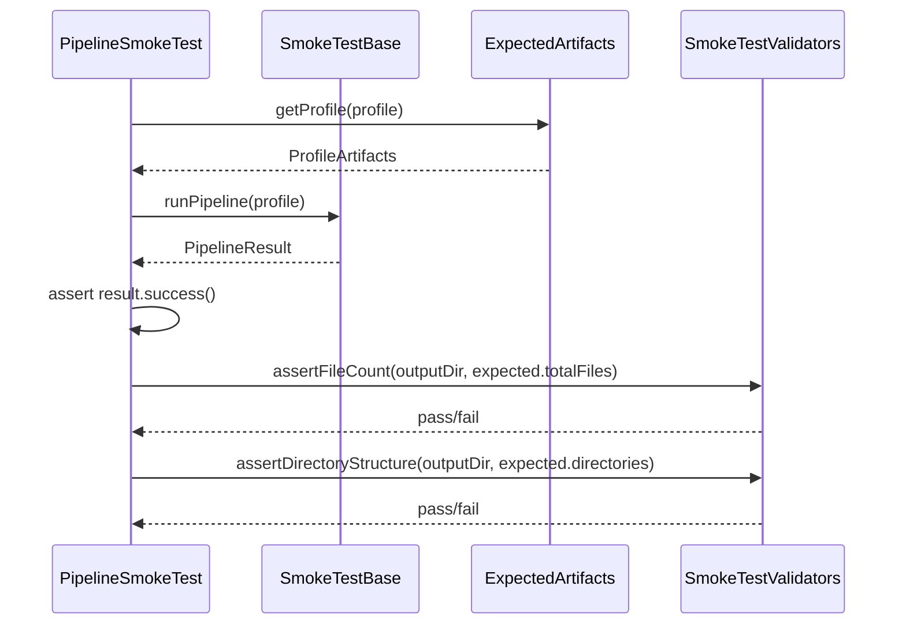

# História: Smoke Test de Pipeline Completo por Perfil

**ID:** story-0012-0003
**Chave Jira:** —

## 1. Dependências

| Blocked By | Blocks |
| :--- | :--- |
| story-0012-0001, story-0012-0002 | story-0012-0006, story-0012-0007, story-0012-0008, story-0012-0009, story-0012-0011 |

## 2. Regras Transversais Aplicáveis

| ID | Título |
| :--- | :--- |
| RULE-001 | Parametrização por Perfil |
| RULE-002 | Independência de Golden Files |
| RULE-003 | Non-Blocking no Pipeline de Geração |
| RULE-006 | Execução em Temp Directory |

## 3. Descrição

Como **engenheiro de plataforma**, eu quero um smoke test parametrizado que execute o pipeline completo para cada um dos 8 perfis bundled e valide sucesso da execução, contagem de arquivos e estrutura de diretórios, para detectar imediatamente quando uma mudança no pipeline causa regressão na geração de artefatos.

### Contexto

Este é o smoke test mais fundamental — valida que o pipeline executa sem erros e produz a quantidade esperada de artefatos na estrutura correta. O incidente da migração TypeScript→Java seria detectado por este teste (contagem de arquivos divergente). Diferente do golden file test, este não compara conteúdo, apenas propriedades estruturais.

### 3.1 Test Class: `PipelineSmokeTest`

Classe parametrizada que para cada perfil:
1. Executa o pipeline completo via `SmokeTestBase.runPipeline()`
2. Valida `PipelineResult.success() == true`
3. Valida contagem de arquivos contra manifesto (`ExpectedArtifacts`)
4. Valida estrutura de diretórios contra manifesto
5. Valida contagem por categoria contra manifesto
6. Valida que nenhum warning crítico foi emitido

### 3.2 Diagnóstico de Falhas

Quando a contagem diverge, o teste deve reportar:
- Contagem esperada vs. encontrada
- Arquivos extras (não esperados)
- Arquivos ausentes (esperados mas não gerados)
- Delta por categoria

## 4. Definições de Qualidade Locais

### DoR Local

- [ ] `SmokeTestBase` e `SmokeTestValidators` implementados (story-0012-0001)
- [ ] `ExpectedArtifacts` e manifesto gerado (story-0012-0002)
- [ ] Perfis de build Failsafe configurados para smoke tests

### DoD Local

- [ ] Classe `PipelineSmokeTest` criada e parametrizada para 8 perfis
- [ ] Validação de sucesso, contagem, diretórios e categorias
- [ ] Mensagens de erro diagnósticas detalhadas
- [ ] Todos os 8 perfis passando
- [ ] Teste executando via `mvn verify -P integration-tests`
- [ ] Nenhuma regressão nos testes existentes

### Global DoD

- [ ] Cobertura de linhas >= 95%
- [ ] Cobertura de branches >= 90%
- [ ] Zero warnings do compilador/linter
- [ ] Testes seguem padrão test-first (TDD)
- [ ] Commits atômicos com Conventional Commits

## 5. Contratos de Dados

| Campo | Tipo | Obrigatório | Descrição |
| :--- | :--- | :--- | :--- |
| `profile` | `String` | Sim | Nome do perfil (ex: `java-quarkus`) |
| `pipelineResult` | `PipelineResult` | Sim | Resultado da execução |
| `expectedArtifacts` | `ProfileArtifacts` | Sim | Artefatos esperados do manifesto |
| `actualFileCount` | `int` | Sim | Contagem real de arquivos gerados |
| `actualDirectories` | `Set<String>` | Sim | Diretórios reais encontrados |

## 6. Diagramas (Mermaid)



## 7. Critérios de Aceite (Gherkin)

```gherkin
Cenario: Pipeline executa com sucesso para cada perfil
  DADO que o perfil "<perfil>" é um dos 8 perfis bundled
  QUANDO o pipeline é executado no diretório temporário
  ENTÃO PipelineResult.success() é true
  E nenhum warning crítico é emitido

  Exemplos:
    | perfil            |
    | go-gin            |
    | java-quarkus      |
    | java-spring       |
    | kotlin-ktor       |
    | python-click-cli  |
    | python-fastapi    |
    | rust-axum         |
    | typescript-nestjs |

Cenario: Contagem de arquivos corresponde ao manifesto
  DADO que o pipeline executou com sucesso para "<perfil>"
  QUANDO a contagem de arquivos é verificada
  ENTÃO o total corresponde ao declarado no manifesto
  E a contagem por categoria corresponde ao declarado

Cenario: Estrutura de diretórios corresponde ao manifesto
  DADO que o pipeline executou com sucesso para "<perfil>"
  QUANDO os diretórios são verificados
  ENTÃO todos os diretórios declarados no manifesto existem
  E nenhum diretório inesperado de nível 1 existe

Cenario: Mensagem diagnóstica quando contagem diverge
  DADO que o manifesto declara 433 arquivos para "java-quarkus"
  MAS o pipeline gerou 430 arquivos
  QUANDO a validação é executada
  ENTÃO a mensagem de erro lista os 3 arquivos ausentes
  E indica a categoria afetada
```

## 8. Sub-tarefas

- [ ] [Test] Teste RED: `PipelineSmokeTest` com perfil parametrizado validando sucesso
- [ ] [Dev] Implementar `PipelineSmokeTest` estendendo `SmokeTestBase`
- [ ] [Test] Teste RED: validação de contagem de arquivos contra manifesto
- [ ] [Dev] Implementar validação de contagem com diagnóstico detalhado
- [ ] [Test] Teste RED: validação de estrutura de diretórios contra manifesto
- [ ] [Dev] Implementar validação de diretórios
- [ ] [Test] Teste RED: validação de contagem por categoria
- [ ] [Dev] Implementar validação por categoria
- [ ] [Test] Executar para todos os 8 perfis e confirmar GREEN
- [ ] [Dev] Refatorar mensagens de erro para clareza
