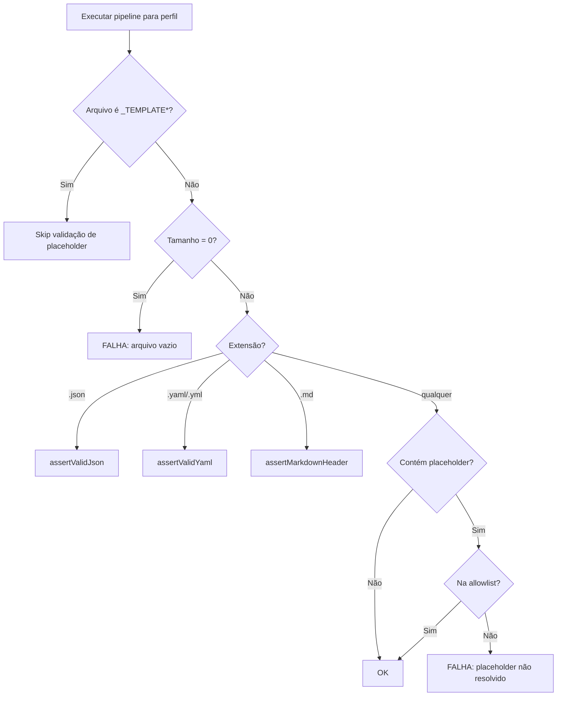

# História: Smoke Test de Integridade de Conteúdo

**ID:** story-0012-0004
**Chave Jira:** —

## 1. Dependências

| Blocked By | Blocks |
| :--- | :--- |
| story-0012-0001 | story-0012-0009, story-0012-0011 |

## 2. Regras Transversais Aplicáveis

| ID | Título |
| :--- | :--- |
| RULE-001 | Parametrização por Perfil |
| RULE-002 | Independência de Golden Files |
| RULE-006 | Execução em Temp Directory |

## 3. Descrição

Como **engenheiro de plataforma**, eu quero um smoke test que valide a integridade do conteúdo dos arquivos gerados — nenhum arquivo vazio, nenhum placeholder não resolvido, e todos os JSON/YAML bem-formados — para garantir que o output é utilizável e não contém artefatos de template incompletos.

### Contexto

Templates Pebble usam a sintaxe `{{ variable }}` para interpolação. Se uma variável não for definida no contexto, o placeholder pode persistir no output dependendo da configuração de strict mode. Além disso, placeholders de skill como `{{LANGUAGE}}`, `{{FRAMEWORK}}`, `{{ARCHITECTURE}}` são resolvidos em runtime pelo AI agent — estes são LEGÍTIMOS e não devem ser flaggeados. O teste deve distinguir entre placeholders de template Pebble (bug) e placeholders de skill (intencional).

### 3.1 Test Class: `ContentIntegritySmokeTest`

Parametrizado para os 8 perfis, valida:

1. **Arquivos vazios**: Nenhum arquivo gerado tem 0 bytes
2. **Placeholders Pebble**: Nenhum `{{ }}` com conteúdo que NÃO seja um placeholder de skill conhecido
3. **Placeholders de dados**: Nenhum `<CHAVE-JIRA>`, `{DOMAIN_NAME}`, etc. persistem em arquivos finais que não são templates
4. **JSON válido**: Todo `.json` é parseable
5. **YAML válido**: Todo `.yaml` / `.yml` é parseable
6. **Markdown headers**: Todo `.md` começa com `#` ou YAML frontmatter (`---`)

### 3.2 Allowlist de Placeholders de Skill

Manter lista de placeholders intencionais que o AI agent resolve em runtime:
- `{{LANGUAGE}}`, `{{LANGUAGE_VERSION}}`, `{{FRAMEWORK}}`, `{{ARCHITECTURE}}`
- `{{BUILD_COMMAND}}`, `{{TEST_COMMAND}}`, `{{COMPILE_COMMAND}}`
- `{{PROJECT_NAME}}`, `{{DB_TYPE}}`, `{{BUILD_FILE}}`
- `{{ARCH_STYLE}}`, `{{PLACEHOLDER}}`

Estes NÃO são bugs e devem ser ignorados pelo scanner.

### 3.3 Template Files Exclusion

Arquivos cujo nome começa com `_TEMPLATE` são templates destinados a uso futuro e DEVEM conter placeholders. Estes são excluídos da validação de placeholders.

## 4. Definições de Qualidade Locais

### DoR Local

- [ ] `SmokeTestBase` e `SmokeTestValidators` implementados (story-0012-0001)
- [ ] Lista de placeholders de skill conhecidos identificada
- [ ] Lista de templates (`_TEMPLATE*`) identificada

### DoD Local

- [ ] Classe `ContentIntegritySmokeTest` criada e parametrizada
- [ ] Validação de arquivos vazios
- [ ] Validação de placeholders com allowlist
- [ ] Validação de JSON/YAML bem-formados
- [ ] Validação de headers markdown
- [ ] Exclusão de `_TEMPLATE*` files da validação de placeholders
- [ ] Todos os 8 perfis passando
- [ ] Nenhuma regressão nos testes existentes

### Global DoD

- [ ] Cobertura de linhas >= 95%
- [ ] Cobertura de branches >= 90%
- [ ] Zero warnings do compilador/linter
- [ ] Testes seguem padrão test-first (TDD)
- [ ] Commits atômicos com Conventional Commits

## 5. Contratos de Dados

| Campo | Tipo | Obrigatório | Descrição |
| :--- | :--- | :--- | :--- |
| `profile` | `String` | Sim | Nome do perfil bundled |
| `allowedPlaceholders` | `Set<String>` | Sim | Placeholders de skill legítimos |
| `templateFilePrefix` | `String` | Sim | Prefixo de templates a excluir (padrão: `_TEMPLATE`) |
| `emptyFiles` | `List<String>` | Não | Lista de arquivos com 0 bytes encontrados |
| `unresolvedPlaceholders` | `Map<String, List<String>>` | Não | Mapa de arquivo → linhas com placeholders |

## 6. Diagramas (Mermaid)



## 7. Critérios de Aceite (Gherkin)

```gherkin
Cenario: Nenhum arquivo vazio gerado para o perfil
  DADO que o pipeline executou com sucesso para "<perfil>"
  QUANDO todos os arquivos são verificados
  ENTÃO nenhum arquivo tem tamanho 0 bytes

Cenario: Nenhum placeholder Pebble não resolvido
  DADO que o pipeline executou com sucesso para "<perfil>"
  QUANDO os arquivos são escaneados por padrão "\{\{[^}]+\}\}"
  E placeholders de skill são filtrados pela allowlist
  E arquivos _TEMPLATE* são excluídos
  ENTÃO nenhum placeholder não resolvido é encontrado

Cenario: Placeholder de skill é permitido
  DADO que um arquivo contém "{{LANGUAGE}}"
  QUANDO o scanner de placeholders é executado
  ENTÃO "{{LANGUAGE}}" NÃO é reportado como erro

Cenario: Arquivo _TEMPLATE com placeholders é permitido
  DADO que _TEMPLATE-STORY.md contém "{{STORY_ID}}"
  QUANDO o scanner é executado
  ENTÃO o arquivo é ignorado completamente

Cenario: Todos os JSON são parseáveis
  DADO que o pipeline executou com sucesso para "<perfil>"
  QUANDO cada arquivo .json é parseado
  ENTÃO nenhum erro de parsing ocorre

Cenario: Todos os YAML são parseáveis
  DADO que o pipeline executou com sucesso para "<perfil>"
  QUANDO cada arquivo .yaml/.yml é parseado
  ENTÃO nenhum erro de parsing ocorre

Cenario: Todos os Markdown têm header válido
  DADO que o pipeline executou com sucesso para "<perfil>"
  QUANDO cada arquivo .md é verificado
  ENTÃO o arquivo começa com "#" ou com "---" (YAML frontmatter)
```

## 8. Sub-tarefas

- [ ] [Test] Teste RED: `ContentIntegritySmokeTest` validação de arquivos vazios
- [ ] [Dev] Implementar validação de arquivos vazios usando `SmokeTestValidators`
- [ ] [Test] Teste RED: validação de placeholders com allowlist
- [ ] [Dev] Implementar scanner de placeholders com exclusão de allowlist e templates
- [ ] [Test] Teste RED: validação de JSON parseável
- [ ] [Dev] Implementar scan de `.json` com `assertValidJson`
- [ ] [Test] Teste RED: validação de YAML parseável
- [ ] [Dev] Implementar scan de `.yaml`/`.yml` com `assertValidYaml`
- [ ] [Test] Teste RED: validação de markdown headers
- [ ] [Dev] Implementar validação de headers markdown
- [ ] [Test] Executar para todos os 8 perfis e confirmar GREEN
