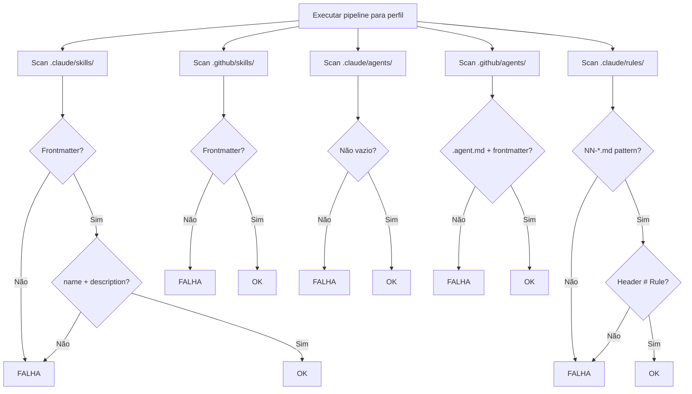

# História: Smoke Test de Frontmatter e Estrutura de Skills

**ID:** story-0012-0005
**Chave Jira:** —

## 1. Dependências

| Blocked By | Blocks |
| :--- | :--- |
| story-0012-0001 | story-0012-0009, story-0012-0011 |

## 2. Regras Transversais Aplicáveis

| ID | Título |
| :--- | :--- |
| RULE-001 | Parametrização por Perfil |
| RULE-002 | Independência de Golden Files |
| RULE-006 | Execução em Temp Directory |

## 3. Descrição

Como **engenheiro de plataforma**, eu quero um smoke test que valide que cada skill gerado possui frontmatter YAML válido com campos obrigatórios, e que agentes e regras seguem as convenções de nomenclatura e estrutura, para garantir que os artefatos gerados são consumíveis pelo Claude Code e GitHub Copilot.

### Contexto

Skills para Claude Code requerem frontmatter YAML com `name` e `description`. Skills para GitHub Copilot requerem fields adicionais. Agentes Claude requerem formato `.md` sem frontmatter. Agentes GitHub requerem `.agent.md` com frontmatter. Regras são arquivos `.md` numerados. Uma falha na estrutura desses artefatos resulta em skills não-invocáveis ou agentes não reconhecidos.

### 3.1 Validações de Skills (.claude)

Para cada `SKILL.md` em `.claude/skills/`:
- Frontmatter YAML presente (delimitado por `---`)
- Campo `name` presente e não vazio
- Campo `description` presente e não vazio
- Conteúdo após frontmatter não está vazio

### 3.2 Validações de Skills (.github)

Para cada `SKILL.md` em `.github/skills/`:
- Frontmatter YAML presente
- Campo `name` ou título presente
- Conteúdo após frontmatter não está vazio

### 3.3 Validações de Agentes (.claude)

Para cada `.md` em `.claude/agents/`:
- Arquivo não está vazio
- Conteúdo começa com `#` ou instrução de sistema

### 3.4 Validações de Agentes (.github)

Para cada `.agent.md` em `.github/agents/`:
- Frontmatter YAML presente
- Extensão é `.agent.md`

### 3.5 Validações de Regras

Para cada `.md` em `.claude/rules/`:
- Nome segue padrão `NN-*.md` (numerado)
- Conteúdo começa com `# Rule` ou `# Global`
- Arquivo não está vazio

## 4. Definições de Qualidade Locais

### DoR Local

- [ ] `SmokeTestBase` e `SmokeTestValidators` implementados (story-0012-0001)
- [ ] Convenções de frontmatter documentadas no CLAUDE.md revisadas
- [ ] Estrutura de `.claude/` e `.github/` compreendida

### DoD Local

- [ ] Classe `SkillStructureSmokeTest` criada e parametrizada
- [ ] Validação de skills Claude (frontmatter, name, description)
- [ ] Validação de skills GitHub (frontmatter, conteúdo)
- [ ] Validação de agentes Claude e GitHub
- [ ] Validação de regras (numeração, headers)
- [ ] Todos os 8 perfis passando
- [ ] Nenhuma regressão nos testes existentes

### Global DoD

- [ ] Cobertura de linhas >= 95%
- [ ] Cobertura de branches >= 90%
- [ ] Zero warnings do compilador/linter
- [ ] Testes seguem padrão test-first (TDD)
- [ ] Commits atômicos com Conventional Commits

## 5. Contratos de Dados

| Campo | Tipo | Obrigatório | Descrição |
| :--- | :--- | :--- | :--- |
| `profile` | `String` | Sim | Nome do perfil bundled |
| `skillPath` | `Path` | Sim | Caminho para o arquivo SKILL.md |
| `frontmatter` | `Map<String, Object>` | Sim | YAML frontmatter parseado |
| `requiredFields` | `Set<String>` | Sim | Campos obrigatórios no frontmatter |

## 6. Diagramas (Mermaid)



## 7. Critérios de Aceite (Gherkin)

```gherkin
Cenario: Skill vazio falha na validação
  DADO que um skill .claude tem frontmatter sem campo "name"
  QUANDO a validação é executada
  ENTÃO o teste falha indicando campo obrigatório ausente

Cenario: Skills Claude possuem frontmatter válido
  DADO que o pipeline executou com sucesso para "<perfil>"
  QUANDO cada SKILL.md em .claude/skills/ é verificado
  ENTÃO frontmatter YAML é válido
  E campo "name" está presente e não vazio
  E campo "description" está presente e não vazio

Cenario: Skills GitHub possuem frontmatter válido
  DADO que o pipeline executou com sucesso para "<perfil>"
  QUANDO cada SKILL.md em .github/skills/ é verificado
  ENTÃO frontmatter YAML é válido
  E conteúdo após frontmatter não está vazio

Cenario: Agentes Claude não estão vazios
  DADO que o pipeline executou com sucesso para "<perfil>"
  QUANDO cada .md em .claude/agents/ é verificado
  ENTÃO o arquivo não está vazio

Cenario: Agentes GitHub têm extensão e frontmatter corretos
  DADO que o pipeline executou com sucesso para "<perfil>"
  QUANDO cada arquivo em .github/agents/ é verificado
  ENTÃO a extensão é .agent.md
  E frontmatter YAML está presente

Cenario: Regras seguem convenção de nomenclatura
  DADO que o pipeline executou com sucesso para "<perfil>"
  QUANDO cada .md em .claude/rules/ é verificado
  ENTÃO o nome segue padrão "NN-*.md"
  E o conteúdo começa com "# Rule" ou "# Global"
```

## 8. Sub-tarefas

- [ ] [Dev] Criar utilitário `FrontmatterParser` para extrair YAML frontmatter de markdown
- [ ] [Test] Testes unitários para `FrontmatterParser`
- [ ] [Test] Teste RED: validação de skills Claude (frontmatter, name, description)
- [ ] [Dev] Implementar validação de skills Claude
- [ ] [Test] Teste RED: validação de skills GitHub
- [ ] [Dev] Implementar validação de skills GitHub
- [ ] [Test] Teste RED: validação de agentes Claude e GitHub
- [ ] [Dev] Implementar validação de agentes
- [ ] [Test] Teste RED: validação de regras (numeração, headers)
- [ ] [Dev] Implementar validação de regras
- [ ] [Test] Executar para todos os 8 perfis e confirmar GREEN
