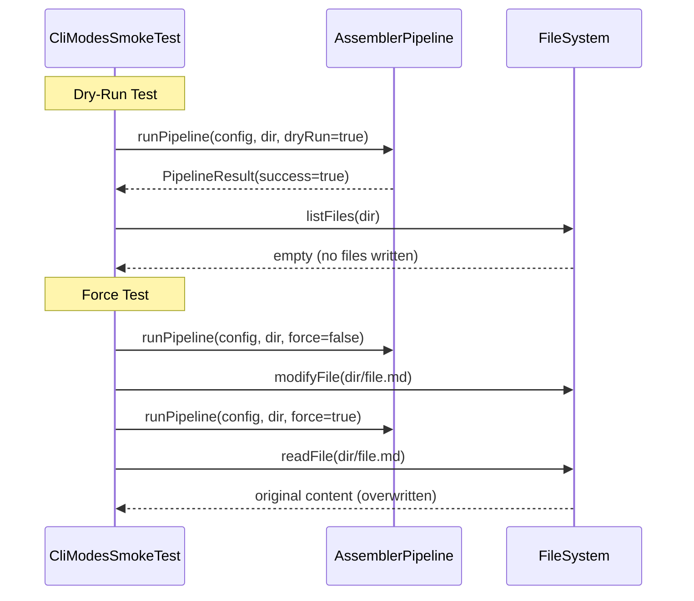

# História: Smoke Test de Modos CLI

**ID:** story-0012-0006
**Chave Jira:** —

## 1. Dependências

| Blocked By | Blocks |
| :--- | :--- |
| story-0012-0003 | story-0012-0011 |

## 2. Regras Transversais Aplicáveis

| ID | Título |
| :--- | :--- |
| RULE-003 | Non-Blocking no Pipeline de Geração |
| RULE-006 | Execução em Temp Directory |

## 3. Descrição

Como **engenheiro de plataforma**, eu quero smoke tests que validem os modos de operação do CLI (dry-run, force, verbose, help), para garantir que os flags de linha de comando funcionam corretamente e que mudanças no pipeline não quebram o comportamento dos modos.

### Contexto

O CLI do ia-dev-env suporta múltiplos modos de operação via flags: `--dry-run` (simulação sem escrita), `--force` (sobrescreve existentes), `--verbose` (output detalhado), `--help` (documentação de uso). Esses modos são exercitados indiretamente pelos testes existentes, mas não há teste explícito que valide seu comportamento como contrato.

### 3.1 Dry-Run Mode

- Executar pipeline com `dryRun=true`
- Verificar que NENHUM arquivo foi escrito no diretório de output
- Verificar que `PipelineResult.success()` é true
- Verificar que `PipelineResult.generatedFiles()` lista arquivos (simulados)

### 3.2 Force Mode

- Gerar output uma vez (baseline)
- Modificar um arquivo no output
- Gerar novamente com `force=true`
- Verificar que o arquivo modificado foi sobrescrito com o conteúdo original

### 3.3 Verbose Mode

- Executar pipeline com `verbose=true`
- Capturar logs/output
- Verificar que output contém informações detalhadas por assembler

### 3.4 Help/Usage

- Invocar `GenerateCommand` com `--help`
- Verificar que output contém flags documentados (`--config`, `--stack`, `--output`, `--dry-run`, `--force`, `--verbose`)

## 4. Definições de Qualidade Locais

### DoR Local

- [ ] `PipelineSmokeTest` implementado e passando (story-0012-0003)
- [ ] `PipelineOptions` record compreendido (dryRun, verbose, force, configPath)
- [ ] `GenerateCommand` revisado para flags suportados

### DoD Local

- [ ] Classe `CliModesSmokeTest` criada
- [ ] Teste de dry-run: nenhum arquivo escrito
- [ ] Teste de force: arquivo sobrescrito
- [ ] Teste de verbose: output detalhado presente
- [ ] Teste de help: flags documentados no output
- [ ] Nenhuma regressão nos testes existentes

### Global DoD

- [ ] Cobertura de linhas >= 95%
- [ ] Cobertura de branches >= 90%
- [ ] Zero warnings do compilador/linter
- [ ] Testes seguem padrão test-first (TDD)
- [ ] Commits atômicos com Conventional Commits

## 5. Contratos de Dados

| Campo | Tipo | Obrigatório | Descrição |
| :--- | :--- | :--- | :--- |
| `dryRun` | `boolean` | Sim | Flag de simulação |
| `force` | `boolean` | Sim | Flag de sobrescrita |
| `verbose` | `boolean` | Sim | Flag de output detalhado |
| `outputDir` | `Path` | Sim | Diretório de output (temp) |
| `generatedFiles` | `List<String>` | Sim | Arquivos gerados/simulados pelo pipeline |

## 6. Diagramas (Mermaid)



## 7. Critérios de Aceite (Gherkin)

```gherkin
Cenario: Dry-run não escreve arquivos
  DADO que o diretório de output está vazio
  QUANDO o pipeline é executado com dryRun=true
  ENTÃO PipelineResult.success() é true
  E o diretório de output continua vazio
  E PipelineResult reporta arquivos simulados

Cenario: Force sobrescreve arquivos existentes
  DADO que o pipeline foi executado uma vez gerando "CLAUDE.md"
  E o conteúdo de "CLAUDE.md" foi manualmente alterado
  QUANDO o pipeline é executado novamente com force=true
  ENTÃO "CLAUDE.md" contém o conteúdo gerado original
  E o conteúdo manual foi sobrescrito

Cenario: Verbose produz output detalhado
  DADO que o pipeline é configurado com verbose=true
  QUANDO o pipeline é executado
  ENTÃO o resultado inclui informações por assembler executado

Cenario: Help exibe flags suportados
  DADO que o comando generate é invocado com --help
  QUANDO o output de uso é capturado
  ENTÃO contém "--config" ou "-c"
  E contém "--stack" ou "-s"
  E contém "--output" ou "-o"
  E contém "--dry-run"
  E contém "--force"
  E contém "--verbose"
```

## 8. Sub-tarefas

- [ ] [Test] Teste RED: dry-run não escreve arquivos no diretório
- [ ] [Dev] Implementar teste de dry-run
- [ ] [Test] Teste RED: force sobrescreve arquivo modificado
- [ ] [Dev] Implementar teste de force overwrite
- [ ] [Test] Teste RED: verbose produz output detalhado
- [ ] [Dev] Implementar teste de verbose output
- [ ] [Test] Teste RED: help exibe flags documentados
- [ ] [Dev] Implementar teste de help/usage
- [ ] [Test] Confirmar todos GREEN
