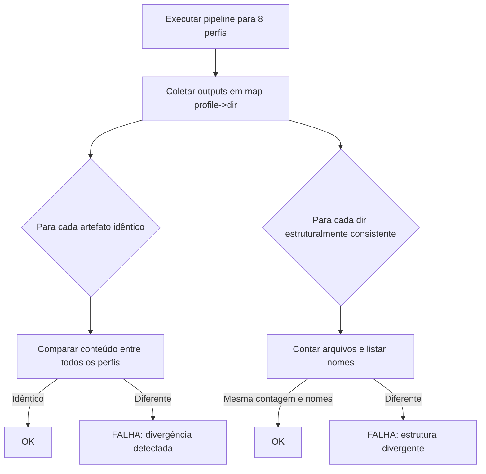

# História: Smoke Test de Consistência Cross-Profile

**ID:** story-0012-0007
**Chave Jira:** —

## 1. Dependências

| Blocked By | Blocks |
| :--- | :--- |
| story-0012-0003 | story-0012-0011 |

## 2. Regras Transversais Aplicáveis

| ID | Título |
| :--- | :--- |
| RULE-001 | Parametrização por Perfil |
| RULE-002 | Independência de Golden Files |
| RULE-006 | Execução em Temp Directory |

## 3. Descrição

Como **engenheiro de plataforma**, eu quero um smoke test que valide a consistência de artefatos compartilhados entre os 8 perfis, para garantir que artefatos que deveriam ser idênticos (ou estruturalmente similares) entre perfis não divergem silenciosamente.

### Contexto

Alguns artefatos gerados são independentes do perfil (ex: agents, skills core como `x-dev-lifecycle`, `x-review`). Outros variam por perfil mas devem manter estrutura consistente (ex: rules sempre tem 6 arquivos, agents sempre tem 8). Uma mudança que afeta apenas um subconjunto de perfis pode indicar bug no pipeline de templating.

### 3.1 Artefatos Idênticos Cross-Profile

Verificar que os seguintes artefatos são byte-a-byte idênticos entre TODOS os perfis:
- `.claude/agents/*.md` (agentes não dependem de linguagem)
- `.claude/skills/x-dev-lifecycle/SKILL.md` e outros skills core (que usam `{{PLACEHOLDER}}` runtime, não template-time)

### 3.2 Artefatos Estruturalmente Consistentes

Verificar que os seguintes artefatos têm a mesma ESTRUTURA (não conteúdo) entre perfis:
- `.claude/rules/` — mesmo número de arquivos, mesmos nomes de arquivo
- `.claude/settings.json` — mesmas chaves de primeiro nível
- `.github/agents/` — mesmo número de agentes, mesmos nomes

### 3.3 Artefatos Legitimamente Diferentes

Documentar e excluir artefatos que DEVEM diferir por perfil:
- `.claude/rules/01-project-identity.md` — contém linguagem, framework, build tool
- `.claude/rules/02-domain.md` — pode variar por perfil
- `Dockerfile` — varia por linguagem
- `docker-compose.yml` — varia por stack
- Infrastructure manifests — variam por stack

## 4. Definições de Qualidade Locais

### DoR Local

- [ ] `PipelineSmokeTest` implementado e passando (story-0012-0003)
- [ ] Lista de artefatos idênticos cross-profile identificada
- [ ] Lista de artefatos estruturalmente consistentes identificada
- [ ] Lista de exclusões documentada

### DoD Local

- [ ] Classe `CrossProfileConsistencySmokeTest` criada
- [ ] Validação de artefatos idênticos entre todos os perfis
- [ ] Validação de estrutura consistente (contagem, nomes)
- [ ] Exclusão documentada para artefatos legitimamente diferentes
- [ ] Relatório de divergências claro e acionável
- [ ] Nenhuma regressão nos testes existentes

### Global DoD

- [ ] Cobertura de linhas >= 95%
- [ ] Cobertura de branches >= 90%
- [ ] Zero warnings do compilador/linter
- [ ] Testes seguem padrão test-first (TDD)
- [ ] Commits atômicos com Conventional Commits

## 5. Contratos de Dados

| Campo | Tipo | Obrigatório | Descrição |
| :--- | :--- | :--- | :--- |
| `profiles` | `List<String>` | Sim | Lista dos 8 perfis bundled |
| `identicalArtifacts` | `Set<String>` | Sim | Paths relativos de artefatos que devem ser idênticos |
| `structurallyConsistent` | `Set<String>` | Sim | Paths de diretórios que devem ter mesma estrutura |
| `exclusions` | `Set<String>` | Sim | Paths de artefatos legitimamente diferentes |

## 6. Diagramas (Mermaid)



## 7. Critérios de Aceite (Gherkin)

```gherkin
Cenario: Artefatos devem ser idênticos entre perfis
  DADO que o pipeline foi executado para todos os 8 perfis
  QUANDO os agentes em ".claude/agents/" são comparados entre perfis
  ENTÃO cada arquivo de agente é byte-a-byte idêntico em todos os perfis

Cenario: Divergência em artefato idêntico é detectada
  DADO que 7 perfis geram ".claude/agents/tech-lead.md" idêntico
  MAS 1 perfil gera versão diferente
  QUANDO a validação cross-profile é executada
  ENTÃO o teste falha indicando o perfil e arquivo divergente

Cenario: Diretórios estruturalmente consistentes têm mesma contagem
  DADO que o pipeline foi executado para todos os 8 perfis
  QUANDO os diretórios ".claude/rules/" são comparados
  ENTÃO todos os perfis têm a mesma quantidade de arquivos
  E todos os perfis têm os mesmos nomes de arquivo

Cenario: Artefatos legítimamente diferentes são excluídos
  DADO que "01-project-identity.md" está na lista de exclusões
  QUANDO a comparação cross-profile é executada
  ENTÃO o arquivo não é incluído na validação de identidade
```

## 8. Sub-tarefas

- [ ] [Dev] Identificar e documentar lista de artefatos idênticos cross-profile
- [ ] [Dev] Identificar e documentar lista de exclusões legítimas
- [ ] [Test] Teste RED: artefatos idênticos divergem entre perfis
- [ ] [Dev] Implementar comparação cross-profile para artefatos idênticos
- [ ] [Test] Teste RED: diretórios estruturalmente consistentes divergem
- [ ] [Dev] Implementar comparação de estrutura de diretórios
- [ ] [Test] Teste RED: exclusões são respeitadas
- [ ] [Dev] Implementar mecanismo de exclusão
- [ ] [Test] Executar e confirmar GREEN para todos os 8 perfis
