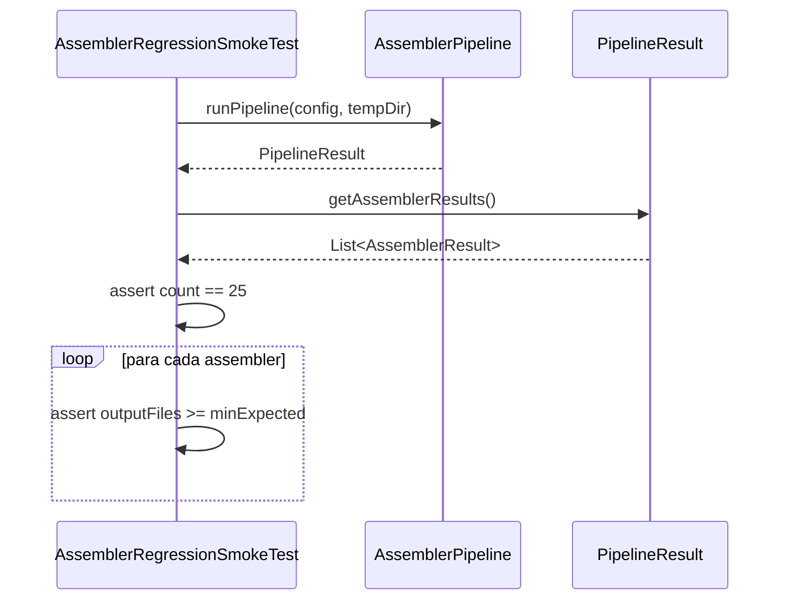

# História: Smoke Test de Regressão de Assemblers

**ID:** story-0012-0008
**Chave Jira:** —

## 1. Dependências

| Blocked By | Blocks |
| :--- | :--- |
| story-0012-0003 | story-0012-0011 |

## 2. Regras Transversais Aplicáveis

| ID | Título |
| :--- | :--- |
| RULE-001 | Parametrização por Perfil |
| RULE-003 | Non-Blocking no Pipeline de Geração |

## 3. Descrição

Como **engenheiro de plataforma**, eu quero um smoke test que valide que todos os 25 assemblers são executados na ordem correta e que cada assembler contribui com artefatos ao output, para detectar quando um assembler é adicionado, removido ou reordenado sem atualização dos testes.

### Contexto

O pipeline executa 25 assemblers em ordem fixa (RULE-005 do AssemblerPipelineTest existente). O teste existente `AssemblerPipelineTest` valida a lista de assemblers, mas não valida que cada assembler PRODUZ output. Um assembler que executa mas gera 0 arquivos (por bug de condição) passaria no teste existente mas falharia neste smoke test.

### 3.1 Validação de Execução Completa

Para cada perfil, verificar que:
1. O pipeline reporta exatamente 25 assemblers executados
2. Cada assembler contribui com pelo menos 1 arquivo (ou é condicionalmente desabilitado)
3. A ordem de execução corresponde à especificação RULE-005

### 3.2 Validação de Contribuição por Assembler

Para cada assembler, manter expectativa mínima de output:
- `RulesAssembler` → `.claude/rules/` (6 arquivos)
- `SkillsAssembler` → `.claude/skills/` (14+ skills)
- `AgentsAssembler` → `.claude/agents/` (8 agentes)
- etc.

### 3.3 Assemblers Condicionais

Alguns assemblers são condicionais (ex: `GrpcDocsAssembler` só gera se `interfaces` contém `grpc`). Para esses, verificar:
- Se condição ativa → assembler gera output
- Se condição inativa → assembler é skipped gracefully

## 4. Definições de Qualidade Locais

### DoR Local

- [ ] `PipelineSmokeTest` implementado e passando (story-0012-0003)
- [ ] Lista dos 25 assemblers e suas condições mapeada
- [ ] `AssemblerPipelineTest` existente revisado

### DoD Local

- [ ] Classe `AssemblerRegressionSmokeTest` criada
- [ ] Validação de 25 assemblers executados
- [ ] Validação de contribuição mínima por assembler
- [ ] Validação de assemblers condicionais (ativo/inativo)
- [ ] Todos os 8 perfis passando
- [ ] Nenhuma regressão nos testes existentes

### Global DoD

- [ ] Cobertura de linhas >= 95%
- [ ] Cobertura de branches >= 90%
- [ ] Zero warnings do compilador/linter
- [ ] Testes seguem padrão test-first (TDD)
- [ ] Commits atômicos com Conventional Commits

## 5. Contratos de Dados

| Campo | Tipo | Obrigatório | Descrição |
| :--- | :--- | :--- | :--- |
| `profile` | `String` | Sim | Nome do perfil bundled |
| `assemblerCount` | `int` | Sim | Número esperado de assemblers (25) |
| `assemblerExpectations` | `Map<String, AssemblerExpectation>` | Sim | Mapa de assembler → expectativa mínima |
| `conditionalAssemblers` | `Set<String>` | Sim | Assemblers que podem ser skipped |

### AssemblerExpectation

| Campo | Tipo | Descrição |
| :--- | :--- | :--- |
| `outputDirectory` | `String` | Diretório onde o assembler gera output |
| `minFileCount` | `int` | Mínimo de arquivos esperados |
| `condition` | `String` | Condição de ativação (ou `null` para incondicional) |

## 6. Diagramas (Mermaid)



## 7. Critérios de Aceite (Gherkin)

```gherkin
Cenario: Pipeline executa exatamente 25 assemblers
  DADO que o pipeline executou com sucesso para "<perfil>"
  QUANDO a contagem de assemblers é verificada
  ENTÃO exatamente 25 assemblers foram executados

Cenario: Cada assembler incondicional contribui com output
  DADO que o pipeline executou com sucesso para "<perfil>"
  QUANDO a contribuição de cada assembler incondicional é verificada
  ENTÃO cada um gera pelo menos o mínimo esperado de arquivos

Cenario: Assembler condicional ativo gera output
  DADO que o perfil "java-quarkus" tem smokeTests=true
  QUANDO o SmokeTestAssembler é verificado
  ENTÃO ele gera arquivos no diretório "tests/smoke/"

Cenario: Assembler condicional inativo é skipped
  DADO que o perfil não tem interfaces contendo "grpc"
  QUANDO o GrpcDocsAssembler é verificado
  ENTÃO ele não gera nenhum arquivo
  E nenhum erro é reportado

Cenario: Novo assembler adicionado é detectado
  DADO que o pipeline reporta 26 assemblers (1 novo)
  QUANDO a validação é executada esperando 25
  ENTÃO o teste falha indicando assembler inesperado
  E a mensagem inclui o nome do assembler extra
```

## 8. Sub-tarefas

- [ ] [Dev] Mapear expectativas mínimas de output para cada assembler
- [ ] [Dev] Identificar assemblers condicionais e suas condições
- [ ] [Test] Teste RED: pipeline executa 25 assemblers
- [ ] [Dev] Implementar validação de contagem de assemblers
- [ ] [Test] Teste RED: cada assembler contribui com output mínimo
- [ ] [Dev] Implementar validação de contribuição por assembler
- [ ] [Test] Teste RED: assemblers condicionais são respeitados
- [ ] [Dev] Implementar validação de assemblers condicionais
- [ ] [Test] Executar para todos os 8 perfis e confirmar GREEN
