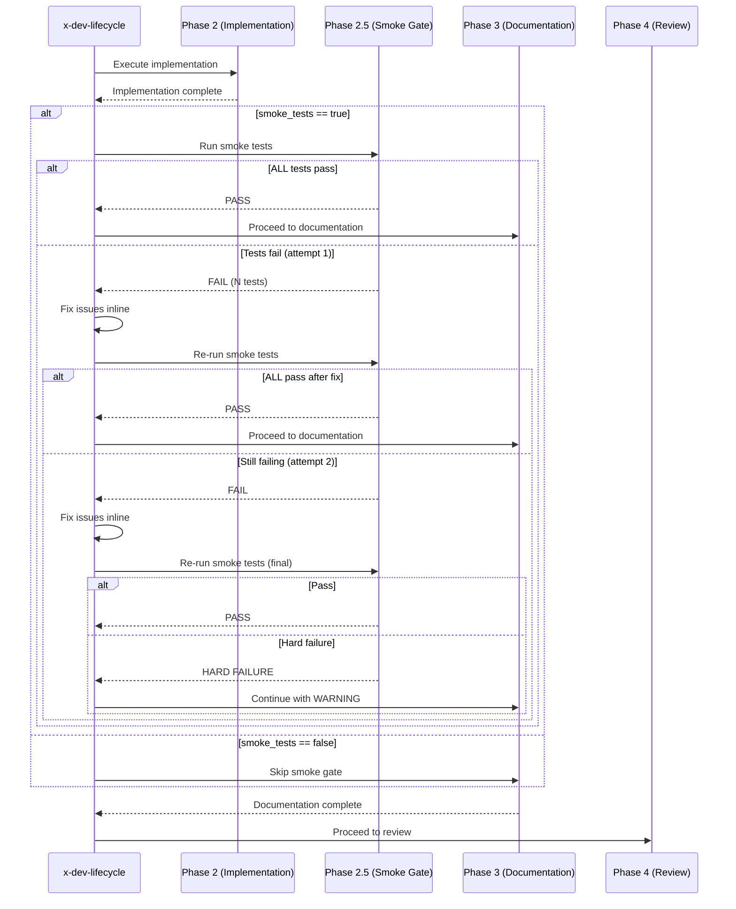
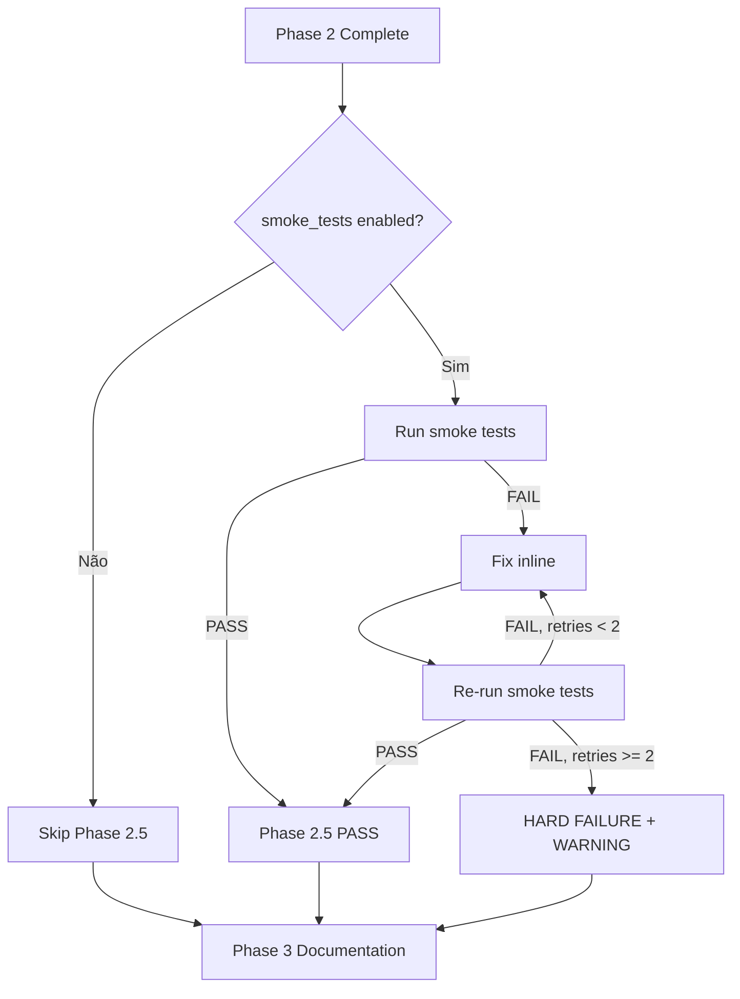

# História: Integrar Smoke Tests no Skill x-dev-lifecycle

**ID:** story-0012-0009
**Chave Jira:** —

## 1. Dependências

| Blocked By | Blocks |
| :--- | :--- |
| story-0012-0003, story-0012-0004, story-0012-0005 | story-0012-0010 |

## 2. Regras Transversais Aplicáveis

| ID | Título |
| :--- | :--- |
| RULE-004 | Smoke Gate Bloqueante |

## 3. Descrição

Como **engenheiro de plataforma**, eu quero que o skill `x-dev-lifecycle` execute smoke tests automaticamente após a implementação e antes da review, para que falhas estruturais sejam detectadas e corrigidas ANTES de consumir tokens em review paralela.

### Contexto

O skill `x-dev-lifecycle` orquestra 9 fases (0-8). Atualmente, após Phase 2 (Implementation) vai direto para Phase 3 (Documentation) e depois Phase 4 (Review). Esta história adiciona uma Phase 2.5 (Smoke Gate) entre Implementation e Documentation. Se o smoke gate falha, o desenvolvedor corrige antes de prosseguir.

### 3.1 Nova Fase: Phase 2.5 — Smoke Gate

Inserir entre Phase 2 (Implementation) e Phase 3 (Documentation):

```
Phase 2: Implementation        (subagent)
Phase 2.5: Smoke Gate          (orchestrator — inline)    ← NOVO
Phase 3: Documentation         (orchestrator — inline)
Phase 4: Review                (invoke /x-review)
```

### 3.2 Comportamento da Phase 2.5

1. Executar `mvn verify -P integration-tests -pl . -Dtest.smoke=true` (ou equivalente configurável via `{{SMOKE_COMMAND}}`)
2. Se TODOS os smoke tests passarem:
   - Log: `">>> Phase 2.5/8 completed. Smoke Gate PASSED. Proceeding to Phase 3..."`
   - Continuar para Phase 3
3. Se QUALQUER smoke test falhar:
   - Log: `">>> Phase 2.5/8 FAILED. Smoke Gate BLOCKED. {N} test(s) failed."`
   - Listar testes falhados com detalhes
   - Executar correções inline (similar à Phase 5 — Fixes)
   - Re-executar smoke tests
   - Max 2 tentativas de correção. Se após 2 tentativas ainda falhar:
     - Log: `"SMOKE GATE HARD FAILURE after 2 retry cycles. Manual intervention required."`
     - Continuar para Phase 3 com WARNING (não bloqueia permanentemente, pois a review ainda vai avaliar)

### 3.3 Atualização da Documentação do Skill

- Atualizar a seção "Complete Flow" para incluir Phase 2.5
- Atualizar a contagem de fases (9 → 10 fases: 0, 1, 1B-1E, 2, 2.5, 3, 4, 5-6, 7, 8)
- Atualizar mensagens de progresso

### 3.4 Configurabilidade

- O smoke gate é ativado quando `testing.smoke_tests == true` no project identity
- Se `testing.smoke_tests == false`, Phase 2.5 é skipped com log: `"Smoke Gate skipped (testing.smoke_tests=false)"`
- O comando de smoke test é configurável via `{{SMOKE_COMMAND}}` placeholder

## 4. Definições de Qualidade Locais

### DoR Local

- [ ] Smoke tests das stories 0003, 0004, 0005 implementados e passando
- [ ] Skill `x-dev-lifecycle/SKILL.md` revisado e compreendido
- [ ] Fases atuais mapeadas (0-8)

### DoD Local

- [ ] Phase 2.5 adicionada ao skill SKILL.md
- [ ] Seção "Complete Flow" atualizada
- [ ] Comportamento de retry (max 2) documentado
- [ ] Condição de skip documentada (smoke_tests=false)
- [ ] Placeholder `{{SMOKE_COMMAND}}` documentado
- [ ] Mensagens de progresso atualizadas
- [ ] Golden files de skills atualizados
- [ ] Nenhuma regressão nos testes existentes

### Global DoD

- [ ] Cobertura de linhas >= 95%
- [ ] Cobertura de branches >= 90%
- [ ] Zero warnings do compilador/linter
- [ ] Testes seguem padrão test-first (TDD)
- [ ] Commits atômicos com Conventional Commits

## 5. Contratos de Dados

| Campo | Tipo | Obrigatório | Descrição |
| :--- | :--- | :--- | :--- |
| `smokeTestsEnabled` | `boolean` | Sim | Flag do project identity `testing.smoke_tests` |
| `smokeCommand` | `String` | Não | Comando customizado de smoke test (padrão: `{{SMOKE_COMMAND}}`) |
| `maxRetries` | `int` | Sim | Tentativas máximas de correção (padrão: 2) |
| `smokeResult` | `PASS/FAIL/SKIP` | Sim | Resultado da Phase 2.5 |
| `failedTests` | `List<String>` | Não | Lista de testes que falharam |

## 6. Diagramas (Mermaid)





## 7. Critérios de Aceite (Gherkin)

```gherkin
Cenario: Smoke gate é skipped quando smoke_tests=false
  DADO que o project identity tem testing.smoke_tests=false
  QUANDO x-dev-lifecycle executa
  ENTÃO Phase 2.5 é skipped com log "Smoke Gate skipped"
  E Phase 3 é executada diretamente após Phase 2

Cenario: Smoke gate passa na primeira tentativa
  DADO que o project identity tem testing.smoke_tests=true
  E todos os smoke tests passam
  QUANDO Phase 2.5 é executada
  ENTÃO o resultado é PASS
  E a mensagem "Smoke Gate PASSED" é emitida
  E Phase 3 é executada

Cenario: Smoke gate falha e correção na primeira tentativa
  DADO que o project identity tem testing.smoke_tests=true
  E 2 smoke tests falham inicialmente
  E as falhas são corrigíveis
  QUANDO Phase 2.5 é executada
  ENTÃO correções são aplicadas inline
  E smoke tests são re-executados
  E o resultado final é PASS após correção

Cenario: Smoke gate hard failure após 2 tentativas
  DADO que o project identity tem testing.smoke_tests=true
  E smoke tests falham persistentemente
  QUANDO Phase 2.5 é executada com max 2 tentativas
  ENTÃO após 2 tentativas de correção sem sucesso
  E a mensagem "SMOKE GATE HARD FAILURE" é emitida
  E Phase 3 é executada com WARNING

Cenario: Phase 2.5 aparece no flow completo
  DADO que o skill SKILL.md é lido
  QUANDO a seção "Complete Flow" é verificada
  ENTÃO Phase 2.5 está listada entre Phase 2 e Phase 3
```

## 8. Sub-tarefas

- [ ] [Dev] Adicionar Phase 2.5 ao "Complete Flow" no SKILL.md
- [ ] [Dev] Documentar comportamento de Phase 2.5 (execução, retry, skip)
- [ ] [Dev] Documentar placeholder `{{SMOKE_COMMAND}}`
- [ ] [Dev] Atualizar mensagens de progresso (Phase N/8 → Phase N/9 ou manter numeração com .5)
- [ ] [Dev] Documentar condição de skip (testing.smoke_tests=false)
- [ ] [Dev] Documentar hard failure behavior (WARNING, não bloqueante permanente)
- [ ] [Test] Validar que golden files de skills refletem a mudança
- [ ] [Dev] Atualizar golden files se necessário
- [ ] [Dev] Atualizar counterpart GitHub Copilot skill se existir
