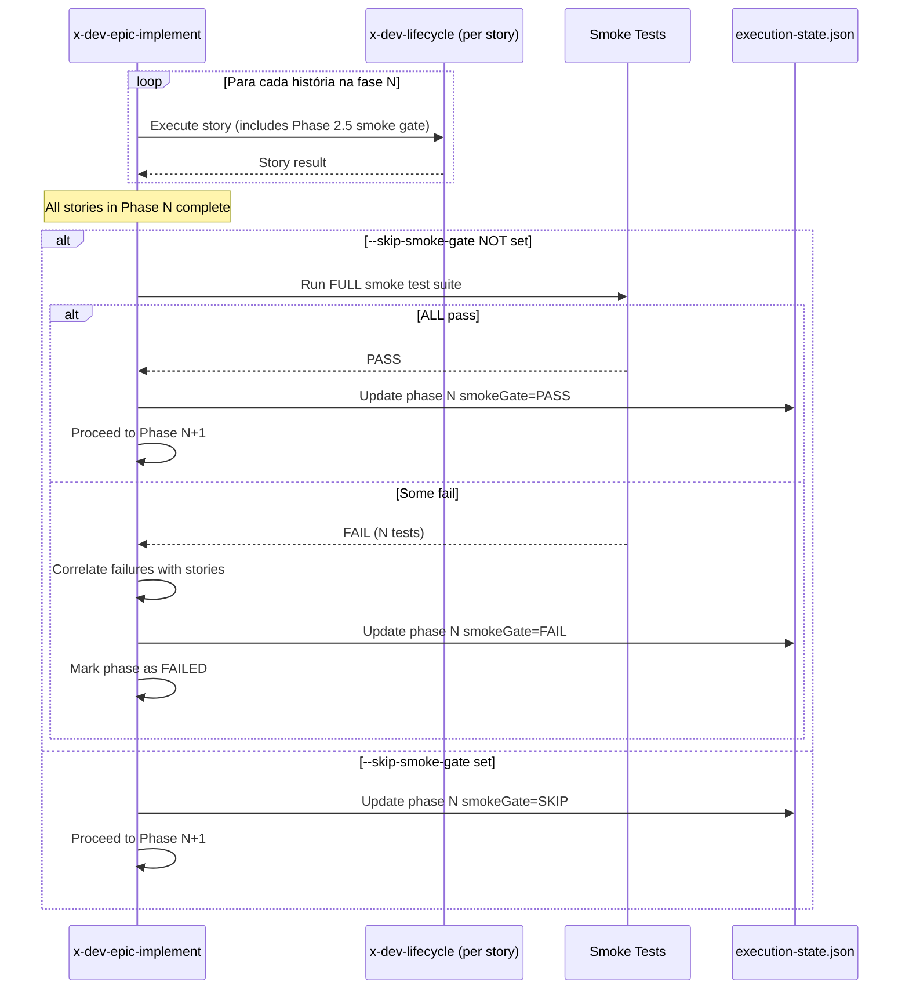

# História: Integrar Smoke Tests no Skill x-dev-epic-implement

**ID:** story-0012-0010
**Chave Jira:** —

## 1. Dependências

| Blocked By | Blocks |
| :--- | :--- |
| story-0012-0009 | — |

## 2. Regras Transversais Aplicáveis

| ID | Título |
| :--- | :--- |
| RULE-004 | Smoke Gate Bloqueante |

## 3. Descrição

Como **engenheiro de plataforma**, eu quero que o skill `x-dev-epic-implement` execute smoke tests nos integrity gates de cada fase, para que a progressão entre fases do épico só ocorra quando os smoke tests confirmam integridade do output.

### Contexto

O skill `x-dev-epic-implement` orquestra a execução de histórias em fases. Cada fase tem um "integrity gate" que valida cobertura e testes antes de permitir progressão. Esta história adiciona a execução de smoke tests como parte do integrity gate. Como cada história já executa o smoke gate via `x-dev-lifecycle` (Phase 2.5), o integrity gate do epic faz uma validação ADICIONAL de regressão — garante que a implementação de uma história não quebrou o output de histórias anteriores.

### 3.1 Smoke Gate no Integrity Gate

Após todas as histórias de uma fase completarem:

1. Executar smoke tests completos (não apenas os da história atual)
2. Se PASS → progressão para próxima fase liberada
3. Se FAIL → investigar qual história da fase introduziu a regressão
4. Registrar resultado no checkpoint (`execution-state.json`)

### 3.2 Comportamento de Falha

Se o smoke gate do integrity gate falha:
1. Identificar quais testes falharam
2. Correlacionar com histórias da fase (baseado nos arquivos tocados)
3. Log: `"INTEGRITY GATE SMOKE FAILURE: Phase {N}. {count} test(s) failed. Suspected stories: [{list}]"`
4. A fase é marcada como `FAILED` no checkpoint
5. O operador decide: `--resume` para tentar novamente após fix manual, ou `--skip-review` para prosseguir

### 3.3 Skip Condition

Mesmo que `testing.smoke_tests=true` no project identity, o smoke gate do integrity gate pode ser skipped com:
- Flag `--skip-smoke-gate` no `x-dev-epic-implement`
- Log: `"Integrity gate smoke tests skipped (--skip-smoke-gate)"`

### 3.4 Atualização do Checkpoint

Adicionar campo ao `execution-state.json`:

```json
{
  "phases": {
    "0": {
      "status": "SUCCESS",
      "smokeGate": {
        "status": "PASS",
        "testsRun": 45,
        "testsFailed": 0,
        "timestamp": "2026-03-25T14:30:00Z"
      }
    }
  }
}
```

## 4. Definições de Qualidade Locais

### DoR Local

- [ ] Story-0012-0009 implementada (smoke gate no x-dev-lifecycle)
- [ ] Skill `x-dev-epic-implement/SKILL.md` revisado e compreendido
- [ ] Formato de `execution-state.json` compreendido
- [ ] Integrity gate existente documentado

### DoD Local

- [ ] Smoke gate adicionado ao integrity gate no SKILL.md
- [ ] Flag `--skip-smoke-gate` documentada
- [ ] Formato de checkpoint atualizado com `smokeGate` field
- [ ] Comportamento de falha documentado (correlação com histórias)
- [ ] Golden files de skills atualizados
- [ ] Nenhuma regressão nos testes existentes

### Global DoD

- [ ] Cobertura de linhas >= 95%
- [ ] Cobertura de branches >= 90%
- [ ] Zero warnings do compilador/linter
- [ ] Testes seguem padrão test-first (TDD)
- [ ] Commits atômicos com Conventional Commits

## 5. Contratos de Dados

| Campo | Tipo | Obrigatório | Descrição |
| :--- | :--- | :--- | :--- |
| `phaseId` | `int` | Sim | Identificador da fase (0-N) |
| `smokeGateResult` | `PASS/FAIL/SKIP` | Sim | Resultado do smoke gate no integrity gate |
| `testsRun` | `int` | Sim | Número de smoke tests executados |
| `testsFailed` | `int` | Sim | Número de smoke tests que falharam |
| `suspectedStories` | `List<String>` | Não | Histórias suspeitas de causar regressão |
| `skipSmokeGate` | `boolean` | Não | Flag para pular smoke gate (padrão: false) |

### Formato do Checkpoint (smokeGate)

```json
{
  "status": "PASS | FAIL | SKIP",
  "testsRun": 45,
  "testsFailed": 0,
  "failedTests": [],
  "suspectedStories": [],
  "timestamp": "ISO-8601"
}
```

## 6. Diagramas (Mermaid)



## 7. Critérios de Aceite (Gherkin)

```gherkin
Cenario: Smoke gate passa no integrity gate
  DADO que todas as histórias da fase 0 completaram com sucesso
  E smoke tests passam
  QUANDO o integrity gate da fase 0 é executado
  ENTÃO o smokeGate status é "PASS"
  E o checkpoint é atualizado
  E a fase 1 é liberada para execução

Cenario: Smoke gate falha no integrity gate
  DADO que todas as histórias da fase 1 completaram
  MAS smoke tests detectam regressão
  QUANDO o integrity gate é executado
  ENTÃO o smokeGate status é "FAIL"
  E as histórias suspeitas são listadas
  E a fase é marcada como FAILED no checkpoint

Cenario: Smoke gate é skipped com flag
  DADO que --skip-smoke-gate é passado
  QUANDO o integrity gate é executado
  ENTÃO o smokeGate status é "SKIP"
  E a próxima fase é liberada

Cenario: Checkpoint registra resultado do smoke gate
  DADO que o integrity gate da fase 0 executou com PASS
  QUANDO o execution-state.json é lido
  ENTÃO phase 0 contém "smokeGate" com status "PASS"
  E testsRun > 0
  E testsFailed == 0
```

## 8. Sub-tarefas

- [ ] [Dev] Adicionar smoke gate ao integrity gate no SKILL.md
- [ ] [Dev] Documentar flag `--skip-smoke-gate`
- [ ] [Dev] Documentar formato de checkpoint atualizado
- [ ] [Dev] Documentar comportamento de falha (correlação com histórias)
- [ ] [Dev] Documentar skip condition
- [ ] [Test] Validar que golden files refletem a mudança
- [ ] [Dev] Atualizar golden files se necessário
- [ ] [Dev] Atualizar counterpart GitHub Copilot skill se existir
- [ ] [Dev] Adicionar `--skip-smoke-gate` à tabela de flags no skill
