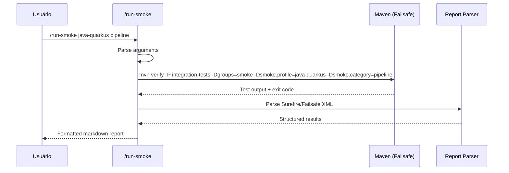

# História: Criar Skill /run-smoke para Execução On-Demand

**ID:** story-0012-0011
**Chave Jira:** —

## 1. Dependências

| Blocked By | Blocks |
| :--- | :--- |
| story-0012-0003, story-0012-0004, story-0012-0005, story-0012-0006, story-0012-0007, story-0012-0008 | — |

## 2. Regras Transversais Aplicáveis

| ID | Título |
| :--- | :--- |
| RULE-007 | Relatório Estruturado |

## 3. Descrição

Como **engenheiro de plataforma**, eu quero um skill invocável `/run-smoke` que execute todos os smoke tests on-demand e produza relatório estruturado, para que eu possa validar rapidamente a integridade da aplicação a qualquer momento sem depender do ciclo de vida completo.

### Contexto

Os smoke tests criados nas stories anteriores são executados como integration tests via Maven. O skill `/run-smoke` provê uma interface conveniente no Claude Code para executar esses testes e apresentar resultados de forma legível, similar ao existente `/run-e2e`.

### 3.1 Argumentos

| Argumento | Formato | Padrão | Descrição |
| :--- | :--- | :--- | :--- |
| `profile` | string | `all` | Perfil específico ou `all` para todos |
| `category` | string | `all` | Categoria: `pipeline`, `content`, `structure`, `cli`, `cross-profile`, `assembler`, `all` |

### 3.2 Execução

1. Construir comando Maven baseado nos argumentos:
   - `all`: `mvn verify -P integration-tests -Dgroups=smoke`
   - Perfil específico: `mvn verify -P integration-tests -Dgroups=smoke -Dsmoke.profile=java-quarkus`
   - Categoria específica: `mvn verify -P integration-tests -Dgroups=smoke -Dsmoke.category=pipeline`
2. Executar o comando
3. Parsear output (Surefire/Failsafe reports)
4. Produzir relatório

### 3.3 Formato do Relatório

```
## Smoke Test Report

**Status:** PASS | FAIL
**Profile:** all (8 profiles)
**Category:** all
**Duration:** 45s

### Summary
| Category   | Tests | Passed | Failed | Skipped |
|------------|-------|--------|--------|---------|
| Pipeline   | 8     | 8      | 0      | 0       |
| Content    | 8     | 8      | 0      | 0       |
| Structure  | 8     | 8      | 0      | 0       |
| CLI        | 4     | 4      | 0      | 0       |
| CrossProf  | 3     | 3      | 0      | 0       |
| Assembler  | 8     | 8      | 0      | 0       |
| **Total**  | **39**| **39** | **0**  | **0**   |

### Failed Tests
(none)
```

### 3.4 Template do Skill

Criar `src/main/resources/skills-templates/core/run-smoke/SKILL.md` com frontmatter e instruções, seguindo o padrão do `/run-e2e` existente.

### 3.5 Integração no Pipeline de Geração

O `SkillsAssembler` já gera skills a partir de templates em `skills-templates/`. O novo skill será automaticamente incluído na geração.

## 4. Definições de Qualidade Locais

### DoR Local

- [ ] Todas as classes de smoke test das stories 0003-0008 implementadas
- [ ] Skill `/run-e2e` revisado como referência de formato
- [ ] `SkillsAssembler` compreendido para inclusão automática

### DoD Local

- [ ] Template `skills-templates/core/run-smoke/SKILL.md` criado
- [ ] Frontmatter com `name: run-smoke`, `description`, `allowed-tools`
- [ ] Argumentos documentados (profile, category)
- [ ] Formato de relatório documentado
- [ ] Skill aparece na lista de skills gerados
- [ ] Golden files atualizados com novo skill
- [ ] Nenhuma regressão nos testes existentes

### Global DoD

- [ ] Cobertura de linhas >= 95%
- [ ] Cobertura de branches >= 90%
- [ ] Zero warnings do compilador/linter
- [ ] Testes seguem padrão test-first (TDD)
- [ ] Commits atômicos com Conventional Commits

## 5. Contratos de Dados

| Campo | Tipo | Obrigatório | Descrição |
| :--- | :--- | :--- | :--- |
| `profile` | `String` | Não | Perfil alvo (`all` por padrão) |
| `category` | `String` | Não | Categoria de teste (`all` por padrão) |
| `status` | `PASS/FAIL` | Sim | Status geral |
| `totalTests` | `int` | Sim | Total de testes executados |
| `passedTests` | `int` | Sim | Testes que passaram |
| `failedTests` | `int` | Sim | Testes que falharam |
| `skippedTests` | `int` | Sim | Testes skipped |
| `duration` | `String` | Sim | Duração da execução |
| `categories` | `Map<String, CategoryResult>` | Sim | Resultado por categoria |

## 6. Diagramas (Mermaid)



```mermaid
flowchart TD
    A[/run-smoke args] --> B{Parse arguments}
    B --> C{profile?}
    C -->|all| D[Todos os perfis]
    C -->|específico| E[Filtrar por perfil]
    B --> F{category?}
    F -->|all| G[Todas as categorias]
    F -->|específica| H[Filtrar por categoria]
    D --> I[Build Maven command]
    E --> I
    G --> I
    H --> I
    I --> J[Execute Maven]
    J --> K[Parse results]
    K --> L[Format report]
    L --> M[Output to user]
```

## 7. Critérios de Aceite (Gherkin)

```gherkin
Cenario: Execução sem argumentos roda todos os testes
  DADO que o skill é invocado sem argumentos
  QUANDO /run-smoke é executado
  ENTÃO todos os smoke tests para todos os perfis são executados
  E o relatório mostra status geral PASS ou FAIL

Cenario: Filtro por perfil executa apenas perfil selecionado
  DADO que o skill é invocado com "java-quarkus"
  QUANDO /run-smoke java-quarkus é executado
  ENTÃO apenas smoke tests para java-quarkus são executados
  E o relatório mostra "Profile: java-quarkus"

Cenario: Filtro por categoria executa apenas categoria selecionada
  DADO que o skill é invocado com "all pipeline"
  QUANDO /run-smoke all pipeline é executado
  ENTÃO apenas smoke tests de pipeline são executados para todos os perfis
  E o relatório mostra "Category: pipeline"

Cenario: Relatório tem formato estruturado
  DADO que os smoke tests executaram
  QUANDO o relatório é gerado
  ENTÃO contém tabela de resumo por categoria
  E contém total de testes, passados, falhados, skipped
  E contém duração
  E se houver falhas, contém seção "Failed Tests" com detalhes

Cenario: Skill template tem frontmatter válido
  DADO que o template do skill foi criado
  QUANDO o SKILL.md é parseado
  ENTÃO frontmatter contém "name: run-smoke"
  E frontmatter contém "description" não vazia
  E frontmatter contém "allowed-tools"
```

## 8. Sub-tarefas

- [ ] [Dev] Criar diretório `skills-templates/core/run-smoke/`
- [ ] [Dev] Criar `SKILL.md` com frontmatter e documentação
- [ ] [Dev] Documentar argumentos (profile, category)
- [ ] [Dev] Documentar formato de relatório
- [ ] [Dev] Documentar fluxo de execução
- [ ] [Dev] Documentar exemplos de uso
- [ ] [Test] Validar que `SkillsAssembler` inclui o novo skill na geração
- [ ] [Dev] Atualizar golden files com novo skill
- [ ] [Test] Teste de integração: skill aparece no output gerado para todos os 8 perfis
- [ ] [Dev] Atualizar CLAUDE.md com referência ao novo skill (se gerado automaticamente, verificar)
