# Implementation Map — EPIC-0013: Cobertura Completa do SDLC

## 1. Grafo de Dependências

```mermaid
graph TD
    S1[0001: PR/Issue Templates]
    S2[0002: CI/CD KP]
    S3[0003: Rules 07-09]
    S4[0004: CD Workflows]
    S5[0005: x-ci-cd-generate]
    S6[0006: Incident/Postmortem]
    S7[0007: Operational Runbook]
    S8[0008: SRE KP]
    S9[0009: SRE Agent]
    S10[0010: x-ops-incident]
    S11[0011: SLO/SLI + Obs KP]
    S12[0012: Release Mgmt KP]
    S13[0013: Release Checklist]
    S14[0014: x-release]
    S15[0015: Data Mgmt KP]
    S16[0016: Migration Template]
    S17[0017: DB KP Ext + Agent]
    S18[0018: Perf Engineering KP]
    S19[0019: x-perf-profile]
    S20[0020: Feature Flags KP]
    S21[0021: Security SBOM Ext]
    S22[0022: x-threat-model]
    S23[0023: Resilience+DR]
    S24[0024: API Deprecation+FinOps]
    S25[0025: x-setup-dev + Contributing]
    S26[0026: Pipeline Integration]

    S2 --> S4
    S4 --> S5
    S2 --> S5
    S6 --> S7
    S6 --> S10
    S8 --> S9
    S8 --> S10
    S8 --> S11
    S8 --> S23
    S9 --> S10
    S12 --> S13
    S13 --> S14
    S12 --> S14
    S15 --> S16
    S15 --> S17
    S18 --> S19

    S1 --> S26
    S3 --> S26
    S5 --> S26
    S7 --> S26
    S10 --> S26
    S11 --> S26
    S14 --> S26
    S16 --> S26
    S17 --> S26
    S19 --> S26
    S20 --> S26
    S21 --> S26
    S22 --> S26
    S23 --> S26
    S24 --> S26
    S25 --> S26
```



## 2. Fases de Implementação

### Phase 1 — Foundation (sem dependências, máximo paralelismo)

```
┌─────────────────────────────────────────────────────────────────────────────┐
│ PHASE 1: Foundation (13 stories em paralelo)                                │
│                                                                             │
│  [0001] PR/Issue Templates    [0002] CI/CD KP        [0003] Rules 07-09    │
│  [0006] Incident/Postmortem   [0008] SRE KP          [0012] Release KP     │
│  [0015] Data Mgmt KP         [0018] Perf Eng KP     [0020] Feature Flags  │
│  [0021] Security SBOM Ext    [0022] x-threat-model   [0024] API+FinOps    │
│  [0025] x-setup-dev                                                        │
└─────────────────────────────────────────────────────────────────────────────┘
```

**Stories:** 0001, 0002, 0003, 0006, 0008, 0012, 0015, 0018, 0020, 0021, 0022, 0024, 0025
**Parallelism:** 13 stories independentes
**Critical Path Impact:** Nenhuma — todas são raízes do grafo

### Phase 2 — Dependent Artifacts (dependem de Phase 1)

```
┌─────────────────────────────────────────────────────────────────────────────┐
│ PHASE 2: Dependent Artifacts (9 stories)                                    │
│                                                                             │
│  [0004] CD Workflows  ←  0002                                              │
│  [0007] Op. Runbook   ←  0006                                              │
│  [0009] SRE Agent     ←  0008                                              │
│  [0011] SLO/SLI       ←  0008                                              │
│  [0013] Release Check ←  0012                                              │
│  [0016] Migration Tpl ←  0015                                              │
│  [0017] DB KP+Agent   ←  0015                                              │
│  [0019] x-perf-prof   ←  0018                                              │
│  [0023] Chaos+DR      ←  0008                                              │
└─────────────────────────────────────────────────────────────────────────────┘
```

**Stories:** 0004, 0007, 0009, 0011, 0013, 0016, 0017, 0019, 0023
**Parallelism:** 9 stories em paralelo (cada uma depende de uma story diferente da Phase 1)
**Critical Path:** 0002 → 0004 → 0005 (CI/CD chain)

### Phase 3 — Skills de Orquestração (dependem de Phase 2)

```
┌─────────────────────────────────────────────────────────────────────────────┐
│ PHASE 3: Orchestration Skills (3 stories)                                   │
│                                                                             │
│  [0005] x-ci-cd-generate  ←  0002, 0004                                   │
│  [0010] x-ops-incident    ←  0006, 0008, 0009                             │
│  [0014] x-release         ←  0012, 0013                                   │
└─────────────────────────────────────────────────────────────────────────────┘
```

**Stories:** 0005, 0010, 0014
**Parallelism:** 3 stories em paralelo
**Critical Path:** 0002 → 0004 → 0005 (mais longa cadeia)

### Phase 4 — Integration (depende de TUDO)

```
┌─────────────────────────────────────────────────────────────────────────────┐
│ PHASE 4: Integration & Validation (1 story)                                 │
│                                                                             │
│  [0026] Pipeline Integration  ←  0001-0025 (todas)                         │
└─────────────────────────────────────────────────────────────────────────────┘
```

**Stories:** 0026
**Parallelism:** Nenhum — execução sequencial obrigatória
**Critical Path:** Depende da conclusão de TODAS as stories anteriores

## 3. Caminho Crítico

```
0002 (CI/CD KP) → 0004 (CD Workflows) → 0005 (x-ci-cd-generate) → 0026 (Integration)
```

**Duração estimada do caminho crítico:** 4 phases sequenciais

**Caminhos paralelos mais longos:**
- `0008 → 0009 → 0010 → 0026` (SRE chain, 4 phases)
- `0012 → 0013 → 0014 → 0026` (Release chain, 4 phases)
- `0006 → 0010 → 0026` (Incident chain, 3 phases)
- `0015 → 0016/0017 → 0026` (Data chain, 3 phases)
- `0018 → 0019 → 0026` (Performance chain, 3 phases)

## 4. Resumo por Phase

| Phase | Stories | Parallelism | Blocked By |
| :--- | :--- | :--- | :--- |
| **Phase 1** | 13 stories | 13 parallel | — |
| **Phase 2** | 9 stories | 9 parallel | Phase 1 |
| **Phase 3** | 3 stories | 3 parallel | Phase 2 |
| **Phase 4** | 1 story | sequential | Phase 3 |
| **Total** | **26 stories** | **Max 13 parallel** | — |

## 5. Observações Estratégicas

1. **Alto Paralelismo:** Phase 1 permite 13 stories em paralelo, maximizando throughput do épico
2. **Dependency Chains:** As 3 maiores cadeias (CI/CD, SRE, Release) têm profundidade 4 — são o gargalo
3. **Story 0026 é o bottleneck:** Depende de TODAS as 25 stories anteriores. Deve ser a última a executar.
4. **Worktrees recomendados:** Phase 1 e Phase 2 são candidatas ideais para execução em worktrees paralelos
5. **Integrity Gates:** Entre cada phase, validar que o pipeline compila e testes existentes passam
6. **Risco de conflito:** Stories que modificam templates existentes (0011, 0017, 0021, 0023, 0024) podem conflitar se executadas em worktrees paralelos — monitorar file overlap
