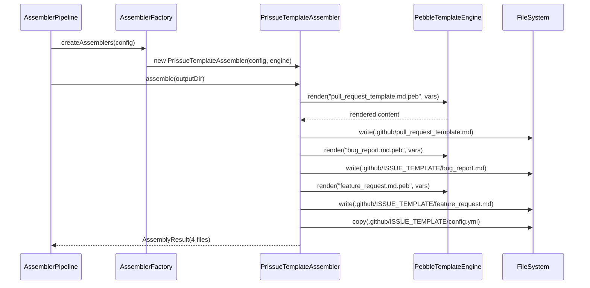

# Historia: GitHub PR e Issue Templates Assembler

**ID:** story-0013-0001
**Chave Jira:** --
**Status:** Pendente

## 1. Dependencias

| Blocked By | Blocks |
| :--- | :--- |
| -- | story-0013-0026 |

## 2. Regras Transversais Aplicaveis

| ID | Titulo |
| :--- | :--- |
| RULE-001 | Template Consistency |
| RULE-002 | Assembler Integration |
| RULE-003 | Pebble Template Variables |
| RULE-005 | Golden File Compatibility |

## 3. Descricao

Como **engenheiro de plataforma**, eu quero que o pipeline de geracao produza automaticamente templates de Pull Request e Issue (bug report, feature request) no diretorio `.github/` dos projetos gerados, para que todo repositorio criado com ia-dev-env tenha padroes de comunicacao profissionais desde o dia 1.

### Contexto

Atualmente o ia-dev-env gera extensos artefatos para `.claude/`, `.github/skills/`, `.github/agents/` e `.github/instructions/`, mas NAO gera os templates padrao do GitHub para Pull Requests e Issues. Isso significa que desenvolvedores que criam repositorios com ia-dev-env nao tem um formato consistente para PRs e bug reports, dependendo de cada pessoa criar manualmente esses templates.

Esta historia cria: (1) templates Pebble para PR e Issues que usam variaveis do projeto, (2) um novo assembler `PrIssueTemplateAssembler` integrado ao pipeline, e (3) a configuracao do issue template chooser do GitHub.

### 3.1 Pull Request Template

- Arquivo gerado: `.github/pull_request_template.md`
- Secoes: Summary, Type of Change (checklist), Testing (checklist), Checklist (cobertura, TDD, docs)
- Usa variaveis Pebble: `{{PROJECT_NAME}}`, `{{COVERAGE_LINE}}`, `{{COVERAGE_BRANCH}}`
- Inclui referencia ao coding standards e quality gates do projeto

### 3.2 Issue Templates

- Bug Report: `.github/ISSUE_TEMPLATE/bug_report.md` com frontmatter YAML (`name`, `description`, `labels`, `assignees`)
  - Secoes: Describe the Bug, Steps to Reproduce, Expected Behavior, Actual Behavior, Environment, Screenshots, Additional Context
- Feature Request: `.github/ISSUE_TEMPLATE/feature_request.md`
  - Secoes: Problem Statement, Proposed Solution, Alternatives Considered, Acceptance Criteria, Additional Context
- Config: `.github/ISSUE_TEMPLATE/config.yml` com `blank_issues_enabled: false` e links para docs

### 3.3 Assembler

- Criar `PrIssueTemplateAssembler` em `dev.iadev.assembler`
- Registrar no `AssemblerPipeline` apos `GlobalInstructionsAssembler`
- O assembler e INCONDICIONAL (sempre gera para todos os projetos)
- Output: 4 arquivos (PR template + 2 issue templates + config)

## 3.5 Entrega de Valor

- **Valor Principal:** Todos os repositorios gerados incluem templates de PR e Issues padronizados
- **Metrica de Sucesso:** Pipeline gera 4 arquivos adicionais em `.github/` para todos os 10 perfis
- **Impacto no Negocio:** Comunicacao entre desenvolvedores padronizada desde o primeiro PR

## 4. Definicoes de Qualidade Locais

### DoR Local

- [ ] Estrutura de `.github/ISSUE_TEMPLATE/` do GitHub compreendida
- [ ] `AssemblerPipeline` e `AssemblerFactory` revisados
- [ ] Templates Pebble existentes revisados para manter consistencia
- [ ] Variaveis disponiveis em `TemplateVariable` identificadas

### DoD Local

- [ ] Template Pebble `pull_request_template.md.peb` criado em resources
- [ ] Template Pebble `bug_report.md.peb` criado com frontmatter YAML
- [ ] Template Pebble `feature_request.md.peb` criado com frontmatter YAML
- [ ] Template estatico `config.yml` criado
- [ ] `PrIssueTemplateAssembler.java` implementado e registrado no pipeline
- [ ] Unit tests para o assembler (output correto para 3 perfis distintos)
- [ ] Golden file manifests atualizados com 4 novos arquivos
- [ ] Smoke test validando geracao dos templates

### Global DoD

- **Cobertura:** >= 95% Line, >= 90% Branch
- **Regressao:** Golden file tests passando
- **TDD Compliance:** Test-first, refactoring explicito
- **Multi-Target:** Artefatos gerados apenas para GitHub (PR/Issue templates sao GitHub-specific)

## 5. Contratos de Dados

**Pull Request Template:**

| Campo | Tipo | Origem |
| :--- | :--- | :--- |
| `{{PROJECT_NAME}}` | String | Config YAML `project.name` |
| `{{COVERAGE_LINE}}` | Integer | Config YAML `testing.coverage.line` (default: 95) |
| `{{COVERAGE_BRANCH}}` | Integer | Config YAML `testing.coverage.branch` (default: 90) |
| `{{ARCHITECTURE}}` | String | Config YAML `architecture.style` |

**Issue Template Frontmatter:**

| Campo | Formato | Obrigatorio | Descricao |
| :--- | :--- | :--- | :--- |
| `name` | String | M | Nome do template (ex: "Bug Report") |
| `description` | String | M | Descricao curta do template |
| `title` | String | O | Prefixo do titulo (ex: "[BUG] ") |
| `labels` | List | O | Labels automaticas (ex: ["bug", "triage"]) |
| `assignees` | List | O | Assignees automaticos |

## 6. Diagramas

### 6.1 Pipeline de Geracao



## 7. Criterios de Aceite (Gherkin)

```gherkin
Cenario: Pipeline gera PR template vazio quando variaveis nao configuradas
  DADO que o config YAML nao define coverage thresholds
  QUANDO o pipeline executa o PrIssueTemplateAssembler
  ENTAO o PR template e gerado com valores default (95% line, 90% branch)

Cenario: Pipeline gera PR template com variaveis do projeto
  DADO que o config YAML define project.name="my-service" e coverage.line=98
  QUANDO o pipeline executa o PrIssueTemplateAssembler
  ENTAO o arquivo ".github/pull_request_template.md" existe
  E contem "my-service" no header
  E contem "98%" na secao de checklist de cobertura

Cenario: Pipeline gera bug report template com frontmatter valido
  DADO que o pipeline e executado para qualquer perfil
  QUANDO o PrIssueTemplateAssembler processa bug_report
  ENTAO o arquivo ".github/ISSUE_TEMPLATE/bug_report.md" existe
  E o frontmatter YAML contem campo "name" com valor "Bug Report"
  E o frontmatter YAML contem campo "labels" com "bug"

Cenario: Pipeline gera feature request template
  DADO que o pipeline e executado para qualquer perfil
  QUANDO o PrIssueTemplateAssembler processa feature_request
  ENTAO o arquivo ".github/ISSUE_TEMPLATE/feature_request.md" existe
  E contem secao "Proposed Solution"
  E contem secao "Acceptance Criteria"

Cenario: Config YAML desabilita issue em branco
  DADO que o pipeline e executado para qualquer perfil
  QUANDO o PrIssueTemplateAssembler processa config.yml
  ENTAO o arquivo ".github/ISSUE_TEMPLATE/config.yml" existe
  E contem "blank_issues_enabled: false"

Cenario: Assembler gera para todos os 10 perfis sem erro
  DADO que cada um dos 10 perfis bundled e processado
  QUANDO o pipeline completo e executado
  ENTAO todos os 4 arquivos de template sao gerados para cada perfil
  E nenhum erro e lancado
```

### 7.1 Scenario Ordering (TPP)

> TPP: degenerate (variaveis ausentes) -> unconditional (PR template com variaveis) -> condicional (bug report frontmatter) -> condicional (feature request) -> condicional (config) -> boundary (todos os perfis).

### 7.2 Mandatory Scenario Categories

- [x] Degenerate cases (variaveis nao configuradas)
- [x] Happy path (PR template com variaveis)
- [x] Error paths (N/A - assembler e incondicional)
- [x] Boundary values (todos os 10 perfis)

## 8. Sub-tarefas

- [ ] [Test] Unit test: PrIssueTemplateAssembler gera PR template com variaveis default
- [ ] [Dev] Criar template Pebble `pull_request_template.md.peb`
- [ ] [Dev] Implementar `PrIssueTemplateAssembler.java`
- [ ] [Test] Unit test: PrIssueTemplateAssembler gera bug report com frontmatter valido
- [ ] [Dev] Criar template Pebble `bug_report.md.peb`
- [ ] [Test] Unit test: PrIssueTemplateAssembler gera feature request
- [ ] [Dev] Criar template Pebble `feature_request.md.peb`
- [ ] [Dev] Criar template estatico `config.yml`
- [ ] [Dev] Registrar assembler no `AssemblerPipeline`
- [ ] [Test] Integration test: pipeline completo gera 4 arquivos para perfil java-spring
- [ ] [Test] Atualizar golden file manifests com 4 novos arquivos
- [ ] [Doc] Atualizar contagem de artefatos no CLAUDE.md
